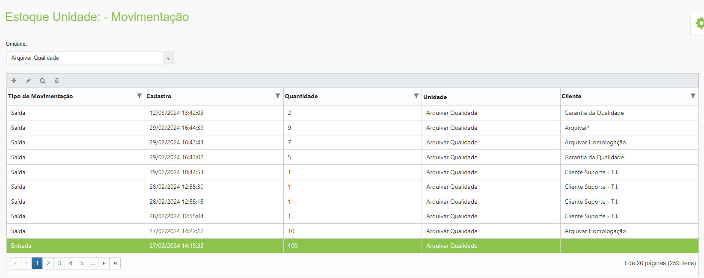
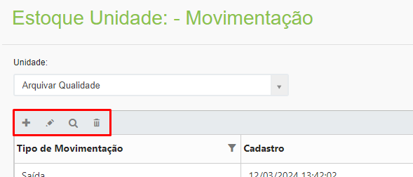
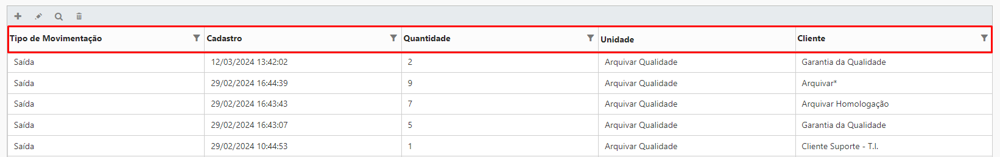
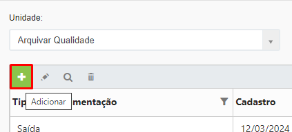
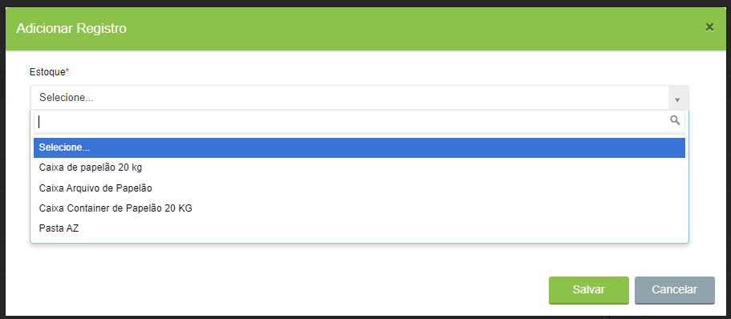
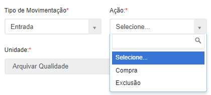
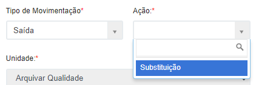
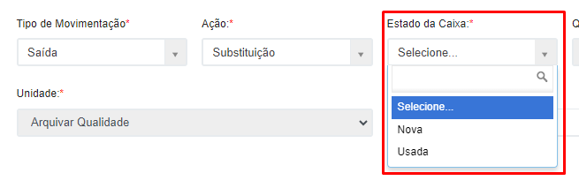
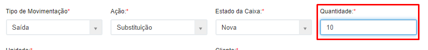
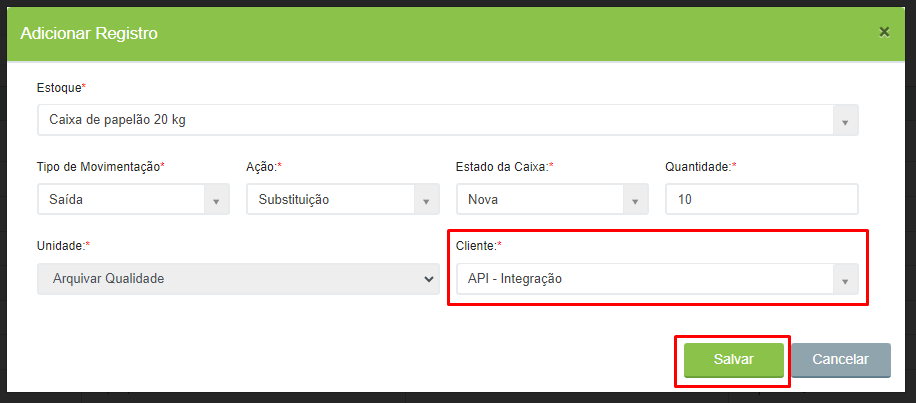

# 🔹 Movimentação



No menu Movimentação são lançadas as movimentações de entrada (compra) e saída (descarte) das caixas.  &#x20;


<mark style="color:orange;">**A criação de caixas na tela**</mark> [<mark style="color:blue;">**Caixa ou Pasta > Criar > Caixa da Unidade**</mark>](../../caixa-ou-pasta/criar.md#caixa-da-unidade) <mark style="color:orange;">**interfere no saldo de caixas físicas da Unidade, porque o sistema entende que a Unidade está tirando caixas físicas do seu estoque para direcionar para um cliente. Cada caixa criada para clientes será subtraída do estoque de caixas novas ou usadas da Unidade e essas movimentações também serão exibidas automaticamente na tela Movimentação.**</mark>


<figure><figcaption>
Clique na imagem para ampliar.
</figcaption></figure>

***

### Movimentação - Tela inicial

**Campo Unidade:** Exibe a Unidade Arquivar.

**Ícone Adicionar:** Utilizado para informar uma nova movimentação de caixa física.

**Ícone Editar:** Utilizado para editar as informações de uma movimentação de caixa física.

**Ícone Visualizar:** Utilizado para visualizar as informações de uma movimentação de caixa registrada.

**Ícone Excluir:** Utilizado para excluir uma informação de movimentação de caixa física.

<figure><figcaption>
Clique na imagem para ampliar.
</figcaption></figure>

**Coluna Tipo de Movimentação:** Informa se a movimentação registrada foi de entrada ou saída.

**Coluna Cadastro:** Exibe a data e hora da movimentação realizada.

**Coluna Quantidade:** Exibe a quantidade de caixas acrescentadas ou excluídas.

**Coluna Unidade:** Exibe o nome da Unidade Arquivar.

**Coluna Cliente:** Exibe o nome do cliente para o qual aquela movimentação de caixa física foi realizada.

<figure><figcaption>
Clique na imagem para ampliar.
</figcaption></figure>

***

### Registro de Movimentação de Caixa de Estoque

Para informar uma movimentação, selecione a Unidade e clique no ícone “Adicionar”.

<figure><figcaption>
Clique na imagem para ampliar.
</figcaption></figure>

No campo “Estoque” selecione o modelo de caixa que terá lançamento. Os modelos apresentados aqui devem ter sido anteriormente cadastrados na tela de [Configuração](movimentacao.md#configuracao).&#x20;

<figure><figcaption>
Clique na imagem para ampliar.
</figcaption></figure>

Informe o “Tipo de Movimentação”, que pode ser de entrada ou saída e a “Ação”, que pode ser de compra, exclusão ou substituição.


<mark style="color:orange;">**A entrada de caixas pode vir de uma ação de compra (quando a unidade adquire novas caixas) ou de exclusão (quando um cliente exclui caixas que ainda podem ser aproveitadas pela unidade e essas caixas entram no estoque como usadas).**</mark>&#x20;

<mark style="color:orange;">**A saída de caixa vem de uma ação de substituição (quando há necessidade de substituir caixas de um cliente e as caixas utilizadas para essa substituição saem do estoque da unidade).**</mark>


<figure><figcaption>
Clique na imagem para ampliar.
</figcaption></figure> <figure><figcaption>
Clique na imagem para ampliar.
</figcaption></figure>

No campo “Estado da Caixa” informe se são caixas usadas ou novas. Se a ação for de entrada por meio de compra, a caixa será obrigatoriamente nova. Se for de entrada por meio de exclusão, a caixa será obrigatoriamente usada. Se a ação for de saída devido a substituição, a caixa pode ser nova ou usada.

<figure><figcaption>
Clique na imagem para ampliar.
</figcaption></figure>

No campo “Quantidade” informe a quantidade que está sendo movimentada.

<figure><figcaption>
Clique na imagem para ampliar.
</figcaption></figure>

No caso de ações de entrada por meio de exclusão é preciso informar o cliente do qual as caixas estão sendo excluídas e sendo repassadas para o estoque da Unidade. No caso de saída para substituição, será preciso informar o cliente para o qual as caixas da Unidade estão sendo repassadas. Clique em “Salvar” para concluir.

<figure><figcaption>
Clique na imagem para ampliar.
</figcaption></figure>

Para conferir se a movimentação foi feita com sucesso, acesse o menu [Saldo](movimentacao.md#saldo) e revise as informações cadastradas.
