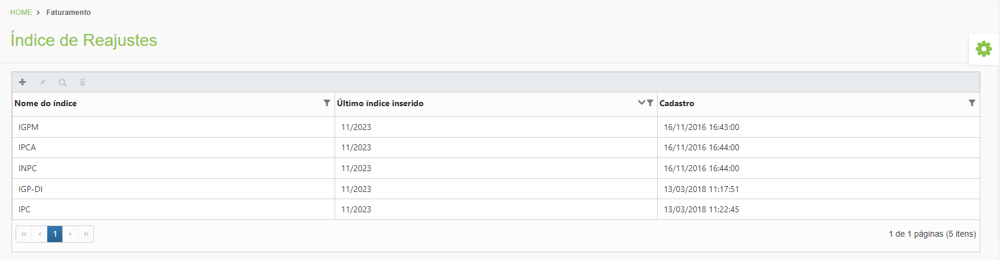
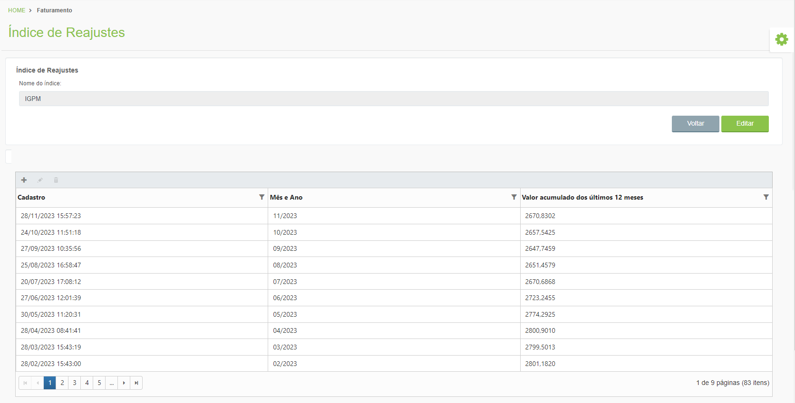

# 🟩 Índice de Reajuste

No menu Índice de Reajuste são apresentados os índices de correção dos contratos. Esses índices são corrigidos e atualizados mensalmente, pelo setor financeiro da Arquivar Master.&#x20;

<figure><figcaption>
Clique na imagem para ampliar.
</figcaption></figure>

Ao clicar em um deles é apresentado o histórico de reajuste dos últimos 12 meses.&#x20;

<figure><figcaption>
Clique na imagem para ampliar.
</figcaption></figure>
