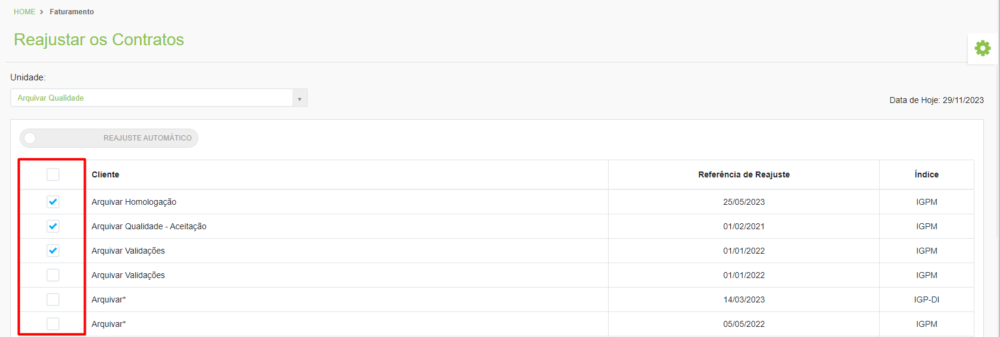

# 🟩 Reajustar os Contratos

Todos os contratos celebrados entre as unidades e seus clientes são cadastrados pela Arquivar Master e nesta tela é possível realizar o reajuste dos contratos da unidade selecionada no campo “Unidade”. &#x20;

<figure><figcaption>
Clique na imagem para ampliar.
</figcaption></figure>


<mark style="color:orange;">**Só serão exibidos contratos em que o reajuste tenha sido selecionado como “Manual” no campo “Tipo de Reajuste”, na tela**</mark> [<mark style="color:orange;">**Cliente > Contratos > Aba Dados Gerais**</mark>](../cliente/contratos/aba-dados-gerais.md)<mark style="color:orange;">**.**</mark>

