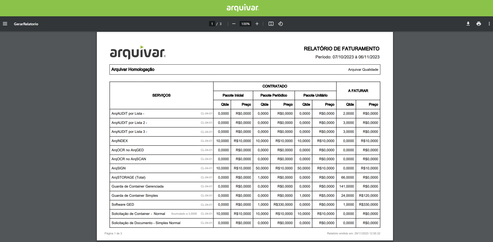

# 🟩 Relatório

Neste menu a unidade Arquivar pode gerar os relatórios de faturamento de seus clientes, informando o mês e ano desejados, o intervalo de dias e o cliente.  Esse relatório pode ser gerado em Excel ou em PDF.&#x20;

<figure><figcaption>
Clique na imagem para ampliar.
</figcaption></figure>

<figure><figcaption>
Clique na imagem para ampliar.
</figcaption></figure>

Sempre que o usuário acessar esta tela, no período fechado ou já faturado para a Unidade ou Unidade cliente, é exibido o link de acesso ao último relatório gerado em PDF ou Excel.

<figure><figcaption>
Clique na imagem para ampliar.
</figcaption></figure>



### Faturamento período "Em aberto"

Quando não houver relatório solicitado/gerado para a Unidade ou Unidade + Cliente, não será exibido o link para Gerar Excel e Gerar PDF.&#x20;

Será apresentado o botão "Fazer Consolidação" para que o usuário possa solicitar a consolidação do faturamento do período desejado.

<figure><figcaption>
Clique na imagem para ampliar.
</figcaption></figure>


<mark style="color:red;">É importante ressaltar que o "Faturamento Em Aberto" é uma pré-consolidação da quantidade a faturar para os serviços do contrato a partir da última fatura até o dia solicitado.</mark>


Ao clicar em "Fazer Consolidação", o relatório não ficará disponível imediatamente, duranto o processo de geração do relatório, o sistema apresenta uma mensagem informando que o processo ainda não foi concluído e o botão "Fazer consolidação" é substituído pelo botão "Refazer a Consolidação", que ficará inativo enquanto o relatório é gerado.

<figure><figcaption>
Clique na imagem para ampliar.
</figcaption></figure>

Concluído o relatório, o usuário terá duas opções para visualização:

**Gerar Excel:** Os dados são exportados para a máquina do usuário em um arquivo em Excel.

**Gerar PDF:** Os dados são apresentados em uma nova aba do navegador em um arquivo em PDF.

<figure><figcaption>
Clique na imagem para ampliar.
</figcaption></figure>

Quando o usuário aciona o botão "Refazer a Consolidação", a aplicação retoma a geração de um novo relatório de faturamento e durante esse processo não exibe os links para **Gerar Excel** e **Gerar PDF** na tela. No lugar é apresentada uma mensagem informativa do processo e ao concluir os links voltama ser exibidos ao usuário com o relatório gerado.

<figure><figcaption>
Clique na imagem para ampliar.
</figcaption></figure>


<mark style="color:red;">Quando acionada a opção de "Fazer a Consolidação/Refazer a Consolidação" para a Unidade sem informar o cliente, será gerado um relatório consolidado com todo faturamento "Em Aberto" de todos os clientes da unidade.</mark>&#x20;

<mark style="color:red;">A consolidação destes dados exige um processamento maior para realização de cálculos da quantidade a faturar dos serviços dos contratos, portanto o tempo de disponibilização pode ser entre 10 e 20 minutos a depender da quantidade de clientes e serviços a faturar.</mark>


### Faturamento período "Fechado" ou "Faturado"

Quando o usuário solicita um período faturado, ao escolher a Unidade que ainda não possui relatório de faturamento gerado, não serão exibidos os links "Gerar Excel" e "Gerar PDF", na tela é apresentada uma mensagem informativa de que não há relatório disponível para o período selecionado.

<figure><figcaption>
Clique na imagem para ampliar.
</figcaption></figure>

O usuário deve clicar na opção disponível de "Gerar Relatório", será gerado um relatório de faturamento consolidado para a unidade, considerando o faturamento de todos os seus clientes.

<figure><figcaption>
Clique na imagem para ampliar.
</figcaption></figure>

Após clicar no link "Gerar Relatório" o sistema exibe na tela uma mensagem de confirmação do processamento, além de apresentar uma mensagem fixa informando que o relatório está sendo gerado contendo a data e a hora da solicitação.

<figure><figcaption>
Clique na imagem para ampliar.
</figcaption></figure>


<mark style="color:red;">O tempo estimado para a disponibilização do relatório é de até 20 minutos, porém, essa condição está dependente da quantidade de solicitações realizadas no momento, o que poderá impactar neste prazo.</mark>


Gerado o relatório, é exibida na tela uma mensagem informando a data e hora de conclusão do relatório junto com os links de acesso.

<figure><figcaption>
Clique na imagem para ampliar.
</figcaption></figure>


<mark style="color:blue;">O botão "Refazer a Consolidação" para um período fechado, ou seja, já faturado, será habilitado somente após a seleção da Unidade e do Cliente. Sempre que a consolidação de faturamento de um cliente for refeito, o relatório já consolidado para a Unidade em questão será atualizado automaticamente.</mark>


Ao acessar a tela em período faturado e escolher a Unidade + Cliente, é exibido o link para GErar Excel ou Gerar PDF. Ao clicar, o relatório estará sempre disponível para consulta.

<figure><figcaption>
Clique na imagem para ampliar.
</figcaption></figure>


<mark style="color:blue;">O botão Refazer a Consolidação será exibido habilitado para que o usuário possa refazer a consolidação do relatório caso seja necessário. Este botão é utilizado para recalcular o faturamento quando houver alguma atualização em valor de serviços ou correção de lançamento em quantidade a faturar de algum serviço. Por este motivo, sempre que este processo for acionado, automaticamente o relatório da unidade será atualizado com as novas informações.</mark>


Quando o usuário escolher a Unidade + Cliente e clicar em Refazer a Consolidação, será exibida uma mensagem informativa na tela e o botão será desabilitado até a conclusão da solicitação. Também haverá na tela uma mensagem fixa informando que o relatório está sendo gerado, além de informar a data e hora da solicitação.

<figure><figcaption>
Clique na imagem para ampliar.
</figcaption></figure>


<mark style="color:red;">O tempo estimado para a disponibilização do relatório é de até 20 minutos, porém, essa condição está dependente da quantidade de solicitações realizadas no momento, o que poderá impactar neste prazo.</mark>


Após o processamento da solicitação, o relatório estará disponível na tela para visualização em Excel ou PDF.

<figure><figcaption>
Clique na imagem para ampliar.
</figcaption></figure>
