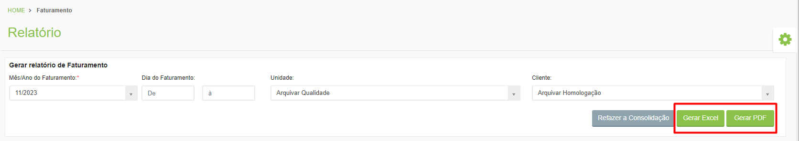

# 🟩 Relatório

Neste menu a unidade Arquivar pode gerar os relatórios de faturamento de seus clientes, informando o mês e ano desejados, o intervalo de dias e o cliente.  Esse relatório pode ser gerado em Excel ou em PDF.&#x20;

<figure><figcaption>
Clique na imagem para ampliar.
</figcaption></figure>

<figure><figcaption>
Clique na imagem para ampliar.
</figcaption></figure>
