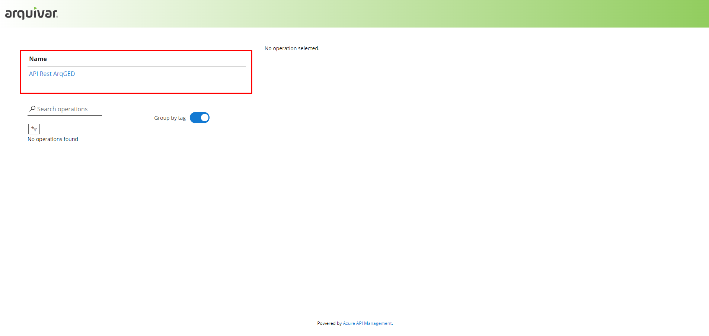

# 🟩 Relatório

Neste menu a unidade Arquivar pode gerar os relatórios de faturamento de seus clientes, informando o mês e ano desejados, o intervalo de dias e o cliente.  Esse relatório pode ser gerado em Excel ou em PDF.&#x20;

<figure><figcaption>
Clique na imagem para ampliar.
</figcaption></figure>

<figure><figcaption>
Clique na imagem para ampliar.
</figcaption></figure>

Sempre que o usuário acessar esta tela, no período fechado ou já faturado para a Unidade ou Unidade cliente, é exibido o link de acesso ao último relatório gerado em PDF ou Excel.

<figure><figcaption>
Clique na imagem para ampliar.
</figcaption></figure>

#### Faturamento período "Em aberto"

Quando não houver relatório solicitado/gerado para a Unidade ou Unidade + Cliente, não será exibido o link para Gerar Excel e Gerar PDF.&#x20;

Será apresentado o botão "Fazer Consolidação" para que o usuário possa solicitar a consolidação do faturamento do período desejado.

<figure><figcaption>
Clique na imagem para ampliar.
</figcaption></figure>
