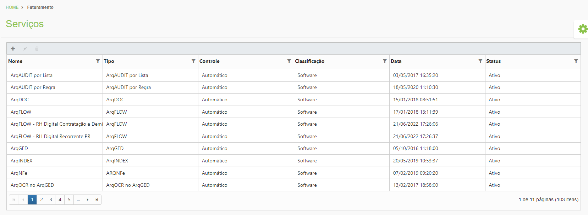

# 🟩 Serviços

No menu Serviços são exibidos todos os serviços que podem ser oferecidos aos clientes pelas unidades. A criação e visualização desses serviços é exclusivamente feita pela Arquivar Master. Os tipos de serviços que podem ser oferecidos aos clientes pelas unidades são:

* **Serviço:** Serviços de guarda oferecidos pela unidade aos clientes.
* **Produto de Terceiros:** Serviços de terceiros que a Arquivar Master oferece às unidades franqueadas, como por exemplo licenças de softwares (Bitrix, Microsoft etc.).
* **Serviço Avulso:** Serviços próprios que a Arquivar Master oferece às unidades franqueadas, como horas técnicas de suporte e de consultoria para projetos, por exemplo.
* **Software:** Serviços relativos à utilização dos módulos do sistema ArqGED oferecidos pela unidade aos clientes.

<figure><figcaption>
Clique na imagem para ampliar.
</figcaption></figure>
