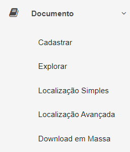

# 🟩 URL da API ArqGED


<mark style="color:red;">A URL da API ArqGED será alterada!</mark>

<mark style="color:red;">A URL</mark> [<mark style="color:red;">**https://integracao.arquivar.com/**</mark>](https://integracao.arquivar.com/) <mark style="color:red;background-color:red;">**estará disponível somente até 31/03/2025**</mark><mark style="color:red;">. Desta forma é importante todos que usam a API ArqGED alterarem as chamadas para a nova rota:</mark> <mark style="color:red;"></mark><mark style="color:red;">**https://api-rest.arquivar.com/**</mark>

<mark style="color:red;">Na nova rota será necessário além do usuário e senha, enviar também a SubscriptionKey (Chave de Assinatura ou Chave de API).</mark> [<mark style="color:red;">**A Chave de API poderá ser gerada**</mark>](../administracao/api.md) <mark style="color:red;">por um usuário com as devidas permissões no ArqGED.</mark>&#x20;

<mark style="color:red;">A aplicação permitirá ao usuário gerar um par de chaves, elas poderão ser usadas de forma rotacionada, ou seja, a cada chamada o usuário poderá usar uma.</mark> &#x20;


## **Rota em processo de descontinuidade:** [**https://integracao.arquivar.com/**](https://integracao.arquivar.com/)

É necessário que o usuário escolha qual versão do método deseja utilizar. Alguns métodos já possuem mais de uma versão disponível para trabalho.

<figure><figcaption>
Clique na imagem para ampliar.
</figcaption></figure>


<mark style="color:blue;">Antes de acessar os serviços da URL informada, leia as informações deste manual de integração, para garantir a completa compreensão dos requisitos.</mark>


***

## Nova Rota: [https://developers.arquivar.com/](https://developers.arquivar.com)

Para visualizar a documentação online de API do ArqGED, acesse: [https://developers.arquivar.com/](https://developers.arquivar.com)

<figure><figcaption>
Clique na imagem para ampliar.
</figcaption></figure>

Ao acessar a URL da documentação, é exibida a API disponível, ao clicar os dados são listados na tela.

<figure><figcaption>
Clique na imagem para ampliar.
</figcaption></figure>

No canto esquerdo da tela é exibida a lista dos métodos disponíveis para a API.

<figure><figcaption>
Clique na imagem para ampliar.
</figcaption></figure>

Clicando no método, é exibido do lado direito da tela o seu detalhamento.

<figure><figcaption>
Clique na imagem para ampliar.
</figcaption></figure>

**Search operations:** Utilize para buscar um método da API selecionada na tela.

**Group by tag:** Utilize para agrupar os métodos da API selecionada.

**Try it:** Utilize para testar o método.

Clicando na opção "Try it", é aberto no canto direito da tela os campos de parâmentros e headers para preenchimento e teste.

Para usar os métodos, primeiramente será necessário gerar um token de autenticação em [https://api-rest.arquivar.com/v1/api/Autenticacao/Login](https://api-rest.arquivar.com/v1/api/Autenticacao/Login). No método autenticação são informados a “SubscriptionKey” no “Headers” e os dados do Usuário no “Body”, conforme print abaixo:

<figure><figcaption>
Clique na imagem para ampliar.
</figcaption></figure>

Com o token retornado pelo método anterior, será possível usar os outros métodos. Então neste caso, na área do “Headers” precisam ser enviados a “[SubscriptionKey](../administracao/api.md#subscriptionkey-chave-de-acesso-ou-chave-de-api)” e token de autenticação no formato “Baerer Token” no campo “Authorization”:

<figure><figcaption>
Clique na imagem para ampliar.
</figcaption></figure>
