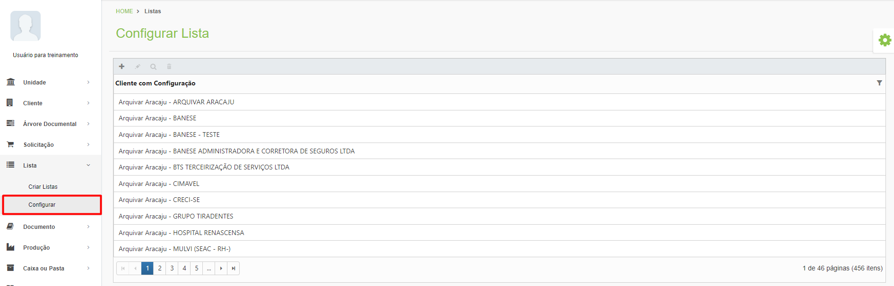

# 🟩 Configurar

Neste menu deve ser feita a associação de uma lista criada no menu Lista > Criar Lista à árvore documental do cliente.   &#x20;

<figure><figcaption>
Clique para ampliar a imagem.
</figcaption></figure>
