# 🟩 Configurar

Neste menu deve ser feita a associação de uma lista criada no menu [Lista > Criar Listas](criar-listas.md) à árvore documental do cliente.   &#x20;

<figure><figcaption>
Clique para ampliar a imagem.
</figcaption></figure>

***

## Configurar - Tela principal

**Ícone Adicionar:** Utilizado para iniciar a configuração de uma lista de cliente. Só será possível adicionar uma configuração para clientes que ainda não possuem nenhuma configuração cadastrada.

**Ícone Editar:** Utilizado para editar as configurações do cliente selecionado.

**Ícone Visualizar:** Utilizado para apresentar as informações de configuração do cliente selecionado.&#x20;

**Ícone Excluir:** Utilizado para excluir as configurações de lista do cliente selecionado.


<mark style="color:red;">**Ao excluir as configurações de um cliente serão apagadas todas as configurações feitas para todas as listas, em toda a árvore do cliente. Não será possível, portanto, fazer a pesquisa de documentos por lista. Só podem ser excluídas configurações feitas em árvores que não possuem registros de documentos cadastrados.**</mark>


**Cliente com Configuração:** Serão apresentadas todas as listas de unidades e clientes aos quais o usuário tem acesso. Caso um cliente ainda não tenha nenhuma lista criada, essa criação deverá ser feita no menu [Lista > Criar Listas](criar-listas.md).

<figure>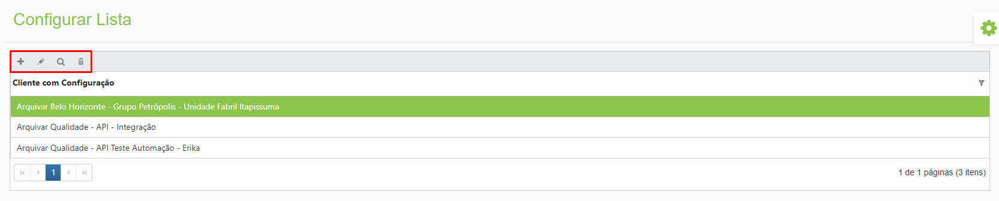<figcaption>
Clique para ampliar a imagem.
</figcaption></figure>

***

## Configurando uma lista

Para iniciar uma configuração, selecione a lista desejada e clique no ícone “Adicionar”. Só será possível incluir uma configuração para o cliente se ele não tiver uma configuração cadastrada. Se já tiver e for necessário alterá-la, clique no ícone “Editar”.

<figure>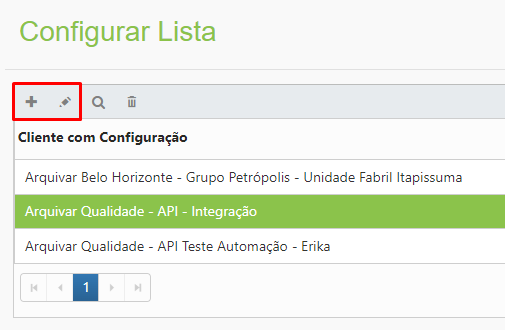<figcaption></figcaption></figure>

Selecione o cliente. No lado esquerdo será exibida a árvore organizacional do cliente.

<figure>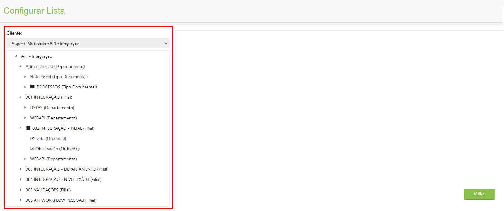<figcaption>
Clique para ampliar a imagem.
</figcaption></figure>

Caso já haja uma configuração de lista associada a um nível da árvore, será exibido o ícone “Este nível possui configuração de lista”.

<figure>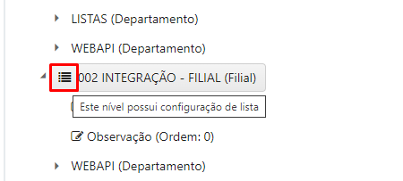<figcaption></figcaption></figure>

Ao clicar em um nível da árvore serão exibidos os campos de “Associação de lista ao nível da árvore” no lado direito.

<figure>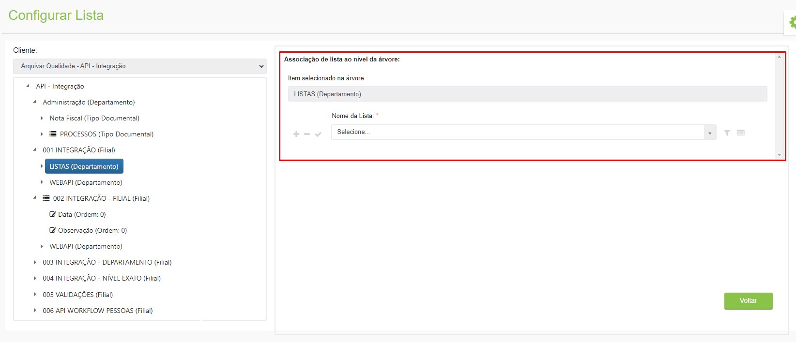<figcaption>
Clique para ampliar a imagem.
</figcaption></figure>

O nível selecionado será mostrado no campo “Item selecionado na árvore”.

<figure>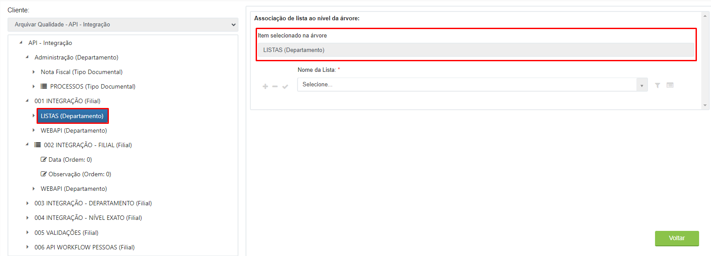<figcaption>
Clique para ampliar a imagem.
</figcaption></figure>

No campo “Nome da Lista” selecione a lista que será associada a todos os documentos daquele nível da árvore e clique no ícone “Salvar”.


<mark style="color:blue;">**EXEMPLO:**</mark> <mark style="color:blue;"></mark><mark style="color:blue;">No nível da árvore “Recursos Humanos (Departamento)”, será usada a lista “Funcionários”, ou seja, todos os tipos documentais daquele departamento como dossiê de funcionários, folha de ponto, recibo de férias etc. usarão aquela lista.</mark>


<figure>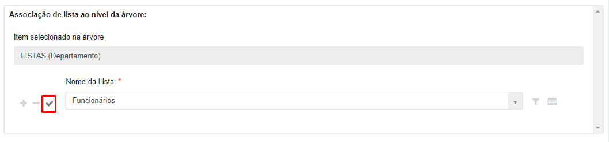<figcaption>
Clique para ampliar a imagem.
</figcaption></figure>

É possível associar mais de uma lista ao nível da árvore. Para isso, clique no ícone “Adicionar”. Para excluir uma associação de lista, clique no ícone “Remover”.

<figure>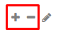<figcaption></figcaption></figure>

Clicando no ícone “Campos da lista” serão exibidos todos os campos que compõem aquela lista que serão usados na tela de indexação.

<figure>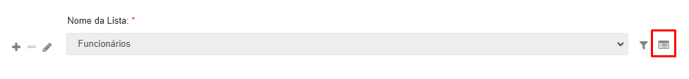<figcaption>
Clique para ampliar a imagem.
</figcaption></figure>

Serão exibidos todos os campos que foram definidos como importação obrigatória na tela Lista > Criar Listas. Para editar as configurações de um campo, clique no ícone “Editar”.

<figure>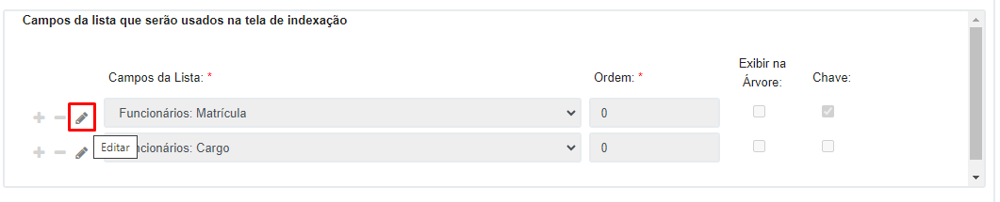<figcaption>
Clique para ampliar a imagem.
</figcaption></figure>

É possível alterar a ordem de exibição dos campos e selecionar aqueles que devem ser exibidos na árvore no momento da pesquisa.

<figure>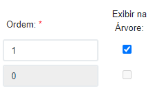<figcaption></figcaption></figure>

Na coluna “Chave” será exibido quais dos campos da lista são chave, ou seja, não podem ser duplicados e serão utilizados para importar as informações dos demais campos no momento do preenchimento pelo usuário.

<figure>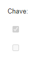<figcaption></figcaption></figure>

É possível adicionar campos que não foram marcados como obrigatórios na tela Lista > Criar Listas, clicando-se no ícone “Adicionar” e selecionado o campo desejado.

Para excluir um campo, clique no ícone “Remover”. Só poderão ser removidos campos que não forem obrigatórios.

<figure><figcaption></figcaption></figure>

Clicando em “Excluir Configuração” será apagada toda a configuração realizada para o nível da árvore selecionado.

<figure>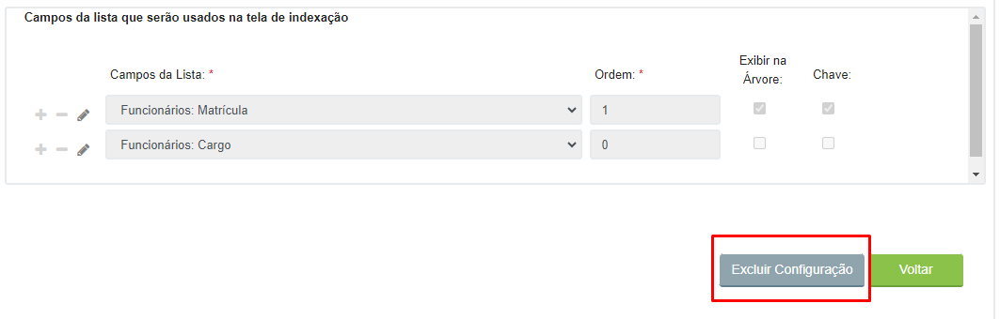<figcaption>
Clique para ampliar a imagem.
</figcaption></figure>

