# 🟩 Criar Listas

Neste menu são criadas as listas do cliente selecionado no campo “Cliente”. &#x20;

<figure>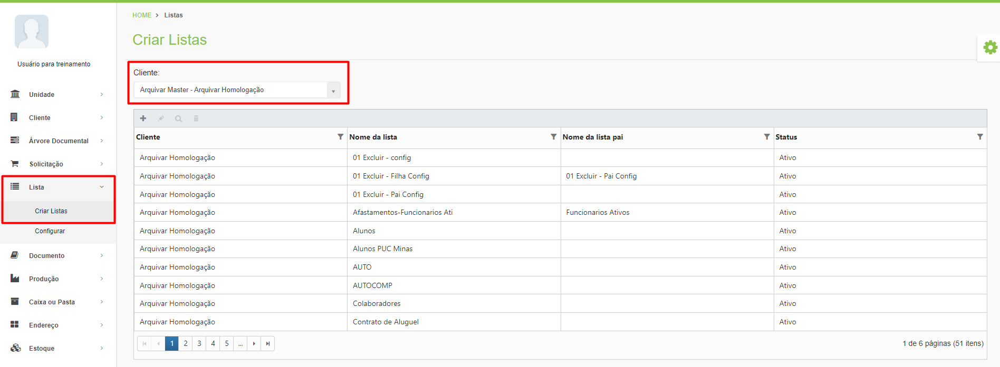<figcaption>
Clique para ampliar a imagem.
</figcaption></figure>

***

## Criar Listas - Tela principal&#x20;

**Ícone Adicionar:** Utilizado para cadastrar uma nova lista.

**Ícone Editar:** Utilizado para editar as informações da lista selecionada.

**Ícone Visualizar:** Utilizado para apresentar as informações da lista selecionada.&#x20;

**Ícone Excluir:** Utilizado para excluir a lista selecionada.

<figure>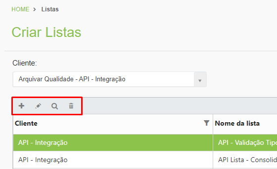<figcaption></figcaption></figure>

**Coluna Cliente:** Exibe o nome do cliente escolhido no campo “Cliente”.

**Coluna Nome da lista:** Exibe o nome da lista.

**Coluna Nome da lista pai:** Caso a lista seja subordinada a outra, neste campo será exibido o nome da lista pai.

**Coluna Status:** Informa se a lista está ativa ou inativa.

<figure>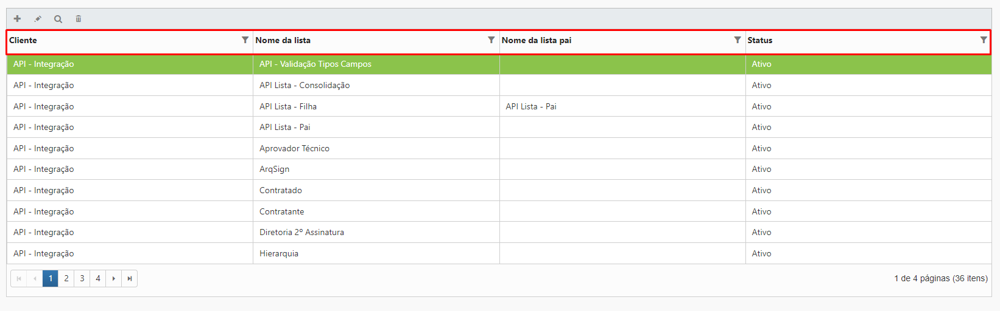<figcaption>
Clique para ampliar a imagem.
</figcaption></figure>

***

## Criando uma lista

Clique no ícone “Adicionar”.

<figure>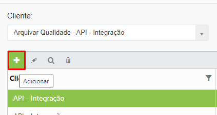<figcaption></figcaption></figure>

**Nome da Lista:** Informe o um nome para a lista que está sendo criada.

Tipo de lista: Selecione o tipo de lista, que pode ser “Auto Complete” ou “Consolidação”. Quando é necessário que o sistema faça a conferência de algum item da lista, ou seja, se é necessária auditoria, deve ser escolhida a opção “Consolidação”. A lista de Auto Complete não pode ser utilizada para auditoria.&#x20;


<mark style="color:blue;">**EXEMPLO:**</mark> <mark style="color:blue;"></mark><mark style="color:blue;">Em uma lista de funcionários é necessário que o sistema faça constantemente a conferência para verificar se não há documentos obrigatórios faltantes. Neste caso, a lista de funcionários deve ser do tipo “Consolidação”.</mark>


<figure>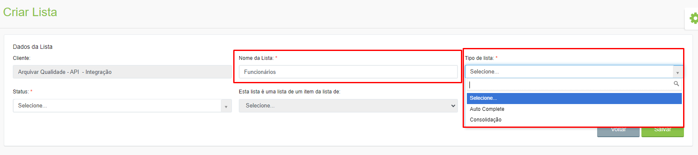<figcaption>
Clique para ampliar a imagem.
</figcaption></figure>

**Status:** Informe se a lista ficará ativa ou inativa.

<figure>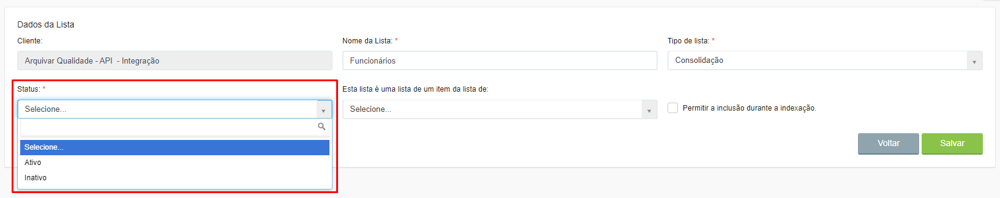<figcaption>
Clique para ampliar a imagem.
</figcaption></figure>

**Esta lista é uma lista de um item da lista de:** Este campo só será habilitado se a lista for do tipo “Consolidação”. Neste caso, a lista que está sendo criada poderá ser uma sub lista de outra (lista pai), que deve ser selecionada neste campo.


<mark style="color:blue;">**EXEMPLO:**</mark> <mark style="color:blue;"></mark><mark style="color:blue;">Na lista “Funcionários” existem os campos Matrícula (campo chave), Nome, Função, Admissão e Demissão. Para saber quando um funcionário deverá receber um recibo de férias, foi criada a lista “Férias”, que será filha da lista “Funcionários”, ou seja, utilizará o mesmo campo chave (Matrícula), além de campos específicos da lista como Início das Férias e Fim das Férias. Para saber quando deverá ser enviado um recibo de férias, será criada uma regra de auditoria baseada na lista “Férias”.</mark>


**Permitir a inclusão durante a indexação:** Esta opção só ficará disponível se a lista for do tipo “Consolidação”. A lista de Consolidação permite a inclusão de informações durante a indexação, ou seja, se no momento de cadastrar um documento composto por uma lista eu informar um dado de pessoa ou empresa ainda não informado anteriormente, o sistema permitirá que eu insira os dados manualmente naquele momento. A partir daí, nas próximas vezes que utilizar um documento com essa mesma lista, ele extrairá as informações automaticamente. Na lista Auto Complete só é permitido incluir informações antes da indexação, como itens de lista. A inclusão de itens após a indexação deverá ser feita via API ou por meio de importação de dados do Excel add-in. &#x20;

<figure>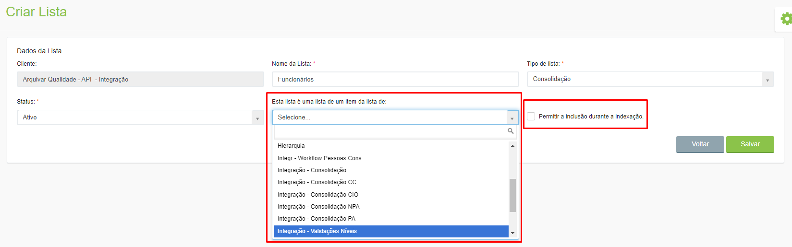<figcaption>
Clique para ampliar a imagem.
</figcaption></figure>

Ao clicar em “Salvar” será exibida a área “Campos da Lista”, onde deverão ser criados os campos que vão compor a lista que está sendo criada.

<figure><figcaption>
Clique para ampliar a imagem.
</figcaption></figure>

Para cadastrar um campo clique no ícone “Editar” e informe o nome do campo que está sendo criado.

<figure>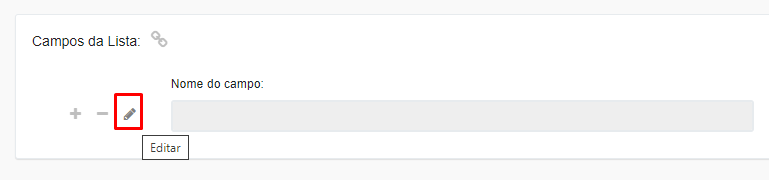<figcaption></figcaption></figure>

**Definição de Campo:** Selecione o formato do campo, que pode ser:

* _Checkbox_: Campo em que o usuário deverá marcar uma caixa de seleção de acordo com a pergunta apresentada. &#x20;
* _CNPJ_: Campo em que o usuário deverá informar um número de CNPJ válido.
* _CNPJ/CPF_: Campo em que o usuário deverá informar um número de CNPJ ou de CPF válido.
* _CPF_: Campo em que o usuário deverá informar um número de CPF válido.
* _Data_: O usuário deverá informar uma data válida, com dia, mês e ano.
* _Lista:_ Deverá ser criada uma lista de opções para que o usuário selecione a opção que deseja.
* _Monetário:_ Campo em que o usuário deverá informar um valor monetário, com vírgula.
* _Numérico:_ Campo em que o usuário deverá informar um valor numérico.
* _Texto:_ Campo em que o usuário poderá informar qualquer valor, seja de texto ou numérico. Este tipo de campo aceita qualquer caractere como resposta.

<figure>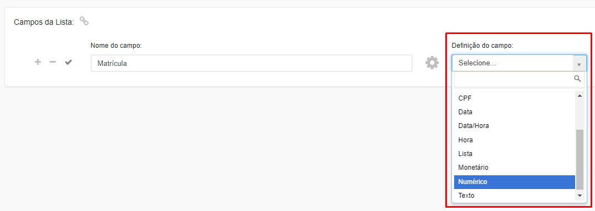<figcaption>
Clique para ampliar a imagem.
</figcaption></figure>

**Chave para duplicidade:** Informe se aquele campo poderá ser repetido ou não. Quando um campo é chave, ele não deverá permitir duplicidade. Um campo chave é utilizado para facilitar o preenchimento pelo usuário, já que ao informar um dado chave os outros campos da lista são preenchidos automaticamente.


<mark style="color:blue;">**EXEMPLO:**</mark> <mark style="color:blue;"></mark><mark style="color:blue;">O campo Matrícula é um campo chave da lista “Funcionários”. Neste caso, ao cadastrar funcionários não será permitido que dois funcionários possuam a mesma matrícula, ou seja, o campo Matrícula deverá evitar duplicidade.</mark>


**Importação obrigatória:** Selecione se a informação será obrigatória na indexação ou não.&#x20;

<figure>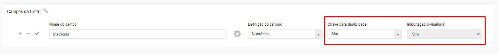<figcaption>
Clique para ampliar a imagem.
</figcaption></figure>

Para salvar o campo, clique no ícone “Salvar”. Depois de salvar um campo será possível configurá-lo clicando no ícone “Configurações”.

<figure>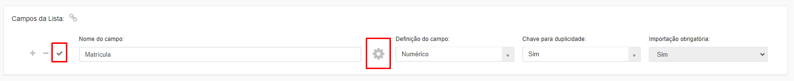<figcaption>
Clique para ampliar a imagem.
</figcaption></figure>

**Proibir edição após ter valor:** Se selecionada a opção “Sim”, não será possível editar os valores cadastrados para o campo.

Dependendo do tipo de campo serão exibidas outras configurações:

**Valor mínimo e valor máximo:** Utilizado para determinar um valor mínimo e máximo para preenchimento do campo pelo usuário.

<figure>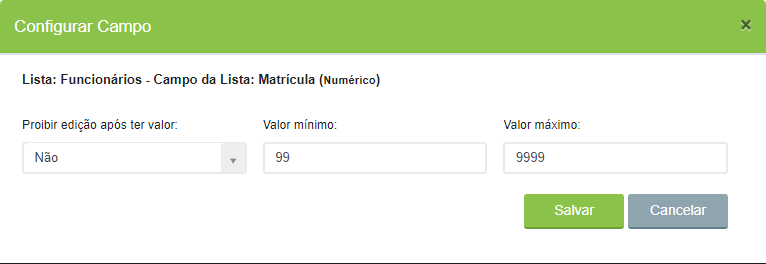<figcaption></figcaption></figure>

**Lista de valores para o campo:** Aqui deverão ser cadastrados valores que serão exibidos como opção de resposta no campo da lista. Informe o valor e clique no ícone “Adicionar”.


<mark style="color:blue;">**EXEMPLO:**</mark> <mark style="color:blue;"></mark><mark style="color:blue;">No campo “Cargo” foram cadastrados os valores Auxiliar Administrativo, Vigia, Secretário, Gerente etc.</mark>


<figure>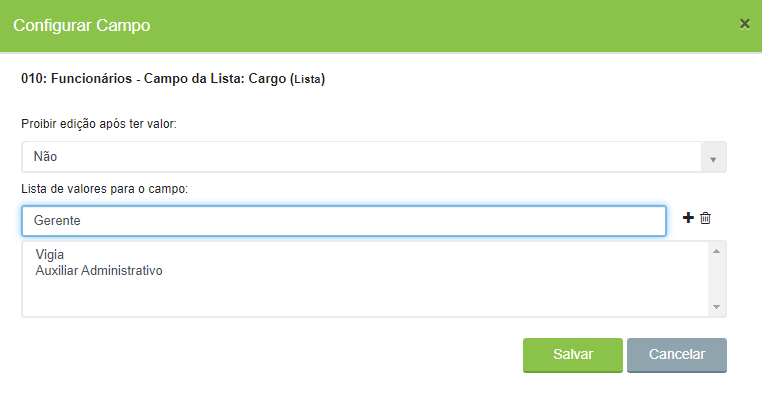<figcaption></figcaption></figure>

Para criar campos clique no ícone “Adicionar” e para excluir um campo cadastrado clique no ícone “Remover”. &#x20;

<figure>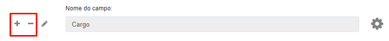<figcaption></figcaption></figure>
