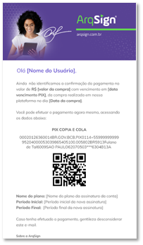
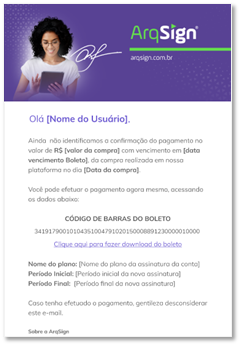
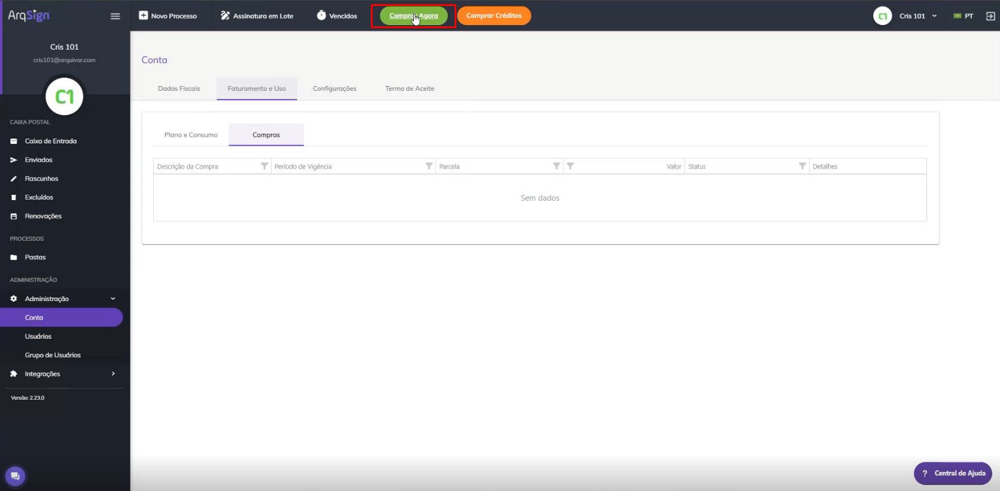
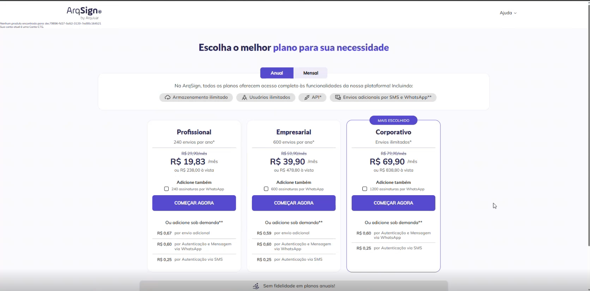
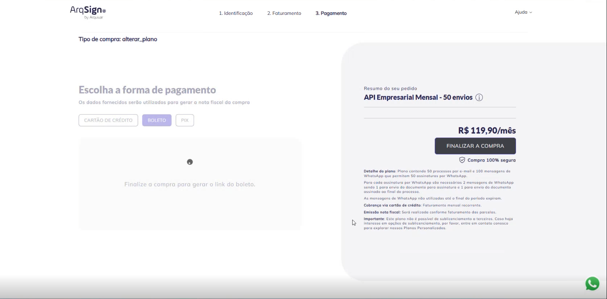
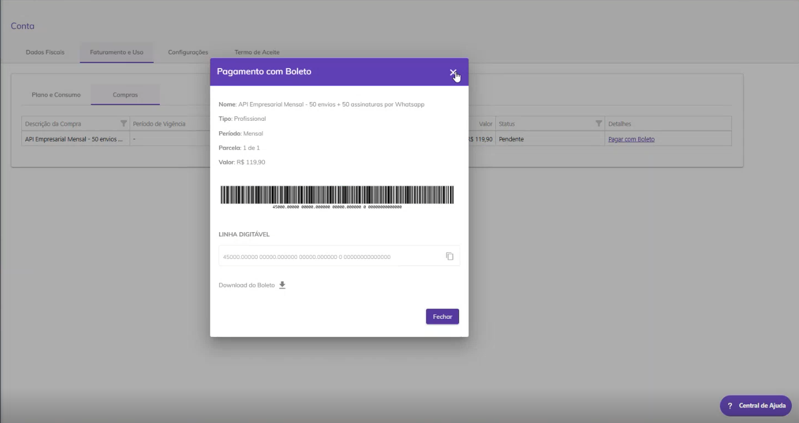
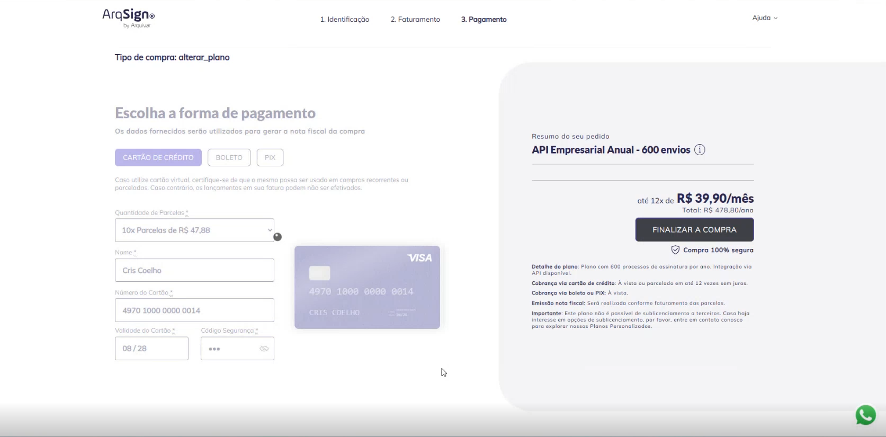

# 🛒 Comprar ou Alterar Plano

Os botões “Comprar Agora” ou “Alterar Plano” serão exibidos para usuários que possuem uma conta de teste grátis ou para usuários que possuam plano pago expirado ou próximo da data de expiração. Neste caso, o usuário pode escolher permanecer no plano em que está ou migrar para outro plano. &#x20;

O botão “Comprar Agora” será exibido para usuários da Conta teste grátis ou usuários com a assinatura do plano expirada.&#x20;

O botão “Alterar Plano” será exibido para usuários com assinatura de plano pago com data de vencimento próxima (30 dias antes da expiração de planos anuais e 10 dias antes da expiração de planos mensais).&#x20;

## Compra ou alteração de Plano

Para comprar um plano ou alterar o seu plano clique em “Comprar Agora” ou “Alterar plano”. Selecione o plano ideal para o seu negócio, preencha os dados para pagamento e clique em “Finalizar a compra”.

<figure><figcaption>
Clique na imagem para ampliar.
</figcaption></figure>

<figure><figcaption>
Clique na imagem para ampliar.
</figcaption></figure>


<mark style="color:orange;">**Caso o usuário tenha deixado marcada a opção “Renovação Automática” na tela**</mark> [<mark style="color:blue;">**Administração > Conta > Aba Faturamento e Uso > Plano e Consumo**</mark>](../administracao/administracao/conta.md#plano-e-consumo)<mark style="color:orange;">**, o botão “Comprar Plano” não será exibido, porque ao expirar o plano, o sistema automaticamente renovará a assinatura no plano atual, utilizando as informações de faturamento já existentes no cadastro do usuário.**</mark> &#x20;


<figure><figcaption>
Clique na imagem para ampliar.
</figcaption></figure>

### Compra com pagamento por PIX, boleto ou cartão de crédito

Depois de passar pelo passo a passo de compra ou alteração de plano, o usuário será direcionado para a escolha da forma de pagamento.

<figure><figcaption>
Clique na imagem para ampliar.
</figcaption></figure>


<mark style="color:orange;">As opções de pagamento por PIX ou BOLETO não possuem a função de parcelamento da compra, esta opção está disponível somente para pagamentos realizados com CARTÃO DE CRÉDITO.</mark>


Ao finalizar a compra, é exibido o botão **ACESSAR ARQSIGN** que direciona e autentica o usuário na plataforma ArqSIGN e apresenta os dados de pagamento de PIX ou BOLETO.

<figure><figcaption>
Clique na imagem para ampliar.
</figcaption></figure>

<figure><figcaption>
Clique na imagem para ampliar.
</figcaption></figure>


No caso de pagamento por PIX ou boleto, o usuário tem acesso imediato à plataforma, independente do pagamento. **O pagamento pode ser feito em até 5 dias.**&#x20;

O usuário recebe notificações de pagamento até a data de vencimento. Não ocorrendo o pagamento nesse prazo, a conta é bloqueada.&#x20;

Assim é feita a notificação de pagamento pendente:&#x20;

Caso o usuário não faça o pagamento, ele recebe a seguinte notificação de conta bloqueada:



### Plano com período TRIAL

Na tela que seleciona a forma de pagamento, o usuário tem a possibilidade de inserir um cupom que transforma o plano selecionado em um plano com período TRIAL. Dessa forma, ao escolher pagamento por PIX ou boleto, eles são gerados somente ao final do período TRIAL. O usuário recebe um alerta por e-mail o lembrando do término do período TRIAL e enviando o código PIX ou boleto para pagamento.&#x20;

Ao realizar a compra ou alteração de um plano, o sistema verificará se o e-mail informado durante a compra tem vínculo com alguma conta grátis.

Caso não tenha, uma conta será criada e será enviada ao usuário uma notificação para que ele ative sua conta.

<figure><figcaption>
Clique na imagem para ampliar.
</figcaption></figure>

Caso seja verificado que o e-mail informado durante a compra tem vínculo com alguma conta grátis, serão apresentadas ao usuário duas opções de ação:&#x20;

1\) Migrar a conta de teste grátis para a conta paga ou&#x20;

2\) Criar uma nova conta para o plano adquirido.

Usuário logado na plataforma ArqSIGN, com as devidas permissões, ao clicar no botão Comprar Agora ou Alterar Plano é direcionado para a tela de adicionais do e-commerce, conforme assinatura e plano atual da conta.

<figure><figcaption>
Clique na imagem para ampliar.
</figcaption></figure>

<figure><figcaption>
Clique na imagem para ampliar.
</figcaption></figure>

* Usuário seleciona o plano desejado e clicando no botão COMEÇAR AGORA.
* Usuário informa/confirma os dados de identificação e clica no botão AVANÇAR.
* Usuário informa/confirma os dados de faturamento e clica no botão AVANÇAR.
* Usuário escolhe a forma de pagamento e clica no botão FINALIZAR COMPRA

<figure><figcaption>
Clique na imagem para ampliar.
</figcaption></figure>

* Ao finalizar, o site disponibiliza o botão ACESSAR ARQSIGN que direciona e autentica o usuário na plataforma ArqSIGN, apresentando os dados de pagamento.

<figure><figcaption>
Clique na imagem para ampliar.
</figcaption></figure>

* A compra ou alteração de plano por cartão de crédito possui o mesmo fluxo, no entanto, é possível parcelar a compra escolhendo essa opção.&#x20;

<figure><figcaption>
Todos os dados inseridos são dados de teste
</figcaption></figure>

Após a conclusão da mudança de plano, se a conta for compartilhada com outros usuários, todos os usuários com perfil de administrador global da conta receberão uma notificação por e-mail sobre a alteração ou renovação do plano.&#x20;

#### Renovação de assinatura por PIX ou boleto

A plataforma busca as contas com status ativo que possuem renovação automática, cujo a assinatura com forma de pagamento por PIX ou Boleto que esteja com período final menor ou igual a data atual.

A aplicação gera os dados de renovação da assinatura e envia notificação com os dados de pagamento por PIX ou Boleto para os usuários com perfil de administrado global.

Dessa forma, o sistema renova automaticamente a assinatura do usuário, e o pagamento fica pendente durante 5 dias, gerando cobranças automáticas.&#x20;

Assim é o aviso e cobrança de renovação automática:

<figure><figcaption>
Clique na imagem para ampliar.
</figcaption></figure>

## 🗪 Perguntas e Respostas Frequentes

Planos ArqSign – Escolha a Melhor Opção para Você

Todos os planos oferecem:

✅ Armazenamento e usuários ilimitados&#x20;

✅ Acesso a todas as funcionalidades da plataforma

✅ API de integração

Planos Anuais – Economia e Mais Benefícios

<mark style="color:purple;">✅</mark><mark style="color:purple;">**Plano Profissional Anual – 240 processos**</mark>

Ideal para profissionais que precisam de um fluxo contínuo de assinaturas digitais.

🔹 O que inclui?\
✔ 240 processos de assinatura com envio por e-mail ao longo de 12 meses.\
✔ Armazenamento e usuários ilimitados.\
✔ API de integração para automatizar processos.

💰 Investimento: R$ 238,00 à vista ou em até 12x de R$ 19,90 sem juros no cartão de crédito.

📜 Faturamento e Nota Fiscal:

* Cobrança anual via cartão de crédito.
* Nota fiscal emitida por parcela, após a cobrança.

📌 Opcionais:\
➕ Processo adicional: R$1,00 por envio.\
➕ Autenticação por SMS: R$0,25 por autenticação.\
➕ Autenticação por WhatsApp: R$0,60 por autenticação.\
➕ Envio de mensagem por WhatsApp: R$0,60 por mensagem.

✅ <mark style="color:purple;">**Plano Empresarial Anual – 600 processos**</mark>\
Perfeito para empresas que buscam mais eficiência e automação nos processos de assinatura.

🔹 O que inclui?\
✔ 600 processos de assinatura com envio por e-mail ao longo de 12 meses.\
✔ Armazenamento e usuários ilimitados.\
✔ API de integração para otimizar processos.

💰 Investimento: R$ 478,00 à vista ou em até 12x de R$39,90 sem juros no cartão de crédito.

📜 Faturamento e Nota Fiscal:

* Cobrança anual via cartão de crédito.
* Nota fiscal emitida por parcela, após a cobrança.

📌 Opcionais:\
➕ Processo adicional: R$0,80 por envio.\
➕ Autenticação por SMS: R$0,25 por autenticação.\
➕ Autenticação por WhatsApp: R$0,60 por autenticação.\
➕ Envio de mensagem por WhatsApp: R$0,60 por mensagem.

✅ <mark style="color:purple;">**Plano Corporativo Anual – Envios Ilimitados**</mark>\
Para empresas que demandam um volume ilimitado de assinaturas digitais.

🔹 O que inclui?\
✔ Processos de assinatura com envio por e-mail.\
✔ Armazenamento e usuários ilimitados.\
✔ API de integração para máxima produtividade.

💰 Investimento:\
R$ 838,80 à vista ou em até 12x de R$69,90 sem juros no cartão de crédito.

📜 Faturamento e Nota Fiscal:

* Cobrança anual via cartão de crédito.
* Nota fiscal emitida por parcela após a cobrança.

📌 Opcionais:\
➕ Autenticação por SMS: R$0,25 por autenticação.\
➕ Autenticação por WhatsApp: R$0,60 por autenticação.\
➕ Envio de mensagem por WhatsApp: R$0,60 por mensagem.

Planos Mensais – Flexibilidade para seu Negócio

<mark style="color:purple;">**✅ Plano Profissional Mensal – 20 processos**</mark>

Para profissionais que precisam de um plano acessível e flexível.

🔹 O que inclui?\
✔ 20 processos de assinatura com envio por e-mail ao mês.\
✔ Armazenamento e usuários ilimitados.\
✔ API de integração para automatizar processos.

💰 Investimento: R$ 29,90/mês

📜 Cobrança e Nota Fiscal:

* Cobrança mensal via cartão de crédito.
* Nota fiscal emitida por parcela, após a cobrança.

📌 Opcionais:\
➕ Processo adicional: R$1,50 por envio.\
➕ Autenticação por SMS: R$0,25 por autenticação.\
➕ Autenticação por WhatsApp: R$0,60 por autenticação.\
➕ Envio de mensagem por WhatsApp: R$0,60 por mensagem.

<mark style="color:purple;">**✅ Plano Empresarial Mensal – 50 processos**</mark>

Para empresas que precisam de mais envios e flexibilidade mensal.

🔹 O que inclui?\
✔ 50  processos de assinatura com envio por e-mail ao mês.\
✔ Armazenamento e usuários ilimitados.\
✔ API de integração para automatizar processos.

💰 Investimento: R$ 59,90/mês

📜 Cobrança e Nota Fiscal:

* Cobrança mensal via cartão de crédito.
* Nota fiscal emitida por parcela, após a cobrança.

📌 Opcionais:\
➕ Processos adicional: R$1,20 por envio.\
➕ Autenticação por SMS: R$0,25 por autenticação.\
➕ Autenticação por WhatsApp: R$0,60 por autenticação.\
➕ Envio de mensagem por WhatsApp: R$0,60 por mensagem.

<mark style="color:purple;">**✅ Plano Corporativo Mensal – Processos Ilimitados**</mark>

Para empresas que querem total liberdade de envios.

🔹 O que inclui?\
✔ Processos de assinatura com envio por e-mail ao mês.\
✔ Armazenamento e usuários ilimitados.\
✔ API de integração para automatizar processos.

💰 Investimento: R$ 89,90/mês

📜 Cobrança e Nota Fiscal:

* Cobrança mensal via cartão de crédito.
* Nota fiscal emitida por parcela, após a cobrança.

📌 Opcionais:\
➕ Autenticação por SMS: R$0,25 por autenticação.\
➕ Autenticação por WhatsApp: R$0,60 por autenticação.\
➕ Envio de mensagem por WhatsApp: R$0,60 por mensagem.

Planos com pacotes de WhatsApp: Anuais - Economia e Mais Benefícios 

<mark style="color:purple;">**💼 Plano Profissional Anual – 240 Processos + 240 assinaturas por WhatsApp**</mark> \
Ideal para profissionais que precisam de um fluxo contínuo de assinaturas digitais.&#x20;

🔹 O que inclui? \
✔ 240 processos de assinatura por e-mail ou WhatsApp ao longo de 12 meses. \
✔ Armazenamento e usuários ilimitados. \
✔ API de integração para automatizar processos.&#x20;

🔹 Detalhe do plano: \
Plano anual com 240 processos e 480 créditos de WhatsApp que permitem 240 assinaturas por WhatsApp.&#x20;

Para cada assinatura por WhatsApp são necessários 2 créditos de mensagens de WhatsApp sendo 1 crédito para envio do documento para assinatura e 1 crédito para envio do documento assinado ao final do processo).&#x20;

Os créditos de WhatsApp não utilizados até o final do período expiram.&#x20;

💰 Investimento: R$ 526,80 à vista ou em até 12x de R$43,90 sem juros no cartão de crédito.&#x20;

📜 Faturamento e Nota Fiscal:&#x20;

* Cobrança anual via cartão de crédito.&#x20;
* Nota fiscal emitida por parcela, após a cobrança.&#x20;

📌 Opcionais: \
➕ Processo adicional: R$1,00 por envio. \
➕ Autenticação por SMS: R$0,25 por autenticação. \
➕ Autenticação por WhatsApp: R$0,60 por autenticação. \
➕ Envio de mensagem por WhatsApp: R$0,60 por mensagem.&#x20;

&#x20;<mark style="color:purple;">**🏢 Plano Empresarial Anual – 600 processos + 600 assinaturas por WhatsApp**</mark> \
Perfeito para empresas que buscam mais eficiência e automação nos processos de assinatura.&#x20;

🔹 O que inclui? \
✔ 600 processos de assinatura por e-mail ou WhatsApp ao longo de 12 meses. \
✔ Armazenamento e usuários ilimitados. \
✔ API de integração para otimizar fluxos de trabalho.&#x20;

Detalhe do plano:&#x20;

Plano anual com 600 processos e 1200 créditos de WhatsApp que permitem 600 assinaturas por WhatsApp.&#x20;

Para cada assinatura por WhatsApp são necessários 2 créditos de mensagens de WhatsApp sendo 1 crédito para envio do documento para assinatura e 1 crédito para envio do documento assinado ao final do processo).&#x20;

Os créditos de WhatsApp não utilizados até o final do período expiram.&#x20;

💰 Investimento: R$1.198,80 à vista ou em até 12x de R$99,90 sem juros no cartão de crédito.&#x20;

📜 Faturamento e Nota Fiscal:&#x20;

* Cobrança anual via cartão de crédito.&#x20;
* Nota fiscal emitida por parcela, após a cobrança.&#x20;

📌 Opcionais: \
➕ Processo adicional: R$0,80 por envio. \
➕ Autenticação por SMS: R$0,25 por autenticação. \
➕ Autenticação por WhatsApp: R$0,60 por autenticação. \
➕ Envio de mensagem por WhatsApp: R$0,60 por mensagem.&#x20;

&#x20;<mark style="color:purple;">**🏢 Plano Corporativo Anual – Processos ilimitados + 1200 assinaturas por WhatsApp**</mark>  \
Para empresas que demandam um volume ilimitado de assinaturas digitais.&#x20;

🔹 O que inclui? \
✔ Processos de assinatura ilimitados por e-mail e 1200 assinaturas por WhatsApp. \
✔ Armazenamento e usuários ilimitados. \
✔ API de integração para máxima produtividade.&#x20;

Detalhe do plano:&#x20;

Plano anual com processos ilimitados e 2400 créditos de WhatsApp que permitem 1200 assinaturas por WhatsApp.&#x20;

Para cada assinatura por WhatsApp são necessários 2 créditos de mensagens de WhatsApp sendo 1 crédito para envio do documento para assinatura e 1 crédito para envio do documento assinado ao final do processo).&#x20;

Os créditos de WhatsApp não utilizados até o final do período expiram.&#x20;

💰 Investimento: R$ 2.278,80 à vista ou em até 12x de R$189,90 sem juros no cartão de crédito.&#x20;

📜 Faturamento e Nota Fiscal:&#x20;

* Cobrança anual via cartão de crédito.&#x20;
* Nota fiscal emitida por parcela, após a cobrança.&#x20;

📌 Opcionais: \
➕ Autenticação por SMS: R$0,25 por autenticação. \
➕ Autenticação por WhatsApp: R$0,60 por autenticação. \
➕ Envio de mensagem por WhatsApp: R$0,60 por mensagem.&#x20;

Planos com pacotes de WhatsApp: Mensais - Flexibilidade para  seu Negócio

<mark style="color:purple;">**👨‍💼 Plano Profissional Mensal – 20 processos + 20 assinaturas por WhatsApp**</mark> \
Para profissionais que precisam de um plano acessível e flexível.&#x20;

🔹 O que inclui? \
✔ 20 processos de assinatura com envio por e-mail ou WhatsApp ao mês. \
✔ Armazenamento e usuários ilimitados. \
✔ API de integração para otimizar fluxos de trabalho.&#x20;

Detalhe do plano:&#x20;

Plano mensal com 20 processos por e-mail e 40 créditos de WhatsApp que permitem 20 assinaturas por WhatsApp.&#x20;

Para cada assinatura por WhatsApp são necessários 2 créditos de mensagens de WhatsApp sendo 1 crédito para envio do documento para assinatura e 1 crédito para envio do documento assinado ao final do processo.&#x20;

Os créditos de WhatsApp não utilizados até o final do período expiram.&#x20;

💰 Investimento: R$ 53,90/mês&#x20;

📜 Cobrança e Nota Fiscal:&#x20;

* Cobrança mensal via cartão de crédito.&#x20;
* Nota fiscal emitida por parcela, após a cobrança.&#x20;

📌 Opcionais: \
➕ Processo adicional: R$1,50 por envio. \
➕ Autenticação por SMS: R$0,25 por autenticação. \
➕ Autenticação por WhatsApp: R$0,60 por autenticação. \
➕ Envio de mensagem por WhatsApp: R$0,60 por mensagem.&#x20;

<mark style="color:purple;">**🏢 Plano Empresarial Mensal – 50 processos + 50 assinaturas por WhatsApp**</mark> \
Para empresas que precisam de mais envios e flexibilidade mensal.&#x20;

🔹 O que inclui? \
✔ 50 processos de assinatura com envio por e-mail ou WhatsApp ao mês. \
✔ Armazenamento e usuários ilimitados. \
✔ API de integração para otimizar fluxos de trabalho.&#x20;

Detalhe do plano:&#x20;

Plano mensal com 50 processos  por e-mail e 100 créditos de WhatsApp que permitem 50 assinaturas por WhatsApp.&#x20;

Para cada assinatura por WhatsApp são necessários 2 créditos de mensagens de WhatsApp sendo 1 crédito para envio do documento para assinatura e 1 crédito para envio do documento assinado ao final do processo.&#x20;

Os créditos de WhatsApp não utilizados até o final do período expiram.&#x20;

💰 Investimento: R$ 119,90/mês&#x20;

📜 Cobrança e Nota Fiscal:&#x20;

* Cobrança mensal via cartão de crédito.&#x20;
* Nota fiscal emitida por parcela, após a cobrança.&#x20;

📌 Opcionais: \
➕ Processo adicional: R$1,20 por envio. \
➕ Autenticação por SMS: R$0,25 por autenticação. \
➕ Autenticação por WhatsApp: R$0,60 por autenticação. \
➕ Envio de mensagem por WhatsApp: R$0,60 por mensagem.&#x20;

&#x20;<mark style="color:purple;">**🏢 Plano Corporativo Mensal – Processos ilimitados + 100 assinaturas por WhatsApp**</mark> \
Para empresas que querem total liberdade de envios.&#x20;

🔹 O que inclui? \
✔ Processos de assinatura com envio por e-mail ilimitados e 100 assinaturas por WhatsApp ao mês. \
✔ Armazenamento e usuários ilimitados. \
✔ API de integração para otimizar fluxos de trabalho.&#x20;

Detalhe do plano:&#x20;

 Plano anual com processos ilimitados por e-mail e 200 créditos de WhatsApp que permitem 100 assinaturas por WhatsApp. \
Para cada assinatura por WhatsApp são necessários 2 créditos de mensagens de WhatsApp sendo 1 crédito para envio do documento para assinatura e 1 crédito para envio do documento assinado ao final do processo. \
Os créditos de WhatsApp não utilizados até o final do período expiram..&#x20;

💰 Investimento: R$ 209,90/mês&#x20;

📜 Cobrança e Nota Fiscal:&#x20;

* Cobrança mensal via cartão de crédito.&#x20;
* Nota fiscal emitida por parcela, após a cobrança.&#x20;

📌 Opcionais: \
➕ Autenticação por SMS: R$0,25 por autenticação. \
➕ Autenticação por WhatsApp: R$0,60 por autenticação. \
➕ Envio de mensagem por WhatsApp: R$0,60 por mensagem.&#x20;

Planos - Como é contabilizado o Consumo?

<mark style="color:purple;">**Sobre o envio de documentos para assinaturas**</mark>

Na ArqSign, os planos funcionam com base nos Processos, que são como envelopes digitais. Em apenas 1 PROCESSO, você pode configurar até 25 documentos (totalizando até 100MB) e incluir quantos signatários forem necessários—tudo isso pagando apenas 1 PROCESSO.

<mark style="color:purple;">**Como funciona o consumo ao enviar processos?**</mark>

Você pode enviar processos para assinatura por e-mail ou WhatsApp.

✅**Processos com Envio por e-mail:**

Quando você envia um processo para assinatura por e-mail, a ArqSign cuida de tudo! O sistema envia diretamente ao signatário e, assim que ele assina, a plataforma encaminha automaticamente o documento finalizado para todos os envolvidos.

➡️ Consumo: 1 CRÉDITO DE ENVIO DO PLANO

&#x20;

✅**Processos com** **Envio por WhatsApp:**

O Processo com envio via WhatsApp funciona de forma diferente porque conta com nossa integração direta com o WhatsApp Business, garantindo mais segurança e rastreabilidade. Quando um documento é enviado para assinatura pelo WhatsApp:

1️ - A ArqSign o envia para o WhatsApp Business integrado.

2️ - O WhatsApp Business encaminha diretamente para o número do signatário.

3️ - Após a assinatura, o documento finalizado é enviado automaticamente para os envolvidos—por e-mail para quem assinou por e-mail e pelo WhatsApp para quem assinou pelo WhatsApp.

➡️ Consumo: 1 CRÉDITO DE ENVIO DO PLANO + 2 CRÉDITOS DE WHATSAPP

**Por que o envio de um documento para assinatura via WhatsApp consome um crédito de envio no plano ArqSign?**&#x20;

O envio de um documento para assinatura via WhatsApp consome um crédito de envio no plano ArqSign porque a plataforma é responsável por gerenciar todo o processo além da simples entrega do link. Isso inclui a configuração do fluxo de assinatura, a geração de links seguros, a automação de mensagens, o acompanhamento da entrega e do status do documento, a execução das assinaturas, o armazenamento seguro e outros recursos essenciais.&#x20;

O WhatsApp funciona apenas como um canal de comunicação para a entrega do link, enquanto toda a infraestrutura necessária para garantir a segurança e eficiência do processo é gerenciada pela ArqSign. Por isso, o serviço é contabilizado como um envio dentro do plano contratado.&#x20;

**Por que há um custo adicional no WhatsApp?**

A cobrança dos CRÉDITOS DE WHATSAPP se deve à nossa integração oficial com o WhatsApp Business, que garante que o link de assinatura seja enviado diretamente ao signatário, sem risco de interceptação ou uso indevido. Isso significa:

🔹 Mais segurança: Somente o verdadeiro destinatário pode acessar e assinar.

🔹 Trilha de auditoria confiável: O processo é 100% rastreável e auditável.

🔹 Agilidade e praticidade: Seu cliente recebe o documento diretamente no WhatsApp, o que aumenta a taxa de resposta e reduz o tempo de assinatura.

&#x20;Ao utilizar o WhatsApp na ArqSign, você oferece uma experiência mais segura e eficiente para seus signatários, aumentando a confiabilidade e agilidade do processo de assinatura.

Posso cancelar o meu plano se precisar?

Todos os planos podem ser cancelados a qualquer momento.

Para os planos mensais, basta desabilitar a renovação automática na própria plataforma.

Para os planos anuais durante a vigência, basta entrar em contato com o nosso [faleconosco@arqsign.com](mailto:faleconosco@arqsign.com).

Qual a vantagem em adquirir um plano anual?

Para os planos anuais há um desconto de 20% no valor total que pode ser parcelado em até 12 vezes sem juros.

Como contratar um plano com envios via WhatsApp?

Ao contratar um plano ArqSign, você terá acesso a um número de Processos de acordo com cada plano. Os Processos contemplados no plano podem ser enviados por E-mail ou WhatsApp nas seguintes condições:

Para envio de processos via WhatsApp, é necessário que a conta tenha a disponibilidade de **Processos e de Créditos para WhatsApp** já que neste caso, é através de uma integração com o WhatsApp Oficial que fazemos o envio do processo. Para contratar créditos de WhatsApp, vá ao Menu [Comprar créditos](comprar-creditos.md). O valor é de R$0,60 por envio de mensagem. No envio de um fluxo são gastos por signatário 2 mensagens (uma para envio do documento para assinatura e uma para envio do documento assinado ao final do processo).

Para envio de Processos via E-mail, é necessário que a conta tenha apenas a disponibilidade de **Processos** já que a própria Plataforma ArqSign executa o envio do fluxo.

Qual a base de cobrança de cada plano?

A base de cobrança de cada plano é o serviço de envio de um processo para assinaturas.

Um envio de um processo, pode conter vários arquivos e assinaturas e ainda assim, será descontado apenas um envio do plano.

Como funciona o pagamento recorrente dos planos ArqSign?

Para os planos mensais, você paga uma mensalidade ao contratar o plano e já começa a utilizar a ferramenta. Mensalmente no mesmo dia da compra haverá o faturamento da mensalidade automaticamente no mesmo cartão, a não ser que você desabilite a renovação automática.

Para os planos anuais há opção de aquisição em até 12 vezes sem juros no cartão.

Como contratar a Plataforma ArqSign?

É muito simples! Escolha o plano que melhor se adeque à sua necessidade, clique em “Começar agora”, preencha os dados para o faturamento e criação da conta e finalize a compra.

Como funciona o suporte?

O Suporte da plataforma ArqSign é premium e humanizado.&#x20;

Pode ser solicitado das seguintes formas:&#x20;

* Menu Suporte na Plataforma ArqSign – canto lateral direito;&#x20;
* Chat do site&#x20;
* WhatsApp do site&#x20;
* Telefone 4003-8839&#x20;
* E-mail: [faleconosco@arqsign.com](https://arquivar.com.br/faq-assuntos/como-funciona-o-suporte/faleconosco@arqsign.com)&#x20;

Como alterar o meu plano anual?

30 dias antes de vencer a renovação do seu plano anual você poderá alterá-lo. Para isso, clique no botão “Alterar plano” ou “Comprar agora”, escolha o plano que quer dar continuidade e efetue o pagamento normalmente.&#x20;

Caso precise alterá-lo antes entre em contato com [faleconosco@arqsign.com](mailto:faleconosco@arqsign.com).&#x20;

Como alterar o meu plano mensal?

Cinco dias antes de vencer a renovação do seu plano mensal você poderá alterá-lo. Para isso, clique no botão "Alterar plano" ou "Comprar agora", escolha o plano que quer dar continuidade e efetue o pagamento normalmente.

Como reativo a minha conta após o vencimento do plano?

Para reativar um plano com a renovação vencida, o cliente deverá acionar o botão Alterar plano ou Comprar agora, escolher o plano que quer dar continuidade e efetuar o pagamento normalmente.

O que acontece se eu não renovar o meu plano?

Após o vencimento do plano, caso ele não seja renovado, o cliente tem mais 10 dias para utilizar os créditos restantes e/ou créditos adicionais.&#x20;

Quando o cliente reativar o plano, os créditos referentes a envios adicionais dentro da validade de 6 meses estarão ativos além dos créditos do plano escolhido para reativação.&#x20;

Como cancelar um plano mensal?

Basta ir até o menu [Administração > Conta > Faturamento e Uso](../administracao/administracao/conta.md#aba-faturamento-e-uso) e desativar a opção Renovação automática.

Como cancelar um plano anual durante a vigência?

Entre em contato com [faleconosco@arqsign.com](mailto:faleconosco@arqsign.com).&#x20;

Como cancelar a renovação automática de um plano mensal ou anual?

Basta ir até o menu [Administração > Conta > Faturamento e Uso](../administracao/administracao/conta.md#aba-faturamento-e-uso) e desativar a opção Renovação automática.

Existe fidelidade para os planos?

Não. Todos os planos podem ser cancelados ou renovados conforme a necessidade do cliente.

Quais as formas de pagamento?

Para planos mensais cartão de crédito, para os planos anuais cartão de crédito parcelado em até 12 vezes ou boleto com pagamento único.

Qual a diferença entre os planos?

Todos os planos possuem as mesmas funcionalidades, a única diferença está no número de Processos de cada pacote e a disponibilização entre planos anuais e mensais.

Os planos podem ser parcelados?

Trabalhamos com os planos anuais e mensais. Na modalidade anual todos os planos são parceláveis até 12x sem juros no cartão de crédito.

Ao final do período de testes, eu perco o acesso aos documentos assinados na plataforma?

Não. Ao final do período de testes, você mantém o acesso aos Processos com todos os documentos assinados através da plataforma e para fazer novos envios basta contratar um dos planos ArqSign.

Como funciona o teste grátis na ArqSign?

Nós da ArqSign entendemos que para uma maior segurança e confiabilidade no produto, é de extrema importância realizar testes antes da compra. \
Disponibilizamos avaliação gratuita durante 30 dias com 10 envios para os clientes se familiarizarem com a plataforma.

[Clique aqui](https://youtu.be/7X9ISarg45o) e assista ao vídeo explicativo.

