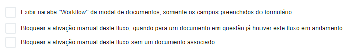

# ▫ Setembro | 2023

14/09: ArqFlow - Bloquear ativação manual sem um documento associado

A tela [Dados Gerais](../workflow/desenho-do-fluxo/aba-dados-gerais.md) no menu Desenho de um Fluxo foi alterada para incluir o parâmetro “Bloquear a ativação manual deste fluxo sem um documento associado.”

Este parâmetro será exibido para seleção somente em desenhos com tipo de ativação manual.

Desenhos de fluxo com este parâmetro selecionado não poderão ser ativados manualmente sem que haja um documento selecionado, ou seja, para estes desenhos um fluxo poderá ser ativado somente via pesquisa simples, avançada, explorar ou aba Workflow na tela de Documentos.

Para ver detalhes dessa funcionalidade acesse [Workflow > Desenho do Fluxo > Aba Dados Gerais. ](../workflow/desenho-do-fluxo/aba-dados-gerais.md)

13/09: ArqFlow - Substituição de pessoas

Na tela de substituição de pessoas, quando o usuário escolher a opção "Substituição Definitiva - Transferir todas as atividades em execução", a aplicação irá verificar todos os fluxos em execução do cliente e enviar todas as tarefas do usuário substituído para o usuário substituto.&#x20;

Anteriormente, a aplicação substituía o usuário somente nas tarefas em execução do usuário substituído. Com esta alteração, a aplicação irá verificar todos os fluxos que estejam em execução e que já foram executadas por este usuário substituído e, incluir o usuário substituto em todas as tarefas em questão.&#x20;

Desta forma, quando voltar uma tarefa, esta não irá retornar para o usuário responsável que executou, mas sim para o usuário substituído.

Para ver detalhes dessa funcionalidade acesse [Workflow > Substituição de Pessoas.](../workflow/substituicao-de-pessoas.md#substituicao-definitiva)

13/09: ArqFlow - Grupo de Usuários

A tela de Grupo de Usuários foi alterada para possibilitar inativar/ativar usuários em um grupo.&#x20;

Foi incluído um ícone para a funcionalidade e, não será mais necessário excluir um usuário do grupo para que ele não receba tarefas para execução.

Quando for selecionado um usuário do grupo, o ícone será habilitado para que este seja inativado ou ativado, conforme a necessidade.&#x20;

Usuários inativados em um grupo não irão receber novas tarefas que estejam configuradas para o Grupo em questão.

Para ver detalhes dessa funcionalidade acesse [Workflow > Grupo de Usuários.](../workflow/grupo-de-usuarios.md#inativar-usuarios)

