# 🟩 Cadastrar

Por meio do menu Cadastrar é possível visualizar todos os documentos processados e validados pela aplicação ArqIndex.&#x20;

Nesta tela, quando o usuário seleciona o local de trabalho (que é a configuração de [Parâmetros Gerais](configuracoes/parametros-gerais.md) relacionada na aplicação ArqIndex), o campo "Cliente" é habilitado para que seja selecionado em qual cliente serão realizadas as indexações. Após selecionados o local de trabalho e o cliente, o botão "Pesquisar" é habilitado e, quando acionado na tela, são exibidos todos os documentos do cliente em questão para indexação.

Nesta tela são exibidos apenas mil documentos por vez e à medida que são realizadas as indexações, a tela vai atualizando a quantidade de documentos, enquanto houver documentos para serem indexados. Veja abaixo os detalhes da tela.

<figure>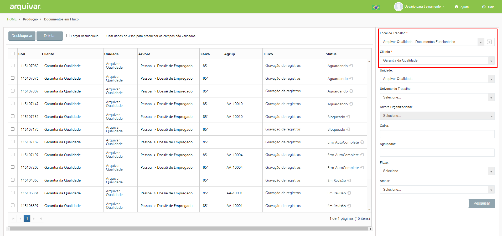<figcaption>
Clique para ampliar a imagem.
</figcaption></figure>

***

## Processo de Indexação&#x20;

Ao acessar a tela, selecione o “Local de Trabalho”. Para salvar o local selecionado como padrão, clique no ícone “Salvar”. Essa opção permite que ao entrar novamente na tela de indexação, o local salvo seja exibido de forma fixa, sem necessidade de seleção novamente.&#x20;

<figure>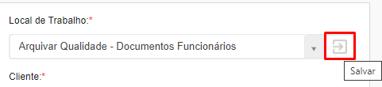<figcaption>
Clique para ampliar a imagem.
</figcaption></figure>

Ao selecionar o local de trabalho são preenchidos os campos “Cliente” e “Unidade”. Caso a unidade esteja indexando documentos para mais de um cliente, será necessário selecionar o cliente que deverá ser pesquisado.

<figure>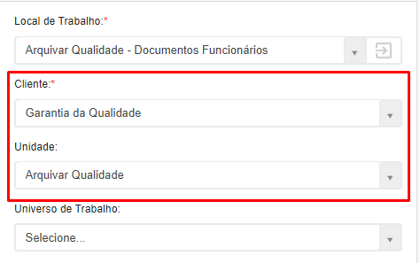<figcaption>
Clique para ampliar a imagem.
</figcaption></figure>

Os demais campos podem ou não ser preenchidos para a pesquisa. Conforme a necessidade de indexação, será possível filtrar os documentos por “Universo de Trabalho”, “Árvore Organizacional”, “Caixa”, “Agrupador”, “Fluxo de Trabalho” ou “Status”.&#x20;

Quando acionado o botão “Pesquisar” serão exibidos todos os documentos processados e validados pela aplicação ArqIndex.

<figure>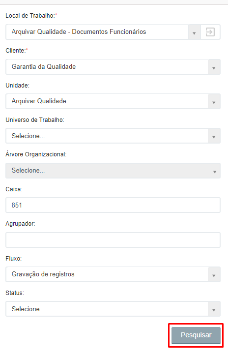<figcaption>
Clique para ampliar a imagem.
</figcaption></figure>

Serão exibidos todos os arquivos daquele local de trabalho que estão aguardando para ser indexados. Nesta tela são exibidos no máximo 1000 registros por vez. Os arquivos com status “Aguardando” são exibidos sempre primeiro e os com status “Em Revisão” são exibidos por último. O filtro de status pode ser aplicado conforme a necessidade.  &#x20;

<figure><figcaption>
Clique para ampliar a imagem.
</figcaption></figure>


<mark style="color:orange;">**Para a indexação de documentos no menu Produção > Cadastrar é necessário que a aplicação ArqIndex esteja com o processo de**</mark> [<mark style="color:blue;">**“Host das Imagens” iniciado.**</mark>](configuracoes/aplicativo-arqindex.md) <mark style="color:orange;">**Esse processo é responsável por exibir as imagens de cada documento.**</mark> 

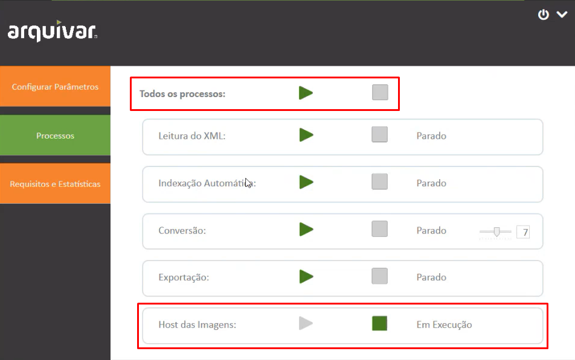


Caso o arquivo que deseja indexar esteja bloqueado, selecione-o e clique em “Desbloquear”. O sistema levará 10 minutos para desbloquear o arquivo.&#x20;

<figure>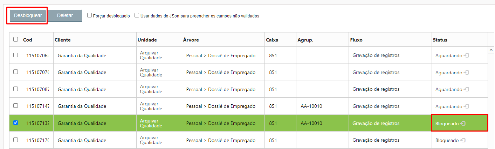<figcaption>
Clique para ampliar a imagem.
</figcaption></figure>

Ao desbloquear um arquivo certifique-se de que ele não está bloqueado porque outra pessoa já está executando a indexação. Caso tenha certeza de que ninguém mais está trabalhando com o mesmo arquivo, marque a opção “Forçar desbloqueio” para desbloquear o arquivo imediatamente.&#x20;

Também é possível excluir arquivos que estejam na fila de trabalho, selecionando-os e clicando em “Deletar”.&#x20;

Selecionando a opção “Usar dados do JSon para preencher os campos não validados”, ao abrir um arquivo para indexação os campos que tiverem sido preenchidos erroneamente serão exibidos em vermelho. Caso essa opção não seja marcada, os campos que tiverem sido preenchidos incorretamente serão deixados em branco.  &#x20;

<figure>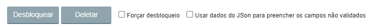<figcaption>
Clique para ampliar a imagem.
</figcaption></figure>

Ao clicar no ícone “Abrir documento” de um arquivo, será aberta a imagem para que os campos indexadores sejam cadastrados.&#x20;

<figure>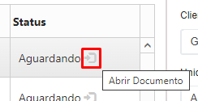<figcaption>
Clique para ampliar a imagem.
</figcaption></figure>

Na parte esquerda da tela é exibida a imagem escaneada do documento. Na parte direita são apresentados os campos que devem ser preenchidos pelo operador de indexação. Se o arquivo tiver o campo chave preenchido durante a digitalização, alguns campos com autocomplete serão apresentados já preenchidos.&#x20;

<figure>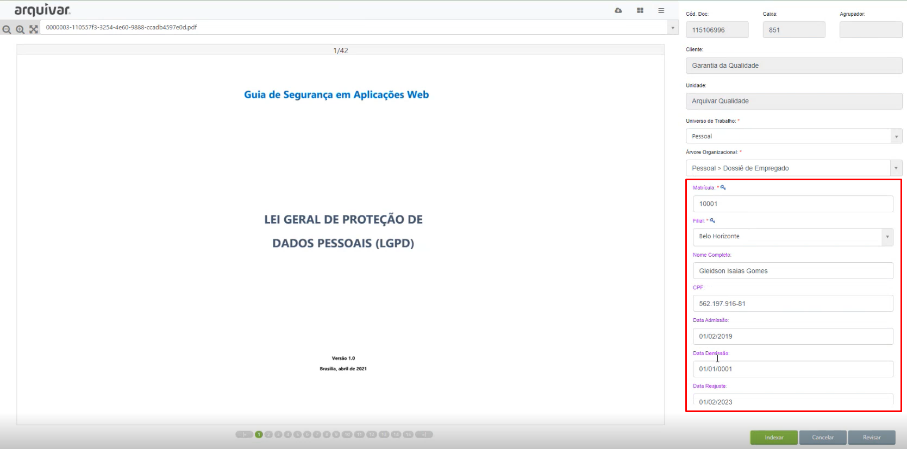<figcaption>
Clique para ampliar a imagem.
</figcaption></figure>

O operador que estiver executando a indexação deve preencher os campos em branco com as informações apresentadas no documento. Para navegar entre as páginas do documento utilize a paginação na parte inferior da tela ou as teclas de seta para direita e esquerda do teclado. &#x20;

<figure>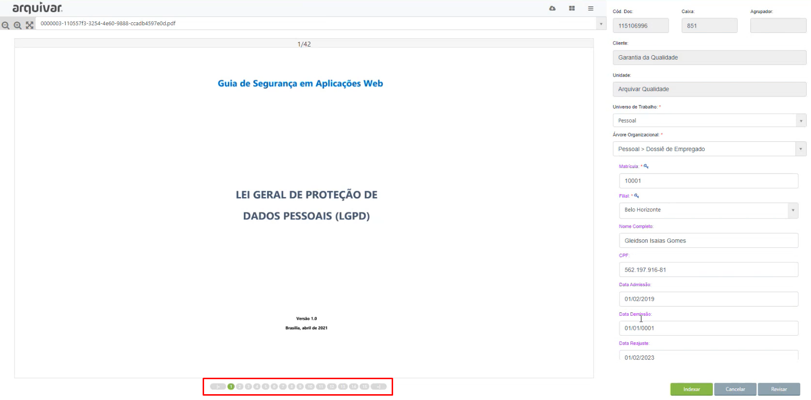<figcaption>
Clique para ampliar a imagem.
</figcaption></figure>

É possível visualizar mais de uma página na tela, clicando no ícone de grid no canto superior da tela. &#x20;

<figure><figcaption>
Clique para ampliar a imagem.
</figcaption></figure>

Ao clicar no ícone “Baixar” será feito o download das imagens do arquivo. Clicando no ícone “Recolher” os campos à direita serão ocultados, expandindo a visualização do arquivo.&#x20;

<figure>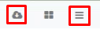<figcaption>
Clique para ampliar a imagem.
</figcaption></figure>

Também é possível aumentar ou diminuir o zoom das páginas ou visualizar o arquivo em tela cheia utilizando os ícones no canto superior esquerdo.  &#x20;

<figure>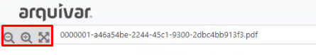<figcaption>
Clique para ampliar a imagem.
</figcaption></figure>

Quando se inicia o processo de indexação de um arquivo, é exibido na parte superior da tela um cronômetro, que conta 10 minutos. Isso significa que o operador possui dez minutos para concluir a indexação do documento. Caso o tempo acabe e a indexação não seja concluída, a tela será fechada e o arquivo será desbloqueado.  &#x20;

<figure>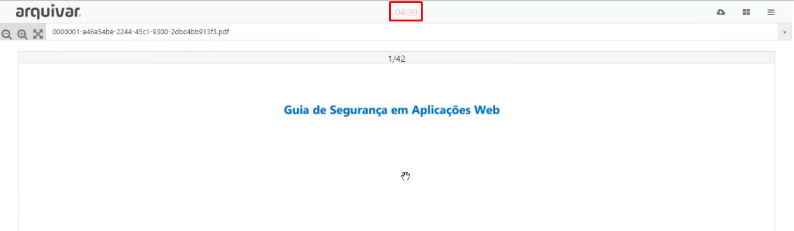<figcaption>
Clique para ampliar a imagem.
</figcaption></figure>

Depois de concluir o preenchimento dos campos, clique em “Indexar”. Atente-se ao preenchimento dos campos obrigatórios. Ao terminar a indexação de um documento, o próximo que estiver na fila de trabalho será aberto para indexação seguinte. &#x20;

<figure>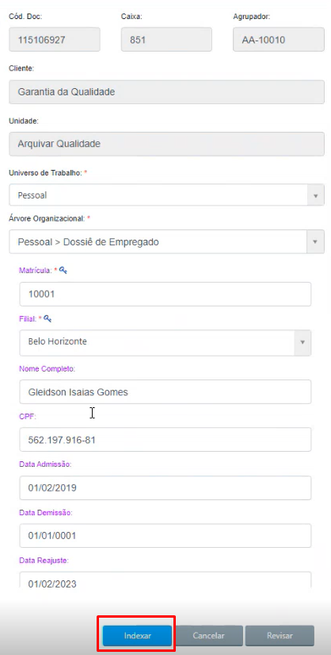<figcaption>
Clique para ampliar a imagem.
</figcaption></figure>


<mark style="color:orange;">**Depois de indexado, não será possível visualizar o arquivo novamente. Somente será possível verificar o log acessando o menu**</mark> [<mark style="color:blue;">**Configurações > Parâmetros Gerais > Visualizar > Aba Log**</mark>](configuracoes/#parametros-gerais)<mark style="color:orange;">**, onde deverá ser selecionada a etapa seguinte à indexação definida no**</mark>[ <mark style="color:blue;">**Fluxo de Trabalho.**</mark> ](configuracoes/#fluxo-de-trabalho)

