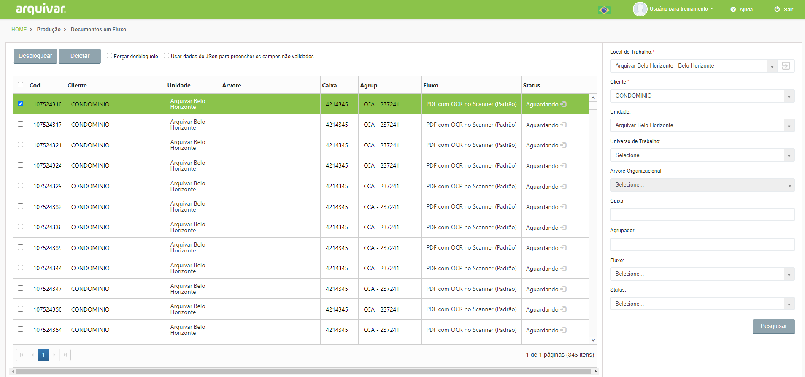
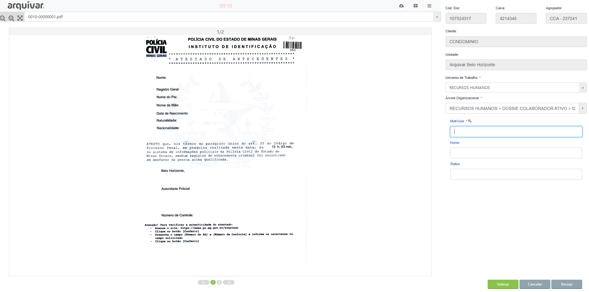

# 🟩 Cadastrar

No menu Cadastrar é realizado o cadastro dos metadados dos documentos do cliente que estão na fila de trabalho. Depois de selecionar o Local de Trabalho e o Cliente, é apresentada a lista de arquivos que estão na fila de trabalho.&#x20;

<figure><figcaption>
Clique para ampliar a imagem.
</figcaption></figure>

Ao clicar em um deles é aberta a imagem para que os campos indexadores sejam cadastrados.&#x20;

Na parte esquerda da tela é exibida a imagem escaneada do documento. Na parte direita são apresentados os campos que devem ser preenchidos pelo operador de produção. &#x20;

<figure><figcaption>
Clique para ampliar a imagem.
</figcaption></figure>
