# 🟩 Cadastrar



Por meio do menu Cadastrar é possível visualizar todos os documentos processados e validados pela aplicação ArqIndex.&#x20;

Nesta tela, quando o usuário seleciona o local de trabalho (que é a configuração de [Parâmetros Gerais](configuracoes/parametros-gerais.md) relacionada na aplicação ArqIndex), o campo "Cliente" é habilitado para que seja selecionado em qual cliente serão realizadas as indexações. Após selecionados o local de trabalho e o cliente, o botão "Pesquisar" é habilitado e, quando acionado na tela, são exibidos todos os documentos do cliente em questão para indexação.

Nesta tela são exibidos apenas mil documentos por vez e à medida que são realizadas as indexações, a tela vai atualizando a quantidade de documentos, enquanto houver documentos para serem indexados. Veja abaixo os detalhes da tela.

<figure>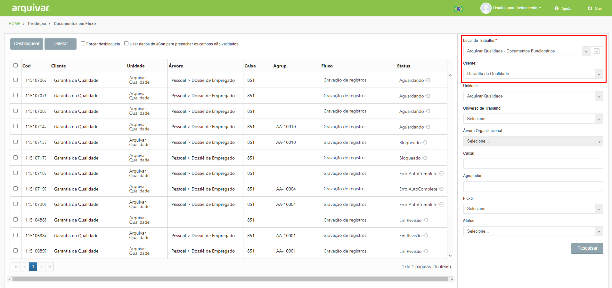<figcaption>
Clique para ampliar a imagem.
</figcaption></figure>

***

## Processo de Indexação&#x20;

### Localização do arquivo&#x20;

Ao acessar a tela, selecione o “Local de Trabalho”. Para salvar o local selecionado como padrão, clique no ícone “Salvar”. Essa opção permite que ao entrar novamente na tela de indexação, o local salvo seja exibido de forma fixa, sem necessidade de seleção novamente.&#x20;

<figure>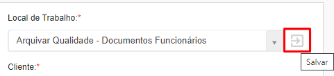<figcaption>
Clique para ampliar a imagem.
</figcaption></figure>

Ao selecionar o local de trabalho são preenchidos os campos “Cliente” e “Unidade”. Caso a unidade esteja indexando documentos para mais de um cliente, será necessário selecionar o cliente que deverá ser pesquisado.

<figure>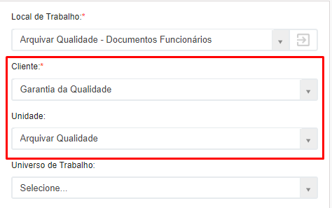<figcaption>
Clique para ampliar a imagem.
</figcaption></figure>

Os demais campos podem ou não ser preenchidos para a pesquisa. Conforme a necessidade de indexação, será possível filtrar os documentos por “Universo de Trabalho”, “Árvore Organizacional”, “Caixa”, “Agrupador”, “Fluxo de Trabalho” ou “Status”.&#x20;

Quando acionado o botão “Pesquisar” serão exibidos todos os documentos processados e validados pela aplicação ArqIndex.

<figure>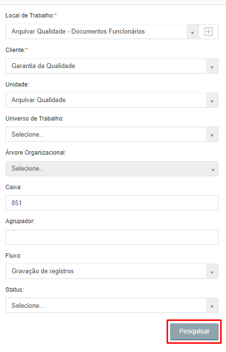<figcaption>
Clique para ampliar a imagem.
</figcaption></figure>

Serão exibidos todos os arquivos daquele local de trabalho que estão aguardando para ser indexados. Nesta tela são exibidos no máximo 1000 registros por vez. Os arquivos com status “Aguardando” são exibidos sempre primeiro e os com status “Em Revisão” são exibidos por último. O filtro de status pode ser aplicado conforme a necessidade.  &#x20;

<figure>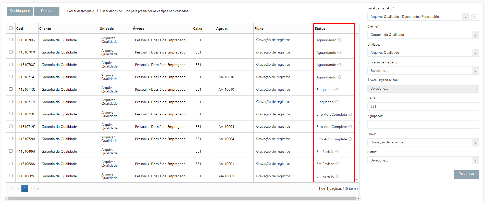<figcaption>
Clique para ampliar a imagem.
</figcaption></figure>


<mark style="color:orange;">**Para a indexação de documentos no menu Produção > Cadastrar é necessário que a aplicação ArqIndex esteja com o processo de**</mark> [<mark style="color:blue;">**“Host das Imagens” iniciado.**</mark>](configuracoes/aplicativo-arqindex.md) <mark style="color:orange;">**Esse processo é responsável por exibir as imagens de cada documento.**</mark> 

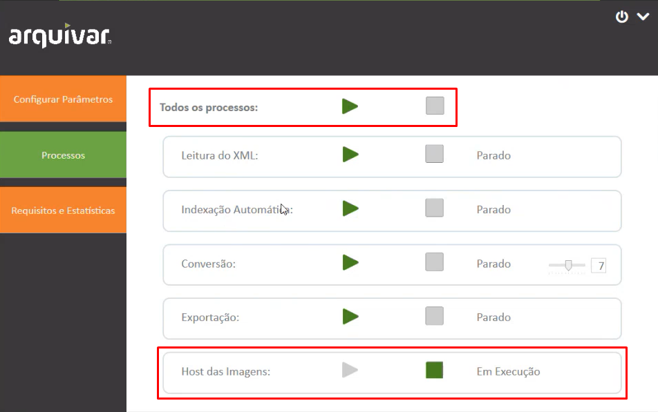


Caso o arquivo que deseja indexar esteja bloqueado, selecione-o e clique em “Desbloquear”. O sistema levará 10 minutos para desbloquear o arquivo.&#x20;

<figure>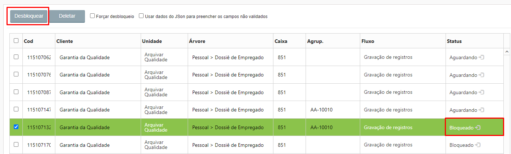<figcaption>
Clique para ampliar a imagem.
</figcaption></figure>

Ao desbloquear um documento certifique-se de que ele não está bloqueado por indexação. Caso tenha certeza que o documento não está em processo de indexação, selecione-o na tela e marque a opção “Forçar desbloqueio” para o desbloqueio imediato.&#x20;

Para exclusão de documentos na tela, selecione o documentos em questão e clique em “Deletar”.&#x20;

Selecionando a opção “Usar dados do JSon para preencher os campos não validados”, quando um documento for aberto para indexação os campos que tiverem sido preenchidos incorretamente serão exibidos com o valor na cor vermelha para correção.   &#x20;


<mark style="color:blue;">**EXEMPLO:**</mark> <mark style="color:blue;"></mark><mark style="color:blue;">Campo "Data" preenchido com o valor "12/13/2023".</mark>


<figure>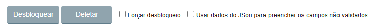<figcaption>
Clique para ampliar a imagem.
</figcaption></figure>

Para abrir um documento para indexação, cada documento exibido na tela possui o ícone "Abrir documento" ao lado do status. Ao clicar no ícone e com o ["Host das Imagens" iniciado na aplicação ArqIndex](configuracoes/aplicativo-arqindex.md#processos), o documento será aberto, exibindo sua imagem ou arquivo para indexação, bem como sua árvore e os campos customizados ou de lista serão exibidos para preenchimento.&#x20;

<figure>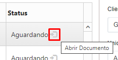<figcaption>
Clique para ampliar a imagem.
</figcaption></figure>

***

### Campos da tela de indexação

Quando um documento é aberto para indexação, na parte esquerda da tela é exibida a imagem digitalizada do documento. Na parte direita são apresentados o código do documento, o código da caixa (se houver), o agrupador (se houver), o cliente e a unidade. Logo abaixo, ainda na parte direita, são exibidos a árvore documental e seus campos customizados e/ou de lista para indexação.


<mark style="color:orange;">**Um documento pode ser digitalizado sem árvore documental. Neste caso, ao abri-lo o campo "Universo de Trabalho" e "Árvore Organizacional" virão vazios para que o usuário possa escolher em qual nível de árvore este documento será indexado.**</mark>&#x20;


Se o arquivo tiver o campo chave preenchido durante a digitalização, alguns campos com autocomplete serão apresentados já preenchidos.&#x20;

O campo "Agrupador" exibido no canto superior direito da tela refere-se a um campo customizado cuja informação será utilizada para agrupar vários documentos, ou seja, na tela principal um usuário poderá filtrar pelo valor do campo agrupador e indexar todos os documentos que possuírem este valor filtrado.&#x20;


<mark style="color:orange;">**Para utilização deste controle é preciso que na árvore documental exista um campo chamado "Agrupador", e na digitalização este campo seja preenchido com o valor desejado para algum tipo de controle do usuário gestor.**</mark>&#x20;


<figure>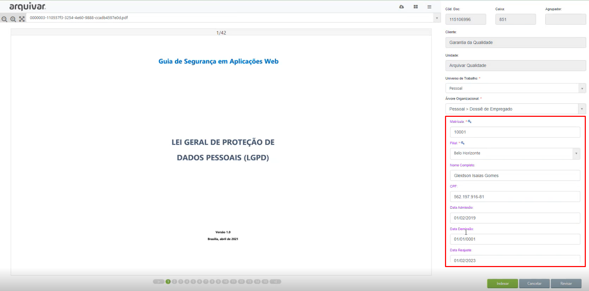<figcaption>
Clique para ampliar a imagem.
</figcaption></figure>

O operador que estiver executando a indexação deve preencher os campos em branco com as informações apresentadas no documento. Na parte inferior da tela, caso o arquivo relacionado ao documento possua mais de uma página é possível navegar entre as páginas utilizando a paginação por teclas no teclado direita/esquerda ou clicando nos números conforme a quantidade de páginas. &#x20;

<figure>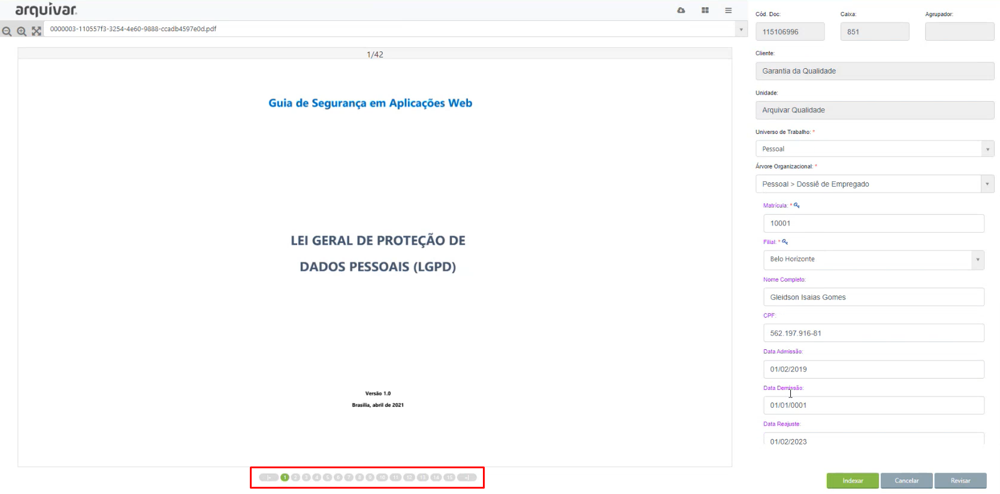<figcaption>
Clique para ampliar a imagem.
</figcaption></figure>

É possível visualizar mais de uma página na tela, clicando no ícone de grid no canto superior da tela. &#x20;

<figure>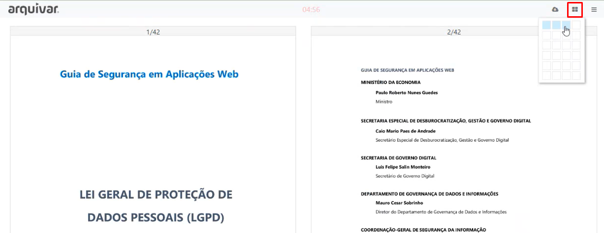<figcaption>
Clique para ampliar a imagem.
</figcaption></figure>

Ao clicar no ícone “Baixar” será feito o download das imagens do arquivo. Clicando no ícone “Recolher” os campos à direita serão ocultados, expandindo a visualização do arquivo.&#x20;

<figure>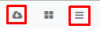<figcaption>
Clique para ampliar a imagem.
</figcaption></figure>

Também é possível aumentar ou diminuir o zoom das páginas ou visualizar o arquivo em tela cheia utilizando os ícones no canto superior esquerdo.  &#x20;

<figure>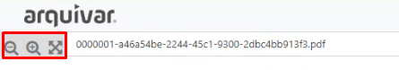<figcaption>
Clique para ampliar a imagem.
</figcaption></figure>

Quando se inicia o processo de indexação (abre-se o documento), é exibido na parte superior da tela um temporizador, com prazo de 10 minutos para indexação. Nesse tempo o documento fica bloqueado para que somente o usuário em questão possa indexá-lo. Isso significa que o usuário possui até dez minutos para concluir a indexação do documento. Caso o tempo expire e a indexação não seja concluída, a tela será fechada automaticamente, retornando para a pesquisa principal e o arquivo será desbloqueado para indexação.  &#x20;

<figure>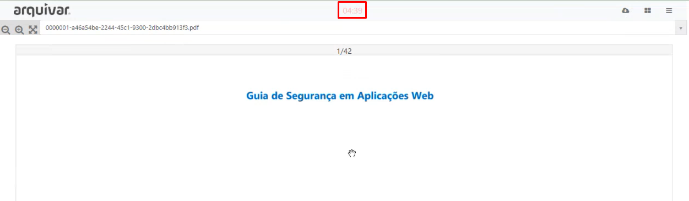<figcaption>
Clique para ampliar a imagem.
</figcaption></figure>

Na parte inferior da tela são apresentados os botões "Indexar", "Cancelar" e "Revisar". Depois de concluir o preenchimento dos campos de indexação do documento, clique em “Indexar”. Atente-se ao preenchimento dos campos obrigatórios. O documento em questão irá para a próxima etapa do fluxo de trabalho e o próximo documento a ser indexado será carregado na tela automaticamente.

Caso o usuário fique em dúvida ou encontre algo no documento que necessite de alguma revisão, deve clicar no botão "Revisar". O status do documento será alterado para "Em revisão" e o próximo documento a ser indexado será carregado na tela automaticamente. O documento em revisão poderá ser encontrado na tela de pesquisa anterior por meio do novo status e indexado novamente conforme necessidade.   &#x20;

<figure>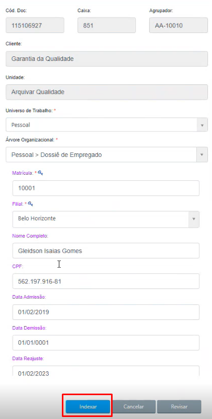<figcaption>
Clique para ampliar a imagem.
</figcaption></figure>


<mark style="color:orange;">**Após a indexação do documento não será possível visualizá-lo novamente até ser exportado para a o ArqGED. É possível acompanhar o processo de gravação e exportação dos documentos indexados acessando o menu**</mark> [<mark style="color:blue;">**Configurações > Parâmetros Gerais > Visualizar > Aba Log**</mark>](configuracoes/#parametros-gerais)<mark style="color:blue;">**.**</mark>**&#x20;**<mark style="color:orange;">**Nesta tela será possível acompanhar as etapas seguintes à indexação conforme definidas no**</mark> [<mark style="color:blue;">**Fluxo de Trabalho**</mark>](configuracoes/fluxo-de-trabalho.md)<mark style="color:orange;">**.**</mark>  &#x20;

