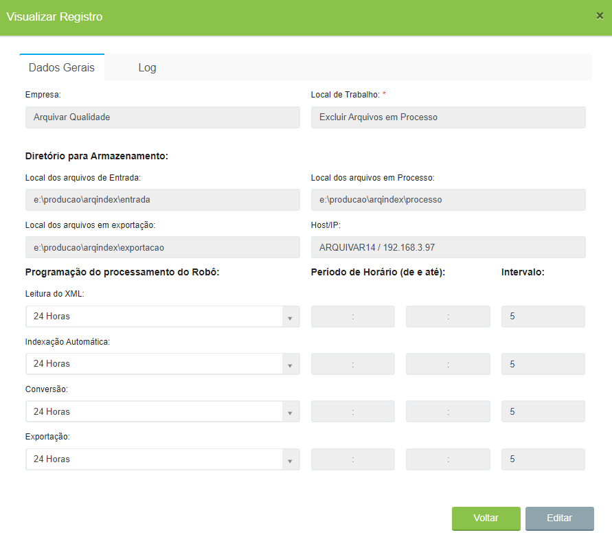
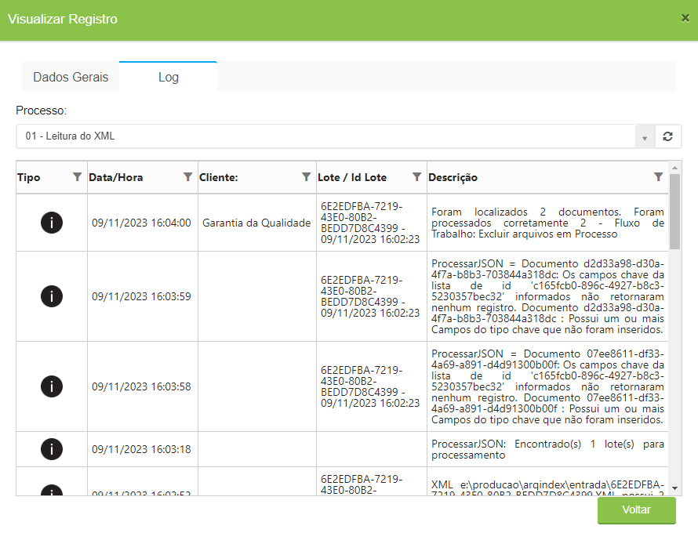
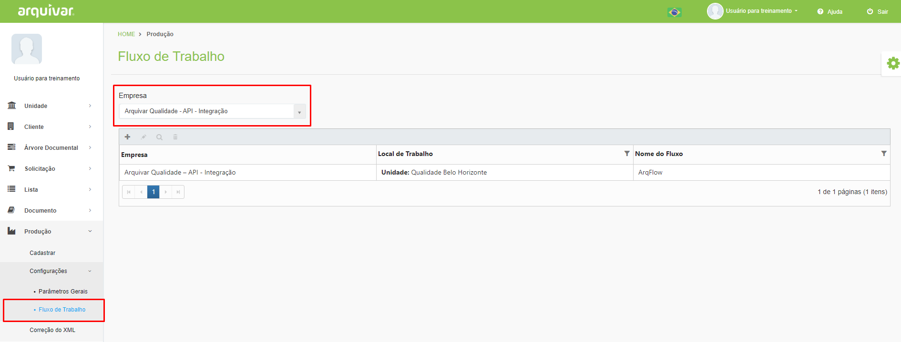
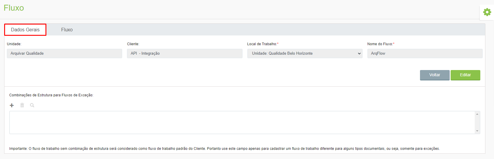

# 🟩 Configurações

No menu Configurações é configurado o robô do ArqIndex no servidor que está armazenando as imagens do cliente em processamento e definido o fluxo do processo de indexação de cada cliente.

O menu Configurações é composto pelos seguintes submenus:

## Parâmetros Gerais&#x20;

No menu Parâmetros Gerais são configurados os caminhos do servidor para o cliente, ou seja, os locais de armazenamento dos arquivos do cliente no servidor. Ao longo do processo de indexação um arquivo de documento fica hospedado em diferentes locais do servidor:&#x20;

* **Local dos arquivos de Entrada:** Local em que o arquivo fica hospedado assim que é digitalizado.&#x20;
* Local dos arquivos em Processo: Local em que o arquivo fica hospedado quando é enviado para a fila de trabalho e está aguardando para ser indexado.    &#x20;
* **Local dos arquivos em Exportação:** Local em que o arquivo fica hospedado quando já foi indexado e está pronto para ser exportado para PDF.&#x20;

Neste menu é definida também a periodicidade da leitura dos arquivos XML, da indexação automática, da conversão e da exportação dos arquivos do cliente, que são as rotinas do processo de indexação de um documento executadas pelo próprio sistema. &#x20;

<figure><figcaption>
Clique para ampliar a imagem.
</figcaption></figure>

Na aba Log são apresentados os logs do robô de processamento, ou seja, as informações de todas as movimentações dos processos que foram realizados nos arquivos escaneados e indexados. &#x20;

<figure><figcaption>
Clique para ampliar a imagem.
</figcaption></figure>

***

## Fluxo de Trabalho&#x20;

Neste menu é configurado o processo de trabalho de indexação de cada cliente, ou seja, o passo a passo para que a indexação de documentos daquele cliente seja feita. Para isso, é preciso selecionar a Empresa cliente.

<figure><figcaption>
Clique para ampliar a imagem.
</figcaption></figure>

Na aba Dados Gerais, depois de selecionar a empresa é possível editar os fluxos criados ou desenhar um novo fluxo.&#x20;

<figure><figcaption>
Clique para ampliar a imagem.
</figcaption></figure>

Na aba Fluxo é possível definir quais etapas irão compor o processo de indexação do cliente.  &#x20;

<figure><figcaption>
Clique para ampliar a imagem.
</figcaption></figure>
