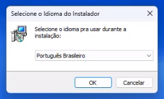
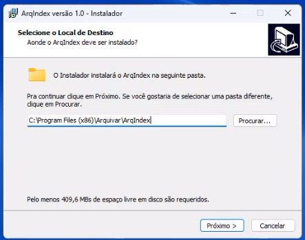
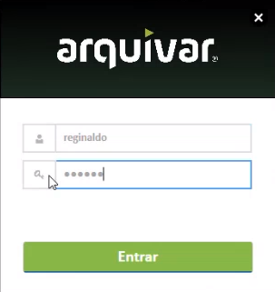
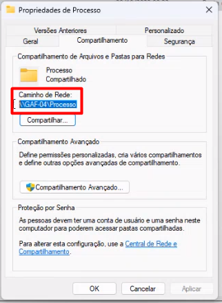
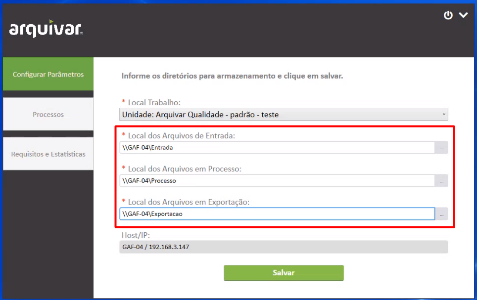
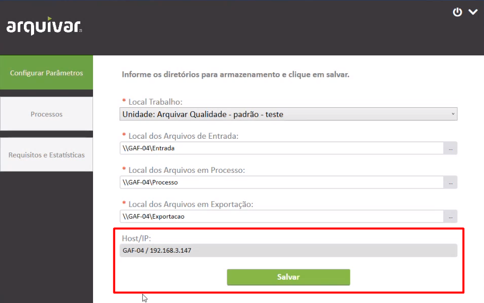
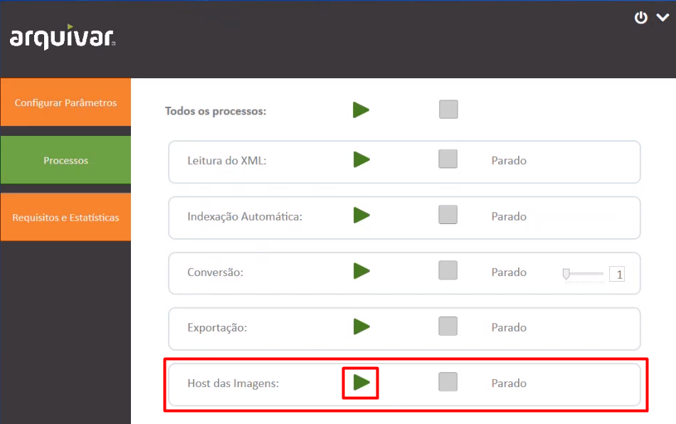
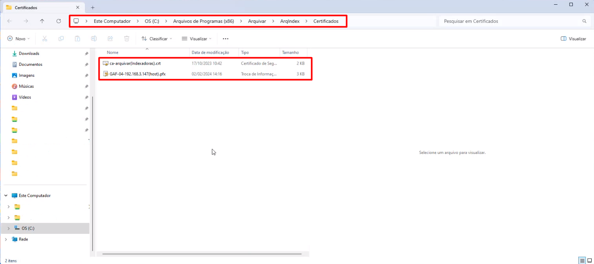
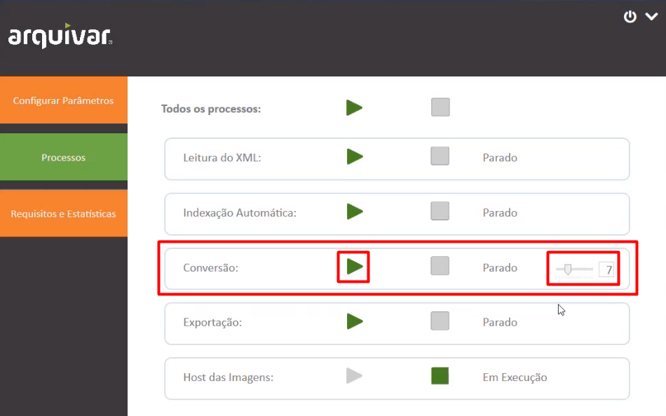
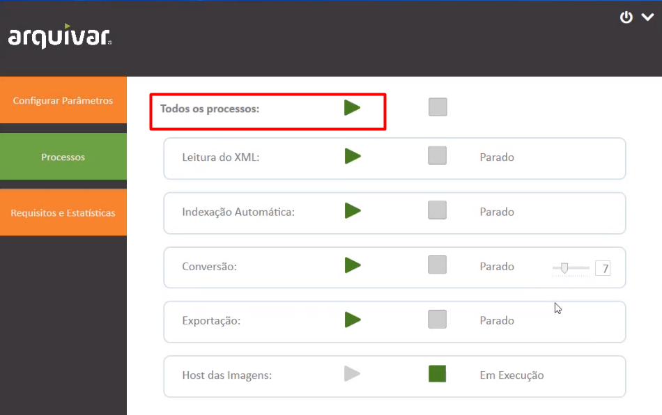

# 🔹 Aplicativo ArqIndex

O aplicativo ArqIndex é necessário para o trabalho de digitalização e indexação dos documentos, seja na unidade ou no cliente. Este aplicativo deve ser instalado em todas as máquinas que farão a digitalização e indexação de documentos. &#x20;

## Instalação do aplicativo ArqIndex&#x20;

A instalação do ArqIndex no cliente ou em uma das unidades franqueadas deve ser feita pela Arquivar Master mediante solicitação da própria unidade Arquivar franqueada por meio do ArqAtende.&#x20;

Passo a passo para abertura de chamado no ArqAtende

1. Acesse o site [https://b24-sd3f59.bitrix24.site/Solicitacoesfranquias/](https://b24-sd3f59.bitrix24.site/Solicitacoesfranquias/)&#x20;
2. Preencha os campos apresentados na tela:&#x20;

* _Unidade de Negócios:_ nome da unidade solicitante&#x20;
* _Nome do cliente:_ Se o chamado estiver sendo aberto para a unidade, repita o nome. Se for para um cliente, informe o cliente para quem o chamado será aberto.&#x20;
* _Dados de contato:_ Informe o nome, e-mail e telefone de quem deve receber o retorno do chamado. Essa pessoa precisa ter condições de repassar informações do processo, pois ela poderá ser contata pelos técnicos da Arquivar Master durante a execução do chamado. Se o chamado estiver sendo aberto para um cliente, o contato deverá ser do responsável pelo atendimento àquele cliente dentro da unidade. &#x20;

3. Clique em “Próximo”.&#x20;
4. No campo “Departamento Atendimento Solicitação” informe o departamento que deve receber sua solicitação.&#x20;

***

### Requisitos mínimos&#x20;

A máquina onde o aplicativo ArqIndex será instalado deve ter, no mínimo:&#x20;

* Processador de quatro núcleos;&#x20;
* 8 GB de memória RAM;&#x20;
* Espaço de armazenamento em disco de acordo com a demanda de processamento, sendo o mínimo de 250 GB. Caso a unidade ou cliente demande um espaço maior de armazenamento, é recomendável utilizar uma máquina de 500 GB ou 1 TB.

***

### Instalação

Depois de realizar o download do do aplicativo instalador, clique duas vezes sobre o arquivo. Selecione o idioma desejado e clique em “OK”. Nas próximas telas, clique em “Próximo”. &#x20;

<figure><figcaption></figcaption></figure>

Por padrão, a pasta de destino da instalação sempre será C:\Program Files (x86)\Arquivar\ArqIndex. O usuário pode escolher outra pasta de destino se desejar.&#x20;

<figure><figcaption></figcaption></figure>

***

## Acesso ao ArqIndex&#x20;

Depois de instalar o aplicativo do ArqIndex, realize o login utilizando o mesmo usuário e senha de acesso ao ArqGED.&#x20;

<figure><figcaption></figcaption></figure>


<mark style="color:orange;">**Para acessar o ArqIndex o usuário precisa possuir permissão de acesso ao ArqIndex devidamente habilitada na tela**</mark> [<mark style="color:blue;">**Administração > Usuários > Aba Permissões I**</mark>](../../administracao/usuarios.md) <mark style="color:blue;">**> Perfil de acesso: Gestão ArqINDEX**</mark><mark style="color:orange;">**. Um usuário pode possuir apenas permissão de indexação, de configuração do local de trabalho ou de correção do XML, ou pode possuir uma permissão global, que permite o acesso a todos os menus.**</mark>&#x20;



***

## Configurar Parâmetros&#x20;

Nesta tela são definidos os locais de trabalho para armazenamento das imagens digitalizadas.&#x20;

Em “Local de Trabalho” selecione a unidade ou cliente. &#x20;

Para definir os locais de arquivos de entrada, em processo e em exportação é preciso primeiro criar essas pastas na máquina. Para isso, acesse o local onde o aplicativo foi instalado (por padrão a pasta C:\Program Files (x86)\Arquivar\ArqIndex) e crie três pastas nesse local: “Entrada”, “Exportação” e “Processo”.&#x20;

<figure><figcaption></figcaption></figure>


<mark style="color:orange;">**As pastas criadas devem ser compartilhadas em rede com outras máquinas que também precisarão acessar o conteúdo para realizar a indexação dos documentos.**</mark>&#x20;


Depois de criar as pastas, copie o endereço de acesso a elas nos campos correspondentes a cada uma. Para isso clique sobre a pasta com o botão direito do mouse e selecione Propriedades > Compartilhamento. Copie o “Caminho de Rede” no campo correspondente.&#x20;


<mark style="color:blue;">**EXEMPLO:**</mark> <mark style="color:blue;"></mark><mark style="color:blue;">Copie o caminho de rede da pasta “Entrada” no campo “Local dos Arquivos de Entrada”. Faça isso também com as demais pastas.</mark>&#x20;


<figure><figcaption></figcaption></figure>

<figure><figcaption></figcaption></figure>

O campo “HOST/IP” é preenchido automaticamente com o endereço de rede onde está instalado o robô do ArqIndex. Clique em “Salvar”.&#x20;

<figure><figcaption></figcaption></figure>

***

## &#x20;Processos&#x20;

Nesta tela são iniciadas as etapas do fluxo de indexação do cliente. As etapas mostradas aqui foram definidas anteriormente na tela [Produção > Configurações > Fluxo de Trabalho](fluxo-de-trabalho.md) para o cliente ou unidade.&#x20;

A primeira etapa a ser executada é o “Host das Imagens”, que deverá criar os certificados de segurança da máquina onde o robô está instalado e das máquinas indexadoras. Clique no ícone “Play”.  &#x20;

<figure><figcaption></figcaption></figure>

Será criada uma pasta com os certificados necessários para a indexação dentro do local onde o aplicativo está instalado (por padrão, a pasta C:\Program Files (x86)\Arquivar\ArqIndex). &#x20;

<figure><figcaption></figcaption></figure>

Na etapa “Conversão” deve ser definida a quantidade de núcleos do processador que deverão ser dedicados exclusivamente para o processo de conversão dos documentos, que demanda mais recursos da máquina. Depois de realizar essa definição, clique em “Play”.&#x20;

<figure><figcaption></figcaption></figure>

Ao iniciar o processo de indexação, clique em “Play” em “Todos os processos”. &#x20;

<figure><figcaption></figcaption></figure>


<mark style="color:orange;">**O ideal é que a máquina que for receber o robô do ArqIndex seja dedicada exclusivamente a essa função, já que serão consumidos muito espaço de armazenamento e memória pelo aplicativo e permaneça ligada. Caso seja necessário desligar a máquina ou interromper o ArqIndex por algum motivo, retorne a essa tela e clique em “Pause” em “Todos os processos”.**</mark> &#x20;

