# 🔹 Aplicativo ArqIndex



O aplicativo ArqIndex é necessário para o trabalho de digitalização e indexação dos documentos, seja na unidade ou no cliente. Este aplicativo deve ser instalado na máquina que será utilizada como servidor, na qual ocorrerão os processos.

## Instalação do aplicativo ArqIndex

A instalação do ArqIndex no cliente ou em uma das unidades franqueadas deve ser feita pela Arquivar Master mediante solicitação da própria unidade Arquivar franqueada por meio do ArqAtende.

Passo a passo para abertura de chamado no ArqAtende

1. Acesse o site [https://b24-sd3f59.bitrix24.site/Solicitacoesfranquias/](https://b24-sd3f59.bitrix24.site/Solicitacoesfranquias/)
2. Preencha os campos apresentados na tela:

* _Unidade de Negócios:_ nome da unidade solicitante
* _Nome do cliente:_ Se o chamado estiver sendo aberto para a unidade, repita o nome. Se for para um cliente, informe o cliente para quem o chamado será aberto.
* _Dados de contato:_ Informe o nome, e-mail e telefone de quem deve receber o retorno do chamado. Essa pessoa precisa ter condições de repassar informações do processo, pois ela poderá ser contata pelos técnicos da Arquivar Master durante a execução do chamado. Se o chamado estiver sendo aberto para um cliente, o contato deverá ser do responsável pelo atendimento àquele cliente dentro da unidade.

3. Clique em “Próximo”.
4. No campo “Departamento Atendimento Solicitação” informe o departamento que deve receber sua solicitação.

***

### Requisitos mínimos

Alguns processos executados pela aplicação ArqIndex podem demandar um alto processamento de máquina, como memória, processador, espaço em disco, tráfego de rede e internet. É importante que seja avaliado cada detalhe do projeto, pois esta máquina é um grande diferencial, levando em consideração a quantidade de documentos digitalizados bem como a qualidade e tamanho dos arquivos. Seguem os requisitos mínimos da máquina que irá receber a instalação do aplicativo ArqIndex:

* Processador de quatro núcleos;
* 8 GB de memória RAM;
* Espaço de armazenamento em disco de acordo com a demanda de processamento, sendo o mínimo de 250 GB. Caso a unidade ou cliente demande um espaço maior de armazenamento, é recomendável utilizar uma máquina de 500 GB ou mais de armazenamento interno.

***

### Instalação

Após de realizar o download do executável de instalação, execute a instalação, selecione o idioma desejado e clique em “OK”. Nas próximas telas, apenas clique em “Próximo” para instalação padrão.

<figure>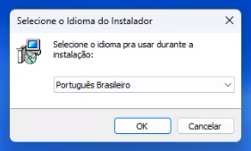<figcaption>
Clique para ampliar a imagem.
</figcaption></figure>

Por padrão, a pasta de destino da instalação sempre será C:\Program Files (x86)\Arquivar\ArqIndex. O usuário pode escolher outra pasta de destino se desejar.

<figure>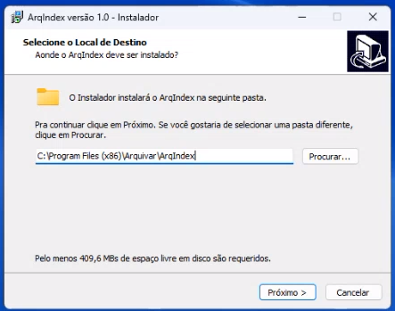<figcaption>
Clique para ampliar a imagem.
</figcaption></figure>

Para instalar o Servidor do ArqIndex o usuário que utilizar o sistema (usuário do Windows), precisa ter permissão de leitura e escrita nos diretórios:

• ArqIndex( C:)

• Entrada

• Processo

• Exportação


<mark style="color:red;">Os aplicativos da Arquivar Addin / ArqIndex / ArqClient podem apresentar erros durante o uso, por falta de pacotes específicos no desktop.</mark>

<mark style="color:red;">Estes erros são solucionados após a instalação de pacotes .Net e VC Redist."</mark>

<mark style="color:red;">Veja abaixo um exemplo de erro deste tipo:</mark>

<mark style="color:red;">Clique nos links abaixo para baixar os instaladores para estes pacotes. É importante utilizar sempre a versão mais atual para instalação.</mark>

1. [<mark style="color:red;">**VC Redist.**</mark>](https://learn.microsoft.com/pt-br/cpp/windows/latest-supported-vc-redist?view=msvc-170#latest-microsoft-visual-c-redistributable-version)
2. [<mark style="color:red;">**.Net**</mark>](https://dotnet.microsoft.com/pt-br/download/dotnet/3.1)

<mark style="color:blue;">Estes erros são apresentados com maior frequência em Notebooks e Máquinas Virtuais.</mark>

<mark style="color:red;">Em caso de dúvidas, entre em contato com nosso suporte pelo ArqAtende.</mark>


***

## Acesso ao ArqIndex

Depois de instalar o aplicativo do ArqIndex, realize o login utilizando o mesmo usuário e senha de acesso ao ArqGED.

<figure>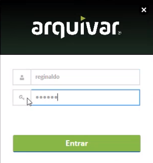<figcaption>
Clique para ampliar a imagem.
</figcaption></figure>


<mark style="color:orange;">**Para acessar o ArqIndex o usuário precisa possuir permissão de acesso ao ArqIndex devidamente habilitada na tela**</mark> [<mark style="color:blue;">**Administração > Usuários > Aba Permissões I**</mark>](../../administracao/usuarios.md) <mark style="color:blue;">**> Perfil de acesso: Gestão ArqINDEX**</mark><mark style="color:orange;">**. Um usuário pode possuir apenas permissão de indexação, de configuração do local de trabalho ou de correção do XML, ou pode possuir uma permissão global, que permite o acesso a todos os menus.**</mark>

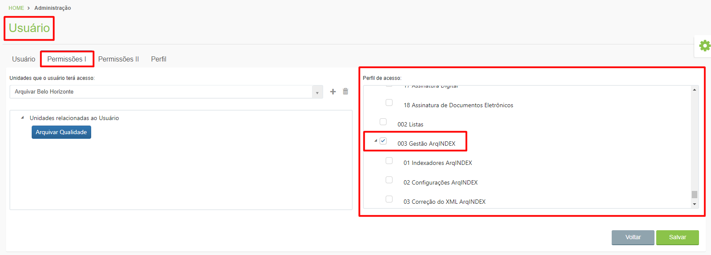


***

## Configurar Parâmetros

Após o login é exibida a tela de configuração dos parâmetros para o funcionamento da aplicação.

**Local de Trabalho:** Neste campo são exibidos os [Parâmetros Gerais](parametros-gerais.md) ou o chamado Local de Trabalho, criados no menu [Produção > Configurações > Parâmetros Gerais](parametros-gerais.md).

**Local dos Arquivos de Entrada:** Neste campo é informada a pasta onde serão armazenados os arquivos XML e imagens digitalizadas no scanner. É importante que esta pasta esteja compartilhada na rede, pois será utilizada tanto pelo ArqIndex para indexação quanto pelo scanner para digitalização.

**Local dos Arquivos em Processo:** Neste campo é informada a pasta onde serão armazenados os arquivos processados e validados corretamente pelo ArqIndex para indexação. É importante que essa pasta esteja compartilhada na rede, pois será utilizada pelo ArqIndex para indexação dos documentos.

**Local dos Arquivos em Exportação:** Neste campo é informado a pasta onde serão armazenados os arquivos processados, validados e indexados corretamente pelo ArqIndex. É importante que esSa pasta esteja compartilhada na rede, pois será utilizada pelo ArqIndex para exportação dos documentos indexados para o ArqGED.

**HOST/IP:** Este campo é preenchido automaticamente com o endereço da rede onde foi instalada a aplicação ArqIndex.


<mark style="color:orange;">**Após clicar no botão "Salvar" não será mais possível alterar o Local de Trabalho informado, portanto, tenha total certeza de que o endereço informado é o correto.**</mark>


<figure>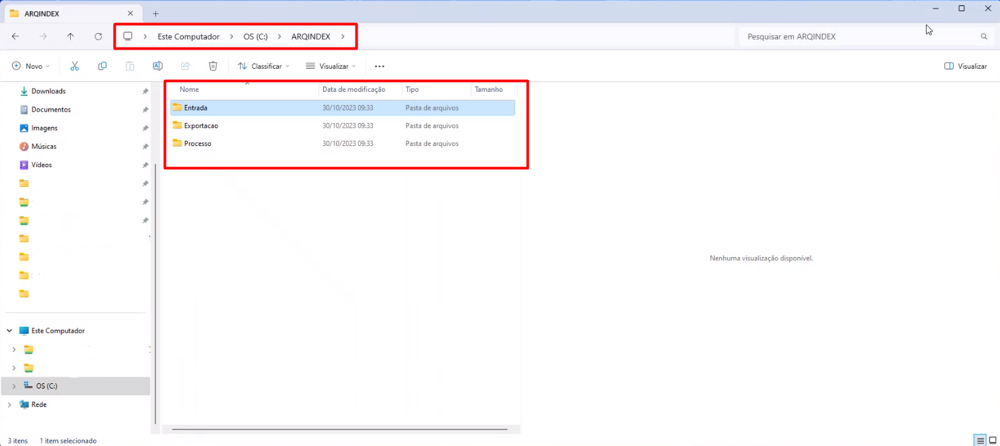<figcaption>
Clique para ampliar a imagem.
</figcaption></figure>

Após criadas as pastas para a configuração dos parâmetros, clique sobre cada pasta criada com o botão direito do mouse, selecione Propriedades > Compartilhamento e copie o “Caminho de Rede” conforme o exemplo abaixo. Após copiado, basta colar o caminho no campo correspondente na aplicação ArqIndex. O ideal é que sejam atribuídos às pastas nomes de fácil identificação.


<mark style="color:blue;">**EXEMPLO:**</mark>

* <mark style="color:blue;">Local dos Arquivos de Entrada: Entrada</mark>
* <mark style="color:blue;">Local dos Arquivos em Processo: Processo</mark>
* <mark style="color:blue;">Local dos Arquivos em Exportação: Exportação</mark>


<figure>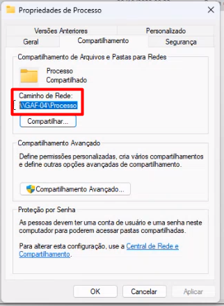<figcaption>
Clique para ampliar a imagem.
</figcaption></figure>

<figure>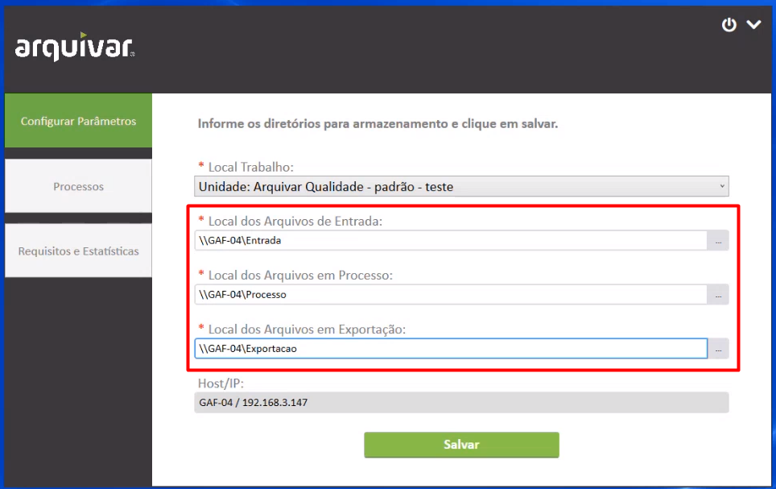<figcaption>
Clique para ampliar a imagem.
</figcaption></figure>

O campo “HOST/IP” é preenchido automaticamente com o endereço de rede onde está instalado o robô do ArqIndex. Clique em “Salvar”.

<figure>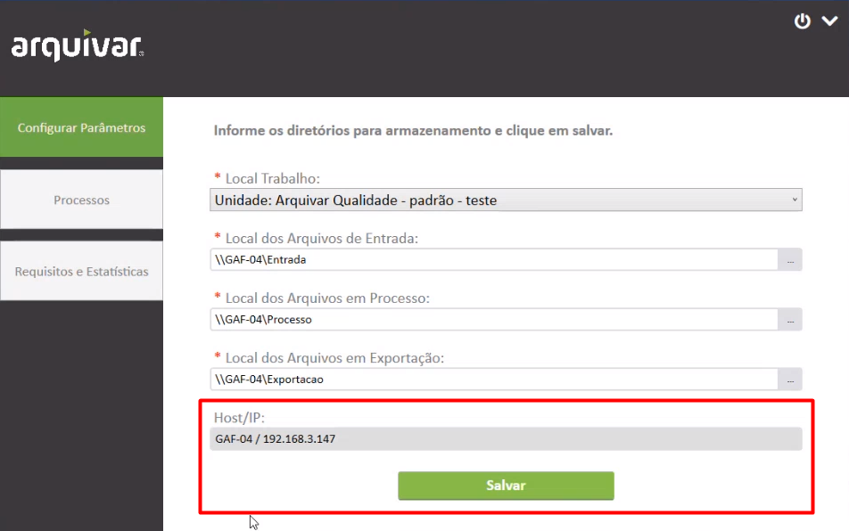<figcaption>
Clique para ampliar a imagem.
</figcaption></figure>

***

## Processos

Após salvar as configurações, na aba Processos são exibidos as etapas de execução da aplicação, que serão executadas conforme definidas no menu [Produção > Configurações > Fluxo de Trabalho](fluxo-de-trabalho.md).

Inicialmente, sugerimos que seja iniciado o processo de Host das Imagens, clicando-se no ícone “Play”. Quando iniciado, serão criados um certificado para utilização da aplicação ArqIndex na máquina onde foi instalado e outro para ser instalado nas maquinas indexadoras, ou seja, as máquinas onde os usuários irão realizar a indexação dos documentos. Esses certificados são importantes para a comunicação entre a máquina servidor e as máquinas indexadoras.

Os certificados serão criados na pasta onde o aplicativo está instalado (por padrão, na pasta C:\Program Files (x86)\Arquivar\ArqIndex\Certificados).


<mark style="color:orange;">**A máquina de instalação da aplicação ArqIndex precisa ter permissão de Administrador, pois serão criados os certificados automaticamente. Além disso, é necessário:**</mark>

* <mark style="color:orange;">**Liberar a porta 8087 para uso do ArqIndex;**</mark>
* <mark style="color:orange;">**Verificar o firewall, para que não bloqueie o acesso;**</mark>
* <mark style="color:orange;">**Verificar bloqueios de antivírus à aplicação.**</mark>


<figure>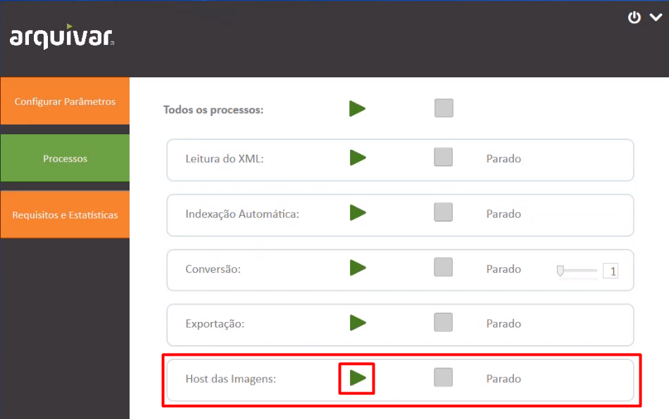<figcaption>
Clique para ampliar a imagem.
</figcaption></figure>

Será criada uma pasta com os certificados necessários para a indexação dentro do local onde o aplicativo está instalado (por padrão, a pasta C:\Program Files (x86)\Arquivar\ArqIndex).

<figure>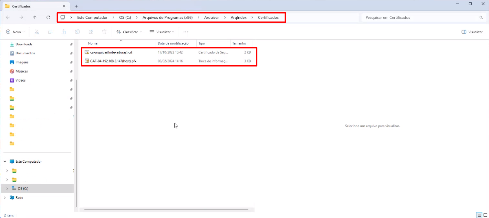<figcaption>
Clique para ampliar a imagem.
</figcaption></figure>

Na etapa “Conversão” deve ser definida a quantidade de núcleos do processador que deverão ser dedicados exclusivamente para o processo de conversão dos documentos, que demanda mais recursos da máquina. Depois de realizar essa definição, clique em “Play”.

<figure>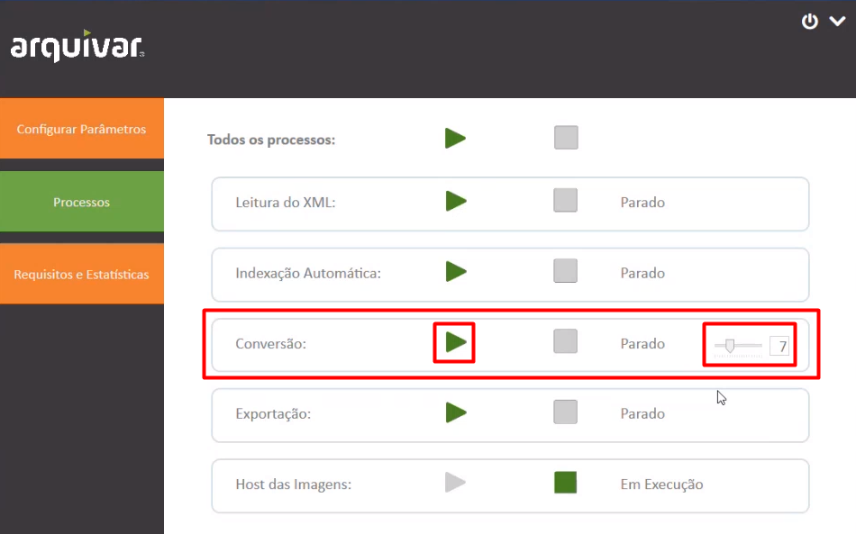<figcaption>
Clique para ampliar a imagem.
</figcaption></figure>

Ao iniciar o processo de indexação, clique em “Play” em “Todos os processos”.

<figure>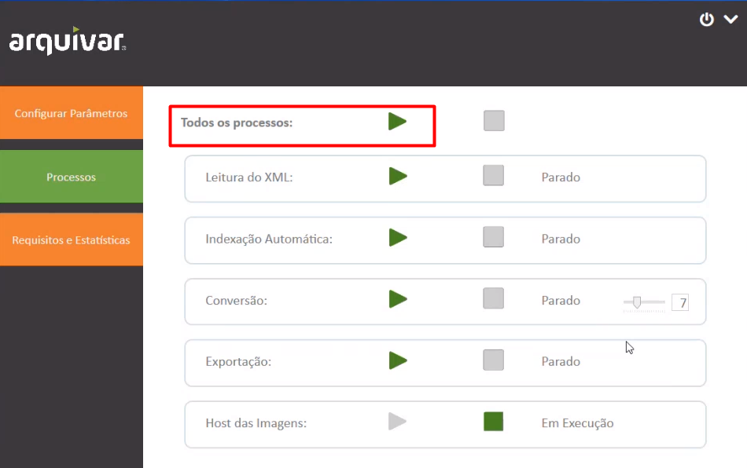<figcaption>
Clique para ampliar a imagem.
</figcaption></figure>


<mark style="color:orange;">**O ideal é que a máquina que for receber o robô do ArqIndex seja dedicada exclusivamente a essa função, já que serão consumidos muito espaço de armazenamento e memória pelo aplicativo e permaneça ligada. Caso seja necessário desligar a máquina ou interromper o ArqIndex por algum motivo, retorne a essa tela e clique em “Pause” em “Todos os processos”.**</mark>

