# 🔹 Aplicativo Kodak Capture Pro

Depois de instalado o aplicativo ArqIndex, é preciso configurar o aplicativo do scanner que irá realizar a digitalização dos documentos. &#x20;


<mark style="color:orange;">**Essa configuração deverá ser feita em todas as máquinas indexadoras e varia de acordo com a marca e modelo do scanner que será utilizado. A seguir, vamos apresentar as configurações feitas para scanners da marca Kodak, que é a usualmente utilizadas nas unidades Arquivar. Essas configurações devem ser feitas a cada novo cliente da unidade.**</mark>&#x20;


***

## Configuração de trabalho

Esta é a configuração da estrutura de saída do arquivo, ou seja, a estrutura de pastas onde as imagens que serão digitalizadas pelo scanner ficarão armazenadas. Para iniciar, clique em Arquivo > Configuração de trabalho.&#x20;

<figure>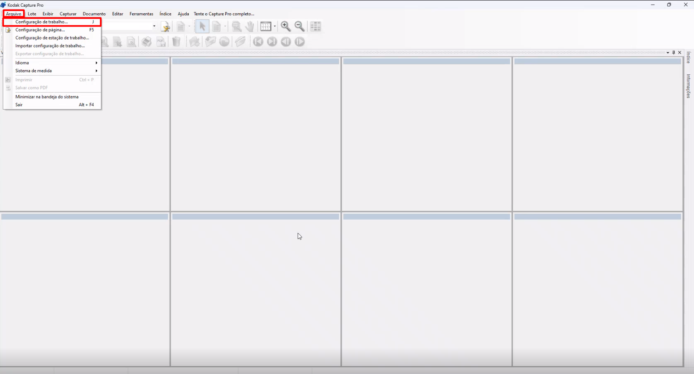<figcaption><p>Clique para ampliar a imagem.</p></figcaption></figure>

Selecione o “Nome do trabalho”, que é a configuração feita o cliente específico. Geralmente é o nome do próprio cliente.&#x20;

<figure>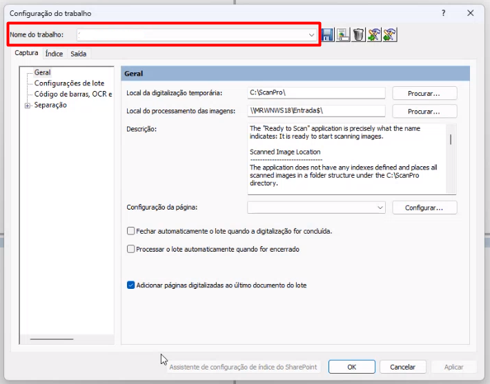<figcaption><p>Clique para ampliar a imagem.</p></figcaption></figure>

Na aba “Captura”, por padrão o “Local da digitalização temporária” é a pasta C:\ScanPro\\. Selecione o “Local do processamento das imagens”, que deve ser a pasta “Entrada” do local de trabalho, anteriormente criada durante as configurações dos parâmetros do aplicativo ArqIndex. Clique em “Aplicar” para concluir&#x20;

<figure>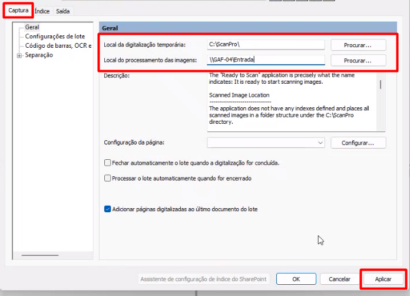<figcaption><p>Clique para ampliar a imagem.</p></figcaption></figure>


<mark style="color:orange;">**Para copiar o endereço da pasta “Entrada” clique sobre ela com o botão direito do mouse e selecione Propriedades > Compartilhamento. Copie o “Caminho de Rede” no campo correspondente.**</mark>&#x20;


Na aba “Índice” pode ser definido um índice de lote para os documentos digitalizados, ou seja, uma informação que será inserida em todos os documentos que forem digitalizados para aquele lote do cliente, atuando como um campo agrupador.&#x20;

<figure>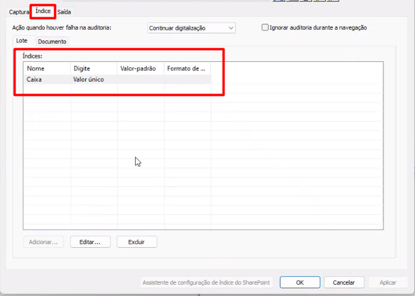<figcaption><p>Clique para ampliar a imagem.</p></figcaption></figure>


<mark style="color:blue;">**EXEMPLO:**</mark> <mark style="color:blue;"></mark><mark style="color:blue;">Para determinado cliente foi definido o índice de lote “Caixa”. Ao iniciar a digitalização de um lote de documentos desse cliente o usuário que estiver realizando a indexação deverá informar o código da caixa que está alocando os documentos físicos do lote, que neste caso é “1050”. O índice funciona como um campo agrupador, que informa que todos os documentos daquele lote que estão sendo digitalizados estão alocados na caixa 1050, não sendo necessário que o usuário preencha o campo “Caixa” de cada um dos documentos.</mark>&#x20;


Também pode ser criado um índice de documento, que são campos customizados ou de lista que servirão como “etiquetas” para os documentos, ou seja, irão identificar o documento. Para isso, clique em “Adicionar” e no campo “Etiqueta” informe CC\_Id do campo customizado ou CL\_Id do campo de lista (esses Ids são obtidos por meio do relatório de campos customizados ou de campos de lista). No campo “Descrição” insira o nome ou descrição do campo.&#x20;

<figure>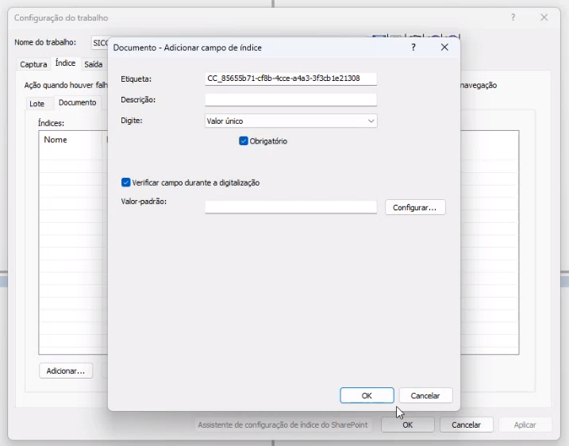<figcaption><p>Clique para ampliar a imagem.</p></figcaption></figure>

<figure>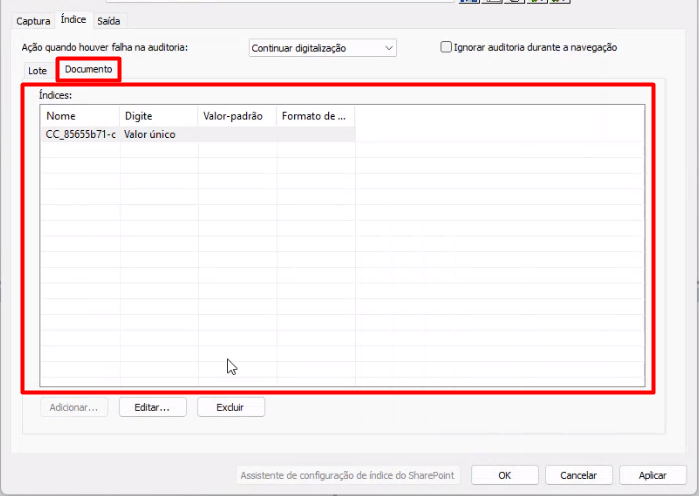<figcaption><p>Clique para ampliar a imagem.</p></figcaption></figure>


<mark style="color:blue;">**ÍNDICE DE LOTE X ÍNDICE DE DOCUMENTO**</mark>&#x20;

<mark style="color:blue;">Quando inserido um índice de documento, a cada documento digitalizado o operador que estiver executando a indexação deverá parar e preencher o campo solicitado.</mark>&#x20;

<mark style="color:blue;">Quando inserido um índice de lote, só será necessário que o operador preencha o campo solicitado na abertura do lote. Todos os documentos que pertencerem ao mesmo lote terão o campo automaticamente preenchido.</mark>   &#x20;

<mark style="color:blue;">É recomendável utilizar apenas o índice de lote, para otimizar a produtividade do scanner. Imagine que em um lote com 30 documentos de uma empresa de Belo Horizonte foi inserido o índice de documento “Cidade”. Neste caso, o operador deverá informar a cidade 30 vezes, parando para preencher o campo a cada documento digitalizado. Se tivesse sido inserido o índice de lote, ele preencheria o campo uma única vez ao abrir o lote e todos os 30 documentos já ficariam com o campo “Cidade” preenchido automaticamente.</mark>  &#x20;



<mark style="color:orange;">**Para que a unidade consiga inserir um campo customizado ou de lista como índice de documento de um cliente, deverá obter os Ids desses campos. Para isso, será necessário solicitar à Arquivar Master via ArqAtende os relatórios do cliente que contém essas informações.**</mark>&#x20;


Selecionado a opção “Obrigatório” o usuário que estiver realizando a indexação deverá obrigatoriamente preencher o campo.&#x20;

<figure>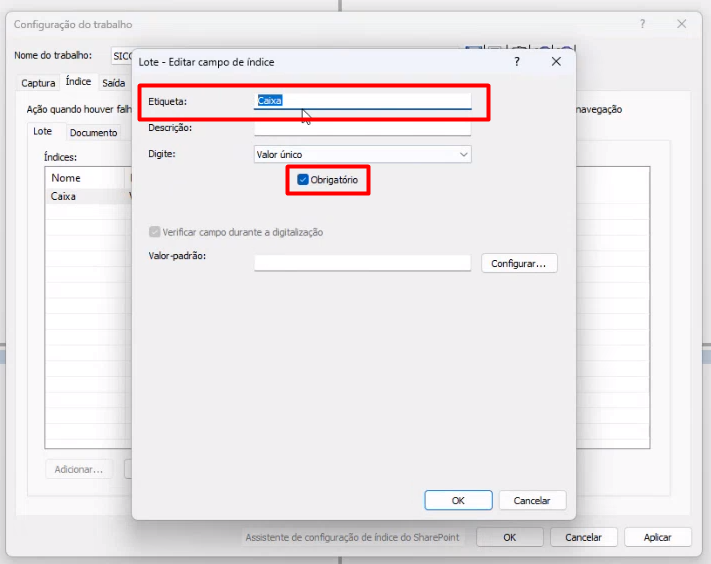<figcaption><p>Clique para ampliar a imagem.</p></figcaption></figure>

Na aba “Saída” deve ser informado que tipo de arquivo deverá ser gerado: PDF, PDF pesquisável, TIFF ou PNG. &#x20;

<figure>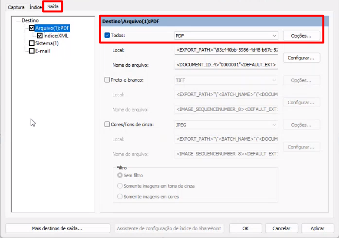<figcaption><p>Clique para ampliar a imagem.</p></figcaption></figure>

Clicando em “Opções”, se for escolhida a opção PDF ou PDF pesquisável, deverá ser configurado também o agrupamento das páginas. Se selecionada a opção “Página única” será criada uma página de PDF para cada página física digitalizada. Se selecionada a opção “Páginas múltiplas”, pode-se escolher criar mais de uma página por documento, por página ou por lote. Neste caso será preciso informar quando um documento físico termina, para evitar que vários documentos digitalizados sejam agrupados no mesmo arquivo.&#x20;

<figure>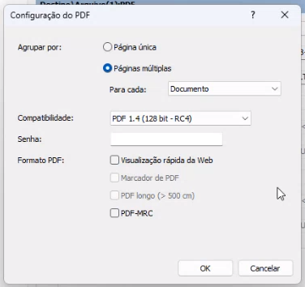<figcaption><p>Clique para ampliar a imagem.</p></figcaption></figure>

Clicando em “Configurar” deverá ser feita a configuração de saída do arquivo digitalizado. &#x20;

<figure>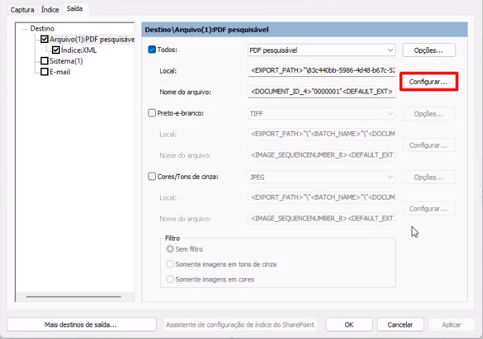<figcaption><p>Clique para ampliar a imagem.</p></figcaption></figure>

### Aba Nome do arquivo&#x20;

Aqui deve ser criada a fórmula que irá compor o nome do arquivo que deve ser: &#x20;

```
<<DOCUMENT_ID_X> + <DEFAULT_EXT>> 
```

Onde:&#x20;

* DOCUMENT\_ID\_X: Id do documento&#x20;
* X: O número de zeros à esquerda &#x20;
* DEFAULT\_EXT: Extensão default, que por padrão é .pdf.&#x20;

<figure>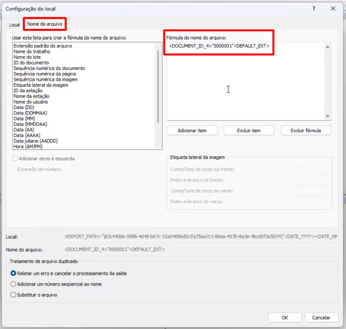<figcaption><p>Clique para ampliar a imagem.</p></figcaption></figure>

### Aba Local&#x20;

Aqui deve ser criada a fórmula do local de saída do arquivo, que deve ser:&#x20;

```
<EXPORT_PATH>”\ID DA UNIDADE\ID DO CLIENTE\”<DATE_YYYY><DATE_MM><DATE_DD><TIME_24>”\
ao=ID DA ÁRVORE;cx=”<BTC_IDX:Caixa> 
```

<figure>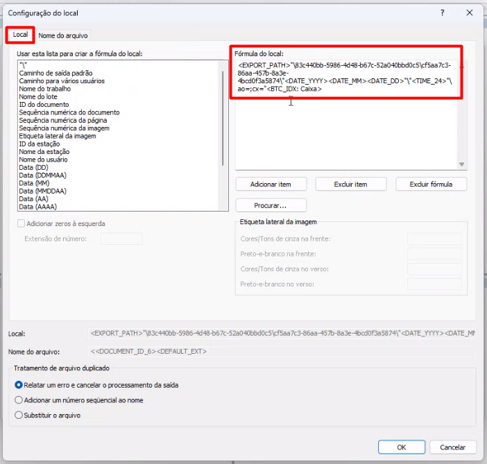<figcaption><p>Clique para ampliar a imagem.</p></figcaption></figure>

Onde: &#x20;

* EXPORT\_PATH: Caminho de saída padrão.&#x20;
* “\”: Informa que deverá ser criada uma pasta com o nome a seguir.&#x20;
* ID DA UNIDADE E ID DO CLIENTE: Números de Id da unidade e do cliente obtidos por meio do menu Relatórios.&#x20;
* DATE\_YYYY: Ano, com quatro dígitos.&#x20;
* DATE\_MM: Mês, com dois dígitos.&#x20;
* DATE\_DD: Dia, com dois dígitos.&#x20;
* TIME\_24: Horas, em formato hora:minutos:segundos (00:00:00).&#x20;
* ao=: Árvore Organizacional&#x20;
* ID DA ÁRVORE: ID da Árvore Organizacional do cliente, obtida por meio do menu Relatórios. Devem ser utilizados os Ids dos níveis da árvore que facilitem a indexação, do global para o específico.&#x20;


<mark style="color:blue;">Só é possível criar o local considerando o ID da árvore em último nível. Por exemplo: uma árvore possui o departamento RH e diversos tipos documentais. Dentre esses tipos, o Registro de Empregado é o com maior número de arquivos a serem indexados. Os demais tipos são esporádicos, por isso representam um volume menor.</mark>&#x20;

<mark style="color:blue;">O ideal, neste caso é criar uma configuração utilizando o ID EMPRESA > RECURSOS HUMANOS > REGISTRO DE EMPREGADO, para os registros dos funcionários, e deixar que o operador preencha a árvore durante a indexação nos demais tipos de documentos (neste caso deve-se retirar a parte ao=ID DA ÁRVORE da fórmula).  Ao fazer a indexação de um registro de empregado só será preciso preencher os campos indexadores do documento, já que a estrutura já será preenchida automaticamente. No caso da indexação dos demais tipos, que só acontece esporadicamente, será necessário informar toda a árvore do cliente.</mark>&#x20;


* cx=”: Caixa&#x20;
* \<BTC\_IDX:Caixa>: Número ID da caixa.  Este código não deve ser informado no caso da criação de documentos eletrônicos.&#x20;

A fórmula então ficaria no seguinte formato:

```
<EXPORT_PATH>"\IdUnidade\IdCliente\"AnoMesDia"\"Hora"\arvore Organizacional=;
cx="Codigo da Caixa 
```

***

## Criação do nome de XML&#x20;

Na aba Saída deve ser configurado o nome do XML que será gerado para cada documento digitalizado. Selecione a opção “Arquivo de índice do documento” e clique em “Configurar”.&#x20;

<figure>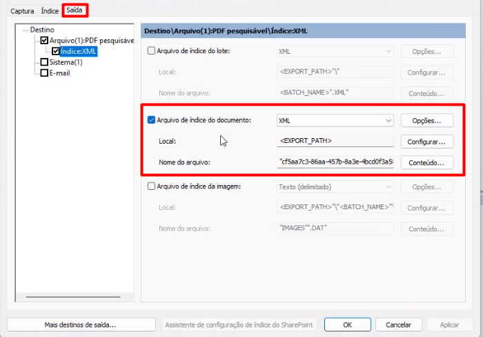<figcaption><p>Clique para ampliar a imagem.</p></figcaption></figure>


<mark style="color:orange;">**Será gerado um arquivo XML para cada lote do cliente e uma linha de informação para cada documento do lote.**</mark>&#x20;


Na aba “Nome do arquivo” deverá ser criada a fórmula do nome do arquivo XML que será gerado, que deve ser: &#x20;

```
ID DO CLIENTE\<DATE_YYYY><DATE_MM><DATE_DD><TIME_24><BTC_IDX: Caixa>”.XML
```

Onde:&#x20;

* ID DO CLIENTE: Números de Id do cliente obtido por meio do menu Relatórios.&#x20;
* DATE\_YYYY: Ano, com quatro dígitos.&#x20;
* DATE\_MM: Mês, com dois dígitos.&#x20;
* DATE\_DD: Dia, com dois dígitos.&#x20;
* TIME\_24: Horas, em formato hora:minutos:segundos (00:00:00).&#x20;
* \<BTC\_IDX:Caixa>: Número ID da caixa.  Este código não deve ser informado no caso da criação de documentos eletrônicos.&#x20;
* .XML: indica a extensão XML do arquivo.&#x20;

De volta à tela “Saída” clique em “Conteúdo” para configurar o conteúdo do índice XML.&#x20;

<figure>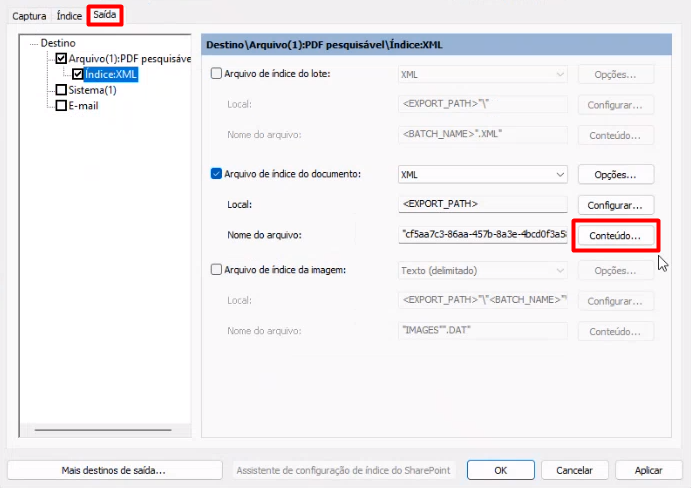<figcaption><p>Clique para ampliar a imagem.</p></figcaption></figure>

Insira na coluna “Índices atuais” as seguintes informações e clique em OK:&#x20;

* ID do documento&#x20;
* Nome de arquivo de documento com caminho total&#x20;
* DOC\_IDX: CC\_ Id do campo customizado&#x20;

<figure>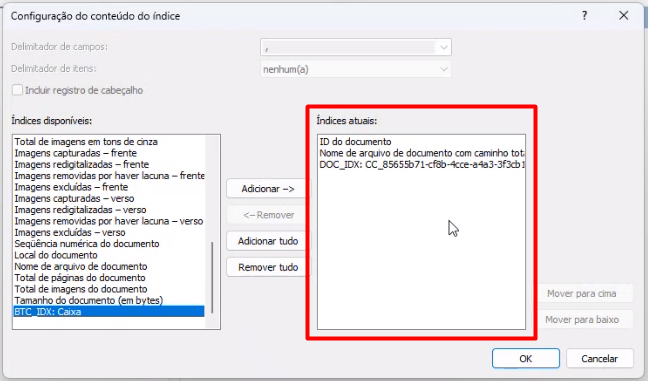<figcaption><p>Clique para ampliar a imagem.</p></figcaption></figure>

***

## Realizando uma indexação no aplicativo Kodak Capture Pro&#x20;

Depois de conectar o scanner devidamente e inserir os documentos que devem ser digitalizados na bandeja do scanner, clique no ícone “Novo lote” para iniciar a digitalização.&#x20;

<figure>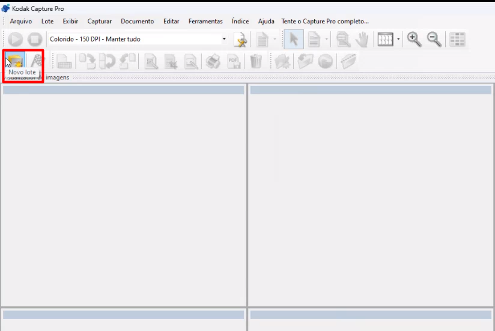<figcaption><p>Clique para ampliar a imagem.</p></figcaption></figure>

Informe o “Nome do trabalho”, que é a configuração criada para o cliente e clique em OK.&#x20;

<figure><figcaption><p>Clique para ampliar a imagem.</p></figcaption></figure>

Preencha o índice de lote, se for solicitado.&#x20;

<figure>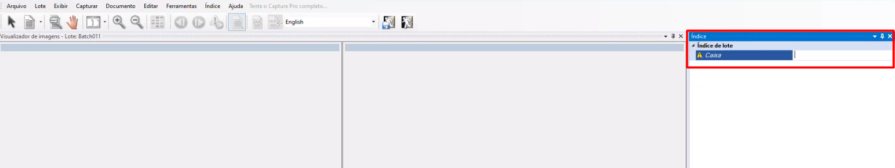<figcaption><p>Clique para ampliar a imagem.</p></figcaption></figure>

Clique no ícone “Iniciar”. As páginas serão digitalizadas e apresentadas na tela. &#x20;

<figure>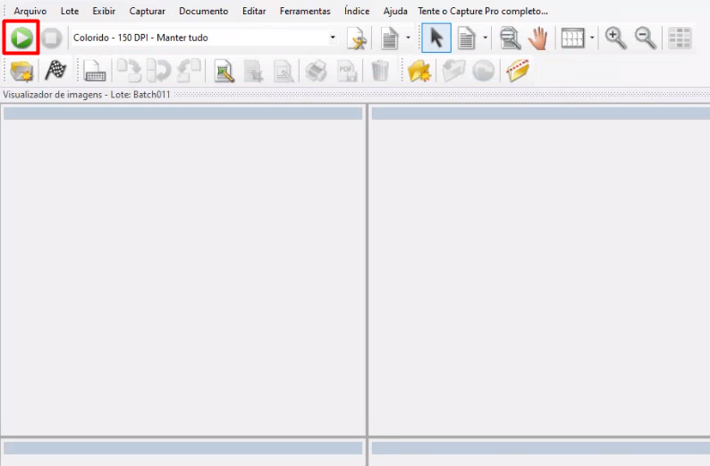<figcaption><p>Clique para ampliar a imagem.</p></figcaption></figure>

<figure>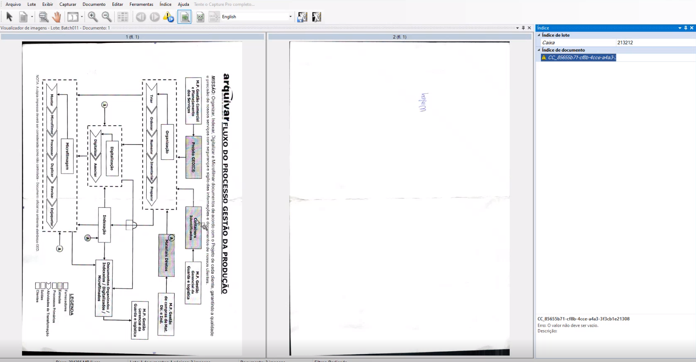<figcaption><p>Clique para ampliar a imagem.</p></figcaption></figure>


<mark style="color:orange;">**Se houver sido definido um índice de documento, será preciso preencher o campo solicitado a cada documento do lote que for digitalizado.**</mark>  &#x20;


Quando concluída a digitalização, clique no ícone “Finalizar”. &#x20;

<figure>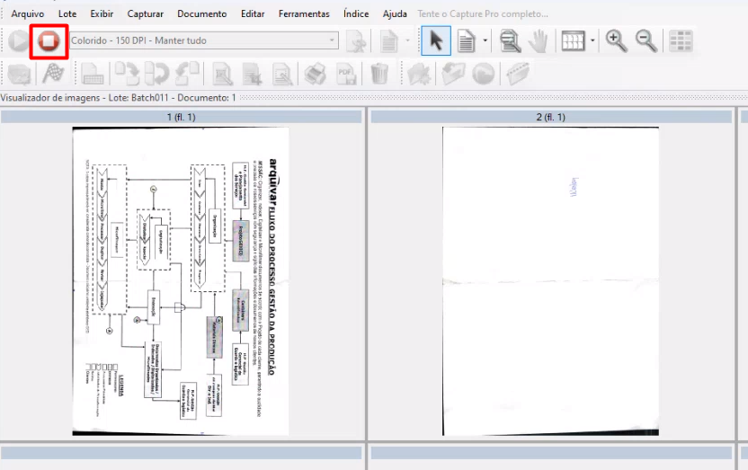<figcaption><p>Clique para ampliar a imagem.</p></figcaption></figure>

Ao acessar a pasta “Entrada” no local C:\Program Files (x86)\Arquivar\ArqIndex será possível verificar que foram criados dois arquivos: o primeiro é a pasta nomeada com o Id da unidade. Dentro dessa pasta poderão ser encontradas subpastas com os Ids dos clientes que estiverem sendo indexados. Dentro dessas subpastas serão geradas outras pastas que abrigarão as imagens digitalizadas em formato PDF. &#x20;

<figure>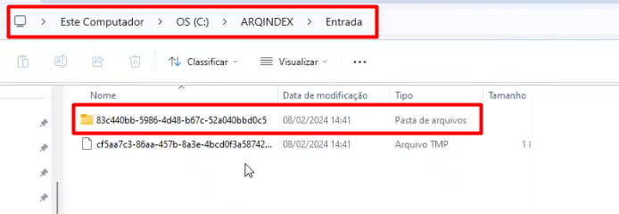<figcaption><p>Clique para ampliar a imagem.</p></figcaption></figure>

O segundo é o arquivo XML gerado, composto com uma linha de dados para cada um dos documentos digitalizados no lote.  &#x20;

<figure><figcaption><p>Clique para ampliar a imagem.</p></figcaption></figure>
