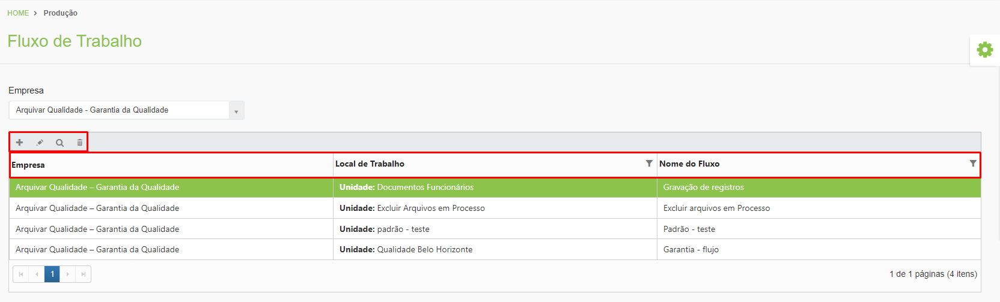
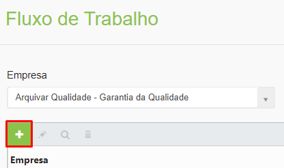
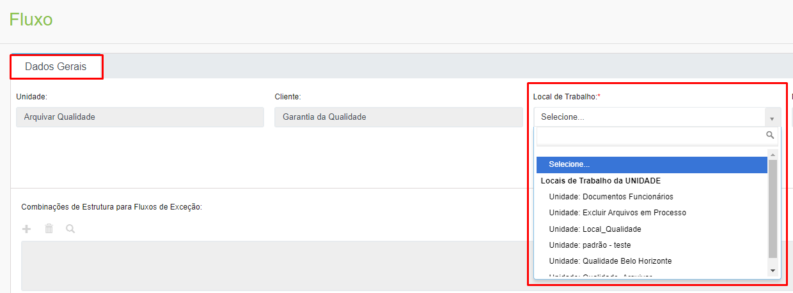
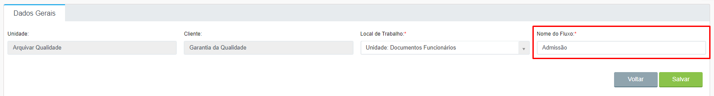
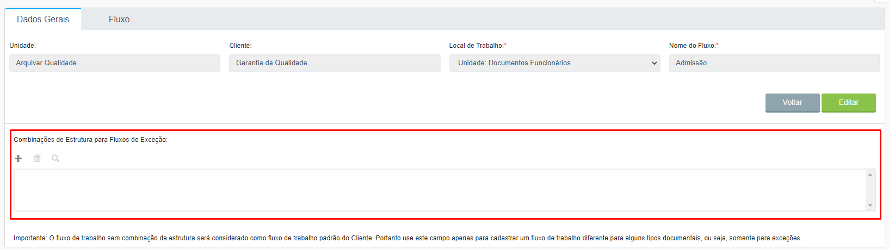
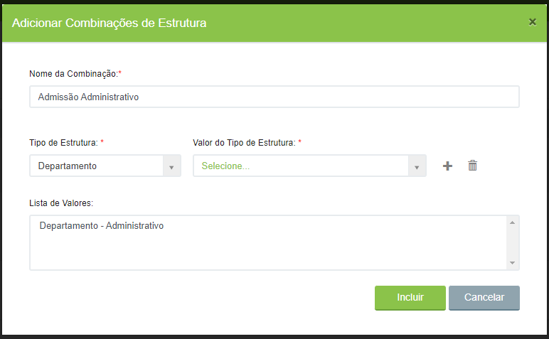
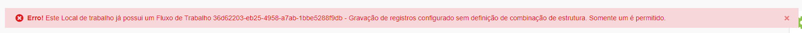
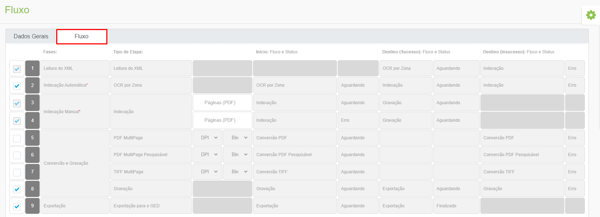
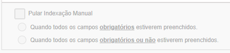
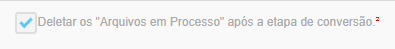

# 🔹 Fluxo de Trabalho

Nesta tela são parametrizadas as etapas para indexação dos documentos para a aplicação ArqIndex. &#x20;

**Campo Empresa:** Utilizado para selecionar o cliente. O fluxo de trabalho sempre será associado ao cliente, nunca à unidade.&#x20;

**Ícone Adicionar:** Utilizado para configurar um novo fluxo de trabalho.&#x20;

**Ícone Editar:** Utilizado para editar um fluxo de trabalho já existente.&#x20;

**Ícone Visualizar:** Utilizado para visualizar os detalhes da configuração do fluxo de trabalho selecionado.   &#x20;

**Ícone Excluir:** Utilizado para excluir o fluxo de trabalho selecionado.&#x20;

**Coluna Empresa:** Mostra o cliente selecionado.&#x20;

**Coluna Local de Trabalho:** Exibe o nome dado ao local de trabalho.&#x20;

**Coluna Nome do Fluxo:** Exibe o nome dado ao fluxo de trabalho criado.&#x20;

<figure><figcaption>
Clique para ampliar a imagem.
</figcaption></figure>

***

## &#x20;Configuração de um novo fluxo de trabalho&#x20;

Para iniciar a configuração de um novo fluxo de trabalho, selecione o cliente no campo “Empresa” e clique no ícone “Adicionar”.&#x20;

<figure><figcaption>
Clique para ampliar a imagem.
</figcaption></figure>

### Aba Dados Gerais&#x20;

Na aba Dados Gerais os campos “Unidade” e “Cliente” serão preenchidos automaticamente.&#x20;

Selecione o local de trabalho onde o fluxo será configurado. Os locais de trabalho exibidos aqui foram anteriormente cadastrados no menu [Produção > Configurações > Parâmetros Gerais](parametros-gerais.md).  &#x20;

<figure><figcaption>
Clique para ampliar a imagem.
</figcaption></figure>

No campo “Nome do Fluxo” informe o nome que será dado ao fluxo de trabalho que está sendo criado. Clique em “Salvar” para concluir.&#x20;

<figure><figcaption>
Clique para ampliar a imagem.
</figcaption></figure>

Depois de salvar o fluxo será habilitado o campo “Combinações de Estrutura para Fluxos de Exceção”, que deverá ser utilizado caso haja mais de um fluxo para o mesmo cliente. &#x20;

<figure><figcaption>
Clique para ampliar a imagem.
</figcaption></figure>

<figure><figcaption>
Clique para ampliar a imagem.
</figcaption></figure>

Se houver apenas um fluxo cadastrado para o cliente, toda a sua árvore organizacional utilizará o mesmo fluxo para indexação, mas se houver mais de um fluxo cadastrado para o cliente é possível definir em que nível da árvore do cliente aquele fluxo será utilizado. &#x20;

***

### &#x20;Aba Fluxo&#x20;

Na aba Fluxo é possível definir quais etapas irão compor o processo de indexação do cliente.  &#x20;


<mark style="color:orange;">**Só será possível criar um Fluxo de Trabalho para cada Local de Trabalho. Caso o local selecionado já possua um fluxo cadastrado, ao tentar criar um novo será apresentada uma mensagem de erro, que mostrará o nome do fluxo criado.**</mark>&#x20;



Por padrão as etapas de “Leitura do XML” e “Indexação Manual” já vêm selecionadas para compor as etapas do processo do robô, não podendo ser desmarcadas. É possível apenas selecionar ou desmarcar as demais etapas apresentadas.   &#x20;

<figure><figcaption>
Clique para ampliar a imagem.
</figcaption></figure>

**Leitura de XML:** Etapa de leitura dos documentos inseridos no scanner. O robô faz a leitura dos documentos transformando-os em arquivos XML e de imagem na ferramenta.&#x20;

**Indexação Automática:** Etapa que ocorre quando é possível realizar a indexação automática dos arquivos, porque eles já foram digitalizados em formato PDF pesquisável. Neste caso é utilizado a ferramenta OCR para identificar e preencher os campos indexadores do documento. &#x20;

**Indexação Manual:** Etapa em que o usuário abre o arquivo no computador, faz a leitura e realiza a indexação dos campos do documento, preenchendo os campos customizados e de lista conforme a imagem apresentada. Caso o arquivo seja um PDF é possível definir quantas páginas serão exibidas para o usuário na indexação manual, preenchendo o campo “Páginas (PDF)”. Essa funcionalidade é útil, por exemplo, quando o arquivo possui muitas páginas, mas só apresenta campos indexadores em algumas delas.&#x20;

**Conversão e Gravação - PDF MultiPage:** Etapa que deve ser realizada quando o arquivo for digitalizado em formato TIFF e precisar ser convertido para o formato PDF. Neste caso deve ser informada a resolução que se deseja para o arquivo e se o os arquivos deverão ser convertidos para preto e branco (binarizar). &#x20;

**Conversão e Gravação - PDF MultiPage Pesquisável:** Etapa que deve ser realizada quando o arquivo for digitalizado PDF mas não for pesquisável (imagem). O robô fará a leitura do arquivo e utilizará a ferramenta OCR para identificar o texto que estiver contido naquele PDF, tornando-o pesquisável dentro do ArqGED. Neste caso deve ser informada a resolução que se deseja para o arquivo e se o os arquivos deverão ser convertidos para preto e branco (binarizar). &#x20;


<mark style="color:orange;">**Para aplicar o OCR nos arquivos e torná-los pesquisáveis, o cliente precisa ter contratado e ativo o serviço**</mark> [<mark style="color:blue;">**ArqSEARCH**</mark>](../../cliente/contratos/aba-servico/regras-de-faturamento-por-tipo-de-servico.md#arqsearch)<mark style="color:orange;">**.**</mark> &#x20;


**Conversão e Gravação - TIFF MultiPage:** Etapa que deve ser realizada quando o arquivo for digitalizado em formato TIFF e for necessário agrupar os arquivos em uma página. Neste caso deve ser informada a resolução que se deseja para o arquivo e se o os arquivos deverão ser convertidos para preto e branco (binarizar).&#x20;

**Conversão e Gravação - Gravação:** Esta etapa é feita quando não é necessária nenhuma manipulação do arquivo. O robô fará apenas a transferência do arquivo da pasta de processo para a pasta de exportação para o ArqGED. Essa etapa é muito utilizada quando o formato do arquivo digitalizado já é PDF pesquisável. &#x20;


<mark style="color:orange;">**Para aplicar o OCR nos arquivos e torná-los pesquisáveis, o cliente precisa ter contratado e ativo o serviço**</mark> [<mark style="color:blue;">**ArqSEARCH**</mark>](../../cliente/contratos/aba-servico/regras-de-faturamento-por-tipo-de-servico.md#arqsearch)<mark style="color:orange;">**.**</mark> &#x20;


**Exportação:** Etapa de exportação do arquivo já indexado para o ArqGED, onde poderá ser consultado via [Localização Simples](../../documento/localizacao-simples.md), [Localização Avançada](../../documento/localizacao-avancada.md) e tela [Explorar](../../documento/explorar/).&#x20;

Se marcada a opção “Pular Indexação Manual” essa etapa poderá deixar de ser executada quando todos os campos obrigatórios estiverem preenchidos após a indexação automática ou quando todos os campos, sendo obrigatórios ou não, estiverem preenchidos após a indexação automática. Neste caso o fluxo de trabalho vai da etapa “Leitura do XML” direto para a etapa “Conversão e Gravação”. &#x20;


<mark style="color:orange;">**Para que seja possível pular a etapa de indexação manual é preciso que os campos dos documentos que estão sendo digitalizados tenham sido preenchidos de forma correta. Caso haja erros no preenchimento de qualquer um dos campos, o processo não irá pular a etapa, devendo ser feita a indexação manual pelo usuário.**</mark>&#x20;


<figure><figcaption>
Clique para ampliar a imagem.
</figcaption></figure>

Se marcada a opção “Deletar os “Arquivos em Processo” após a etapa de conversão”, será feita a exclusão dos arquivos convertidos com sucesso para a etapa de exportação. Isso significa que os arquivos convertidos ficarão disponíveis apenas na pasta de exportação e, após a exportação para o ArqGED ser concluída, serão excluídos definitivamente, ficando disponíveis para consulta apenas no ArqGED.&#x20;


<mark style="color:orange;">**Se essa opção não for habilitada, o arquivo será mantido na pasta de processo mesmo após ser convertido e exportado para o ArqGED, o que pode comprometer a disponibilidade de espaço em disco.**</mark>&#x20;


<figure><figcaption>
Clique para ampliar a imagem.
</figcaption></figure>
