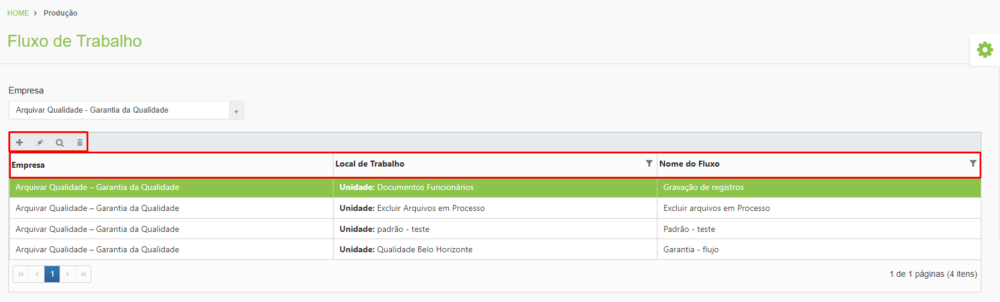
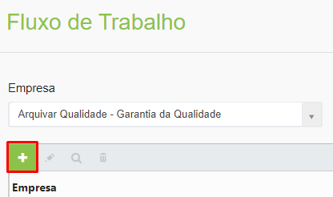
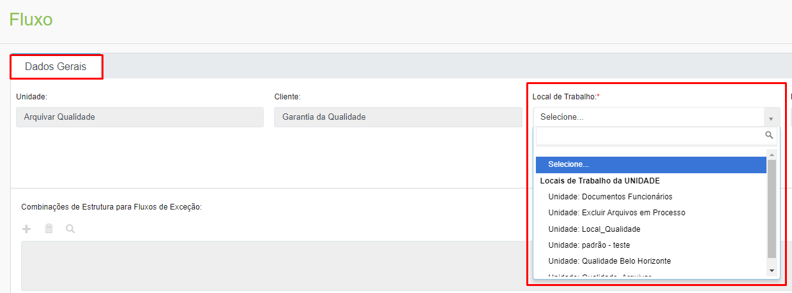
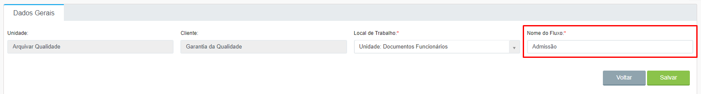
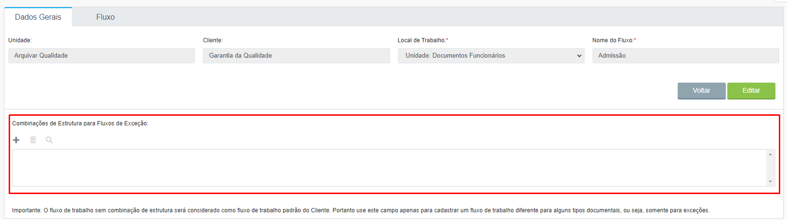
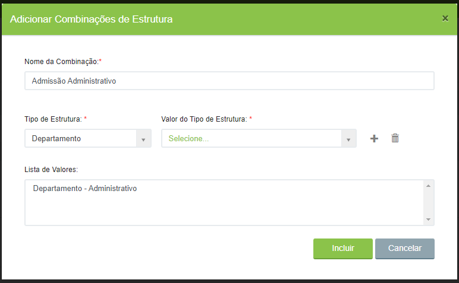
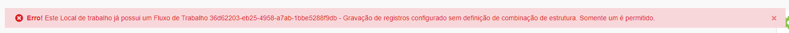
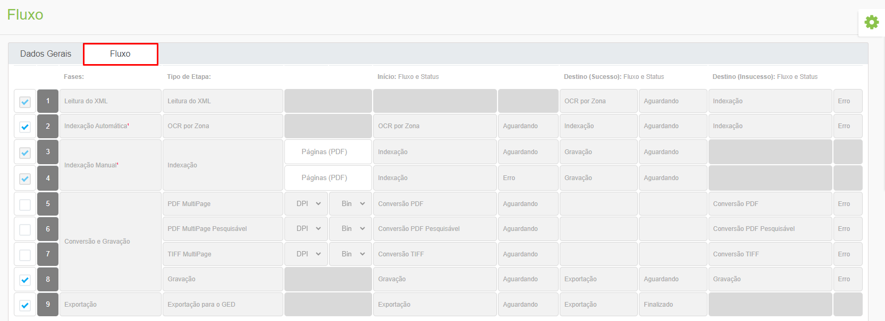
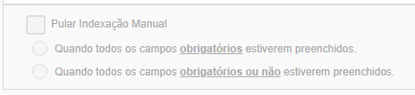
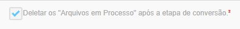

# 🔹 Fluxo de Trabalho



Nesta tela são parametrizadas as etapas para indexação dos documentos para a aplicação ArqIndex. &#x20;

**Campo Empresa:** Utilizado para selecionar o cliente. O fluxo de trabalho sempre será associado ao cliente, nunca à unidade.&#x20;

**Ícone Adicionar:** Utilizado para configurar um novo fluxo de trabalho.&#x20;

**Ícone Editar:** Utilizado para editar um fluxo de trabalho já existente.&#x20;

**Ícone Visualizar:** Utilizado para visualizar os detalhes da configuração do fluxo de trabalho selecionado.   &#x20;

**Ícone Excluir:** Utilizado para excluir o fluxo de trabalho selecionado.&#x20;

**Coluna Empresa:** Mostra o cliente selecionado.&#x20;

**Coluna Local de Trabalho:** Exibe o nome dado ao local de trabalho.&#x20;

**Coluna Nome do Fluxo:** Exibe o nome dado ao fluxo de trabalho criado.&#x20;

<figure><figcaption>
Clique para ampliar a imagem.
</figcaption></figure>

***

## &#x20;Configuração de um novo fluxo de trabalho&#x20;

Para iniciar a configuração de um novo fluxo de trabalho, selecione o cliente no campo “Empresa” e clique no ícone “Adicionar”.&#x20;

<figure><figcaption>
Clique para ampliar a imagem.
</figcaption></figure>

### Aba Dados Gerais&#x20;

Na aba Dados Gerais os campos “Unidade” e “Cliente” serão preenchidos automaticamente.&#x20;

Selecione o local de trabalho onde o fluxo será configurado. Os locais de trabalho exibidos aqui foram anteriormente cadastrados no menu [Produção > Configurações > Parâmetros Gerais](parametros-gerais.md).  &#x20;

<figure><figcaption>
Clique para ampliar a imagem.
</figcaption></figure>

No campo “Nome do Fluxo” informe o nome que será dado ao fluxo de trabalho que está sendo criado. Clique em “Salvar” para concluir.&#x20;

<figure><figcaption>
Clique para ampliar a imagem.
</figcaption></figure>

Depois de salvar o fluxo será habilitado o campo “Combinações de Estrutura para Fluxos de Exceção”, que deverá ser utilizado caso haja mais de um fluxo para o mesmo cliente. &#x20;

<figure><figcaption>
Clique para ampliar a imagem.
</figcaption></figure>

<figure><figcaption>
Clique para ampliar a imagem.
</figcaption></figure>

Se houver apenas um fluxo cadastrado para o cliente, toda a sua árvore organizacional utilizará o mesmo fluxo para indexação, mas se houver mais de um fluxo cadastrado para o cliente é possível definir em que nível da árvore do cliente aquele fluxo será utilizado. &#x20;

***

### &#x20;Aba Fluxo&#x20;

Na aba Fluxo é possível definir quais etapas irão compor o processo de indexação do cliente.  &#x20;


<mark style="color:orange;">**Só será possível criar um Fluxo de Trabalho para cada Local de Trabalho. Caso o local selecionado já possua um fluxo cadastrado, ao tentar criar um novo será apresentada uma mensagem de erro, que mostrará o nome do fluxo criado.**</mark>&#x20;



Por padrão as etapas de “Leitura do XML” e “Indexação Manual” já vêm selecionadas para compor as etapas do processo do robô, não podendo ser desmarcadas. É possível apenas selecionar ou desmarcar as demais etapas apresentadas.   &#x20;

<figure><figcaption>
Clique para ampliar a imagem.
</figcaption></figure>

**Leitura de XML:** Etapa de processamento e validação dos documentos digitalizados.&#x20;

**Indexação Automática:** Etapa utilizada para indexação automática dos documentos. Neste caso é utilizada a ferramenta OCR para identificar e preencher automaticamente os campos indexadores de um arquivo padrão. &#x20;

**Indexação Manual:** Etapa de realização da indexação dos documentos gerados via tela Cadastrar. Caso o arquivo seja um PDF é possível definir quantas páginas serão exibidas para o usuário na tela para indexação, preenchendo o campo “Páginas (PDF)” com a quantidade de páginas a serem exibidas. Essa funcionalidade é útil, por exemplo, quando o arquivo possui muitas páginas, mas só é preciso visualizar as dez primeiras, por exemplo.&#x20;

**Conversão e Gravação - PDF MultiPage:** Etapa utilizada para digitalização de arquivos em formato TIFF e precisa ser convertido para o formato PDF. Neste caso deve ser informada a resolução (qualidade) que se deseja para o arquivo e se o os arquivos deverão ser convertidos para preto e branco (binarizar). &#x20;

**Conversão e Gravação - PDF MultiPage Pesquisável:** Etapa utilizada quando o arquivo for digitalizado como PDF mas não for pesquisável. A aplicação ArqIndex realizará a conversão do arquivo identificando e extraindo o texto, tornando-o pesquisável dentro do ArqGED. Neste caso deve ser informada a resolução (qualidade) que se deseja para o arquivo e se o os arquivos deverão ser convertidos para preto e branco (binarizar). &#x20;


<mark style="color:red;">**O processo de conversão do arquivo para PDF pesquisável, demanda tempo e um consumo maior de processamento da aplicação devido a quantidade de páginas dos arquivos, tamanho e qualidade. Este alto consumo e processamento causa acúmulo de documentos para conversão, podendo inclusive travar todo o funcionamento do dispositivo (máquina/servidor) o que torna o processo improdutivo ou até mesmo inoperante.**</mark>&#x20;

<mark style="color:red;">**Pensando em um ganho de performance, neste sentido, o ideal é que o arquivo seja gerado através do scanner no formato PDF pesquisável, ou seja, com a aplicação do OCR, desta forma o processo de publicação no ArqGED será consideravelmente mais rápido, sem queda de produtividade nas filas de processamento do ArqIndex.**</mark>


**Conversão e Gravação - TIFF MultiPage:** Etapa utilizada quando o arquivo for digitalizado em formato TIFF e for necessário agrupar os arquivos em um arquivo único. Neste caso deve ser informada a resolução (qualidade) que se deseja para o arquivo e se o os arquivos deverão ser convertidos para preto e branco (binarizar).&#x20;

**Conversão e Gravação - Gravação:** Esta etapa não é realizada nenhuma manipulação do arquivo. A aplicação ArqIndex apenas transfere o arquivo da pasta "Processo" para a pasta "Exportação". Essa etapa é muito utilizada quando o formato do arquivo digitalizado já é PDF pesquisável. &#x20;

**Exportação:** Nesta etapa os documentos já foram validados e indexados e estão prontos para serem enviados ao ArqGED. Após a exportação os documentos poderão ser consultados via [Localização Simples](../../documento/localizacao-simples.md), [Localização Avançada](../../documento/localizacao-avancada.md) e tela [Explorar](../../documento/explorar/).&#x20;

**Se marcada a opção “Pular Indexação Manual”  - "Quando todos os campos obrigatórios estiverem preenchidos":** Após a Leitura do XML a aplicação ArqIndex irá validar se os documentos possuem campos obrigatórios e se estes campos estão todos preenchidos corretamente. Caso sim, os documentos não terão interação do usuário na indexação manual e irão direto para a conversão e exportação. Caso não, os documentos serão enviados para indexação manual para que um usuário realize a indexação. &#x20;

**Se marcada a opção “Pular Indexação Manual”  - "Quando todos os campos obrigatórios ou não estiverem preenchidos":**  Após a Leitura do XML a aplicação ArqIndex não irá validar nenhuma informação dos campos relacionados aos documentos e simplesmente irá enviá-los para a conversão e exportação.  &#x20;


<mark style="color:orange;">**Para que seja possível pular a etapa de indexação manual é preciso que os campos dos documentos que estão sendo digitalizados tenham sido preenchidos de forma correta. Caso haja erros no preenchimento de qualquer um dos campos, o processo não irá pular a etapa, devendo ser feita a indexação manual pelo usuário.**</mark>&#x20;


<figure><figcaption>
Clique para ampliar a imagem.
</figcaption></figure>

**Se marcada a opção “Deletar os “Arquivos em Processo” após a etapa de conversão”:** Após a etapa de conversão todos os documentos convertidos com sucesso serão enviados para a etapa de exportação e seus arquivos serão excluídos automaticamente da pasta de "Arquivos em Processo". Esta opção é utilizada para liberar espaço em disco, evitando arquivos desnecessários na máquina.&#x20;


<mark style="color:orange;">**Todos os "Arquivos de Entrada" e "Arquivos em Exportação" são deletados automaticamente pelo robô após a execução de seus respectivos processos (Leitura de XML e Exportação). Para executar o mesmo com os "Arquivos em Processo" é preciso manter essa opção habilitada.**</mark>&#x20;


<figure><figcaption>
Clique para ampliar a imagem.
</figcaption></figure>
