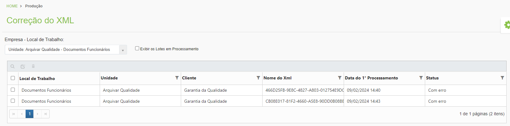
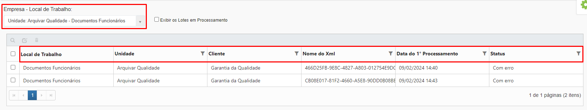
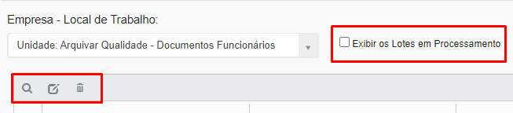
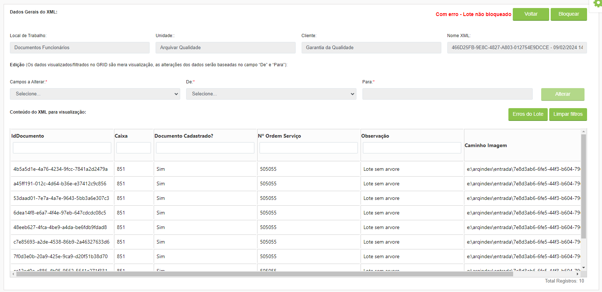
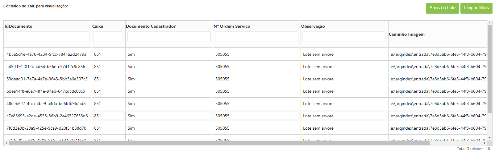
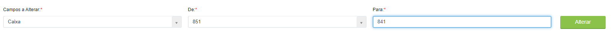
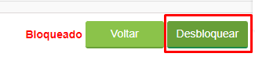

# 🟩 Correção do XML

Esta tela foi criada para a correção de possíveis erros na validação dos documentos gerados pela digitalização.

Durante o processo de leitura do XML são realizadas validações no arquivo XML. A aplicação ArqIndex valida códigos de caixas, árvore documental, campos customizados e os Id's do cliente e da Unidade.

Caso haja alguma inconsistência no arquivo gerado pela digitalização, ao ler e processar o arquivo, a aplicação irá enviá-los para a tela de Correção do XML para que o usuário possa identificar o erro, corrigi-lo e processa-lo novamente.


<mark style="color:blue;">**EXEMPLO:**</mark> <mark style="color:blue;"></mark><mark style="color:blue;">No início do processo de digitalização, o operador responsável pela operação precisa informar alguns dados referentes ao documento que está sendo digitalizado, como código da caixa em que a versão física será arquivada, informações sobre a árvore documental, etc. Se o número da caixa física for informado erroneamente pelo operador, ao fazer a leitura do arquivo XML, o sistema informará que a caixa não existe, enviando o lote de documentos para correção.</mark>


&#x20;Depois de selecionar o Local de Trabalho e a Empresa, são exibidos todos os arquivos XML com erro que não puderam ser processados. Caso seja escolhida uma unidade Arquivar, serão exibidos todos os arquivos de clientes com erro. &#x20;

<figure><figcaption>
Clique para ampliar a imagem.
</figcaption></figure>

***

## Correção de XML – Tela inicial&#x20;

**Coluna Local de Trabalho:** Exibe o local de trabalho selecionado no campo “Empresa - Local de Trabalho”. &#x20;

**Coluna Unidade:** Exibe o nome da unidade Arquivar responsável pela empresa selecionada. &#x20;

**Coluna Cliente:** Exibe o nome do cliente dono do arquivo XML a ser corrigido ou tratado&#x20;

**Coluna Nome do XML:** Exibe o nome que foi atribuído ao XML no momento de sua criação.&#x20;

**Coluna Data do 1º Processamento:** Exibe a data e horário em que ocorreu a primeira tentativa de leitura do XML.&#x20;

**Coluna Status:** Exibe o status do XML, que pode ser:&#x20;

* _Com erro:_ Arquivo que não pôde ser processado devido a erro na estrutura do XML. Precisa ser corrigido para que haja uma nova tentativa de processamento.&#x20;
* _Aguardando:_ Arquivo que está em um lote que ainda aguarda para ser processado. &#x20;
* _Em processamento:_ Arquivo que já está sendo processado pela aplicação ArqIndex.&#x20;
* _Parcialmente processado:_ Arquivo que foi processado parcialmente. &#x20;
* _Bloqueado:_ Arquivo bloqueado para correção ou em correção. &#x20;

<figure><figcaption>
Clique para ampliar a imagem.
</figcaption></figure>

**Exibir os Lotes em Processamento:** Essa opção deve ser marcada para que sejam exibidos arquivos com os status “Em processamento” e “Parcialmente processado”.&#x20;

**Ícone Visualizar:** Utilizado para visualizar o erro encontrado no XML.&#x20;

**Ícone Atualizar status para Aguardando:** Caso o arquivo não contenha erros em sua estrutura, deve-se selecionar o lote  e clicar neste ícone para atualizar seu status para “Aguardando”, ou seja, a aplicação irá processa-lo novamente.


<mark style="color:blue;">**EXEMPLO:**</mark> <mark style="color:blue;"></mark><mark style="color:blue;">Durante o processamento de um lote de arquivos houve uma falha na conexão com o servidor, e parte desses arquivos não pôde ser processada. Os arquivos foram para a tela de Correção do XML com o status “Com erro”, mas neste caso não precisam ser corrigidos pois não há erros em sua estrutura. Basta que se execute um novo processamento mudando o status dos arquivos para “Aguardando” para que eles entrem na fila e sejam novamente processados.</mark>  &#x20;


**Ícone Excluir:** Utilizado para excluir um lote de documentos. Há casos em que é mais eficiente excluir o lote de documentos e refazer a digitalização.

<figure><figcaption>
Clique para ampliar a imagem.
</figcaption></figure>

***

## Dados Gerais do XML&#x20;

Ao clicar no ícone “Visualizar” é exibida a tela Dados Gerais do XML, na qual é possível ver todas as informações do lote de arquivos XML (Local de Trabalho), Unidade, Cliente e Nome XML). &#x20;

<figure><figcaption>
Clique para ampliar a imagem.
</figcaption></figure>

Ao clicar em “Bloquear” o XML é bloqueado, ou seja, caso outros usuários também estejam executando correções de XML, serão informados de que aquele lote está impedido de ser processado novamente. &#x20;

<figure><figcaption>
Clique para ampliar a imagem.
</figcaption></figure>

No campo “Conteúdo do XML para visualização” é exibido um grid com os Ids de todos os documentos daquele lote, a identificação da caixa em que os documentos estão armazenados e o caminho no servidor onde as imagens relacionadas a esses documentos estão gravadas[ (pasta de entrada configurada no local de trabalho).     ](configuracoes/aplicativo-arqindex.md#configurar-parametros)

<figure><figcaption>
Clique para ampliar a imagem.
</figcaption></figure>

Ao clicar em “Erros do Lote” são exibidos todos os erros encontrados no arquivo XML dos documentos. Como um arquivo XML é composto por um lote de documentos, podem ser encontrados diversos tipos de erros em um mesmo arquivo. &#x20;

<figure><figcaption>
Clique para ampliar a imagem.
</figcaption></figure>

<figure><figcaption>
Clique para ampliar a imagem.
</figcaption></figure>

Quando o XML está bloqueado, os campos “Campos a Alterar”, “De” e “Para” são habilitados. Para proceder a correção é preciso verificar qual o erro do lote que se deseja corrigir e em “Campos a Alterar” selecionar o campo que deve ser corrigido. No campo “De” será exibida a informação atual que consta no XML. No campo “Para” deve-se inserir a informação correta que deve substituir a atual. Para concluir a correção, clique em “Alterar” e confirme clicando em “Sim”.&#x20;

<figure><figcaption>
Clique para ampliar a imagem.
</figcaption></figure>

Após executar a correção, clique em “Desbloquear”. O lote que estava com status “Com erro” será alterado para “Aguardando”, ou seja, entrará novamente na fila de trabalho para que seja novamente processado pelo robô.&#x20;


<mark style="color:orange;">**O controle de quantidade de documentos digitalizados e indexados é de responsabilidade do usuário Gestor, ou seja, acompanhe diariamente todo o processo da aplicação desde a digitalização, indexação e exportação para o ArqGED.**</mark>


<figure><figcaption>
Clique para ampliar a imagem.
</figcaption></figure>
