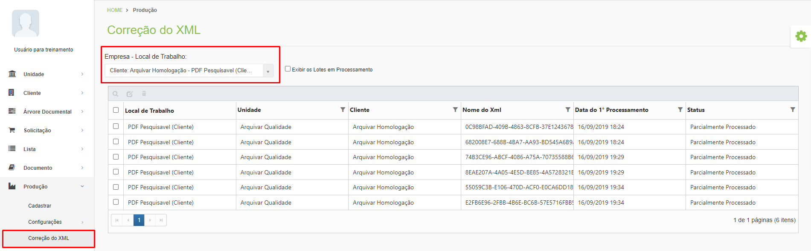

# 🟩 Correção do XML

No menu Correção do XML é possível fazer correções das informações dos arquivos XML gerados no processo de digitalização dos documentos.


<mark style="color:blue;">**EXEMPLO:**</mark> <mark style="color:blue;"></mark><mark style="color:blue;">No início do processo de digitalização, o operador responsável pela operação precisa informar alguns dados referentes ao documento que está sendo digitalizado, como código da caixa em que a versão física está arquivada, informações sobre a árvore documental, etc. Se, por exemplo, o número da caixa física for informado erroneamente pelo operador, ao fazer a leitura do arquivo XML gerado o sistema informará que a caixa não existe. Esse documento ficará na fila de arquivos com erro e só poderá prosseguir para a indexação depois que suas informações forem corrigidas.</mark>


Depois de selecionar o Local de Trabalho e a Empresa, são exibidos todos os documentos com erros que ainda não conseguiram ser processados.&#x20;

<figure><figcaption>
Clique para ampliar a imagem.
</figcaption></figure>
