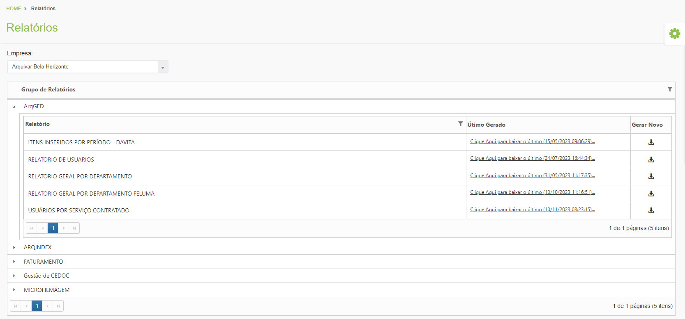

# 📊 Relatórios

No menu Relatórios são criados relatórios personalizados para os clientes. A construção desses relatórios é feita por meio de consulta SQL ao banco de dados do sistema e por isso só pode ser feita pela Arquivar Master.&#x20;

Os clientes e unidades podem consultar esses relatórios, que ficam agrupados por módulo. Ao clicar em um grupo de relatórios, são exibidos todos os relatórios construídos e o usuário tem a opção de fazer o download do último relatório gerado ou de gerar um novo relatório.   &#x20;

Em alguns relatórios é possível informar filtros para refinar o resultado que será exibido no relatório.   &#x20;

<figure><figcaption>
Clique na imagem para ampliar.
</figcaption></figure>
