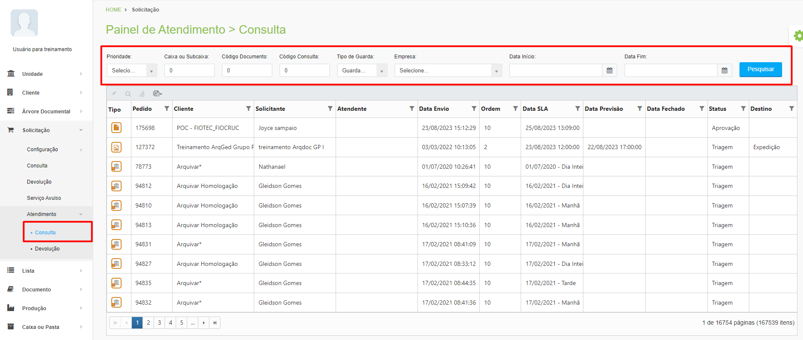

# 🔹 Consulta

Nesta tela são exibidas apenas as solicitações de clientes feitas pelo menu Solicitações > Consulta. É possível realizar a pesquisa de solicitações por meio dos filtros de prioridade, código de caixa, subcaixa, documento ou consulta, pelo tipo de guarda, por empresa ou por data início e fim. &#x20;

<figure><figcaption>
Clique para ampliar a imagem.
</figcaption></figure>

Ao localizar a solicitação de consulta deverá ser gerada nesta tela a guia de busca, utilizada para que a equipe que trabalha no galpão de guarda localize o documento solicitado e o envie para o cliente.&#x20;
