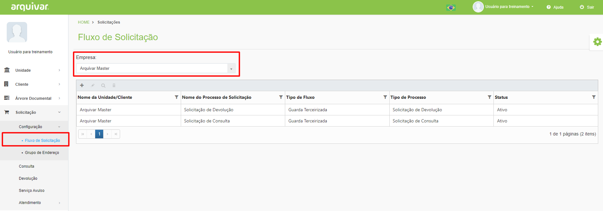
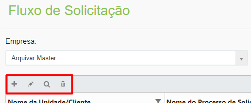

# 🔹 Fluxo de Solicitação

Neste menu são montados os fluxos das solicitações possíveis, ou seja, são configuradas as fases para que os serviços de consulta e devolução de documentos sejam executados dentro do sistema. &#x20;

Nesta tela são apresentados todos os fluxos criados para a unidade ou cliente selecionado no campo “Empresa”. São exibidos o Nome da Unidade/Cliente, o Nome do Processo de Solicitação, o Tipo de Fluxo, que só pode ser de Guarda Terceirizada, o Tipo de Processo, que pode ser de consulta ou de devolução de documentos, e o Status, que pode ser ativo ou inativo.&#x20;

<figure><figcaption>
Clique para ampliar a imagem.
</figcaption></figure>

**Ícone Adicionar:** Utilizado para cadastrar um novo fluxo.  &#x20;

**Ícone Editar:** Utilizado para editar as informações do fluxo selecionado.&#x20;

**Ícone Visualizar:** Utilizado para apresentar as informações do fluxo. &#x20;

**Ícone Excluir:** Utilizado para excluir o fluxo selecionado.&#x20;

<figure><figcaption></figcaption></figure>
