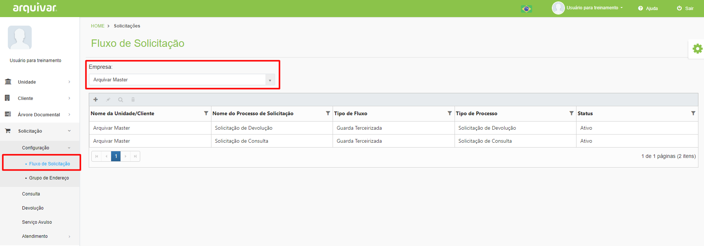
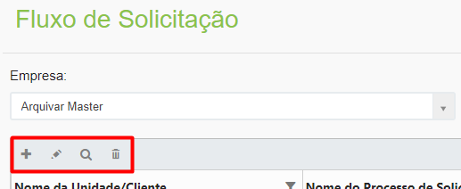

# 🔹 Fluxo de Solicitação

Nesta tela são exibidos todos os fluxos da unidade ou cliente selecionado no campo “Empresa”.&#x20;

<figure><figcaption>
Clique para ampliar a imagem.
</figcaption></figure>

Aqui são criados os fluxos das solicitações possíveis, ou seja, são configuradas as fases para que os serviços de consulta e devolução necessitam para que sejam executados dentro do sistema. &#x20;

<figure><figcaption>
Clique na imagem para ampliar.
</figcaption></figure>

**Ícone Adicionar:** Utilizado para cadastrar um novo fluxo.  &#x20;

**Ícone Editar:** Utilizado para editar as informações do fluxo selecionado.&#x20;

**Ícone Visualizar:** Utilizado para apresentar as informações do fluxo. &#x20;

**Ícone Excluir:** Utilizado para excluir o fluxo selecionado.&#x20;

Ao clicar em adicionar é habilitada a tela **Dados Gerais do processo de Solicitação** para preenchimento dos dados iniciais:

<figure><figcaption>
Clique na imagem para ampliar.
</figcaption></figure>

**"Nome da Unidade/Cliente" e "Tipo de Fluxo":** Estes campos dão preenchidos de forma automática, conforme informação selecionada no campo anterior**,** se selecionada a Unidade, automaticamente o Tipo de Fluxo será preenchido como “Guarda Terceirizada” se selecionado o cliente, automaticamente o Tipo de Fluxo será preenchido como “Guarda Interna”.

**Número Máximo de itens:** Informe o limite de itens que deve ser permitido em cada pedido.&#x20;

* **Exemplo:** Se for definido limite de 100 itens por pedido e reservados 300 itens, serão criados 3 pedidos com 100 itens cada. Geralmente é utilizado o limite de 100 itens por pedido.

**Status:** Informe se processo ativo ou inativo.&#x20;

**Nome do Processo de Solicitação:** Informe o nome do processo, por exemplo "Solicitação de Consulta" ou "Solicitação de Devolução".

**Tipo de Processo:** Selecione se o fluxo criado atende ao processo de “Solicitação de Consulta” ou “Solicitação de Devolução”. &#x20;

Ao clicar em salvar, se o processo estiver sendo criado para a Unidade Arquivar, é habilitada a opção de seleção dos clientes que deverão seguir com o fluxo criado.&#x20;

Selecione o cliente e clique em adicionar.&#x20;

<figure><figcaption>
Clique na imagem para ampliar.
</figcaption></figure>

Repita o processo até que sejam inseridos todos os clientes desejados.&#x20;

Para excluir um cliente da lista, selecione e clique no ícone excluir.&#x20;

<figure><figcaption>
Clique na imagem para ampliar.
</figcaption></figure>


<mark style="color:red;">Se o cliente não estiver vinculado a um processo de consulta, ele não conseguirá prosseguir com o processo de solicitação no sistema ou gerar um pedido para a requisição.</mark>&#x20;

<mark style="color:red;">Quando o processo for de Guarda Interna (CEDOC), não é apresentada a opção de seleção de “Clientes que seguirão o fluxo”, o processo fica vinculado automaticamente ao cliente informado no início do processo.</mark>


Concluído o preenchimento de todas as informações solicitadas na tela, clique "Salvar".
