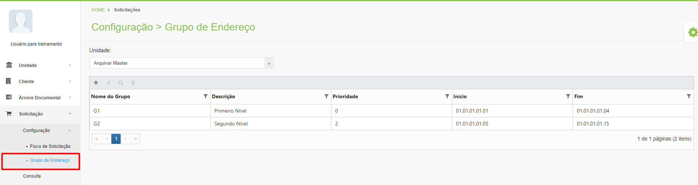
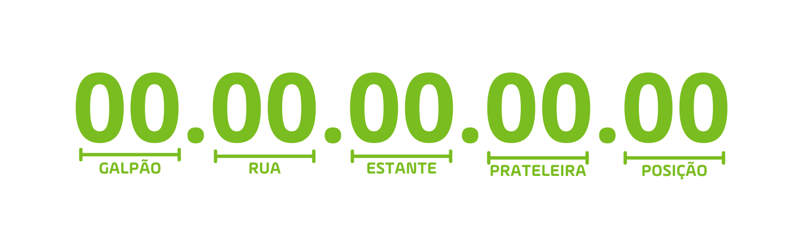

# 🔹 Grupo de Endereço

O Grupo de Endereço é utilizado para dividir as guias de busca dentro das solicitações de consulta de documentos. Essa funcionalidade é importante para direcionar o trabalho dos colaboradores que trabalham dentro dos galpões das unidades Arquivar localizando os documentos solicitados pelos clientes.&#x20;

<figure><figcaption>
Clique para ampliar a imagem.
</figcaption></figure>

Ao receber uma solicitação de consulta de um documento é emitida uma guia de busca que informa a quem irá localizar aquele documento onde ele se encontra no galpão de guarda. Nessa guia consta o endereço do documento, que é um código composto no formato “00.00.00.00.00”, onde os dois primeiros dígitos indicam o número do galpão, os próximos dois dígitos indicam a rua dentro do galpão, os próximos dois indicam a estante, os próximos dois a prateleira e os dois últimos a posição do documento na prateleira. &#x20;

<figure><figcaption></figcaption></figure>

Os grupos de endereço são formados por prateleiras com as mesmas características como por exemplo necessidade de escada ou empilhadeira para acesso, acesso facilitado perto da porta, localização baixa que não demanda o uso de escadas, etc. Se a solicitação do cliente possui documentos que estão em diferentes grupos de endereço, é emitida uma guia de busca para cada grupo.&#x20;
