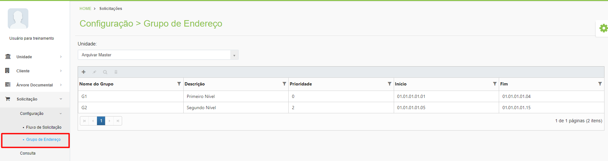
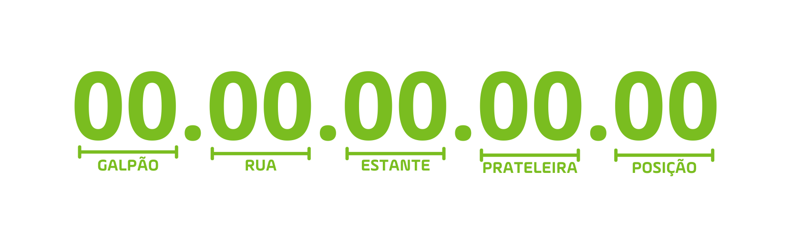

# 🔹 Grupo de Endereço


Clique na legenda e siga o passo a passo.


O Grupo de Endereço é utilizado para separar as guias de busca dentro das solicitações de consulta de documentos e/ou caixas. Essa funcionalidade é importante para direcionar o auxiliar que trabalha no galpão da unidade Arquivar localizando de forma mais rápida o acervo solicitado pelo cliente.

<figure><figcaption>
Clique para ampliar a imagem.
</figcaption></figure>

Ao receber uma solicitação de consulta é emitida uma guia de busca que informa a quem irá localizar aquele acervo onde ele se encontra no galpão de guarda. Nessa guia consta o endereço onde a caixa está alocada, que é um código composto no formato “00.00.00.00.00”, onde os dois primeiros dígitos indicam o número do galpão, os próximos dois dígitos indicam a rua dentro do galpão, os próximos dois indicam a estante, os próximos dois a prateleira e os dois últimos a posição da caixa na prateleira.

<figure><figcaption></figcaption></figure>


<mark style="color:green;">Os grupos de endereço são formados por prateleiras com as mesmas características como por exemplo:</mark>

* <mark style="color:green;">Necessidade de uso da escada ou empilhadeira para acesso, ou</mark>
* <mark style="color:green;">Acesso facilitado perto da porta, ou</mark>
* <mark style="color:green;">Localização baixa que não demanda o uso de escadas, etc.</mark>

<mark style="color:green;">Se a solicitação do cliente possui documentos ou caixas que estão em diferentes grupos de endereço, é emitida uma guia de busca para cada grupo.</mark>


<figure><figcaption>
Clique na imagem para ampliar.
</figcaption></figure>

**Unidade:** Informe a Unidade responsável pelo cliente.

**Adicionar:** Clique para criar um novo Grupo de Endereços.

**Editar:** Clique para alterar um grupo já existente.

**Visualizar:** Clique para visualizar uma configuração já existente.

Ao clicar em Adicionar "+", é apresentada a tela de cadastro:

<figure><figcaption>
Clique na imagem para ampliar.
</figcaption></figure>

**Nome do Grupo:** Informe um nome que identifique a separação do grupo de endereços.

**Descrição:** Descreva uma particularidade do grupo de endereços, por exemplo: caixas com altura 0, tratamento sem escada.

**Prioridade:** Este campo é utilizado para definir qual a ordem de apresentação do grupo nos detalhes do Pedido no Painel de Atendimento > Consulta e na Guia de Busca de Documentos, Caixas e Subcaixas.

No exemplo abaixo, o Agrupamento 02 está configurado como prioridade 1 e o Agrupamento 01 está configurado como prioridade 2, na tela eles aparecem considerando esta configuração.

<figure><figcaption>
Clique na imagem para ampliar.
</figcaption></figure>

**Início:** Identifique o endereço inicial do grupo.

**Fim:** Identifique o endereço final do grupo.

O sistema irá considerar todos os endereços contidos no intervalo informado para separação do pedido no sistema, desta forma a busca do acervo no galpão será mais produtiva, pois será realizada conforme o grupo previamente cadastrado.

**Atualizar Grupo de Endereço:** Trata-se da habilitação para edição dos campos novamente, caso seja necessário aumentar ou diminuir o intervalo de endereços definidos em cada um dos "Grupos de Endereços" configurados.
