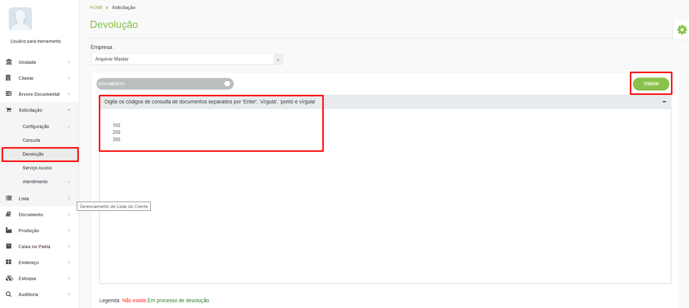

# 🟩 Devolução

Depois de receber e concluir a consulta aos documentos físicos, o cliente deverá devolvê-los para a guarda da unidade Arquivar. Para isso, deverá abrir uma solicitação no menu Devolução. &#x20;

Para devolver o arquivo ele deverá digitar os códigos das caixas, subcaixas ou documentos que está devolvendo e clicar em “Validar”. &#x20;

<figure><figcaption>
Clique para ampliar a imagem.
</figcaption></figure>


<mark style="color:red;">**Caso o cliente não possua o serviço de**</mark> [<mark style="color:blue;">**Devolução de Caixa**</mark>](../cliente/contratos/aba-servico/regras-de-faturamento-por-tipo-de-servico.md#devolucao-de-caixa) <mark style="color:red;">**ou**</mark> [**Devolução de Documento**](../cliente/contratos/aba-servico/regras-de-faturamento-por-tipo-de-servico.md#devolucao-de-documentos) <mark style="color:red;">**cadastrados no contrato, não será possível prosseguir com a validação da devolução.**</mark> &#x20;

