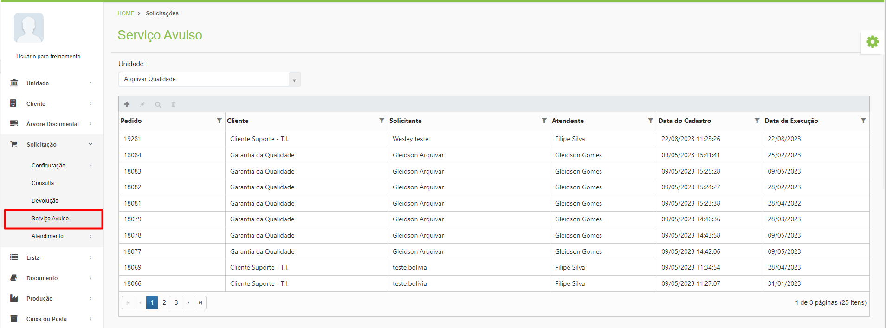

# 🟩 Serviço Avulso

No menu Serviço Avulso as unidades podem solicitar à Arquivar Master a execução de serviços que não podem ser contabilizados pelo sistema, mas que precisam ser faturados.


<mark style="color:blue;">Alguns exemplos de serviços que devem ser faturados, mas não podem ser contabilizados no sistema são suporte técnico, horas de consultoria, organização de documentos, elaboração de projetos, entre outros.</mark>


<figure><figcaption>
Clique na imagem para ampliar.
</figcaption></figure>
