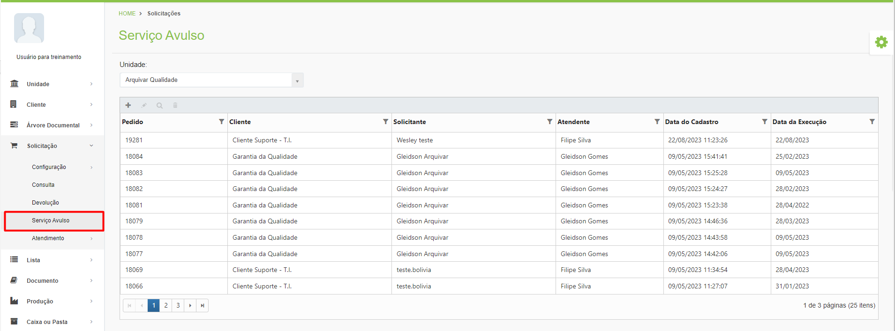

# 🟩 Serviço Avulso




Clique na legenda e siga o passo a passo.


O menu Serviço Avulso é utilizado para lançamento de serviços que não são contabilizados pelo sistema de forma automática, mas que devem ser considerados no faturamento.

<figure><figcaption>
Clique na imagem para ampliar.
</figcaption></figure>


<mark style="color:green;">Alguns exemplos de serviços que devem ser faturados, mas não são contabilizados de forma automática pelo sistema são:</mark>

* <mark style="color:green;">Suporte técnico</mark>
* <mark style="color:green;">Horas de consultoria</mark>
* <mark style="color:green;">Organização de documentos</mark>
* <mark style="color:green;">Elaboração de projetos, entre outros.</mark>


<figure><figcaption>
Cliue na imagem para ampliar.
</figcaption></figure>

**Unidade:** Informe o nome da Unidade Arquivar responsável pela execução do serviço.

**Adicionar:** Clique para adicionar um novo lançamento.

**Editar:** Clique para editar um lançamento já existente.

**Visualizar:** Clique para visualizar os dados de um lançamento já criado.

**Excluir:** Clique para excluir um lançamento existente.

<figure><figcaption>
Clique na imagem para ampliar.
</figcaption></figure>

**Coluna Pedido:** Exibe o número criado para o lançamento realizado.

**Coluna Cliente:** Exibe o nome do Cliente para qual o serviço foi executado.

**Coluna Solicitante:** Exibe o nome do responsável pelo serviço no cliente.

**Coluna Atendente:** Exibe o nome do Atendente responsável pelo serviço na Unidade Arquivar.

**Coluna Data do Cadastro:** Exibe a data que o lançamento foi realizado no sistema.

**Coluna Data da Execução:** Exibe a data de execução do serviço pela Unidade Arquivar.

## Criando um lançamento de Serviço Avulso

Ao clicar na opção de Adicionar é aberta a tela de lançamento.

<figure><figcaption>
Clique na imagem para ampliar.
</figcaption></figure>

Preencha os campos apresentados na tela:

<figure><figcaption>
Clique na imagem para ampliar.
</figcaption></figure>

**Unidade:** É exibido já preenchido, pois considera a informação da tela anterior.

**Cliente**: Selecione na lista o cliente solicitante do serviço.

**Solicitante:** Selecione na lista apresentada o usuário do cliente que demandou o serviço.

**Atendente:** Exibe o nome do usuário logado.

**Serviço:** Selecione na lista apresentado o serviço prestado.

**Data de Execução:** Informe a data de execução do serviço. Para serem considerados no faturamento, os lançamentos devem ser realizados até o último dia do mês corrente.


<mark style="color:red;">Fique atento com o lançamento da data de execução do serviços, depois do fechamento do período de faturamento, não será possível excluir um lançamento.</mark>


**Quantidade:** Informe o volume gerado na prestação de serviços, por exemplo:

* Digitalização - informe a quantidade de imagens geradas
* Suporte técnico - informe a quantidade de horas dedicadas ao atendimento

**Haverá transporte:** Informar se haverá transporte, neste caso, quando não se aplicar a realização de transporte, ao informar "sem transporte" os próximos campos não serão habilitados para preenchimento.

**Endereço:** Selecione o endereço para coleta/entrega.

**Data do Transporte:** Informe a data do transporte.

**Hora:** Informe a hora do transporte.

**Descrição:** Adicione informações relevantes à prestação do serviço considerado no lançamento, por exemplo:

Quantidade de digitalização: 100

* 50 imagens do departamento X
* 50 imagens do departamento Y

Clique "Salvar" para concluir o lançamento do serviço.


<mark style="color:green;">Ao realizar o faturamento do cliente, todos os lançamentos de "Serviço Avulso" serão contabilizados, desde que lançados dentro do período de faturamento.</mark>



<mark style="color:red;">Caso o lançamento do serviço avulso esteja sendo realizado no mesmo dia de reajuste do contrato do cliente, não será possível concluir o lançamento. Ocorre um conflito das informação os serviços não são apresentados na tela para seleção. Neste caso é necessário aguardar para concluir o lançamento no dia seguinte ao reajuste do contrato.</mark>

