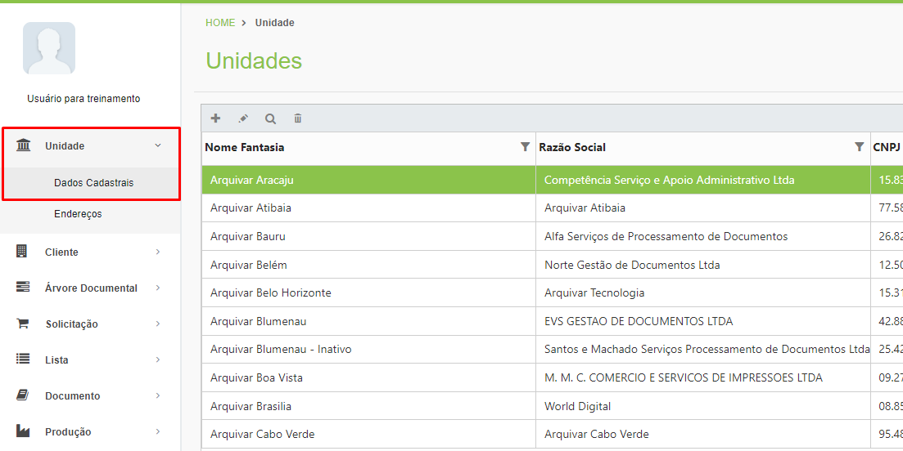
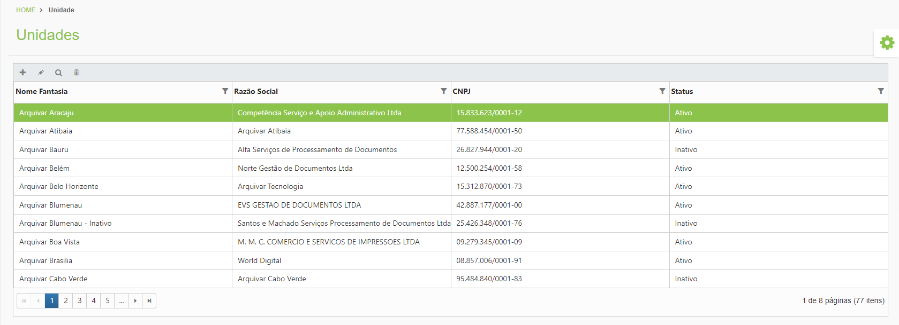
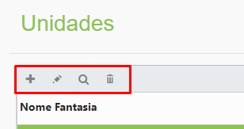

# 🟩 Dados Cadastrais

No menu Dados Cadastrais são cadastradas as informações comerciais sobre cada uma das unidades.&#x20;

<figure><figcaption>
Clique para ampliar a imagem.
</figcaption></figure>

**Coluna Nome Fantasia:** Esta coluna exibe o nome fantasia da unidade. É este nome que será exibido ao realizar o cadastro de qualquer serviço no sistema.  &#x20;

**Coluna Razão Social:** Nesta coluna é exibida a razão social da unidade franqueada. A razão social é o nome comercial da unidade, ou seja, seu nome jurídico registrado.&#x20;

**Coluna CNPJ:** Apresenta o número CNPJ da empresa.&#x20;

**Coluna Status:** Informa se aquela unidade está ativa ou inativa no ArqGED ou se está bloqueada para uso da plataforma. &#x20;

<figure><figcaption>
Clique para ampliar a imagem.
</figcaption></figure>

**Ícone Adicionar:** Utilizado para cadastrar uma nova unidade franqueada.&#x20;

**Ícone Editar:** Utilizado para editar as informações do cadastro da unidade selecionada.&#x20;

**Ícone Visualizar:** Utilizado para exibir as informações cadastrais da unidade selecionada. &#x20;

**Ícone Excluir:** Utilizado para excluir a unidade selecionada. &#x20;

<figure><figcaption></figcaption></figure>
