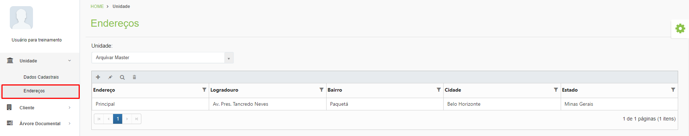
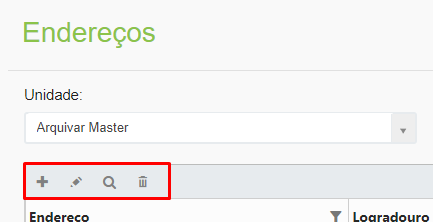
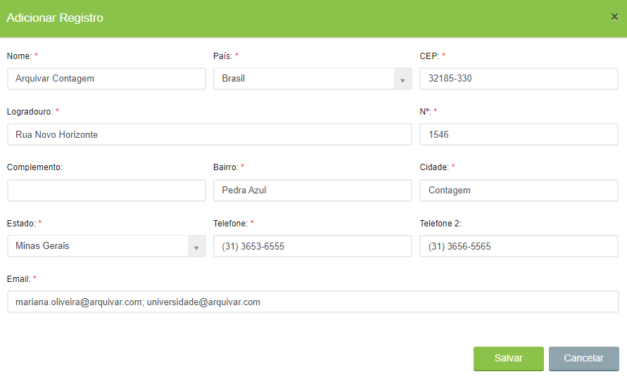
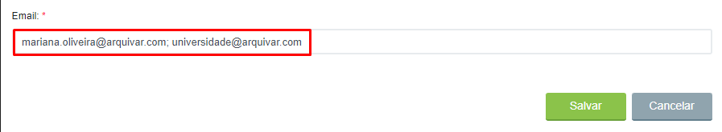

# 🟩 Endereços

A tela Endereços é uma tela informativa, utilizada somente para apresentar os endereços físicos das unidades cadastradas. &#x20;

As colunas da tela principal da aba Endereços apresentam o logradouro, bairro, cidade e estado da unidade. A coluna “Endereço” informa se aquele endereço é o principal da unidade ou se trata-se do endereço de uma filial, por exemplo.&#x20;

<figure><figcaption>
Clique para ampliar a imagem.
</figcaption></figure>

**Ícone Adicionar:** Utilizado para cadastrar um novo endereço para uma unidade franqueada.&#x20;

**Ícone Editar:** Utilizado para editar as informações do endereço selecionado.&#x20;

**Ícone Visualizar:** Utilizado para apresentar as informações de endereço da unidade. &#x20;

**Ícone Excluir:** Utilizado para excluir o endereço selecionado.&#x20;

<figure><figcaption></figcaption></figure>

***

## Cadastro de Endereço&#x20;

1\. Para cadastrar um novo endereço, clique no ícone “Adicionar”.&#x20;

2\. Informe: nome da unidade, país, CEP, endereço completo, cidade, estado e telefones. &#x20;

<figure><figcaption>
Clique para ampliar a imagem.
</figcaption></figure>

3\. Informe os e-mails que receberão solicitações de consulta de documentos do sistema da unidade separados por ponto e vírgula. Para concluir, clique em “Salvar”. &#x20;

<figure><figcaption></figcaption></figure>


<mark style="color:orange;">**Os dados de endereço da unidade são meramente informativos e não impactam em nenhuma funcionalidade da plataforma, exceto o campo “E-mail”, que deve ser preenchido com os endereços de e-mail que receberão solicitações de consulta de documentos do sistema.**</mark>

