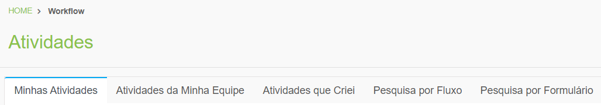

# 🟩 Atividades

No menu Atividades, é onde tudo acontece depois que as configurações do workflow foram realizadas. É neste local que o usuário deve ativar o fluxo e executar suas atividades.

Um processo de trabalho é composto por diversas atividades, ou seja, tarefas que devem ser executadas pelos envolvidos no processo para a sua conclusão. No menu Atividades são exibidas as tarefas do usuário logado. O menu Atividades é dividido em cinco abas:

<table data-view="cards"><thead><tr><th align="center"></th><th data-hidden data-card-target data-type="content-ref"></th></tr></thead><tbody><tr><td align="center"><mark style="color:green;"><strong>Aba Minhas Atividades</strong></mark></td><td><a href="aba-minhas-atividades/">aba-minhas-atividades</a></td></tr><tr><td align="center"><mark style="color:green;"><strong>Aba Atividades da Minha Equipe</strong></mark></td><td><a href="aba-atividades-da-minha-equipe.md">aba-atividades-da-minha-equipe.md</a></td></tr><tr><td align="center"><mark style="color:green;"><strong>Aba Atividades que Criei</strong></mark></td><td><a href="aba-atividades-que-criei.md">aba-atividades-que-criei.md</a></td></tr><tr><td align="center"><mark style="color:green;"><strong>Aba Pesquisa por Fluxo</strong></mark></td><td><a href="aba-pesquisa-por-fluxo.md">aba-pesquisa-por-fluxo.md</a></td></tr><tr><td align="center"><mark style="color:green;"><strong>Aba Pesquisa por Formulário</strong></mark></td><td><a href="aba-pesquisa-por-formulario.md">aba-pesquisa-por-formulario.md</a></td></tr></tbody></table>

<figure><figcaption>
Clique na imagem para ampliar.
</figcaption></figure>
