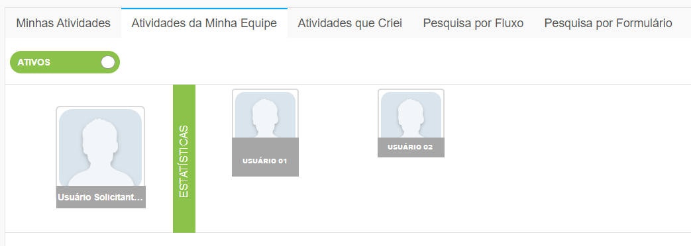
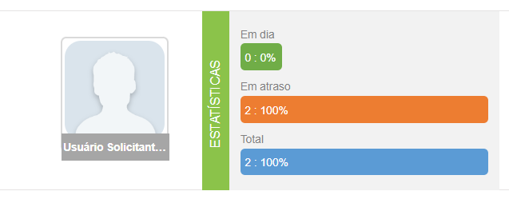
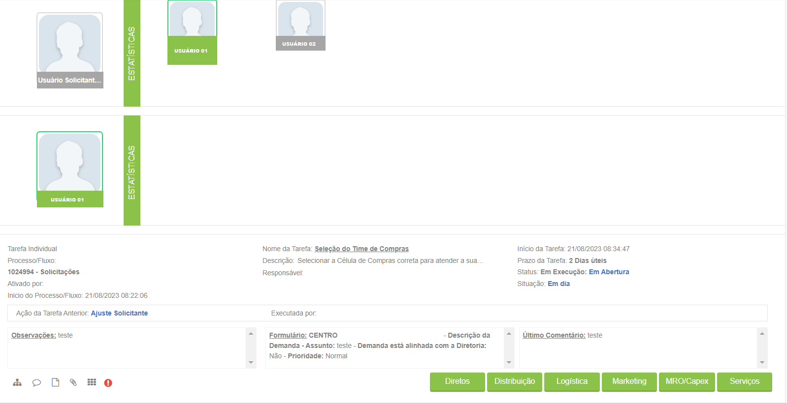

# 🔹 Aba Atividades da Minha Equipe


<mark style="color:orange;">**Esta aba só será exibida caso o usuário tenha outros usuários subordinados a ele no sistema.**</mark>


Caso o usuário tenha outros usuários subordinados a ele no sistema, na aba Atividades da Minha Equipe serão exibidas todas as atividades que esses usuários estão executando ou devem executar. Para que o usuário veja as atividades de sua equipe ele deve ter sido anteriormente indicado como Chefe Imediato no menu Administração > Usuários.


<mark style="color:orange;">**A indicação do Chefe Imediato de cada usuário deve ser feita individualmente no menu Administração > Usuários, campo Chefe Imediato.**</mark>


Na primeira linha são exibidas todas as pessoas da equipe subordinadas ao usuário e o botão “Estatísticas”. É possível visualizar também as atividades agendadas para os membros da equipe alternando o botão Ativos/Agendados.

<figure><figcaption>
Clique na imagem para ampliar.
</figcaption></figure>

Ao clicar no botão “Estatísticas” são exibidos os indicadores relativos ao prazo de execução das tarefas da equipe, mostrando a porcentagem e o número de tarefas em atraso e em dia.

<figure><figcaption></figcaption></figure>

Ao clicar em um usuário serão exibidos todos os fluxos que são sua responsabilidade e as estatísticas relacionadas a esses fluxos. O Chefe Imediato do usuário tem permissão para executar as tarefas e dar andamento aos fluxos de um usuário subordinado.

<figure><figcaption>
Clique na imagem para ampliar.
</figcaption></figure>
