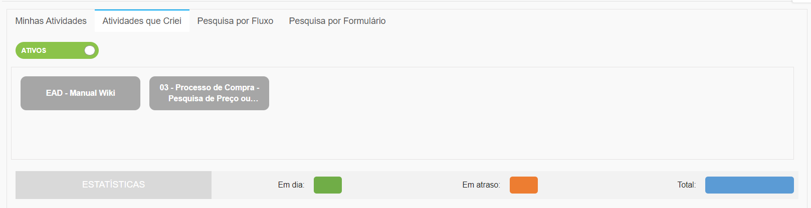
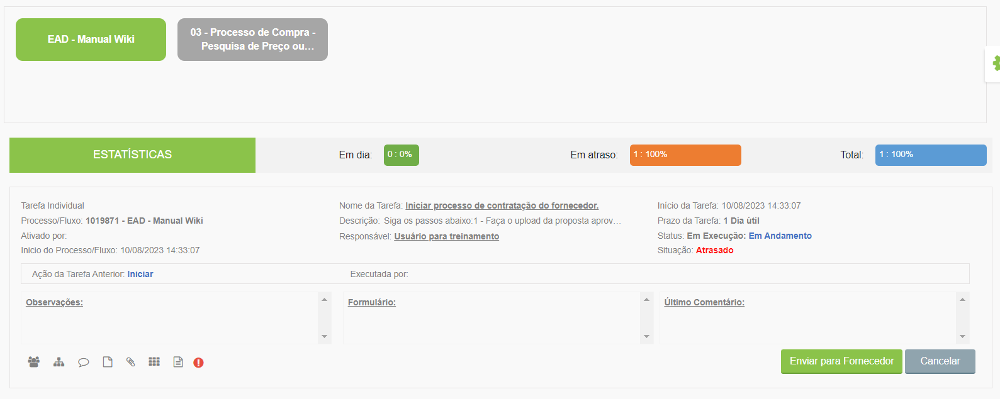

# 🔹 Aba Atividades que Criei

A aba “Atividades que Criei” agrupa todas as atividades criadas pelo usuário logado. O usuário pode solicitar a pesquisa pelo nome dos fluxos que ativou e mesmo que o fluxo não esteja em uma etapa de sua responsabilidade, o usuário conseguirá acompanhar seu andamento. Na parte superior da tela são exibidos os nomes dos fluxos que foram ativados pelo usuário.

<figure><figcaption>
Clique na imagem para ampliar.
</figcaption></figure>

Ao clicar em um dos nomes são mostrados todos os fluxos daquele tipo que foram ativados, com informações sobre em que etapa se encontra. Também são exibidas as estatísticas referentes aos fluxos ativados pelo usuário, que mostra quantos estão em atraso e quantos estão em dia.  &#x20;

Caso o fluxo esteja em uma etapa de responsabilidade do usuário, ele conseguirá executar as obrigatoriedades e dar continuidade ao fluxo por essa tela. Se a etapa for de responsabilidade de outro usuário, ele poderá apenas visualizar a tarefa ou delegar a outra pessoa se tiver essa permissão.&#x20;

<figure><figcaption>
Clique na imagem para ampliar.
</figcaption></figure>
