# 🔹 Aba Minhas Atividades

A aba Minhas Atividades funciona como uma “caixa de entrada” na qual o usuário consegue visualizar informações sobre as tarefas que precisa executar.&#x20;

A aba Minhas Atividades agrupa todas as atividades pendentes para o usuário logado, ou seja, tudo que está em nome dele como tarefa para execução. Nesta tela o usuário visualiza suas atividades para tratamento de forma estruturada na tela e consegue realizar a ativação de novos fluxos de trabalho.&#x20;

***

## Minhas Atividades – Visão Geral

**1. Botão Ativos/Agendados:** A alternância desse botão permite exibir as tarefas ativas (que já iniciaram) ou agendadas (com data futura para início) que são de responsabilidade de execução do usuário.&#x20;

**2. Barra de Filtro:** É possível realizar a busca de tarefas utilizando a barra de filtro, que faz a busca de tarefas do usuário utilizando palavras-chave.   &#x20;

**3. Botão Ativar Novo Fluxo:** Botão para a ativação de novos fluxos.&#x20;

**4. Grupo de informações sobre o fluxo de trabalho e sobre a tarefa:** Aqui são exibidas as seguintes informações: se a tarefa é em grupo ou individual; nome e número do fluxo; data da ativação e nome de quem ativou o fluxo; nome, status e descrição da tarefa; responsável pela tarefa e prazo para a sua execução e status da etapa. É mostrado também quem foi o executor da tarefa anterior e qual foi a ação que ele executou.&#x20;

**5. Observação:** Mostra a informação adicionada no momento da ativação do fluxo no campo “Observação”.&#x20;

**6. Formulário:** Mostra os dados do formulário associado ao fluxo. Os campos exibidos aqui devem ter sido previamente indicados na configuração da tarefa, no menu no menu Workflow > Desenho do Fluxo > Fluxograma. &#x20;

**7. Último Comentário:** Mostra o último comentário feito na tarefa.&#x20;

**8. Próximo Passo:** Nesta área estão concentrados os botões que definem o próximo passo da tarefa. Para cada tarefa de decisão, serão apresentados botões com opções para diferentes caminhos, como por exemplo: Com Validação / Sem Validação, Com Aprovação Técnica / Sem Aprovação Técnica, Validar / Recusar etc. Esses botões servem para direcionar qual caminho deve ser percorrido para atingir o objetivo do fluxo de trabalho. O texto exibido nos botões é inserido nas configurações do conector das tarefas, no menu [Workflow > Desenho do Fluxo > Fluxograma](../../desenho-do-fluxo/aba-fluxograma.md). &#x20;

Os botões “Cancelar” e “Voltar Etapa” só serão exibidos se o usuário tiver permissão para executar essas ações no fluxo. Essa permissão é definida no cadastro de usuário, no menu Administração > Usuários.


<mark style="color:red;">**Ao clicar em “Cancelar” todo o fluxo é cancelado e o processo é interrompido.**</mark>


<figure>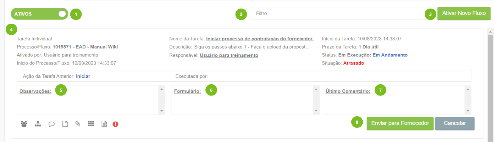<figcaption>
Clique na imagem para ampliar.
</figcaption></figure>

***

## Ícones de Ação das Tarefas

<figure><figcaption></figcaption></figure>


<mark style="color:orange;">**Nem todos os ícones apresentados nessa tela serão utilizados em todos os processos. Em algumas situações, algumas das funcionalidades dessa tela não serão necessárias.**</mark>  


### **1. Delegar Tarefa**

Este ícone estará disponível apenas se a opção “Inibe opção de delegar” esteja desabilitada no menu [Workflow > Desenho do Fluxo > Fluxograma > Configurações da tarefa](../../desenho-do-fluxo/aba-fluxograma.md#configuracoes-da-tarefa). &#x20;

#### Delegando uma tarefa

Ao clicar neste ícone são exibidas informações sobre a tarefa.&#x20;

1\. No campo “Enviar tarefa para” selecione o usuário para o qual a tarefa será direcionada. &#x20;

2\. Defina se a tarefa será:&#x20;

* Para conhecimento apenas: O novo usuário receberá a tarefa e deverá analisá-la e fazer um comentário sobre ela, mas não poderá conclui-la. Quando concluir a análise e o comentário a tarefa voltará para o responsável que deverá cumprir as obrigatoriedades e conclui-la. &#x20;
* Delegar totalmente: O novo usuário receberá a tarefa e deverá cumprir suas obrigatoriedades, devendo inclusive concluir a tarefa.&#x20;

3\. Clique em "Concluir".&#x20;

<figure>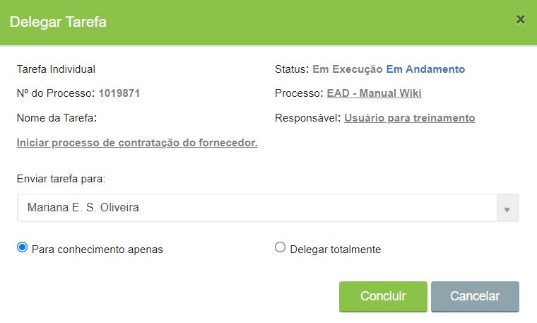<figcaption></figcaption></figure>

### 2. Visualizar Desenho

Ao clicar neste ícone é apresentado ao usuário o desenho completo do processo de trabalho (fluxo) e a sinalização de qual é a tarefa em andamento. A etapa destacada em verde apresenta a tarefa atual do fluxo.

<figure>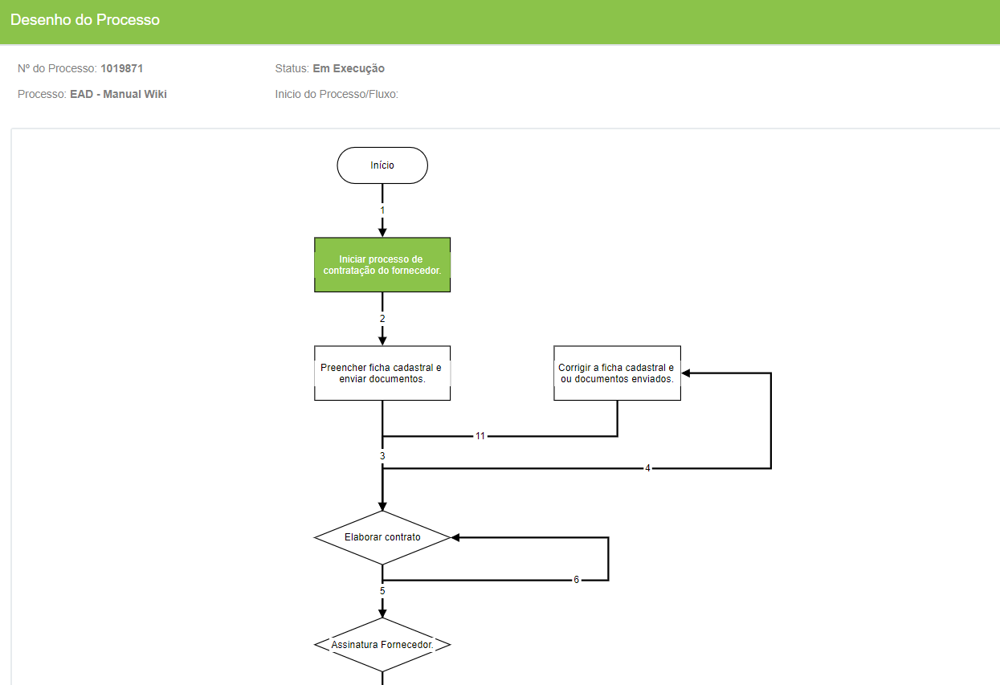<figcaption>
Clique na imagem para ampliar.
</figcaption></figure>

### 3. Comentário

Devem ser inseridas aqui informações que o executor da tarefa atual considere importantes que os usuários que executarão as próximas tarefas fiquem cientes.

<figure><figcaption>
Clique na imagem para ampliar.
</figcaption></figure>

### 4. Documentos

Ao clicar neste ícone é aberta uma janela onde é possível cadastrar, associar ou visualizar um documento.

#### Tela de Documentos

<figure>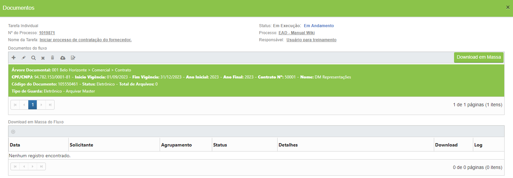<figcaption>
Clique na imagem para ampliar.
</figcaption></figure>

1. **Informações sobre a tarefa:** Tipo, nome e status da tarefa, número do processo e responsável pela execução. &#x20;
2. **Ícones de ação:** Para habilitar todos os ícones é necessário selecionar um dos registros exibidos no campo “Documentos do fluxo”.  &#x20;

\-> _Adicionar:_ Clicando neste ícone será possível cadastrar ou associar um documento ao fluxo.

\-> _Editar:_ Utilizado para editar o registro selecionado.&#x20;

\-> _Visualizar:_ Utilizado para visualizar o registro selecionado. &#x20;

* Aba Dados Cadastrais: Aqui são exibidas as informações e metadados do registro&#x20;

<figure>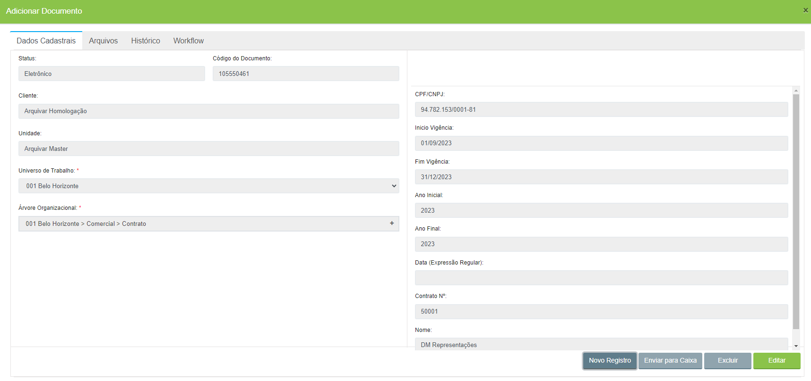<figcaption>
Clique na imagem para ampliar.
</figcaption></figure>

* Aba Arquivos: Informações sobre cada um dos documentos que compõem o registro.  &#x20;

<figure>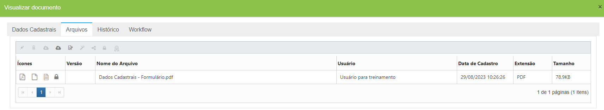<figcaption>
Clique na imagem para ampliar.
</figcaption></figure>

* Aba Histórico: Caso o documento tenha sido solicitado fisicamente, nesta tela será mostrado o histórico das solicitações e informações sobre o recebimento. &#x20;

<figure>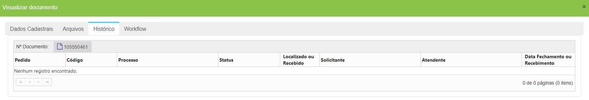<figcaption>
Clique na imagem para ampliar.
</figcaption></figure>

* Aba Workflow:  Informações sobre o fluxo ao qual o registro está associado. Nesta tela é possível ativar um novo fluxo a partir do registro, desassociar o registro do fluxo, visualizar o desenho do fluxo, verificar os comentários feitos no fluxo, visualizar os anexos do fluxo e visualizar o modelo PDF se existir algum associado ao fluxo.&#x20;

<figure>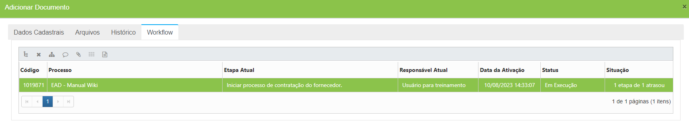<figcaption>
Clique na imagem para ampliar.
</figcaption></figure>

\-> _Desassociar:_ Utilizado para desvincular o registro selecionado do fluxo. O documento continua existindo no sistema mas não terá mais relação com o fluxo.&#x20;

\-> _Excluir:_ Clicando neste ícone o registro selecionado será excluído do sistema.&#x20;

\-> _Upload de arquivos:_ Utilizado para fazer o upload de novo arquivo para o registro selecionado. Um registro pode ser composto por mais de um documento.  &#x20;

\-> _Assinar:_ Utilizado para assinar os documentos do fluxo. O usuário pode escolher entre assinar todos os documentos apresentados ou assinar apenas os que estiverem selecionados em verde no grid.


<mark style="color:orange;">**Para inserir uma nova versão de um documento já cadastrado, selecione o documento e clique no ícone de upload. O sistema preencherá o nome e a versão do arquivo automaticamente, por entender que se trata de um upload de uma nova versão do arquivo selecionado, mas o usuário poderá editar o nome e número da versão se desejar.**</mark>


3. **Download em Massa:** Clicando nesse botão será possível solicitar ao sistema que consolide todos os documentos associados ao fluxo e realizar o download de todos de uma única vez. O usuário pode também selecionar apenas os itens que deseja incluir no download em massa. Será necessário que o usuário escolha o formato do arquivo que será baixado (PDF ou Arquivo ZIP), dê um nome ao arquivo e informe se deseja incluir capas separadoras para diferenciar os documentos (caso tenha sido escolhida a opção de arquivo em PDF). Depois de solicitar, o usuário deverá verificar no campo “Download em Massa do Fluxo” se o arquivo estará disponível ou se houve alguma falha no processamento.  &#x20;

<figure>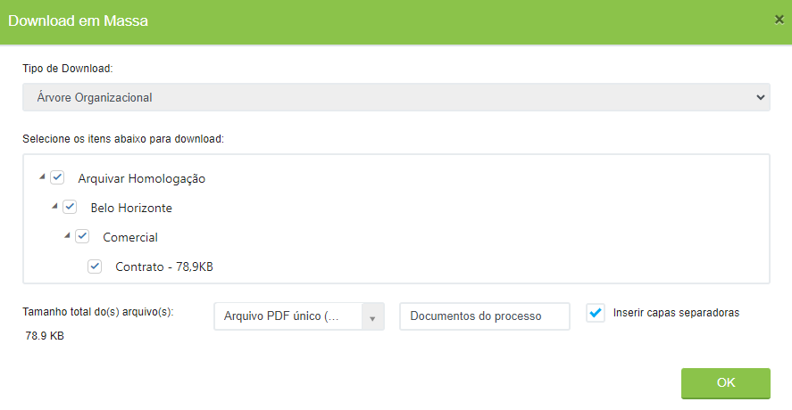<figcaption>
Clique na imagem para ampliar.
</figcaption></figure>

3. **Documentos do fluxo:** Neste campo são exibidos todos os documentos associados ao fluxo cadastrados no sistema. São mostradas as informações e metadados dos documentos.

\-> _Download:_ Clicando no ícone “Download” será possível ver e baixar cada um dos documentos que compõem o registro separadamente.&#x20;

\-> _Editar:_ Clicando no ícone “Editar” será possível editar as informações de indexação do documento com ao mesmo tempo em que se visualiza a imagem.&#x20;

<figure>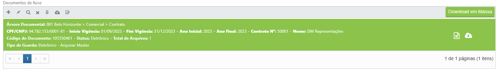<figcaption>
Clique na imagem para ampliar.
</figcaption></figure>


<mark style="color:orange;">**Os ícones “Download” e “Editar” só são exibidos caso haja imagens (JPEG, PNG etc.) compondo o registro.**</mark>


5. **Download em Massa do Fluxo:** Neste campo são exibidos todos os downloads em massa solicitados durante o fluxo. É mostrada a data de solicitação, o nome do solicitante, o agrupamento realizado, o status e os detalhes. Se o arquivo estiver disponível para download, será exibida uma seta no ícone da coluna Download. Se houver tido algum erro no processamento do arquivo, a seta será exibida no ícone da coluna Log.

<figure>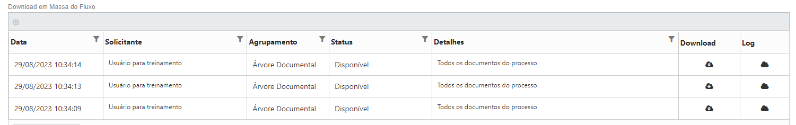<figcaption>
Clique na imagem para ampliar.
</figcaption></figure>

### 5. Anexos

Ao clicar neste ícone é aberta a tela para realizar o upload do documento/imagem.&#x20;

#### Tela de Anexos

1. **Aba Anexos do Fluxo:** São os documentos/imagens tramitados durante a execução do fluxo no sistema. Estão disponíveis os ícones:

\-> _Editar:_ Utilizado para editar o nome do anexo e numerar a versão do anexo. &#x20;

\-> _Excluir:_ Utilizado para excluir o anexo.&#x20;

\-> _Upload de arquivos:_ Utilizado para inserir um novo anexo ao fluxo. &#x20;

\-> _Download:_ Utilizado para baixar o documento selecionado.&#x20;

\-> _Assinar:_ Utilizado para assinar os documentos do fluxo. O usuário pode escolher entre assinar todos os documentos apresentados ou assinar apenas os que estiverem selecionados em verde no grid.

\-> _Capturar Certificado:_ Quando se faz o upload de um documento que esteja assinado digitalmente, clicando neste ícone será possível extrair e visualizar as informações sobre o certificado digital utilizado para a assinatura. Quando o documento for assinado no próprio GED o certificado de assinaturas ficará disponível automaticamente.

<figure>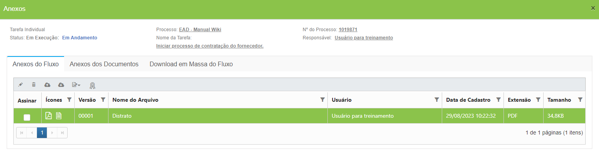<figcaption>
Clique na imagem para ampliar.
</figcaption></figure>

2. **Aba Anexos dos Documentos:** São os documentos/imagens existentes no registro. São os mesmos documentos exibidos na tela “Documentos”. Além de exibir as informações sobre os documentos associados ao fluxo, é possível verificar se o documento foi ou não compartilhado com usuários externos (se não tiver sido o ícone de cadeado será exibido). Na tela estão disponíveis os ícones:

\-> _Editar:_ Utilizado para editar o nome do documento e numerar a sua versão. &#x20;

\-> _Excluir:_ Utilizado para excluir o documento que estiver selecionado.&#x20;

\-> _Assinatura em lote:_ Utilizado para assinar os documentos . O usuário pode escolher entre assinar todos os documentos apresentados ou assinar apenas os que estiverem selecionados em verde no grid.

\-> _Compartilhar:_ Utilizado para permitir que o documento seja compartilhado com usuários externos (não autenticados no sistema).   &#x20;

\-> _Descompartilhar:_ Utilizado para interromper o compartilhamento de um documento. &#x20;

\-> _Download:_ Utilizado para baixar o documento selecionado.&#x20;

\-> _Capturar Certificado:_ Quando se faz o upload de um documento que esteja assinado digitalmente, clicando neste ícone será possível extrair e visualizar as informações sobre o certificado digital utilizado para a assinatura. Quando o documento for assinado no próprio GED o certificado de assinaturas ficará disponível automaticamente.&#x20;

<figure>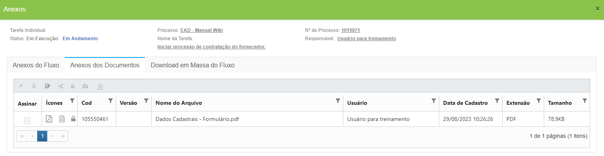<figcaption>
Clique na imagem para ampliar.
</figcaption></figure>

3. **Aba Download em Massa do fluxo:** Opção para baixar todos os documentos do fluxo em uma única ação. são exibidos todos os downloads em massa solicitados durante o fluxo. É mostrada a data de solicitação, o nome do solicitante, o agrupamento realizado, o status e os detalhes. Se o arquivo estiver disponível para download, será exibida uma seta no ícone da coluna Download. Se houver tido algum erro no processamento do arquivo, a seta será exibida no ícone da coluna Log.

<figure>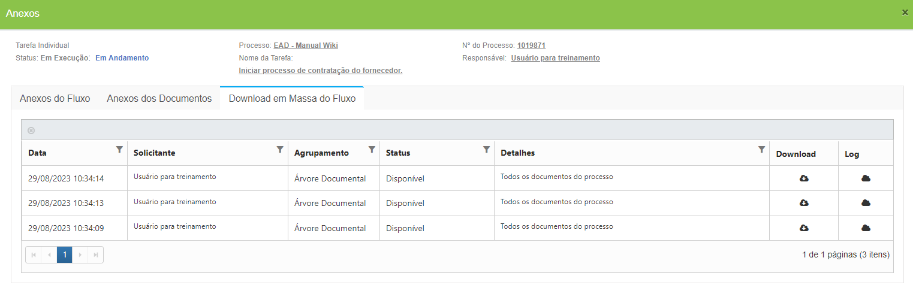<figcaption>
Clique na imagem para ampliar.
</figcaption></figure>

### 6. Formulário

Ao clicar neste ícone é apresentado ao usuário o formulário para preenchimento dos dados. O mesmo formulário pode aparecer em várias tarefas do fluxo para preenchimento de informações específicas de cada uma das tarefas. O formulário mostrado aqui deve ser criado e configurado anteriormente no menu [Workflow > Formulário.](../../formulario.md)

<figure>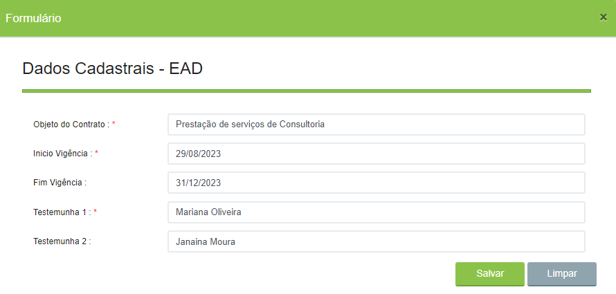<figcaption>
Clique na imagem para ampliar.
</figcaption></figure>

### 7. Modelo de Documento

Este ícone apresenta o modelo de documento PDF editável cadastrado no fluxo no menu [Workflow > Desenho do Fluxo > Aba Dados Gerais > Campo Modelo de Arquivo PDF com campos](../../desenho-do-fluxo/aba-dados-gerais.md#configuracoes-da-aba-dados-gerais).

<figure><figcaption>
Clique na imagem para ampliar.
</figcaption></figure>

### 8. Obrigatoriedades da tarefa

Este ícone funciona como um lembrete ao usuário e vai variar conforme a tarefa em execução. Sua função é informar quais são as ações necessárias para conclusão da etapa. Para isso, basta posicionar o cursor do mouse sobre o ícone e a lista de obrigatoriedades é apresentada. O ícone "Obrigatoriedade da Tarefa" sempre lista quais outros ícones serão usados na execução da tarefa.

Para entender como executar cada uma das obrigatoriedades possíveis, [veja como executar um fluxo.   ](executando-um-fluxo.md)

<figure>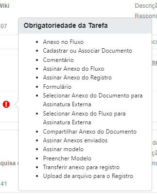<figcaption></figcaption></figure>

