# 🔹 Aba Minhas Atividades



A aba Minhas Atividades funciona como uma “caixa de entrada” na qual o usuário consegue visualizar informações sobre as tarefas que precisa executar. Ela agrupa todas as atividades pendentes para o usuário logado, ou seja, tudo que está em nome dele como tarefa para execução. Nesta tela o usuário visualiza suas atividades para tratamento de forma estruturada na tela, além de conseguir realizar a ativação de novos fluxos de trabalho.

***

## Minhas Atividades – Visão Geral

#### **Botão Ativos/Agendados**

A alternância desse botão permite exibir as tarefas ativas (que já iniciaram) ou agendadas (com data futura para início) que são de responsabilidade de execução do usuário. Por padrão do sistema, ao acessar a tela, são exibidos os dados "Ativos".

<figure><figcaption>
Clique na imagem para ampliar.
</figcaption></figure>


O gráfico exibido na tela **Minhas Atividades,** logo abaixo do botão **"Ativos",** indica a quantidade de fluxos que o usuário possui.\
Isso **não significa** que todos esses fluxos estejam em execução no momento; apenas indica que, dentro da responsabilidade do usuário, existem fluxos previstos para serem executados.&#x20;

Esses fluxos podem estar em "**Ativos**", ou seja, em execução naquele momento ou em "**Agendados",** quando ainda não entraram no processo de execução mas possuem uma data prevista para iniciarem.

&#x20;Ao acessar essa tela, são exibidos por padrão da aplicação os fluxos **ATIVOS.**

**• Quando selecionada a opção "ATIVOS"**

São exibidos os fluxos cuja **data de início da tarefa é inferior a 3 horas** a partir do momento do acesso à tela.

**• Quando selecionada a opção "AGENDADOS"**

São Exibidos os fluxos cuja **data de início da tarefa é superior a 3 horas** a partir do momento do acesso à tela.

Como exemplo, para um usuário, pode ser exibido um total de 6 fluxos no gráfico:

* **2 fluxos em execução**, mostrados na opção **ATIVOS**.
* **4 fluxos agendados**, exibidos na opção **AGENDADOS**, todos com data de início marcada para **o dia ou semana seguinte**.

Esses fluxos agendados **somente aparecerão na opção ATIVOS** quando chegar a data/hora programada para o início de sua execução.

Além disso, na aba **Pesquisa por Fluxo**, é possível identificá-los com o status **Agendado**.


#### **Botão Dados/Listagem**

A alternância desse botão permite alterar a visualização dos fluxos para o usuário. Quando selecionada a opção "Dados", são exibidos na tela os fluxos de responsabilidade do usuário logado considerando um resumo do fluxo, além de exibir também os ícones da etapa e as orientações de pendências. Essa é a forma de visualização padrão do sistema, quando não existe uma configuração de exibição para o perfil do usuário.

<figure><figcaption>
Clique na imagem para ampliar.
</figcaption></figure>

Quando selecionada a opção "Listagem", são exibidos na tela os fluxos de responsabilidade do usuário logado de forma simplificada em uma listagem com as informações mais importantes do fluxo.

<figure><figcaption>
Clique na imagem para ampliar.
</figcaption></figure>

#### **Barra de Filtro**

É possível realizar a busca de tarefas utilizando a barra de filtro, que faz a busca de tarefas do usuário utilizando palavras-chave.   &#x20;

<figure><figcaption>
Clique na imagem para ampliar.
</figcaption></figure>

#### **Botão Ativar Novo Fluxo**

Botão para a ativação de novos fluxos.&#x20;

<figure><figcaption>
Clique na imagem para ampliar.
</figcaption></figure>

#### **Gráfico**

No topo da tela será exibido um gráfico que permite ao usuário visualizar quantos fluxos estão em atraso, com base no total de fluxos sob sua responsabilidade para execução.

<figure><figcaption>
Clique na imagem para ampliar.
</figcaption></figure>

#### **Legendas**

Aqui são exibidas as legendas de cores que indicam de forma visual e clara o estado da Ação. Ela marca ações com uma linha vermelha em caso de <mark style="color:red;">"Ação obrigatória Pendente"</mark>, verde em caso de <mark style="color:green;">"Ação concluída"</mark> e azul em caso de <mark style="color:blue;">"Ação opcional"</mark>.

<figure><figcaption>
Clique na imagem para ampliar.
</figcaption></figure>

#### **Grupo de informações sobre o fluxo de trabalho e sobre a tarefa**

Aqui são exibidas as seguintes informações: se a tarefa é em grupo ou individual; nome e número do fluxo; data da ativação e nome de quem ativou o fluxo; nome, status e descrição da tarefa; responsável pela tarefa e prazo para a sua execução e status da etapa. É mostrado também quem foi o executor da tarefa anterior e qual foi a ação que ele executou.

<figure><figcaption>
Clique na imagem para ampliar.
</figcaption></figure>

#### **Observação**

Mostra a informação adicionada no momento da ativação do fluxo no campo “Observação”.

<figure><figcaption>
Clique na imagem para ampliar.
</figcaption></figure>

#### **Formulário**

Mostra os dados do formulário associado ao fluxo. Os campos exibidos aqui devem ter sido previamente indicados na configuração da tarefa, no menu no menu Workflow > Desenho do Fluxo > Fluxograma.

<figure><figcaption>
Clique na imagem para ampliar.
</figcaption></figure>

#### **Último Comentário**

Mostra o último comentário feito na tarefa.

<figure><figcaption>
Clique na imagem para ampliar.
</figcaption></figure>

#### **Próximo Passo**

Nesta área estão concentrados os botões que definem o próximo passo da tarefa. Para cada tarefa de decisão, serão apresentados botões com opções para diferentes caminhos, como por exemplo: Com Validação / Sem Validação, Com Aprovação Técnica / Sem Aprovação Técnica, Validar / Recusar etc.&#x20;

Esses botões servem para direcionar qual caminho deve ser percorrido para atingir o objetivo do fluxo de trabalho. O texto exibido nos botões é inserido nas configurações do conector das tarefas, no menu [Workflow > Desenho do Fluxo > Fluxograma](../../desenho-do-fluxo/aba-fluxograma.md).

Os botões “Cancelar” e “Voltar Etapa” só serão exibidos se o usuário tiver permissão para executar essas ações no fluxo. Essa permissão é definida no cadastro de usuário, no menu Administração > Usuários.


<mark style="color:red;">**Ao clicar em “Cancelar” todo o fluxo é cancelado e o processo é interrompido.**</mark>


<figure><figcaption>
Clique na imagem para ampliar.
</figcaption></figure>

***

## Ícones de Ação das Tarefas



<figure><figcaption>
Clique na imagem para ampliar.
</figcaption></figure>


<mark style="color:orange;">**Nem todos os ícones apresentados nessa tela serão utilizados em todos os processos. Em algumas situações, algumas das funcionalidades dessa tela não serão necessárias.**</mark>  



As marcações coloridas abaixo dos ícones referem-se à caracterização da ação como: <mark style="color:red;">"Ação obrigatória Pendente"</mark>; <mark style="color:green;">"Ação concluída"</mark>; e <mark style="color:blue;">"Ação opcional"</mark>


### **1. Delegar Tarefa**

Este ícone estará disponível apenas se a opção “Inibe opção de delegar” esteja desabilitada no menu [Workflow > Desenho do Fluxo > Fluxograma > Configurações da tarefa](../../desenho-do-fluxo/aba-fluxograma.md#configuracoes-da-tarefa).

#### Delegando uma tarefa

Ao clicar neste ícone são exibidas informações sobre a tarefa.

1\. No campo “Enviar tarefa para” selecione o usuário para o qual a tarefa será direcionada.

2\. Defina se a tarefa será:

* Para conhecimento apenas: O novo usuário receberá a tarefa e deverá analisá-la e fazer um comentário sobre ela, mas não poderá conclui-la. Quando concluir a análise e o comentário a tarefa voltará para o responsável que deverá cumprir as obrigatoriedades e conclui-la.
* Delegar totalmente: O novo usuário receberá a tarefa e deverá cumprir suas obrigatoriedades, devendo inclusive concluir a tarefa.

3\. Clique em "Concluir".

<figure>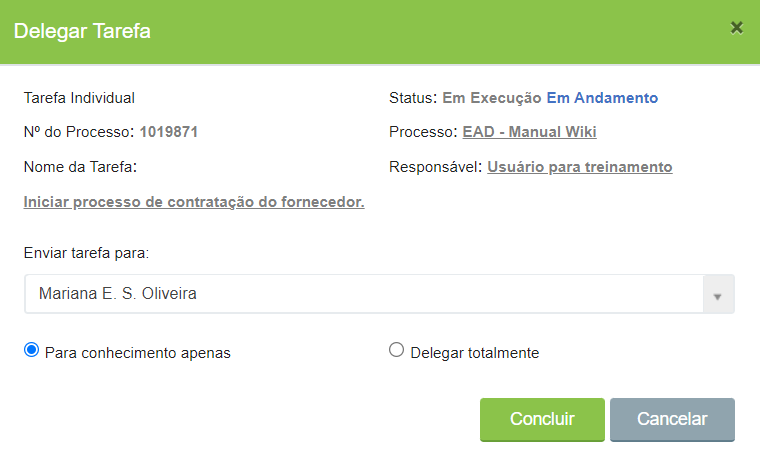<figcaption></figcaption></figure>

### 2. Visualizar Desenho

Ao clicar neste ícone é apresentado ao usuário o desenho completo do processo de trabalho (fluxo) e a sinalização de qual é a tarefa em andamento. A etapa destacada em verde apresenta a tarefa atual do fluxo.

<figure>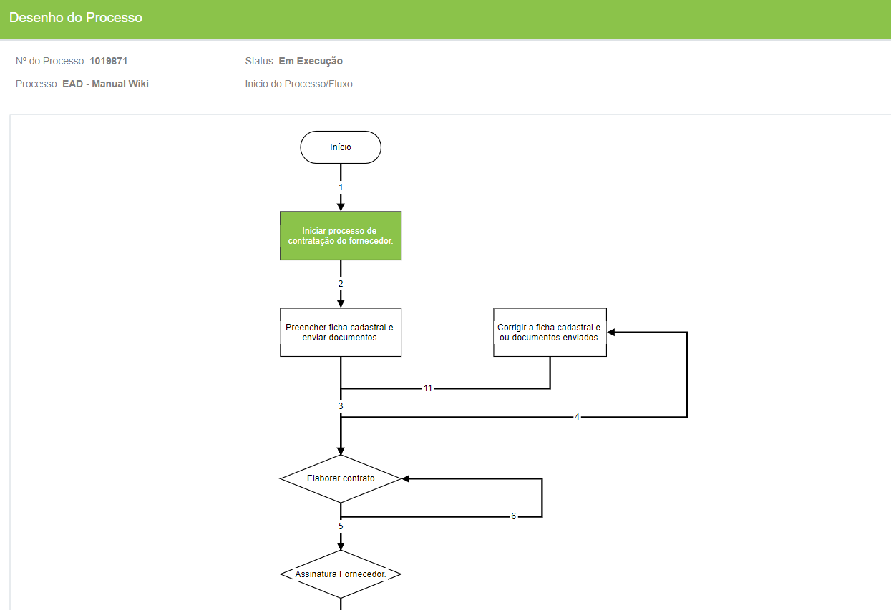<figcaption>
Clique na imagem para ampliar.
</figcaption></figure>

### 3. Comentário

Devem ser inseridas aqui informações que o executor da tarefa atual considere importantes que os usuários que executarão as próximas tarefas fiquem cientes.

<figure><figcaption>
Clique na imagem para ampliar.
</figcaption></figure>

### 4. Documentos

Ao clicar neste ícone é aberta uma janela onde é possível cadastrar, associar ou visualizar um documento.

#### Tela de Documentos

<figure>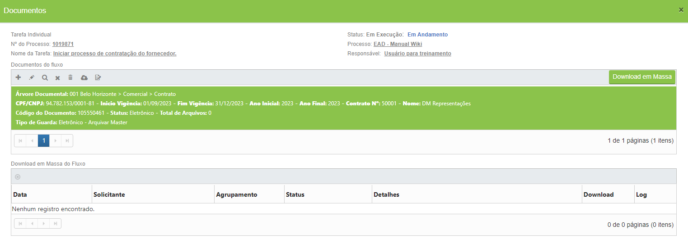<figcaption>
Clique na imagem para ampliar.
</figcaption></figure>

1. **Informações sobre a tarefa:** Tipo, nome e status da tarefa, número do processo e responsável pela execução.
2. **Ícones de ação:** Para habilitar todos os ícones é necessário selecionar um dos registros exibidos no campo “Documentos do fluxo”.

-> _Adicionar:_ Clicando neste ícone será possível cadastrar ou associar um documento ao fluxo.

-> _Editar:_ Utilizado para editar o registro selecionado.

-> _Visualizar:_ Utilizado para visualizar o registro selecionado.

* Aba Dados Cadastrais: Aqui são exibidas as informações e metadados do registro

<figure>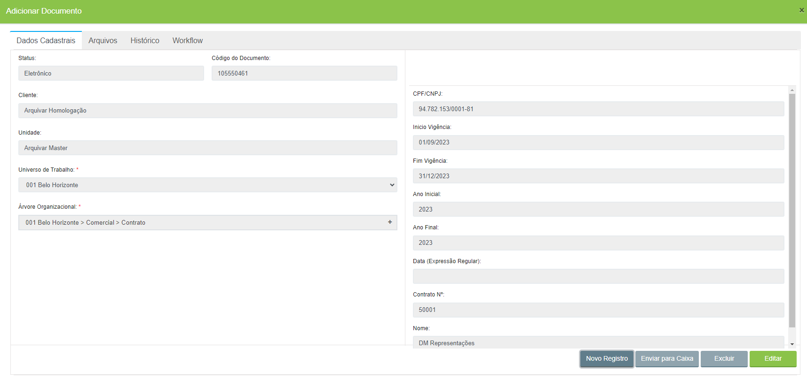<figcaption>
Clique na imagem para ampliar.
</figcaption></figure>

* Aba Arquivos: Informações sobre cada um dos documentos que compõem o registro.

<figure>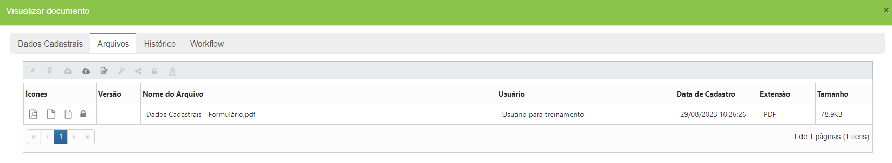<figcaption>
Clique na imagem para ampliar.
</figcaption></figure>

* Aba Histórico: Caso o documento tenha sido solicitado fisicamente, nesta tela será mostrado o histórico das solicitações e informações sobre o recebimento.

<figure>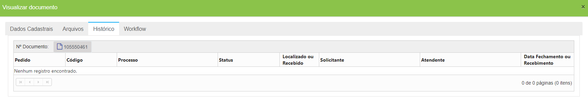<figcaption>
Clique na imagem para ampliar.
</figcaption></figure>

* Aba Workflow: Informações sobre o fluxo ao qual o registro está associado. Nesta tela é possível ativar um novo fluxo a partir do registro, desassociar o registro do fluxo, visualizar o desenho do fluxo, verificar os comentários feitos no fluxo, visualizar os anexos do fluxo e visualizar o modelo PDF se existir algum associado ao fluxo.

<figure>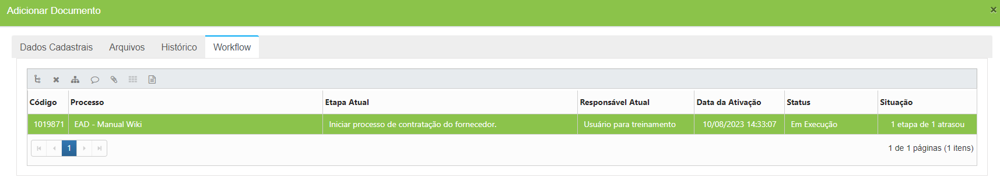<figcaption>
Clique na imagem para ampliar.
</figcaption></figure>

-> _Desassociar:_ Utilizado para desvincular o registro selecionado do fluxo. O documento continua existindo no sistema mas não terá mais relação com o fluxo.

-> _Excluir:_ Clicando neste ícone o registro selecionado será excluído do sistema.

-> _Upload de arquivos:_ Utilizado para fazer o upload de novo arquivo para o registro selecionado. Um registro pode ser composto por mais de um documento.

-> _Assinar:_ Utilizado para assinar os documentos do fluxo. O usuário pode escolher entre assinar todos os documentos apresentados ou assinar apenas os que estiverem selecionados em verde no grid.


<mark style="color:orange;">**Para inserir uma nova versão de um documento já cadastrado, selecione o documento e clique no ícone de upload. O sistema preencherá o nome e a versão do arquivo automaticamente, por entender que se trata de um upload de uma nova versão do arquivo selecionado, mas o usuário poderá editar o nome e número da versão se desejar.**</mark>


3. **Download em Massa:** Clicando nesse botão será possível solicitar ao sistema que consolide todos os documentos associados ao fluxo e realizar o download de todos de uma única vez. O usuário pode também selecionar apenas os itens que deseja incluir no download em massa. Será necessário que o usuário escolha o formato do arquivo que será baixado (PDF ou Arquivo ZIP), dê um nome ao arquivo e informe se deseja incluir capas separadoras para diferenciar os documentos (caso tenha sido escolhida a opção de arquivo em PDF). Depois de solicitar, o usuário deverá verificar no campo “Download em Massa do Fluxo” se o arquivo estará disponível ou se houve alguma falha no processamento.

<figure>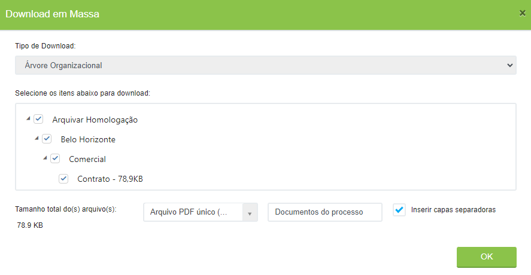<figcaption>
Clique na imagem para ampliar.
</figcaption></figure>

3. **Documentos do fluxo:** Neste campo são exibidos todos os documentos associados ao fluxo cadastrados no sistema. São mostradas as informações e metadados dos documentos.

-> _Download:_ Clicando no ícone “Download” será possível ver e baixar cada um dos documentos que compõem o registro separadamente.

-> _Editar:_ Clicando no ícone “Editar” será possível editar as informações de indexação do documento com ao mesmo tempo em que se visualiza a imagem.

<figure>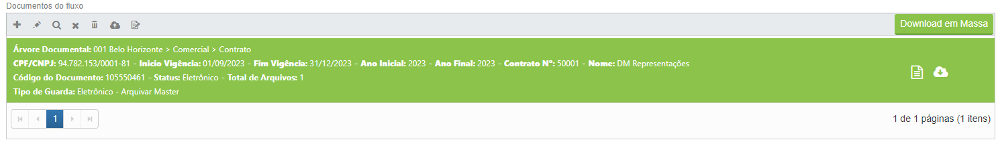<figcaption>
Clique na imagem para ampliar.
</figcaption></figure>


<mark style="color:orange;">**Os ícones “Download” e “Editar” só são exibidos caso haja imagens (JPEG, PNG etc.) compondo o registro.**</mark>


5. **Download em Massa do Fluxo:** Neste campo são exibidos todos os downloads em massa solicitados durante o fluxo. É mostrada a data de solicitação, o nome do solicitante, o agrupamento realizado, o status e os detalhes. Se o arquivo estiver disponível para download, será exibida uma seta no ícone da coluna Download. Se houver tido algum erro no processamento do arquivo, a seta será exibida no ícone da coluna Log.

<figure>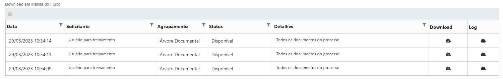<figcaption>
Clique na imagem para ampliar.
</figcaption></figure>

### 5. Anexos

Ao clicar neste ícone é aberta a tela para realizar o upload do documento/imagem.

#### Tela de Anexos

<figure><figcaption>
Clique na imagem para ampliar.
</figcaption></figure>

1. **Aba Anexos:** São os documentos/imagens tramitados durante a execução do fluxo no sistema e existentes no registro. Além de exibir as informações sobre os anexos associados ao fluxo, é possível verificar se o documento foi ou não compartilhado com usuários externos (se não tiver sido o ícone de cadeado será exibido). Na tela estão disponíveis os ícones:

<table><thead><tr><th width="150.60003662109375">Ícone</th><th width="235">Ação</th><th width="95.5999755859375">Tipo</th><th>Detalhes</th></tr></thead><tbody><tr><td>Editar</td><td>Utilizado para editar o nome do anexo e numerar a sua versão.</td><td>Unitária</td><td>Disponível apenas quando um único arquivo estiver selecionado.</td></tr><tr><td>Excluir</td><td>Exclui um ou mais arquivos</td><td>Em lote</td><td>Pode ser usada com um ou vários arquivos.</td></tr><tr><td>Assinar</td><td>Utilizado para assinar os documentos do fluxo.</td><td>Em lote</td><td>Pode ser usada com um ou vários arquivos.</td></tr><tr><td>Compartilhar</td><td>Compartilha o arquivo do tipo “Documento”</td><td>Em lote</td><td>Ação disponível somente a arquivos de Documento não compartilhados.</td></tr><tr><td>Descompartilhar</td><td>Cancela o compartilhamento de um arquivo “Documento”</td><td>Em lote</td><td>Ação disponível somente a arquivos de Documento já compartilhados.</td></tr><tr><td>Upload</td><td>Faz upload de arquivos diretamente para o fluxo</td><td>N/A</td><td>Todos os arquivos enviados por aqui serão identificados como “Anexo”.</td></tr><tr><td>Download</td><td>Permite baixar arquivos selecionados.</td><td>Em lote</td><td>
Quando selecionado somente um arquivo = a aplicação o abre em uma nova aba do navegador.

Quando selecionado vários arquivos = a aplicação agenda um download em massa, para que seja gerado um ZIP com todos os arquivos.
</td></tr><tr><td>Capturar Certificado</td><td>Quando se faz o upload de um documento que esteja assinado digitalmente, será possível extrair e visualizar as informações sobre o certificado digital utilizado para a assinatura. Quando o documento for assinado no próprio GED o certificado de assinaturas ficará disponível automaticamente.</td><td>Em lote</td><td>Apenas para arquivos do tipo Anexo e Documento.</td></tr></tbody></table>

2. **Aba Download em Massa do fluxo:** Opção para baixar todos os documentos do fluxo em uma única ação. são exibidos todos os downloads em massa solicitados durante o fluxo. É mostrada a data de solicitação, o nome do solicitante, o agrupamento realizado, o status e os detalhes. Se o arquivo estiver disponível para download, será exibida uma seta no ícone da coluna Download. Se houver tido algum erro no processamento do arquivo, a seta será exibida no ícone da coluna Log.

<figure><figcaption>
Clique na imagem para ampliar.
</figcaption></figure>

### 6. Formulário

Ao clicar neste ícone é apresentado ao usuário o formulário para preenchimento dos dados. O mesmo formulário pode aparecer em várias tarefas do fluxo para preenchimento de informações específicas de cada uma das tarefas. O formulário mostrado aqui deve ser criado e configurado anteriormente no menu [Workflow > Formulário.](../../formulario.md)

<figure>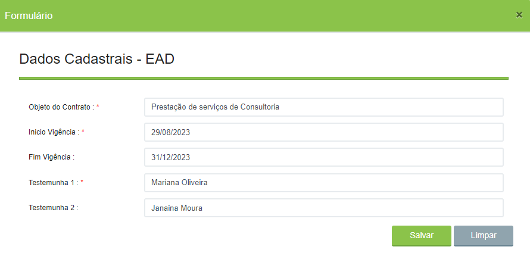<figcaption>
Clique na imagem para ampliar.
</figcaption></figure>

### 7. Modelo de Documento

Este ícone apresenta o modelo de documento PDF editável. Quando o usuário clicar neste ícone, o arquivo do modelo de documento será aberto em uma nova aba conforme a configuração do desenho para a tarefa em questão realizado em [Workflow > Desenho do Fluxo > Aba Dados Gerais > Campo Modelo de Arquivo PDF com campos](../../desenho-do-fluxo/aba-dados-gerais.md#configuracoes-da-aba-dados-gerais). Ou seja, o arquivo será aberto para visualização, edição e/ou assinatura.

<figure>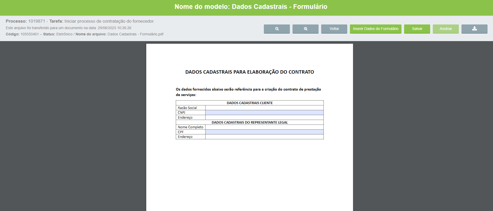<figcaption>
Clique na imagem para ampliar.
</figcaption></figure>

Ao abrir o documento, os <mark style="color:red;">campos de preenchimento obrigatórios</mark> serão apresentados com indicação do <mark style="color:red;">campo em vermelho</mark> e os c<mark style="color:green;">ampos de preenchimento não obrigatórios</mark> serão apresentados com indicação <mark style="color:green;">em verde</mark>:

<figure><figcaption>
Clique na imagem para ampliar.
</figcaption></figure>

Se tratado de tarefa externa, são exibidos os campos "**Tela cheia**" e "**Dividir Tela**". Quando o usuário clica no arquivo o modelo de documento é aberto dividindo a tela com a tarefa.

<figure><figcaption>
Clique na imagem para ampliar.
</figcaption></figure>

Para voltar a dividir a tela com a tarefa, clique no botão "**Dividir Tela**".

<figure><figcaption>
Clique na imagem para ampliar.
</figcaption></figure>

### 8. Processo ArqSign

Este ícone exibe o **status do Processo ArqSign** associado à tarefa.

Sua função é apresentar o andamento do fluxo de assinaturas e permitir que o usuário execute ações relacionadas ao processo, como visualizar documentos, reenviar ou cancelar a solicitação de assinatura.

Ao clicar no ícone, será exibida uma nova janela com os seguintes elementos:

#### **Identificação do processo**

* Exibe o **grupo de informações sobre o fluxo de trabalho e sobre a tarefa**, repetindo os dados já apresentados na tela **Minhas Atividades**;

<figure><figcaption></figcaption></figure>

#### **Detalhamento do Processo de Assinaturas**

Na parte inferior da tela será exibido o detalhamento do(s) fluxo(s) de assinatura vinculados ao processo. Cada fluxo será apresentado com seu respectivo nome, status atual e informações associadas. Caso existam múltiplos fluxos dentro do mesmo processo, todos serão listados nesta área, organizados individualmente.

O status do processo pode se apresentar em três formatos distintos:

**1. Assinado**

* O status será exibido em **verde**.
* Um **link de visualização** será disponibilizado; ao clicar, o usuário poderá visualizar os documentos do processo. Selecionando o documento desejado, será redirecionado à plataforma **ArqSign**, onde poderá visualizá-lo em detalhe.
* Serão exibidas as **datas de envio** e de **conclusão** do processo.
* Abaixo, constará uma **lista de signatários**, com os seguintes dados:
  * Papel de cada signatário no processo;
  * Nome completo;
  * Endereço de e-mail.

<figure><figcaption>
Clique na imagem para ampliar
</figcaption></figure>

#### 2. Aguardando

* O status será exibido em **laranja**.
* Será exibida a **data de envio** do processo.
* A lista de signatários será apresentada com as seguintes marcações:
  * Em **verde**, os usuários que já realizaram a assinatura;
  * Em **laranja**, os que ainda **não assinaram**.
* Serão exibidos dois botões de ação:
  1. **Editar e Reenviar Processo ArqSign**\
     Permite editar os dados de cada signatário (nome, contato e configurações de recebimento de código de segurança, se aplicável) e reenviar o processo.
  2. **Cancelar Processo ArqSign**\
     Ao clicar neste botão, uma **janela de confirmação** será exibida antes da efetivação do cancelamento.

<figure><figcaption>
Clique na imagem para ampliar
</figcaption></figure>

#### 3. Cancelado

* O status será exibido em **vermelho**.
* Serão apresentadas a **data de envio** e a **data de cancelamento** do processo.
* A lista de signatários será apresentada com os seguintes destaques:
  * Em **verde**, os que assinaram;
  * Em **laranja**, os que não assinaram;
  * Em **vermelho**, os que **recusaram a assinatura**.
* Para os signatários que se recusaram a assinar, será exibido um ícone informativo (ícone vermelho com a letra “i”) contendo o **motivo da recusa**.
* Importante: **caso qualquer signatário se recuse a assinar**, todo o processo será automaticamente **cancelado**, independentemente do número de participantes.

<figure><figcaption>
Clique na imagem para ampliar
</figcaption></figure>

### 9. Obrigatoriedades da tarefa

Este ícone funciona como um lembrete ao usuário e vai variar conforme a tarefa em execução. Sua função é informar quais são as ações necessárias para conclusão da etapa. Para isso, basta posicionar o cursor do mouse sobre o ícone e a lista de obrigatoriedades é apresentada. O ícone "Obrigatoriedade da Tarefa" sempre lista quais outros ícones serão usados na execução da tarefa e a lista irá variar de acordo com cada tarefa.

Com objetivo de facilitar a visualização das obrigatoriedades, as já cumpridas serão precedidas por um ícone verde de check (✅)e as que ainda estão por cumprir, por ícone vermelho com um x (❌).

Para entender como executar cada uma das obrigatoriedades possíveis, [veja como executar um fluxo.](executando-um-fluxo.md)

<figure><figcaption></figcaption></figure> <figure><figcaption></figcaption></figure>

