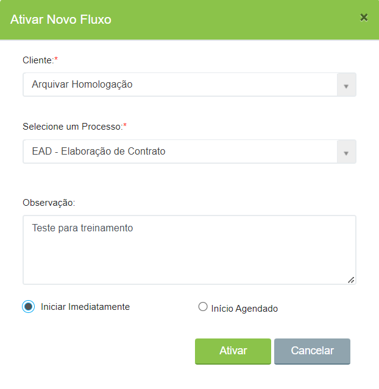
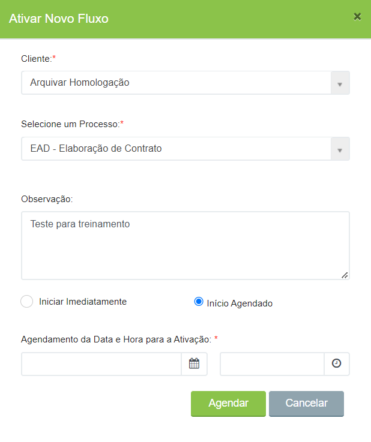

# ➡️ Executando um fluxo - Exibição Listagem

## Visualização Listagem

No modo de exibição 'Listagem', os fluxos sob responsabilidade do usuário logado são exibidos de forma simplificada, em uma lista que destaca as informações mais importantes.

Esse modo de visualização pode ser definido como padrão no [perfil do usuário](../../../administracao/usuarios.md#aba-perfil), garantindo que, ao acessar a aplicação, a tela de Minhas Atividades seja sempre apresentada nessa configuração.

<figure><figcaption>
Clique na imagem para ampliar.
</figcaption></figure>

A tela será exibida conforme a imagem acima, apresentando as seguintes informações:

#### **Barra de Filtro**

É possível realizar a busca de tarefas utilizando a barra de filtro, que faz a busca de tarefas do usuário utilizando palavras-chave.

<figure><figcaption>
Clique na imagem para ampliar.
</figcaption></figure>

#### **Botão Ativar Novo Fluxo**

Botão para a ativação de novos fluxos.

<figure><figcaption>
Clique na imagem para ampliar.
</figcaption></figure>

#### **Gráfico**

No topo da tela será exibido um gráfico que permite ao usuário visualizar quantos fluxos estão em atraso, com base no total de fluxos sob sua responsabilidade para execução.

<figure><figcaption>
Clique na imagem para ampliar.
</figcaption></figure>

#### Detalhamento das Colunas

<figure><figcaption>
Clique na imagem para ampliar.
</figcaption></figure>

**Coluna Nº:** Exibe o número/código do fluxo ou número do processo.

**Coluna Processo:** Exibe o nome do fluxo definido no desenho do processo.

**Coluna Tarefa:** Exibe o nome definido para a tarefa configurada no desenho do fluxo. Ao posicionar o mouse sobre o nome da tarefa, é exibido um _Tooltip_ indicando a situação do fluxo, o status, a classificação (Individual ou Grupo) e as obrigatoriedades com os respectivos botões de avanço.\
Cada tarefa também possui um ícone que indica o andamento da atividade do usuário: verde para "Em dia", vermelho para "Em atraso" e azul para "atividades delegadas", "aguardando ciência" de outro usuário.

**Coluna Início Tarefa:** Exibe a data/hora de chegada da tarefa para execução do responsável.

**Coluna Concluir Até:** Exibe a previsão de término da atividade, conforme o prazo definido na configuração da tarefa. As etapas de acompanhamento do processo de assinatura via plataforma ArqSIGN não possuem prazo de conclusão e, por esse motivo, são sempre exibidas no topo da lista.

**Coluna Detalhes:** Esta coluna apresenta apenas um ícone. Ao clicar nele, o usuário visualiza uma tela com as informações do fluxo, incluindo os 'Dados Gerais do Processo', a 'Ação da Tarefa Anterior', o nome do responsável que executou a tarefa anterior, o último comentário, os campos do formulário configurados para exibição na tarefa e os 'Dados da Tarefa Atual'.\
Além disso, a tela também exibe a 'Observação do Fluxo', quando adicionada no momento da ativação, e as 'Instruções para a Tarefa', correspondentes às informações inseridas no campo 'Descrição da Etapa' durante a configuração da tarefa no desenho do fluxo.

**Coluna Ações:** Nesta coluna são exibidos dois botões: o **'Abrir'** e o **'v'**.\
Ao clicar em **'Abrir'**, uma nova aba é aberta para que o usuário execute as ações da tarefa, como cadastrar ou associar documentos, incluir anexos ao fluxo, preencher formulários, adicionar  comentários, entre outras atividades.\
Ao clicar no botão **'v'**, são exibidos os botões de avanço da tarefa, além das ações 'Abrir Tarefa', 'Delegar Tarefa', 'Cancelar Fluxo', 'Voltar para Tarefa Anterior' e 'Visualizar Fluxograma'.

## Ativar Novo Fluxo

1\. Para ativar um novo fluxo, no menu [Workflow > Atividades > Aba Minhas Atividades](./) clique no botão “Ativar Novo Fluxo”.

2\. Informe o nome da empresa no campo “Cliente”.

3\. No campo “Selecione um Processo”, selecione o fluxo que deseja ativar.

4\. Se houverem observações, informe-as no campo “Observação”. Caso contrário, deixe o campo em branco. As observações inseridas aqui serão exibidas na tela de execução das tarefas.

5\. Selecione se o fluxo terá início imediato (ativar o fluxo no ato) ou se terá o início agendado (com data estabelecida futura).

<figure><figcaption>
Clique na imagem para ampliar.
</figcaption></figure>

6. Clique em “Ativar”. Caso seja um fluxo com início agendado, informe a data e hora para ativação e clique em “Agendar”.

<figure><figcaption>
Clique na imagem para ampliar.
</figcaption></figure>


<mark style="color:red;">**Desenhos de fluxo que possuírem o parâmetro "Bloquear a ativação manual deste fluxo sem um documento associado" selecionado (aba Desenho do Fluxo > Aba Dados Gerais), não poderão ser ativados manualmente pelo botão Ativar Novo Fluxo, da aba Minhas Atividades, porque não poderão ser ativados sem que haja um documento selecionado para associação ao fluxo.**</mark>


***

### Executando o Fluxo

Para executar uma tarefa no modo 'Listagem' das atividades, basta clicar no botão **"Abrir"** correspondente a cada processo/fluxo.

<figure><figcaption>
Clique na imagem para ampliar.
</figcaption></figure>

Ou, na coluna **Detalhes**, clicar no ícone correspondente a cada processo/fluxo e, em seguida, acionar o botão **"Abrir"** na tela.:

<figure><figcaption>
Clique na imagem para ampliar.
</figcaption></figure>

Ao abrir o fluxo, será exibida a seguinte tela:

<figure><figcaption></figcaption></figure>

1. **Título:** Exibe o nome do Fluxo.
2. **Fechar:** Apenas fecha a tela, retornando para a tela inicial com a lista de atividades pendentes.
3. **Outras ações:** Exibe uma lista de outros caminhos possíveis no fluxo, tais como:

• **Delegar Tarefa:** Permite o envio da Tarefa para outro usuário apenas para conhecimento da demanda ou delegando totalmente.

<figure><figcaption>
Clique na imagem para ampliar.
</figcaption></figure>

• **Cancelar Fluxo:** Permite cancelar a execução do Processo/Fluxo totalmente.

<figure><figcaption>
Clique na imagem para ampliar.
</figcaption></figure>

• **Visualizar Fluxograma:** Permite que o usuário visualize o Desenho do Processo/Fluxo.

<figure><figcaption>
Clique na imagem para ampliar.
</figcaption></figure>

4. **Botões de Avanço:** Exibe para o usuário os caminhos disponíveis para tratamento do fluxo.

<figure><figcaption>
Clique na imagem para ampliar.
</figcaption></figure>


<mark style="color:green;">No lado direito dos títulos de cada área há um botão "v" para expandir ou ocultar as informações de uma área específica. Porém, o usuário não precisa clicar exatamente neste botão: toda a linha do título possui a mesma funcionalidade. Basta posicionar o mouse sobre a linha do título e clicar para expandir ou ocultar as informações da área.</mark>


5. **Dados Gerais do Processo:** Exibe as informações do processo de trabalho, incluindo Ação da tarefa anterior e responsável.
6. **Dados da Tarefa Atual:** Exibe as informações da etapa atual.
7. **Instrução para tarefa:** Exibe as orientações para execução da tarefa atual, quando se aplica.
8. **Legenda das Cores:** Exibe a classificação de cores para ações, sendo ações obrigatórias pendentes (vermelho), ações concluídas (verde) e ações opcionais (azul).

<figure><figcaption>
Clique na imagem para ampliar.
</figcaption></figure>


<mark style="color:green;">No lado direito dos títulos de cada área há um botão "v" para expandir ou ocultar as informações de uma área específica. Porém, o usuário não precisa clicar exatamente neste botão: toda a linha do título possui a mesma funcionalidade. Basta posicionar o mouse sobre a linha do título e clicar para expandir ou ocultar as informações da área.</mark>


9\. **Áreas:** São exibidas as áreas configuradas para o processo no desenho do fluxo, considerando obrigatoriedades e a definição da ordem em que elas devem ser exibidas para o usuário.


O nome exibido para a Área, é o nome definido pelo usuário no momento da configuração do layout na tarefa.


<figure><figcaption>
Clique na imagem para ampliar.
</figcaption></figure>

Ao posicionar o mouse sobre o ícone de "Ação obrigatória pendente" em cada área, é exibida a lista de pendências que deve ser executada pelo usuário, além dos botões de avanço para cada obrigatoriedade.

<figure><figcaption>
Clique na imagem para ampliar.
</figcaption></figure>

**Comentários:** As mensagens são exibidas em formato de chat, o que proporciona melhor visualização e exibição das mensagens incluídas pelos responsáveis de cada etapa.

**Processo ArqSIGN:** Sempre que o usuário abrir a tarefa para execução, essa área será exibida automaticamente aberta, facilitando o acompanhamento das assinaturas dos destinatários.

<figure><figcaption>
Clique na imagem para ampliar.
</figcaption></figure>

***
