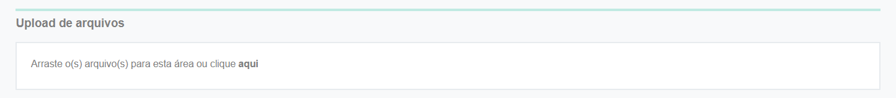

# ➡️ Executando um fluxo

## Ativar Novo Fluxo

1\. Para ativar um novo fluxo, no menu [Workflow > Atividades > Aba Minhas Atividades](./) clique no botão “Ativar Novo Fluxo”.&#x20;

2\. Informe o nome da empresa no campo “Cliente”.

3\. No campo “Selecione um Processo”, selecione o fluxo que deseja ativar.&#x20;

4\. Se houverem observações, informe-as no campo “Observação”. Caso contrário, deixe o campo em branco. As observações inseridas aqui serão exibidas na tela de execução das tarefas.&#x20;

5\. Selecione se o fluxo terá início imediato (ativar o fluxo no ato) ou se terá o início agendado (com data estabelecida futura).&#x20;

<figure><figcaption></figcaption></figure>

6. Clique em “Ativar”. Caso seja um fluxo com início agendado, informe a data e hora para ativação e clique em “Agendar”.

<figure><figcaption></figcaption></figure>


<mark style="color:red;">**Desenhos de fluxo que possuírem o parâmetro "Bloquear a ativação manual deste fluxo sem um documento associado" selecionado (aba Desenho do Fluxo > Aba Dados Gerais), não poderão ser ativados manualmente pelo botão Ativar Novo Fluxo, da aba Minhas Atividades, porque não poderão ser ativados sem que haja um documento selecionado para associação ao fluxo.**</mark>


***

## Tipos de obrigatoriedades

As obrigatoriedades das tarefas são ações que devem ser realizadas para a conclusão de uma tarefa. Existem as obrigatoriedades que devem ser cumpridas pelos usuários internos, ou seja, aqueles que estão autenticados no sistema, e as obrigatoriedades das tarefas externas, que são ações que devem ser executadas por usuários que não estarão autenticados no sistema ArqGED.

***

## Tarefa interna - Obrigatoriedades


<mark style="color:orange;">**A maior parte das tarefas não apresentará todas as obrigatoriedades. Para verificar quais são as obrigatoriedades da tarefa exigidas, clique sobre o ícone “Obrigatoriedades da tarefa” durante a execução do fluxo.**</mark>


<figure><figcaption></figcaption></figure>

### 1. Anexo no Fluxo

1\. Clique no ícone "Anexos" para adicionar um anexo.&#x20;

<figure><figcaption></figcaption></figure>

2\. Na aba "Anexos do Fluxo", clique no ícone de upload.&#x20;

<figure><figcaption>
Clique na imagem para ampliar.
</figcaption></figure>

3\. No campo “Arquivos dos registros” selecione o arquivo que deseja anexar.&#x20;

4\. O arquivo selecionado será exibido no campo “Arquivos que serão associados ao registro”. &#x20;

5\. O usuário pode excluir o arquivo ou visualizá-lo. Pode também renomear e informar o número da versão do arquivo. O sistema preencherá o nome e a versão automaticamente quando entender que se trata de uma nova versão de um arquivo selecionado anteriormente, mas o usuário poderá editar o nome e número da versão se desejar.&#x20;

6\. Para concluir clique em “Upload”.&#x20;

<figure><figcaption>
Clique na imagem para ampliar.
</figcaption></figure>

### 2. Assinar Anexo do Fluxo

1\. Clique no ícone "Anexos".&#x20;

<figure><figcaption></figcaption></figure>

2\. Na aba "Anexos do Fluxo", clique no ícone “Assinar”. É possível realizar a assinatura em lote clicando no ícone de "Assinar". Depois, selecione entre "Assinar os arquivos selecionados no GRID" ou "Assinar todos os arquivos do GRID (Limitado a 300)".&#x20;


<mark style="color:orange;">**Só é possível assinar em lote arquivos que estejam no mesmo fluxo.**</mark> &#x20;


<figure><figcaption>
Clique na imagem para ampliar.
</figcaption></figure>

3\. Selecione o certificado digital que será utilizado para a assinatura e clique em “Assinar”.&#x20;

<figure><figcaption></figcaption></figure>

4\. Será exibida a tela de status da conclusão das assinaturas. Caso o documento já tenha sido assinado anteriormente, será exibida uma mensagem em vermelho informando que o documento já está assinado. Para concluir a assinatura, clique em “Fechar”.&#x20;

<figure><figcaption></figcaption></figure>


<mark style="color:orange;">**Só será possível realizar a assinatura via Certificado Digital se o aplicativo ArqClient estiver devidamente instalado e configurado no computador do usuário.**</mark>&#x20;


### 3. Assinar Anexos enviados pelo responsável da tarefa


<mark style="color:orange;">**Essa obrigatoriedade refere-se à assinatura de anexos enviados pelo responsável pela tarefa.**</mark>


1\. Clique no ícone "Anexos".&#x20;

<figure><figcaption></figcaption></figure>

2\. Na aba "Anexos do Fluxo", clique no ícone “Assinar”. É possível realizar a assinatura em lote clicando no ícone de "Assinar". Depois, selecione entre "Assinar os arquivos selecionados no GRID" ou "Assinar todos os arquivos do GRID (Limitado a 300)".&#x20;


<mark style="color:orange;">**Só é possível assinar em lote arquivos que estejam no mesmo fluxo.**</mark> &#x20;


<figure><figcaption>
Clique na imagem para ampliar.
</figcaption></figure>

3\. Selecione o certificado digital que será utilizado para a assinatura.&#x20;

<figure><figcaption></figcaption></figure>

4\. Será exibida a tela de status da conclusão das assinaturas. Caso o documento já tenha sido assinado anteriormente, será exibida uma mensagem em vermelho informando que o documento já está assinado. Para concluir a assinatura, clique em “Fechar”.&#x20;

<figure><figcaption></figcaption></figure>


<mark style="color:orange;">**Só será possível realizar a assinatura via Certificado Digital se o aplicativo ArqClient estiver devidamente instalado e configurado no computador do usuário.**</mark>


### 4. Selecionar Anexo do Fluxo para Assinatura Externa

1\. Clique no ícone “Anexos”.&#x20;

<figure><figcaption></figcaption></figure>

2\. Na aba “Anexos do Fluxo” selecione o anexo do fluxo que deseja disponibilizar para assinatura externa marcando o checkbox no campo "Assinar".&#x20;

<figure><figcaption>
Clique na imagem para ampliar.
</figcaption></figure>

3\. Feche a janela e retorne para a tela da tarefa.&#x20;

4\. O responsável pela assinatura externa receberá por e-mail um link para interagir com o documento, podendo visualizar, fazer comentários, assinar ou solicitar alterações.&#x20;

### 5. Cadastrar ou Associar Documento

1\. Para cadastrar um documento no fluxo, clique no ícone “Documentos”.&#x20;

<figure><figcaption></figcaption></figure>

2\. Clique no ícone “Adicionar” e selecione a opção “Cadastrar”.&#x20;

<figure><figcaption>
Clique na imagem para ampliar.
</figcaption></figure>

3\. Na tela “Adicionar Documento” selecione o tipo de guarda do documento: “Eletrônico”, “Guarda Interna” ou “Guarda Terceirizada”.&#x20;

<figure><figcaption></figcaption></figure>

4\.  Selecione a “Unidade”, se necessário, o “Universo de Trabalho” e a “Árvore Organizacional”.&#x20;

5\. Na tela à direita preencha os campos solicitados ou clique em “Inserir Dados do Formulário” para que os campos sejam preenchidos automaticamente com os dados do formulário cadastrado.&#x20;

6\. Clique em “Salvar” para finalizar.&#x20;

<figure><figcaption>
Clique na imagem para ampliar.
</figcaption></figure>

7\. Caso deseje alterar algum campo, clique em “Editar”.&#x20;

<figure><figcaption></figcaption></figure>

8\. Para associar um documento já cadastrado anteriormente ao fluxo, clique no ícone “Documentos”.&#x20;

9\. Clique no ícone “Adicionar” e selecione a opção “Associar”.&#x20;

<figure><figcaption></figcaption></figure>

10\. Informe o código do registro que deseja associar e clique em “Concluir”. O código do registro de um documento pode ser visualizado fazendo a busca do documento por meio do menu Documento > Explorar.&#x20;

<figure><figcaption>
Clique na imagem para ampliar.
</figcaption></figure>

### 6. Transferir Anexo para Registro

1\. Clique no ícone “Documentos”.&#x20;

<figure><figcaption></figcaption></figure>

2\. Clique no ícone “Adicionar” e selecione a opção “Cadastrar”.&#x20;

<figure><figcaption>
Clique na imagem para ampliar.
</figcaption></figure>

3\. Selecione os anexos que deseja que sejam armazenados como registro de documento marcando o checkbox ao lado do nome do documento.&#x20;

4\. Clique em “Salvar”.&#x20;

<figure><figcaption>
Clique na imagem para ampliar.
</figcaption></figure>

5\. Também é possível realizar a transferência pela tela de upload de arquivos. Para isso, na tela “Documentos” clique no ícone “Upload”.&#x20;

6\. Selecione os anexos que deseja que sejam armazenados como registro de documento marcando o checkbox ao lado do nome do documento.&#x20;

7\. Clique em “Transferir anexo para registro”.&#x20;

<figure><figcaption>
Clique na imagem para ampliar.
</figcaption></figure>

### 7. Transferir Modelo para Registro

1\. Clique no ícone “Documentos”.&#x20;

<figure><figcaption></figcaption></figure>

2\. Clique no ícone “Adicionar” e selecione a opção “Cadastrar”.&#x20;

<figure><figcaption>
Clique na imagem para ampliar.
</figcaption></figure>

3\. Selecione o modelo que deseja que seja armazenado como registro de documento marcando o checkbox ao lado do nome do documento.&#x20;

4\. Clique em “Salvar”.&#x20;

### 8. Upload de Arquivo para o Registro

1\. Clique no ícone "Documentos".&#x20;

<figure><figcaption></figcaption></figure>

2\. Selecione o registro desejado e clique no ícone "Visualizar".&#x20;

<figure><figcaption>
Clique na imagem para ampliar.
</figcaption></figure>

3\. Na aba "Arquivos" clique no ícone de upload.&#x20;

<figure><figcaption>
Clique na imagem para ampliar.
</figcaption></figure>

4\. Selecione ou arraste o arquivo que deseja incluir e clique em “Upload”. Feche a janela de upload de arquivos e a janela de visualizar documento para retornar à tarefa.&#x20;

<figure><figcaption>
Clique na imagem para ampliar.
</figcaption></figure>

### 9. Assinar Anexo do Registro

1\. Clique no ícone “Anexos”.&#x20;

<figure><figcaption></figcaption></figure>

2\. Na aba "Anexos do Fluxo", clique no ícone “Assinar”. É possível realizar a assinatura em lote clicando no ícone de "Assinar". Depois, selecione entre "Assinar os arquivos selecionados no GRID" ou "Assinar todos os arquivos do GRID (Limitado a 300)".&#x20;


<mark style="color:orange;">**Só é possível assinar em lote arquivos que estejam no mesmo fluxo.**</mark> &#x20;


<figure><figcaption></figcaption></figure>

3\. Selecione o certificado digital que será utilizado para a assinatura.&#x20;

<figure><figcaption></figcaption></figure>

4\. Será exibida a tela de status da conclusão das assinaturas. Caso o documento já tenha sido assinado anteriormente, será exibida uma mensagem em vermelho informando que o documento já está assinado. Para concluir a assinatura, clique em “Fechar”.&#x20;

<figure><figcaption></figcaption></figure>


<mark style="color:orange;">**Só será possível realizar a assinatura via Certificado Digital se o aplicativo ArqClient estiver devidamente instalado e configurado no computador do usuário.**</mark>


### 10. Compartilhar Anexo do Documento

1\. Para compartilhar um documento com usuários externos ao sistema, ou seja, que não serão autenticados no GED, clique no ícone “Anexos”. &#x20;

<figure><figcaption></figcaption></figure>

2\. Na aba “Anexos do Documento” selecione o documento que será compartilhado e clique no ícone “Compartilhar”.&#x20;

<figure><figcaption>
Clique na imagem para ampliar.
</figcaption></figure>

3\. Defina se o compartilhamento será por prazo indeterminado ou determinado. Se for determinado, informe a data final de validade (até quando o link de compartilhamento ficará disponível) e clique em Compartilhar.&#x20;

<figure><figcaption>
Clique na imagem para ampliar.
</figcaption></figure>

4\. No campo “URL para Acesso Externo” será gerado um link para compartilhamento com os usuários externos.&#x20;

5\. No campo de texto é possível inserir e-mails para que o link seja enviado, inserindo o e-mail e clicando em “Enviar”.&#x20;

6\. Para alterar a data de validade do link de compartilhamento, volte à essa tela, clique em “Editar” e altere a data.&#x20;

7\. Para interromper o compartilhamento do documento basta voltar a essa tela e clicar em “Descompartilhar”.  &#x20;

<figure><figcaption>
Clique na imagem para ampliar.
</figcaption></figure>

### 11. Selecionar Anexo do Documento para Assinatura Externa

1\. Clique no ícone "Anexos".&#x20;

<figure><figcaption></figcaption></figure>

2\. Na aba "Anexos do Documento" selecione na coluna “Assinar” do documento que deve ser assinado.&#x20;

<figure><figcaption>
Clique na imagem para ampliar.
</figcaption></figure>

3\. Feche a janela e retorne para a tela da tarefa.&#x20;

4\. O responsável pela assinatura externa receberá por e-mail um link para interagir com o documento, podendo visualizar, fazer comentários, assinar ou solicitar alterações.&#x20;

### 12. Formulário

1\. Clique no ícone “Formulário”.&#x20;

<figure><figcaption></figcaption></figure>

2\. Preencha os campos apresentados. É importante ficar atento aos campos de preenchimento obrigatório, sinalizados com \*. Sem o preenchimento destes campos a tarefa não poderá ser concluída. Também é importante observar os campos considerados "chave". Nestes casos, ao informar os dados do campo e clicar em "Tab", outros campos são preenchidos automaticamente por busca das informações em banco de dados previamente inserido no ArqGED. &#x20;

3\. Adicionadas as informações, clique em "Salvar" e feche o formulário.&#x20;

<figure><figcaption></figcaption></figure>

### 13. Preencher Modelo

1\. Clique no ícone “Modelo PDF”.&#x20;

<figure><figcaption></figcaption></figure>

2\. Será apresentado o modelo de PDF que possui campos de preenchimento editáveis cadastrado anteriormente no menu [Workflow > Desenho do Fluxo > Aba Dados Gerais > Campo Modelo de Arquivo PDF com campos](../../desenho-do-fluxo/aba-dados-gerais.md#configuracoes-da-aba-dados-gerais).  &#x20;

3\. Em alguns casos será permitido ao usuário “Inserir Dados do Formulário”, ou seja, permitir que o sistema preencha o modelo PDF com os dados inseridos no formulário do fluxo.&#x20;

5\. Depois de preencher todos os campos necessários clique em “Salvar”. É possível também fazer o download do documento clicando no ícone de download.&#x20;

<figure><figcaption>
Clique na imagem para ampliar.
</figcaption></figure>

### 14. Assinar Modelo

1\. Clique no ícone “Modelo PDF”.&#x20;

<figure><figcaption></figcaption></figure>

2\. Será apresentado o modelo de PDF que possui campos de preenchimento editáveis cadastrado anteriormente no menu [Workflow > Desenho do Fluxo > Aba Dados Gerais > Campo Modelo de Arquivo PDF com campos](../../desenho-do-fluxo/aba-dados-gerais.md#configuracoes-da-aba-dados-gerais). Clique em “Assinar”.&#x20;

<figure><figcaption>
Clique na imagem para ampliar.
</figcaption></figure>

3\. Selecione o certificado digital que será usado para assinatura.&#x20;


<mark style="color:orange;">**Só será possível realizar a assinatura via Certificado Digital se o aplicativo ArqClient estiver devidamente instalado e configurado no computador do usuário.**</mark>&#x20;


4\. Depois de concluir a assinatura, clique em “Fechar”.&#x20;

### 15. Comentário

1\. Clique no ícone “Comentários”.&#x20;

2\. Ao clicar neste ícone será aberta a caixa de texto para que o usuário adicione a mensagem. Devem ser inseridas aqui informações que o executor da tarefa atual considere importantes que os usuários que executarão as próximas tarefas fiquem cientes. Depois de inserir o texto clique no ícone "Adicionar Comentário" e feche a janela.&#x20;


<mark style="color:orange;">**Depois de publicar o comentário o usuário tem 60 segundos para excluí-lo, caso necessário. Depois de fechar a janela do comentário ou de ultrapassar o tempo de 60 segundos não será possível excluir o comentário.**</mark>


<figure><figcaption>
Clique na imagem para ampliar.
</figcaption></figure>

### 16. Assinar Avanço

1\. A ação de assinar o avanço será solicitada quando for necessário, ao clicar no botão de avanço do fluxo, selecionar um certificado digital para aprovar o prosseguimento do fluxo. Para isso, selecione o certificado digital que será usado e clique em “Assinar”. &#x20;

2\. Informe a senha da assinatura.&#x20;


<mark style="color:orange;">**Só será possível realizar a assinatura via Certificado Digital se o aplicativo ArqClient estiver devidamente instalado e configurado no computador do usuário.**</mark>


***

## Tarefa externa - Obrigatoriedades

Uma tarefa externa é aquela que deve ser executada de forma externa ao sistema ArqGED, ou seja, o responsável por sua execução receberá por e-mail as instruções para cumprir a tarefa sem necessidade de estar autenticado no sistema.

<figure><figcaption>
Exemplo de e-mail de interação que usuário recebe ao ser designado para executar tarefa externa
</figcaption></figure>

Os nomes das obrigatoriedades serão exibidos de forma diferente da maneira apresentada no sistema para o usuário externo. Geralmente ao acessar o link recebido por e-mail para executar uma ação, será exibido um texto de instrução, com orientações sobre a execução das obrigatoriedades descritas de outra forma.

<figure><figcaption></figcaption></figure>

 

<figure><figcaption></figcaption></figure>

| Obrigatoriedade           | Orientação exibida para o usuário externo            |
| ------------------------- | ---------------------------------------------------- |
| Anexo do Fluxo            | Fazer upload de arquivos                             |
| Formulário                | Preencher campos do \[Nome do Formulário]            |
| Comentário                | Inserir comentários                                  |
| Preencher modelo          | Preencher Campos Obrigatórios do Modelo de Documento |
| Assinar Anexo do Fluxo    | Assinar                                              |
| Assinar Avanço            | Assinar                                              |
| Assinar Anexo do Registro | Assinar                                              |
| Assinar Anexos enviados   | Assinar                                              |
| Assinar modelo            | Assinar                                              |

### 1. Anexo do Fluxo

1\. Na tela de execução da tarefa (link recebido por e-mail) clique no campo “Upload de arquivos”.&#x20;

2\. Selecione o arquivo que deseja anexar ao fluxo.&#x20;

<figure><figcaption>
Clique na imagem para ampliar.
</figcaption></figure>

### 2. Formulário

1\.  Verifique os campos de preenchimento obrigatório e preencha com as informações solicitadas.&#x20;

<figure><figcaption>
Clique na imagem para ampliar.
</figcaption></figure>

2\. Se ao lado do nome do campo houver um ícone de chave, significa que aquele campo possui auto-complete, ou seja, ao preencher suas informações outros campos relacionados a ele serão preenchidos automaticamente. &#x20;

<figure><figcaption>
Clique na imagem para ampliar.
</figcaption></figure>

### 3. Comentário

1. No campo “Comentário” insira uma mensagem sobre a execução da tarefa.

<figure><figcaption>
Clique na imagem para ampliar.
</figcaption></figure>

### 4. Preencher modelo

1\. Se houver um modelo a ser preenchido, clique no documento em PDF existente.&#x20;

<figure><figcaption>
Clique na imagem para ampliar.
</figcaption></figure>

2\. Será aberta uma tela à direita com o documento em formato PDF editável. Você poderá aumentar ou diminuir o zoom para leitura e fazer o download do arquivo.&#x20;

<figure><figcaption>
Clique na imagem para ampliar.
</figcaption></figure>

3\. Preencha os campos solicitados e clique em “Salvar”. Se desejar alterar algum campo depois de salvo, será exibido o botão “Editar.&#x20;

4\. Depois de concluir o preenchimento clique em “Fechar” para voltar à tela de visualização da tarefa. &#x20;

<figure><figcaption></figcaption></figure>

### 5. Ações de assinatura

1\. Ao clicar em “Assinar” serão executadas todas as ações de assinaturas solicitadas na tarefa.&#x20;

<figure><figcaption>
Clique na imagem para ampliar.
</figcaption></figure>

2\. Na tela de assinatura, selecione se o documento será assinado por Assinatura Eletrônica ou por Certificado Digital.&#x20;

3\. Se a assinatura for eletrônica e for a primeira vez que o usuário estiver assinando um documento usando a plataforma, será solicitado que o usuário informe seus dados pessoais e crie uma senha para assinar o documento. Se não for a primeira vez, será solicitado apenas o e-mail e senha do usuário.&#x20;


<mark style="color:orange;">**Os dados solicitados variam de acordo com a escolha do usuário entre assinar como pessoa  física ou pessoa jurídica.**</mark>&#x20;


<figure><figcaption>
Assinatura de pessoa física. Clique na imagem para ampliar.
</figcaption></figure>

 

<figure><figcaption>
Assinatura de pessoa jurídica. Clique na imagem para ampliar.
</figcaption></figure>

É importante destacar que a tela de assinatura apresentada ao usuário externo exibe os textos no idioma definido no cadastro do cliente detentor do fluxo, no menu [Cliente > Dados Cadastrais > Aba Dados Cadastrais](../../../cliente/dados-cadastrais.md#aba-dados-cadastrais). Caso o idioma escolhido seja Espanhol, a tela será apresentada nesse idioma e será solicitado o NIT do signatário e, no caso de pessoas jurídicas, outras informações específicas.

<figure><figcaption>
Assinatura de pessoa física em Espanhol. Clique na imagem para ampliar.
</figcaption></figure>

 

<figure><figcaption>
Assinatura de pessoa jurídica em Espanhol. Clique na imagem para ampliar.
</figcaption></figure>

Caso o idioma escolhido seja Inglês, a tela será apresentada nesse idioma e será solicitado o número do seguro social do signatário e, no caso de pessoas jurídicas, outras informações específicas.&#x20;

<figure><figcaption>
Assinatura de pessoa física em Inglês. Clique na imagem para ampliar.
</figcaption></figure>

 

<figure><figcaption>
Assinatura de pessoa jurídica em Inglês. Clique na imagem para ampliar.
</figcaption></figure>

4\. Se a assinatura for via Certificado Digital, será necessário selecionar o certificado que será utilizado para a assinatura. &#x20;


<mark style="color:orange;">**Só será possível realizar a assinatura via Certificado Digital se o aplicativo ArqClient estiver devidamente instalado e configurado no computador do usuário.**</mark>


5. Clique em “Assinar” para concluir a assinatura.


<mark style="color:orange;">**Quando uma tarefa externa cobra mais de uma obrigatoriedade de assinatura (Assinar Anexo do Fluxo, Assinar Avanço, Assinar Anexo do Registro, Assinar Anexos enviados e Assinar modelo), ao assinar na tarefa o usuário estará cumprindo todas as obrigatoriedades de uma só vez, não sendo necessário que ele execute a ação mais de uma vez.**</mark>

