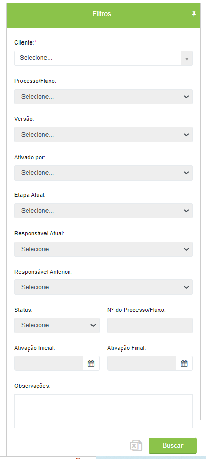
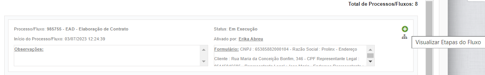
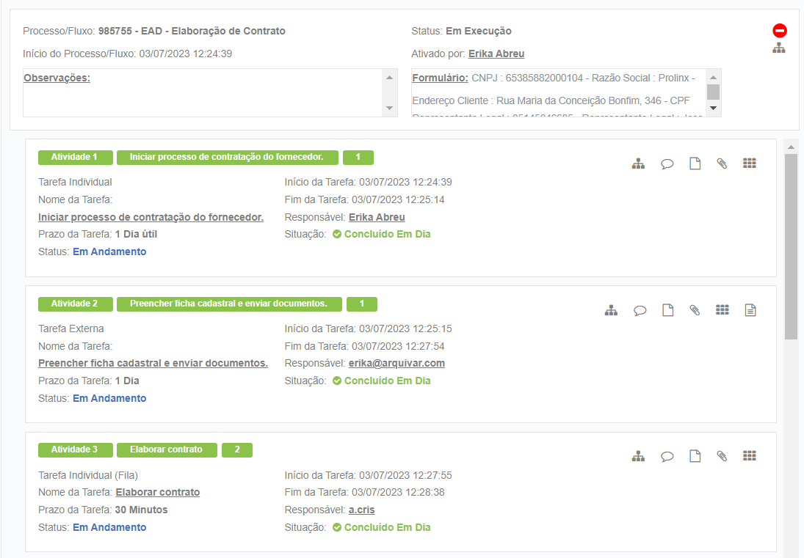
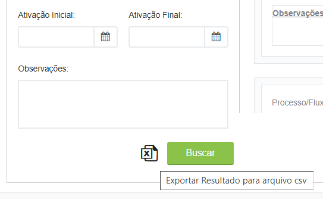
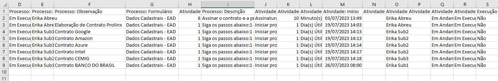
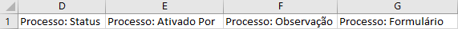
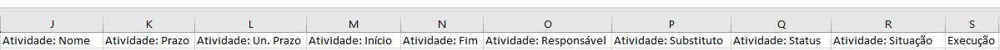

# 🔹 Aba Pesquisa por Fluxo

A aba Pesquisa por Fluxo permite que o usuário aplique filtros e realize buscas de fluxos existentes no sistema, inclusive fluxos já encerrados ou cancelados. Permite também a exportação do resultado da pesquisa para o Excel.&#x20;

Para realizar a pesquisa, preencha os campos de filtro no lado esquerdo da tela para realizar a pesquisa. É possível utilizar os seguintes filtros para pesquisa: &#x20;

* _Cliente:_ Campo de preenchimento obrigatório.&#x20;
* _Processo/Fluxo:_ Busca pelo nome do fluxo. Localiza todos os fluxos do mesmo tipo.&#x20;
* _Versão:_ Busca pelo número de versão do fluxo.&#x20;
* _Ativado por:_ Pode-se selecionar um usuário e serão exibidos todos os fluxos que ele ativou. &#x20;
* _Etapa Atual:_ Serão exibidos todos os fluxos que se encontram na etapa selecionada. &#x20;
* _Responsável Atual:_ Serão exibidos todos os fluxos que possuem tarefas cuja responsabilidade é do usuário selecionado.&#x20;
* _Responsável Anterior:_ Serão exibidos todos os fluxos que possuem tarefas em que o usuário selecionado foi responsável nas etapas anteriores.&#x20;
* _Status:_ Serão exibidos todos os fluxos que se encontram no status selecionado.&#x20;
* _Nº do Processo/Fluxo:_ Será localizado o fluxo pelo seu número de forma exata. &#x20;
* _Ativação Inicial:_ Busca pela data em que o fluxo foi ativado. Serão exibidos todos os fluxos ativados na data informada.&#x20;
* _Ativação Final:_ Busca pela data em que o fluxo foi encerrado. Serão exibidos todos os fluxos encerrados na data informada. Se usado em conjunto com o filtro “Ativação Inicial” mostrará todos os fluxos ativados entre uma data e outra. &#x20;
* _Observações:_ Busca por palavras que tenham sido inseridas no campo “Observações” durante a ativação do fluxo.&#x20;


<mark style="color:red;">**Atente-se ao uso correto dos filtros e evite utilizar muitos filtros ao mesmo tempo para que a pesquisa não se torne inconsistente.**</mark>


<figure><figcaption></figcaption></figure>

Após informar os dados da busca do lado esquerdo da tela, temos o resultado da pesquisa do lado direito com a lista de fluxo(s).

<figure><figcaption>
Clique na imagem para ampliar.
</figcaption></figure>

Ao clicar no ícone “Visualizar Etapas do Fluxo” as etapas são listadas logo abaixo do resultado de cada fluxo.

<figure><figcaption>
Clique na imagem para ampliar.
</figcaption></figure>

Aqui é possível ver as etapas que foram concluídas com atraso, as datas de execução das tarefas, os responsáveis etc. &#x20;

As tarefas são apresentadas de forma ordenada conforme número da etapa no fluxo, nome da etapa e número de execuções, (quando se trata de atividades em grupo ou de decisão é possível que a mesma tarefa seja executada mais de uma vez). Quando for uma tarefa em grupo também será apresentada a soma de pessoas do grupo.&#x20;

Ao clicar nos ícones das tarefas será possível visualizar o que foi executado naquela etapa, como comentários, documentos que foram anexados, informações inseridas no formulário etc.&#x20;

<figure><figcaption>
Clique na imagem para ampliar.
</figcaption></figure>

Ao clicar no ícone "Excluir fluxo" será possível excluir o fluxo, desde que ele ainda esteja em execução. A aplicação irá exibir uma mensagem de confirmação da exclusão do fluxo em questão. Após a confirmação, o fluxo será excluído e não poderá mais ser pesquisado.


<mark style="color:orange;">**O ícone de exclusão de fluxo será exibido somente quando o usuário possuir perfil que permita essa operação. Por padrão esta operação está desmarcada para todos os perfis e essa configuração só deve ser alterada em caso de necessidade, por algum usuário administrador da ferramenta, por meio do menu Administração > Perfis de Usuários.**</mark>


<figure><figcaption>
Clique na imagem para ampliar.
</figcaption></figure>

Ao clicar no ícone “Exportar Resultado para arquivo .csv”, o relatório é exportado e pode ser manuseado da forma como precisar.

<figure><figcaption></figcaption></figure>

<figure><figcaption>
Clique na imagem para ampliar.
</figcaption></figure>

O relatório trará as informações divididas em dois grupos: Colunas com “Dados do Processo” e Colunas com “Dados da Atividade”.

<figure><figcaption>
Clique na imagem para ampliar.
</figcaption></figure>

<figure><figcaption>
Clique na imagem para ampliar.
</figcaption></figure>
