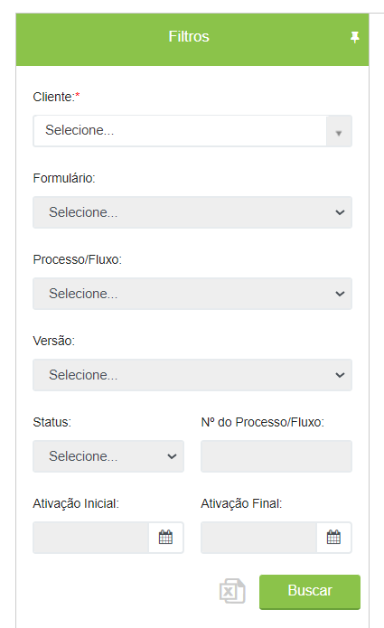
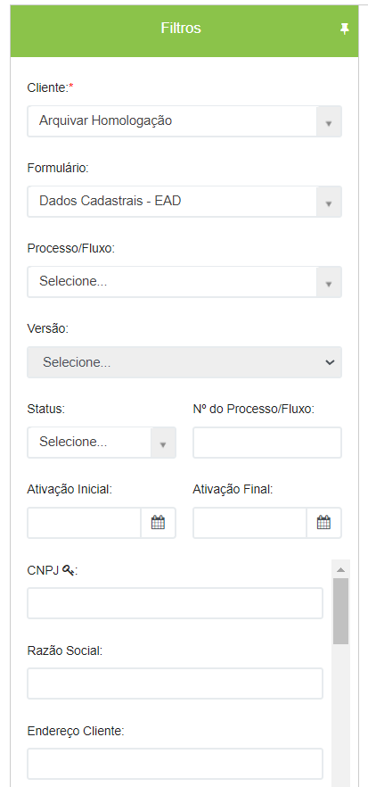
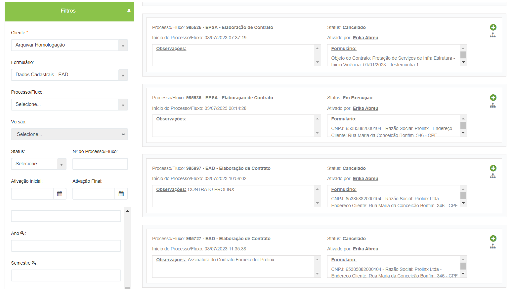
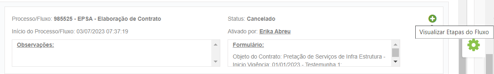
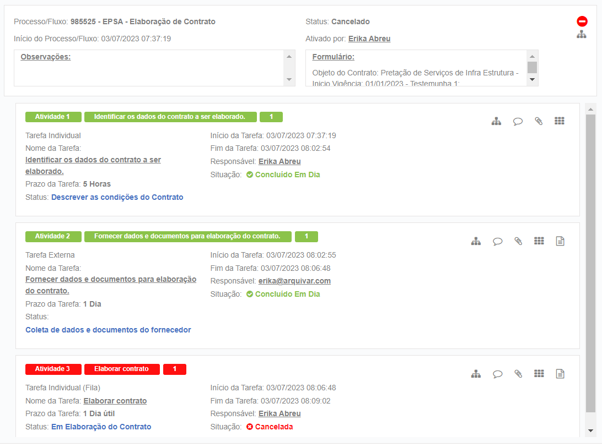
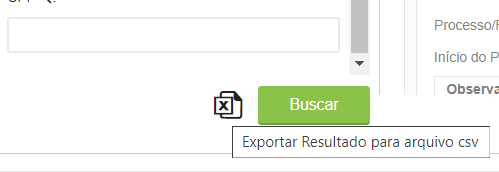
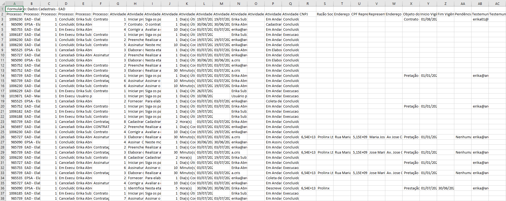
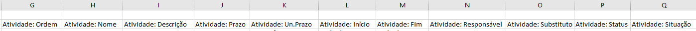

# 🔹 Aba Pesquisa por Formulário

A aba Pesquisa por Formulário permite ao usuário realizar buscas por informações utilizadas em formulários utilizados no processo. Permite também a exportação do resultado da pesquisa para o Excel.&#x20;

Para realizar a pesquisa, preencha os campos de filtro no lado esquerdo da tela para realizar a pesquisa. É possível utilizar os seguintes filtros para pesquisa:&#x20;

* _Cliente:_ Campo de preenchimento obrigatório.&#x20;
* _Formulário:_ Busca pelo formulário associado ao fluxo.&#x20;
* _Processo/Fluxo_: Busca pelo nome do fluxo. Localiza todos os fluxos do mesmo tipo.&#x20;
* _Versão:_ Busca pelo número de versão do fluxo.&#x20;
* _Status:_ Serão exibidos todos os fluxos que se encontram no status selecionado.&#x20;
* _Nº do Processo/Fluxo:_ Será localizado o fluxo pelo seu número de forma exata.&#x20;
* _Ativação Inicial_: Busca pela data em que o fluxo foi ativado. Serão exibidos todos os fluxos ativados na data informada.&#x20;
* _Ativação Final:_ Busca pela data em que o fluxo foi encerrado. Serão exibidos todos os fluxos encerrados na data informada. Se usado em conjunto com o filtro “Ativação Inicial” mostrará todos os fluxos ativados entre uma data e outra.&#x20;

<figure><figcaption></figcaption></figure>

Ao selecionar um formulário ou preencher o campo “Processo/Fluxo” serão exibidos automaticamente os campos do formulário associado ao fluxo, que poderão ser também utilizados como filtros para a busca.

<figure><figcaption></figcaption></figure>

Ao preencher os dados desejados e clicar em buscar, os fluxos serão carregados do lado direito da tela.

<figure><figcaption>
Clique na imagem para ampliar.
</figcaption></figure>

Ao clicar no ícone “Visualizar Etapas do Fluxo” as etapas são listadas logo abaixo do resultado de cada fluxo.

<figure><figcaption>
Clique na imagem para ampliar.
</figcaption></figure>

Aqui é possível ver as etapas que foram concluídas com atraso, as datas de execução das tarefas, os responsáveis etc. &#x20;

As tarefas são apresentadas de forma ordenada conforme número da etapa no fluxo, nome da etapa e número de execuções (quando se trata de atividades de grupo, é apresentada a soma de pessoas do grupo).&#x20;

<figure><figcaption>
Clique na imagem para ampliar.
</figcaption></figure>

Ao clicar no ícone “Exportar Resultado para arquivo .csv”, o relatório é exportado e pode ser manuseado da forma como precisar.

<figure><figcaption></figcaption></figure>

<figure><figcaption>
Clique na imagem para ampliar.
</figcaption></figure>

O relatório trará as informações divididas em três grupos: Colunas com “Dados do Processo”, Colunas com “Dados da Atividade” ou com a exibição de todos os campos do formulário em colunas (desta forma o relatório muda conforme campos utilizados para a busca).

<figure><figcaption>
Clique na imagem para ampliar.
</figcaption></figure>

<figure><figcaption>
Clique na imagem para ampliar.
</figcaption></figure>
