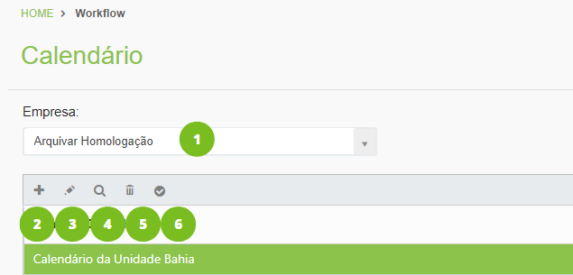
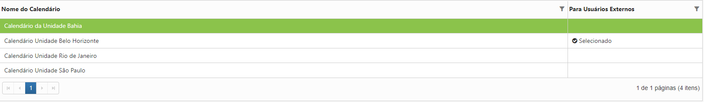
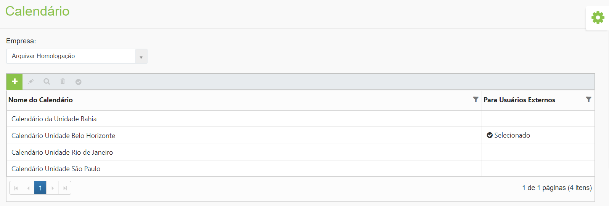
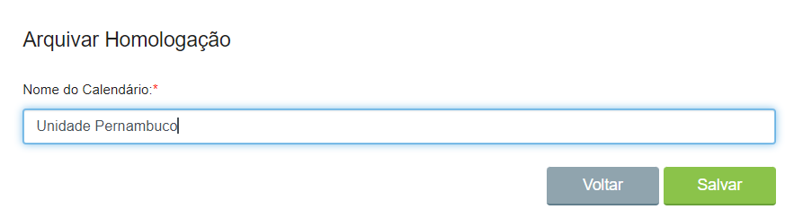
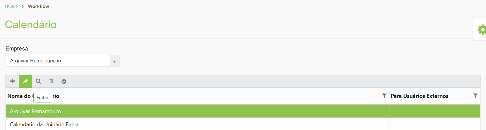
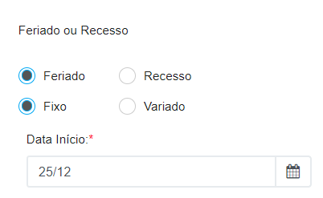
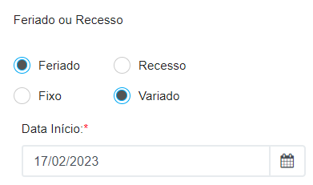
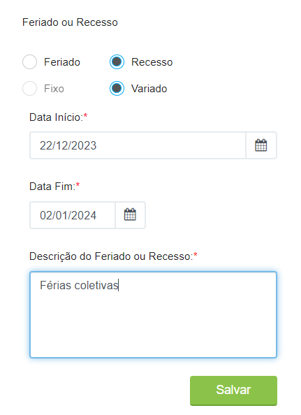
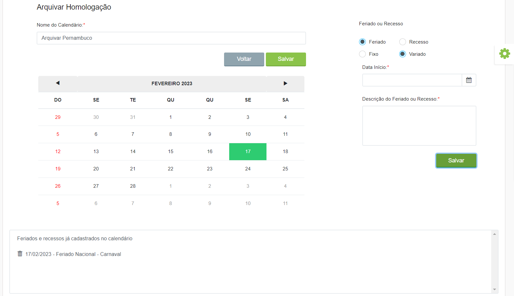

# 🟩 Calendários

Para cada tarefa dentro de um processo é possível definir um prazo para execução. No menu Calendários é possível cadastrar feriados e recessos e sinalizar os dias úteis que deverão ser considerados no prazo para execução das tarefas, considerando apenas os dias úteis e evitando uma contagem errônea do prazo.


<mark style="color:blue;">**EXEMPLO:**</mark> <mark style="color:blue;"></mark><mark style="color:blue;">Uma tarefa deve ser executada em dois dias úteis e é criada em uma segunda-feira anterior a um feriado, no fim do expediente. O sistema irá desconsiderar o feriado na terça-feira, portanto o usuário terá até quinta-feira para executar a tarefa.</mark>&#x20;


***

## Calendários – Tela principal

**1. Campo Empresa:** Neste campo é exibida a empresa ou empresas às quais o usuário logado pertence ou tem acesso.&#x20;

**2. Ícone Adicionar:** Utilizado para o cadastro de um novo calendário. Uma mesma empresa ou unidade pode contar com calendários distintos.&#x20;

**3. Ícone Editar:** Utilizado para realizar a edição do calendário selecionado. &#x20;

**4. Ícone Visualizar:** Utilizado para visualizar detalhes do calendário selecionado. &#x20;

**5. Ícone Excluir:**  Utilizado para excluir o calendário selecionado.&#x20;

**6. Ícone Selecionar como padrão para usuários externos:** Utilizado para selecionar um dos calendários como padrão ao considerar o prazo de execução das tarefas por um usuário externo. Esse parâmetro será utilizado durante a Configuração das Tarefas no Desenho do Fluxo.

<figure><figcaption></figcaption></figure>

**Coluna Nome do Calendário:** Nesta coluna são exibidos todos os calendários da empresa cadastrados.&#x20;

**Coluna Para Usuários Externos:** Nesta coluna é mostrado qual dos calendários da empresa está sendo utilizado como padrão no direcionamento de tarefas para usuários externos.&#x20;


<mark style="color:orange;">**Usuários externos são aqueles que executam tarefas no processo fora do ArqGED (deslogados), como fornecedores, clientes etc.**</mark>


<figure><figcaption>
Clique na imagem para ampliar.
</figcaption></figure>

***

## Cadastro de Calendário

1. Clique no ícone “Adicionar”.

<figure><figcaption>
Clique na imagem para ampliar.
</figcaption></figure>

2. Insira um nome para o calendário e clique em “Salvar”. Depois, clique em “Voltar”.

<figure><figcaption></figcaption></figure>

3. De volta à tela inicial do menu Calendários, selecione o calendário que você acabou de criar e clique no ícone “Editar”.

<figure><figcaption>
Clique na imagem para ampliar.
</figcaption></figure>

4\. Informe se a data que será cadastrada é um “Feriado” ou “Recesso” marcando a opção correspondente. &#x20;

5\. Informe se a data é fixa ou variada, ou seja, se acontece todo ano na mesma data ou se pode variar conforme o ano.  &#x20;


<mark style="color:blue;">**DATA FIXA X DATA VARIADA:**</mark> <mark style="color:blue;"></mark><mark style="color:blue;">Um feriado ou recesso de data fixa ocorre todo ano no mesmo dia, como por exemplo o feriado de Natal (25 de dezembro).</mark> &#x20;

<mark style="color:blue;">Um feriado ou recesso de data variada acontece em dias diferentes a cada ano, como por exemplo o Carnaval, que varia de data a cada ano.</mark>&#x20;


6. Se o evento for marcado como um feriado fixo, no campo “Data Início” não será necessário informar o ano, apenas o dia e mês.

<figure><figcaption></figcaption></figure>

7. Se for marcado como um feriado de data variada será necessário informar a data completa de início, com dia, mês e ano.

<figure><figcaption></figcaption></figure>

8. Se o evento for marcado como um recesso, não será possível escolher a opção fixo, sendo obrigatório informar a data completa de início e fim, com dia, mês e ano.

<figure><figcaption></figcaption></figure>

9. Insira a “Descrição do Feriado ou Recesso” e clique em “Salvar”.

<figure><figcaption></figcaption></figure>

10. As datas marcadas como feriado ou recesso serão exibidas no calendário marcadas em verde e a descrição do evento será exibida no campo Feriados e recessos já cadastrados no calendário.

<figure><figcaption>
Clique na imagem para ampliar.
</figcaption></figure>
