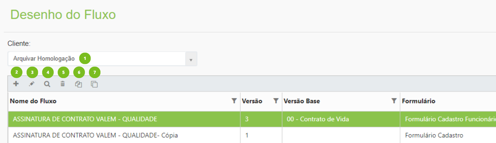
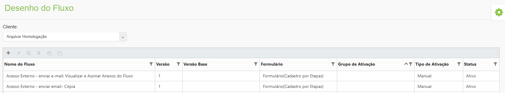
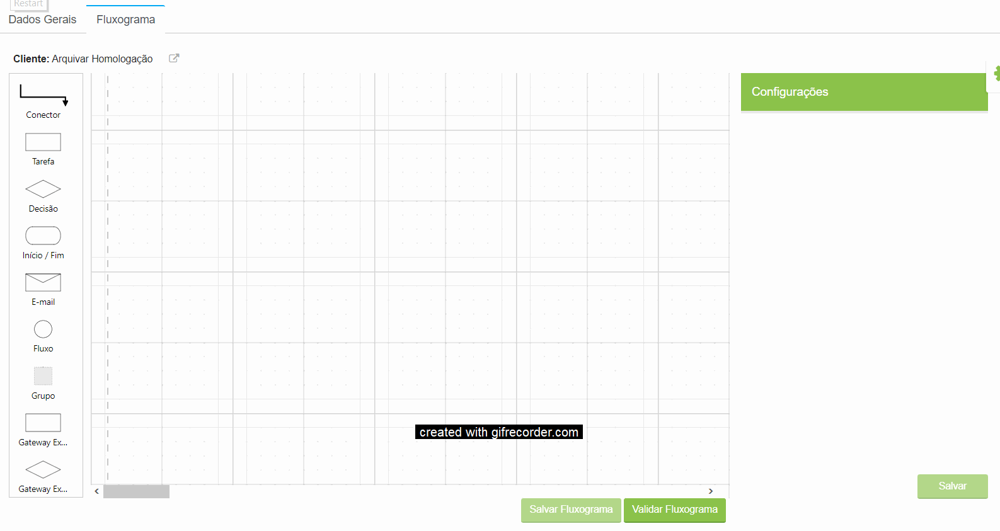
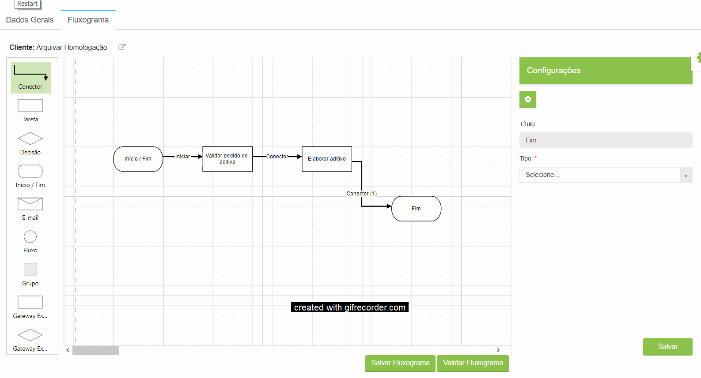

# 🟩 Desenho do Fluxo

No menu Desenho do Fluxo serão configurados os fluxos e etapas dos processos de trabalho.

***

## Desenho do Fluxo – Tela principal

**1. Campo Empresa:** Neste campo é exibida a empresa ou empresas às quais o usuário logado pertence ou tem acesso.&#x20;

**2. Ícone Adicionar:** Utilizado para adicionar um novo fluxo. &#x20;

**3. Ícone Editar:** Utilizado para editar o fluxo selecionado. &#x20;

**4. Ícone Visualizar:** Utilizado para visualizar detalhes do fluxo selecionado. &#x20;

**5. Ícone Excluir:** Utilizado para excluir o fluxo selecionado.


<mark style="color:orange;">**Usuários que não são administradores só podem excluir fluxos que não tenham tido nenhuma ativação ou atividade executada.**</mark>


**6. Ícone Copiar:** Copia um fluxo criado anteriormente. Se as tarefas e informações forem alteradas, não interfere no fluxo que deu origem à cópia. &#x20;

**7. Ícone Versionar:** Cria uma versão de um fluxo já existente. Se existirem fluxos ativos no desenho de fluxo que deu origem à versão, eles não serão paralisados, mas o sistema não permitirá que sejam ativados novos fluxos. Os novos fluxos serão ativados na nova versão que foi criada.

<figure><figcaption>
Clique na imagem para ampliar.
</figcaption></figure>

**Coluna Nome do Fluxo:** Nesta coluna são exibidos todos os fluxos da empresa cadastrados.&#x20;

**Coluna Versão:** Apresenta o número da versão daquele fluxo. Ele pode ser a primeira versão de um fluxo, ou seja, um fluxo inédito, ou uma versão de um fluxo já existente.&#x20;

**Coluna Versão Base:** Caso o fluxo não seja a primeira versão essa coluna apresenta o nome do fluxo que lhe deu origem. &#x20;

**Coluna Formulário:** Apresenta o formulário associado ao fluxo. Essa associação é feita durante a criação do fluxo.&#x20;

**Coluna Grupo de Ativação:** Nesta coluna é exibido o grupo de usuários que pode ativar o fluxo, se esse grupo tiver sido apontado durante a criação do fluxo.&#x20;

**Coluna Tipo de Ativação:** Apresenta o tipo de ativação do fluxo: Manual, Automática ou API Integração. Essa definição é feita durante a criação do fluxo.  &#x20;

**Coluna Status:** Apresenta o status do fluxo: Em Elaboração, Ativo ou Inativo.&#x20;

<figure><figcaption>
Clique na imagem para ampliar.
</figcaption></figure>

***

## Criação do Desenho do Fluxo

1\. Para iniciar a criação do desenho do fluxo, acesse a aba Fluxograma e clique em Editar. Para aumentar a tela de trabalho, clique no ícone “Expandir a tela”.&#x20;

2\. Inicie a elaboração do fluxo. Utilize os ícones para representar cada etapa do fluxo. Arraste o ícone desejado para o campo de desenho.

<figure><figcaption>
Clique na imagem para ampliar.
</figcaption></figure>

3. Informe o nome da tarefa ou ação de cada etapa Para editar os textos dos ícones, clique duas vezes sobre o texto e apague o texto pressionado a tecla “Backspace” do teclado. 


<mark style="color:red;">**Não utilize a tecla “Delete”, pois o ícone será inteiramente excluído.**</mark> 


<figure><figcaption>
Clique na imagem para ampliar.
</figcaption></figure>

4\. Depois que finalizar o desenho e concluir todas as configurações das tarefas e ícones, clique em “Validar Fluxograma”. &#x20;

5\. Caso existam pendências ou alguma configuração obrigatória não tenha sido realizada, será exibida a tela “Erro de Validação”. Será necessário revisar e corrigir cada um até que a validação possa ser concluída.&#x20;

<figure><figcaption>
Clique na imagem para ampliar.
</figcaption></figure>
