# 🔹 Aba Dados Gerais

## Configurações da Aba Dados Gerais

**Campo Versão:** Apresenta o número da versão do fluxo que está sendo criada.&#x20;

**Campo Cliente:** Apresenta o nome da empresa à qual o usuário logado pertence. &#x20;

**Campo Unidade Storage:** Normalmente esse campo apresenta apenas uma opção de escolha, que é a Unidade Storage à qual a empresa do usuário pertence. Caso haja mais de uma opção para seleção, escolha aquela que é responsável por faturar para o cliente o storage que será utilizado (armazenamento que irá receber os arquivos relativos ao fluxo).&#x20;

**Campo Nome do Fluxo:** Informe um nome para o processo. É importante que o nome escolhido seja de fácil compreensão e localização. &#x20;

<figure>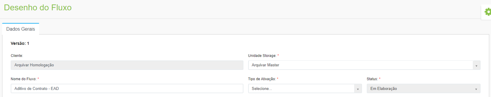<figcaption>
Clique na imagem para ampliar.
</figcaption></figure>

**Campo Tipo de Ativação:** Selecione o tipo de ativação do fluxo, que pode ser:&#x20;

* _Manual:_ o usuário ativará o fluxo clicando em “Workflow > Atividades > Ativar novo fluxo”  &#x20;
* _API Integração:_ quando houver uma API externa ao software para ativar o fluxo. &#x20;
* _Automática:_ Neste caso é preciso definir os parâmetros de ativação. Se a ativação será feita ao chegar em certa data ou se ocorrer determinada ocorrência.  &#x20;

<figure>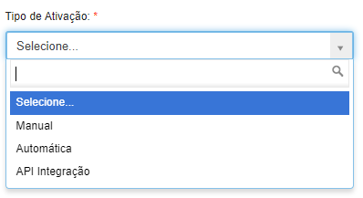<figcaption></figcaption></figure>

**Campo Status:** Selecione o status em que o desenho do fluxo se encontra. &#x20;

* _Em Elaboração_: Durante a criação do fluxo e do seu desenho, o status será sempre “Em Elaboração”.&#x20;
* _Ativo:_ Ao concluir as configurações do fluxo e do seu desenho, o status será definido como “Ativo” automaticamente.&#x20;
* _Inativo:_ Para inativar um fluxo, selecione a opção “Inativo”. Depois de inativado não é possível editar um fluxo ou torná-lo ativo novamente.&#x20;

**Campo Formulário:** Selecione o formulário que será associado ao fluxo, ou seja, o formulário que deverá preenchido pelos usuários que estiverem executando as tarefas do fluxo. Os formulários exibidos aqui para seleção são aqueles anteriormente criados no menu [Workflow > Formulário.](../formulario.md)&#x20;

<figure>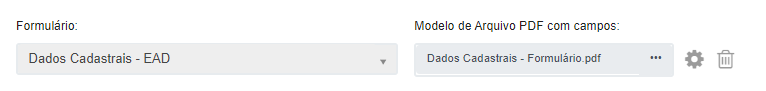<figcaption></figcaption></figure>

**Campo Modelo de Arquivo PDF com campos:**  É possível associar ao fluxo um PDF com campos editáveis que será preenchido pelos usuários executores das tarefas. Este tipo de Modelo PDF deve ser criado por meio de ferramentas como o [Adobe Acrobat](https://www.adobe.com/br/acrobat.html). &#x20;

* _Ícone Excluir o Modelo:_ Clicando nesse ícone o modelo de PDF associado ao fluxo é excluído.
* _Ícone Configuração do Modelo:_ Depois de selecionar o modelo de PDF preenchível, ao clicar no ícone de Configuração do Modelo serão exibidos os campos editáveis que o sistema conseguiu extrair do documento. Nesta tela será possível associar os campos identificados aos campos do Formulário, ou seja, indicar para o sistema que quando o PDF for preenchido, as informações serão aproveitadas no Formulário do fluxo.

<figure>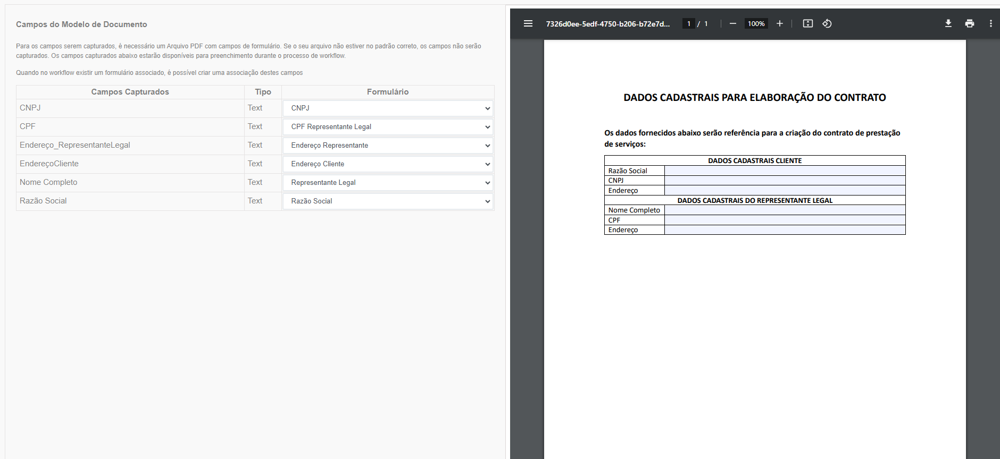<figcaption>
Clique na imagem para ampliar.
</figcaption></figure>

**Campo Grupo de usuários que poderão ativar:** Selecione o grupo de usuários que poderão ativar o fluxo. Esse grupo deverá ter sido criado anteriormente no menu Administração > Grupos. Esse campo não é obrigatório e caso não seja escolhido nenhum grupo, todos os usuários da empresa que tiverem permissão poderão ativar o fluxo.  &#x20;

**Campo Incluir logomarca nas notificações:** Selecione a logomarca da empresa que deverá ser incluída nas notificações que os atores do fluxo receberão por e-mail. Essa logomarca deverá ter sido cadastrada anteriormente no menu Cliente > Dados Cadastrais.    &#x20;

<figure>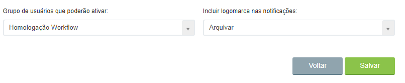<figcaption>
Clique na imagem para ampliar.
</figcaption></figure>

**Exibir na aba “Workflow” da modal de documentos somente os campos preenchidos do formulário:** Marque essa opção se desejar que sejam exibidos apenas os campos preenchidos do formulário durante a sua execução e posteriormente, quando o fluxo for concluído e for disponibilizada a consulta aos arquivos daquele fluxo. Se essa opção não for marcada, serão exibidos todos os campos, inclusive os vazios. &#x20;

**Bloquear a ativação manual deste fluxo, quando para um documento em questão já houver este fluxo em andamento:** Se marcada essa opção, não será possível ativar o fluxo se houver outro fluxo em andamento relacionado ao mesmo documento. Essa funcionalidade é útil para evitar que seja ativado mais de um fluxo de renovação de contrato ou distrato para um mesmo contrato, por exemplo. Essa opção só estará disponível se o fluxo for de ativação manual.&#x20;

**Bloquear a ativação manual deste fluxo sem um documento associado:** Se marcada esta opção o fluxo não poderá ser ativado manualmente sem que haja um documento selecionado, ou seja, para estes desenhos o fluxo só poderá ser ativado via pesquisa simples, avançada, explorar ou pela [aba Workflow na tela Documento.](../atividades/aba-minhas-atividades/#tela-de-documentos) Essa opção só estará disponível se o fluxo for de ativação manual.&#x20;

<figure>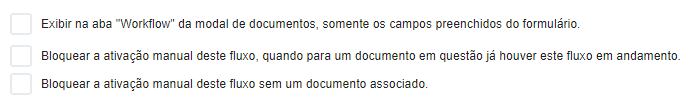<figcaption></figcaption></figure>

***

## Parâmetros de Ativação

<figure>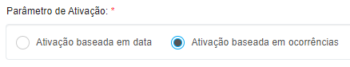<figcaption></figcaption></figure>

### Ativação baseada em data 

A ativação de um fluxo baseada em data pode ser feita de forma diária, semanal, mensal ou anual.   &#x20;

**Diária:** Pode ser feita todos os dias ou em dias selecionados. Também é possível selecionar a opção que não permite que o fluxo seja ativado em dias cadastrados como feriado e recesso e algum dos calendários cadastrados anteriormente no menu [Workflow > Calendários](../calendarios.md).  &#x20;

<figure>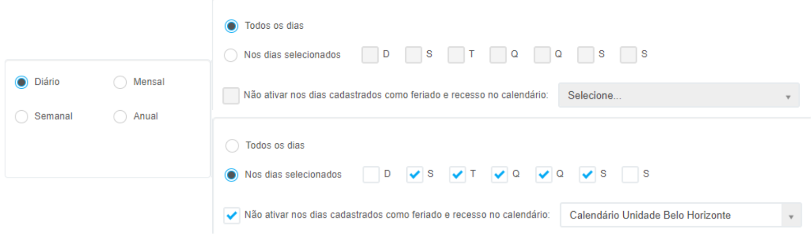<figcaption>
Clique na imagem para ampliar.
</figcaption></figure>

**Semanal:** Pode ser feita todo dia específico, toda semana (exemplo: toda quinta-feira).

<figure>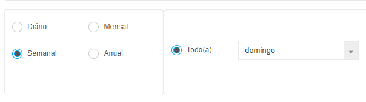<figcaption></figcaption></figure>

**Mensal:** Pode ser feita em um dia específico de cada mês (exemplo: dia 05 de cada mês) ou em uma data mensal (exemplo: 3ª quarta-feira de cada mês).

<figure>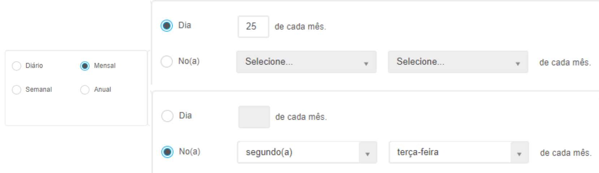<figcaption>
Clique na imagem para ampliar.
</figcaption></figure>

**Anual:** Pode ser feita em um uma data específica (exemplo: em maio, no dia 02) ou considerando uma data mensal (exemplo: 3ª sexta-feira de abril). 

<figure>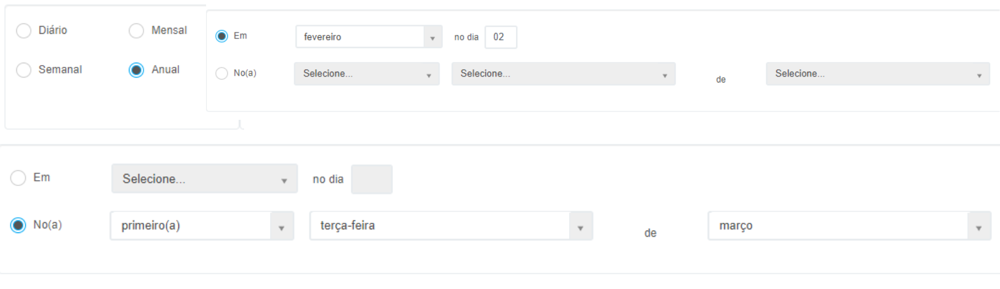<figcaption>
Clique na imagem para ampliar.
</figcaption></figure>

### Ativação baseada em ocorrências

A ativação de um fluxo baseada em ocorrência será feita quando determinado evento ocorrer.

**Quando um registro for inserido:** Neste caso, o fluxo deve ser ativado sempre que um novo registro for inserido no sistema. Selecione se será aplicado para registros eletrônicos, de guarda interna e de guarda terceirizada.

Sempre que houver uma ativação de fluxo quando um registro for inserido, a aplicação irá identificar se os campos preenchidos deste documento são os mesmos campos do formulário relacionado ao desenho do fluxo. Caso sejam os mesmos campos, a aplicação irá copiar as informações destes campos e preencher o formulário automaticamente. Quando o usuário abrir o formulário na tarefa, este já estará preenchido.

<figure>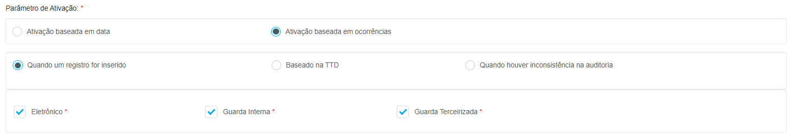<figcaption>
Clique na imagem para ampliar.
</figcaption></figure>

**Baseado na TTD:** Neste caso poderão ser ativados fluxos automáticos para documentos antes que atinjam seu vencimento, conforme a quantidade de dias configurada no campo "TTD antes de vencer em dias" ou quando um documento já estiver vencido, marcando-se a opção "TTD vencida".&#x20;


<mark style="color:blue;">**Exemplo:**</mark> <mark style="color:blue;"></mark><mark style="color:blue;">Em um fluxo configurado para ativar diariamente com TTD antes de vencer em 10 dias, a aplicação irá ativar fluxos todos os dias com os documentos que irão vencer em 10 dias.</mark>


Aqui deverá ser informado se a ativação ocorrerá por lote ou por documento e se será aplicada para registros eletrônicos, de guarda interna e de guarda terceirizada.  Também deve ser informada a periodicidade da ativação (diária, semanal, mensal ou anual) que funciona de acordo com as mesmas regras da [Ativação baseada em data](aba-dados-gerais.md#ativacao-baseada-em-data). Por fim, selecione as árvores que deverão ser verificadas para ativação do fluxo.

<figure>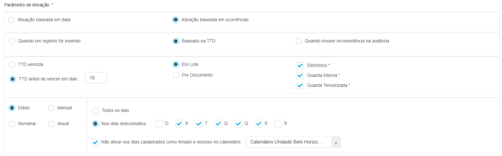<figcaption>
Clique na imagem para ampliar.
</figcaption></figure>

Sempre que houver uma ativação de fluxo por vencimento de documento (TTD vencida ou TTD a vencer em dias), a aplicação irá identificar se os campos preenchidos deste documento são os mesmos campos do formulário relacionado ao desenho do fluxo. Caso sejam os mesmos campos, a aplicação irá copiar as informações destes campos e preencher o formulário automaticamente. Quando o usuário abrir o formulário na tarefa, este já estará preenchido.

**Quando houver inconsistência na auditoria:** Nesse caso o fluxo será ativado sempre que for encontrada alguma inconsistência no registro (exemplo: um documento do fluxo não foi enviado). 

<figure>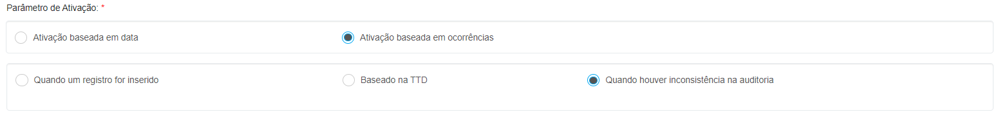<figcaption>
Clique na imagem para ampliar.
</figcaption></figure>

