# 🔹 Aba Fluxograma

## Conector

Conecta as etapas do fluxo. Deve ser inserido ligando uma tarefa à outra no desenho. Para cada conector será exibido para o usuário um botão de prosseguimento no fluxo.

<figure><figcaption></figcaption></figure>

<figure><figcaption>
Clique na imagem para ampliar.
</figcaption></figure>

### Configurações do Conector

* **Ação de Avanço:** Informe o nome do botão que vai aparecer na tela da tarefa quando o usuário for dar prosseguimento ao fluxo.  Caso seja um conector de uma tarefa que será executada por um usuário externo, informe as obrigatoriedades que ele deverá executar para dar prosseguimento ao fluxo. &#x20;
* **Origem:** Mostra a tarefa ou decisão que é a origem do conector.&#x20;
* **Destino:** Mostra a tarefa ou decisão de destino do conector.&#x20;
* **Avançar Automaticamente:** Selecione essa opção se o prosseguimento da etapa for automático depois de um determinado percentual de atraso de execução da tarefa. Neste caso, é preciso preencher também o campo Percentual de Atraso. &#x20;

<figure>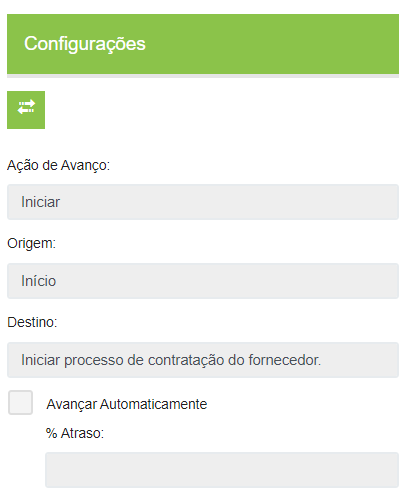<figcaption></figcaption></figure>

### Configurações do Conector de Tarefa tipo Gateway Exclusivo

* **Avançar Automaticamente:** Ao marcar esta opção, o campo numérico “% Atraso” ficará habilitado para o usuário informar o % de atraso para que a decisão avance para este caminho de forma automática conforme o tempo de atraso. &#x20;
* **Condição para este avanço:** Este campo virá marcado e desabilitado &#x20;
* **Quando o campo:** Neste campo já virá preenchido de forma automática o campo do formulário informado nas configurações da tarefa do tipo Gateway Exclusivo associada ao conector.&#x20;
* **For:** Este campo será do tipo dropdown e terão os seguintes valores: “=”, “>=”, “<=” e “<>”. &#x20;
* **Ao valor:** Este campo sempre irá obedecer ao formato do campo que está sendo exibido no “Campo do formulário”. Ou seja, se o “Campo do formulário” for um campo de lista do tipo lista, este campo deverá ser exibido como dropdown exibindo as opções existentes para ele. Se o “Campo do formulário” for numérico, este campo deverá ser exibido no formato numérico. Se o “Campo do formulário” for monetário, este campo deverá ser exibido no formato monetário.&#x20;

<figure>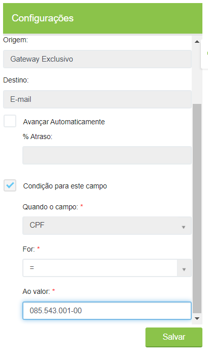<figcaption></figcaption></figure>

### Configurações do Conector de Decisão tipo Gateway Exclusivo

* **Avançar Automaticamente**: Ao marcar esta opção, o campo numérico “% Atraso” ficará habilitado para o usuário informar o % de atraso para que a decisão avance para este caminho de forma automática conforme o tempo de atraso. &#x20;
* **Condição para este avanço:** Selecione esta opção caso deseje que o fluxo avance automaticamente a partir da condição de preenchimento de um campo específico do formulário. &#x20;
* **Quando o campo:** Neste campo já virá preenchido de forma automática o campo do formulário informado nas configurações da tarefa do tipo Gateway Exclusivo associada ao conector.&#x20;
* **For**: Este campo será do tipo dropdown e terão os seguintes valores: “=”, “>=”, “<=” e “<>”. &#x20;
* **Ao valor:** Este campo sempre irá obedecer ao formato do campo que está sendo exibido no “Campo do formulário”. Ou seja, se o “Campo do formulário” for um campo de lista do tipo lista, este campo deverá ser exibido como dropdown exibindo as opções existentes para ele. Se o “Campo do formulário” for numérico, este campo deverá ser exibido no formato numérico. Se o “Campo do formulário” for monetário, este campo deverá ser exibido no formato monetário.&#x20;


<mark style="color:blue;">**Regras de configuração do avanço automático para conectores de saída de uma decisão do tipo Gateway:**</mark> <mark style="color:blue;"></mark>&#x20;

<mark style="color:blue;">-> No conector vinculado a uma decisão do tipo gateway, a aplicação irá exigir que sejam configurados a opção “Avançar Automaticamente” ou a “Condição para este avanço”.</mark> &#x20;

<mark style="color:blue;">-> No conector vinculado a uma decisão do tipo gateway, a aplicação irá exigir que os conectores de saída da decisão em questão tenham combinações dos campos “For” e “Ao Valor” diferentes.</mark> &#x20;

<mark style="color:blue;">-> No conector vinculado a uma decisão do tipo gateway, a aplicação irá exigir que se tenha no máximo um conector de saída com a opção “Avançar Automaticamente” para a decisão em questão. O uso da opção “Avançar Automaticamente” não é obrigatório, mas quando esta opção for usada, ela poderá estar em somente um conector de saída da decisão.</mark> &#x20;

<mark style="color:blue;">-> As tarefas seguintes da decisão do tipo gateway não poderão ter o Tipo Responsável como: “Selecionado”, “Selecionado Externo Único” (sem automação para extração do e-mail de campo de formulário) e “Selecionado Externo Vários” (sem automação para extração do e-mail de campo de formulário).</mark>&#x20;


<figure>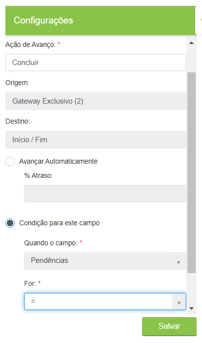<figcaption></figcaption></figure>

***

## Tarefa

Representa as tarefas do fluxo. Ao inserir uma tarefa, insira o seu nome ou uma breve descrição do que deve ser feito naquela tarefa. 

<figure>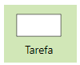<figcaption></figcaption></figure>

### Configurações da Tarefa

Todas as tarefas criadas no desenho do fluxo devem ser configuradas individualmente.

#### Aba Configurações&#x20;

* **Título:** Nome da tarefa. Para editar o título da tarefa, clique sobre o ícone da tarefa no fluxograma. &#x20;
* **Status:** Informe o status para a tarefa. Esse status informará ao usuário em que fase o fluxo se encontra durante a execução daquela tarefa. &#x20;

<figure>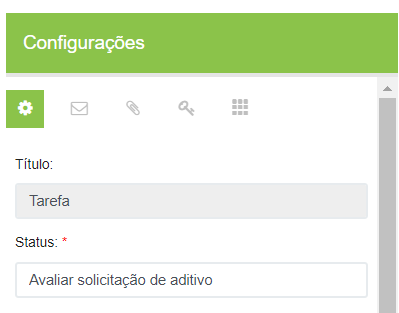<figcaption></figcaption></figure>

* **Tipo de Responsável**: Selecione que tipo de usuário será o responsável por executar aquela tarefa.  &#x20;
  * Chefe imediato (Quem Ativou): Essa opção só será exibida se o fluxo for de ativação manual. Neste caso a tarefa será direcionada para o chefe da pessoa que ativou o fluxo. O sistema obterá a informação de quem é o chefe da pessoa que ativou o fluxo por meio do Cadastro de Usuário.&#x20;
  * Usuário externo: É um usuário fixo que sempre será o executor da tarefa, mas que não precisará estar logado no sistema para executá-la. Será solicitado que seja informado o e-mail da pessoa (campo “E-mail para receber o token”).&#x20;
  * Grupo: será solicitado selecionar o grupo cadastrado anteriormente no menu Workflow > Grupo de Usuários e definir se a tarefa será uma atividade conjunta ou individual. Se a atividade for conjunta, no campo “Consenso” informe a porcentagem que será considerada para prosseguimento do fluxo, de acordo com o número de integrantes do grupo (exemplo: se há duas pessoas e for colocado 50%, quando uma delas assinar o fluxo poderá seguir. Se for colocado 100%, as duas precisarão assinar). Se a tarefa for individual, o sistema escolherá quem vai executar a tarefa. Nesse caso defina se essa escolha vai se basear em uma fila (o sistema obedecerá a ordem alfabética, distribuindo tarefas igualmente para todos os membros do grupo), ou se vai se basear em ociosidade (o sistema direcionará a tarefa para o usuário com menor número de tarefas pendentes).  &#x20;
  * Quem ativou: Neste caso a tarefa será direcionada para o usuário que ativou o fluxo.&#x20;
  * Selecionado: deverá ser indicado o responsável durante a execução do fluxo. &#x20;
  * Selecionado externo único: Deverá ser informado o e-mail do responsável durante a execução do fluxo.&#x20;
  * Selecionado externo vários: Deverá ser informado o e-mail do responsável durante a execução do fluxo. O usuário poderá definir qual o percentual de execução para o avanço (campo “% Consenso”), ou seja, a tarefa poderá prosseguir mesmo quando a porcentagem de usuários definida aqui a execute. Deverá ser preenchido o campo “Decisão de Consenso”, que apontará para o sistema para onde o fluxo deverá seguir após atingir o percentual de consenso configurado. &#x20;
  * Usuários: será solicitado selecionar o usuário que será o responsável.  &#x20;
  * Quem executou uma tarefa externa: Nesse caso a tarefa é direcionada para algum usuário externo que tenha executado alguma outra tarefa durante o fluxo. É preciso definir no campo “Tarefas” a tarefa que está associada e o e-mail utilizado para notificar o usuário será extraído dessa outra tarefa. Só podem ser incluídas tarefas de referência cujo tipo de responsável seja “Selecionado Externo Único”.&#x20;
  * Quem executou uma tarefa interna: O sistema direcionará a tarefa para mesmo usuário que executou alguma outra tarefa durante o fluxo, que deverá ser indicada no campo “Tarefas”. Para este Tipo de Responsável só podem ser incluídas tarefas de referência cujo tipo de responsável anterior seja “Selecionado”, “Grupos por fila” ou “Grupos por ociosidade”.&#x20;

<figure>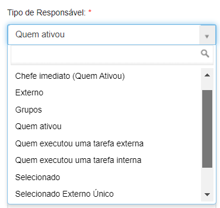<figcaption></figcaption></figure>

* **Prazo:** Informe o prazo que o responsável terá para executar a tarefa. Se o prazo considerar dias, horas e minutos úteis, o sistema vai considerar o [horário de trabalho](../horarios-de-trabalho.md) e [calendário](../calendarios.md) cadastrados no menu Workflow. Caso não hajam esses cadastros o sistema sempre vai considerar o prazo corrido.&#x20;
* **Inibe a opção de delegar:** Se marcada essa opção o responsável não poderá delegar a tarefa para que outra pessoa execute. &#x20;
* **Obrigar comentário na etapa:** Obriga o responsável a fazer um comentário sobre o status ou execução da tarefa antes de dar prosseguimento. &#x20;
* **Descrição da Etapa:** Descrição que será apresentada para o usuário no momento em que ele receber a tarefa. Neste campo pode ser feita a descrição do que deve ser executado de forma mais detalhada. &#x20;

<figure>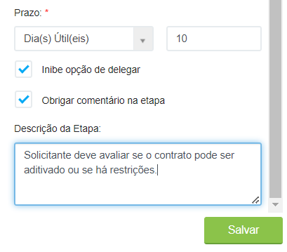<figcaption></figcaption></figure>

#### Aba E-mail

* **Notificar quando:** Informe quando será enviada a notificação sobre a tarefa.

<figure>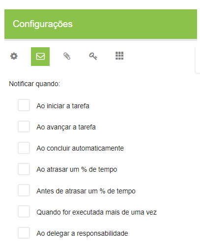<figcaption></figcaption></figure>

* **% de tempo:** Esse campo será exibido se no campo “Notificar quando” tiver sido escolhida a opção “Ao atrasar um % de tempo” ou “Antes de atrasar um % de tempo”. Neste caso deve ser informada aqui a porcentagem de tempo de atraso, considerando o prazo cadastrado na aba Configurações. &#x20;
* **Notificar:** Informe quem deverá ser notificado. O sistema poderá notificar um usuário ou um grupo de usuários.

<figure>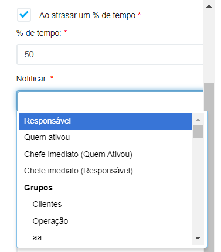<figcaption></figcaption></figure>

* **E-mail externos:** Se forem notificados usuários externos, informe os e-mails e insira uma mensagem personalizada de notificação.&#x20;
* **Mensagem personalizada:** Neste campo pode ser inserida uma mensagem personalizada que será exibida para o usuário executor da tarefa.&#x20;
* **Incluir na notificação:** Selecione o que deverá ser incluído na notificação: se todos os comentários feitos ao longo do fluxo ou se apenas o último. Indique se devem ser incluídos a observação inserida na ativação do fluxo e os campos do formulário associado ao fluxo.   &#x20;
* **Quando for executada mais de uma vez:** Essa opção deve ser marcada se, caso a tarefa seja executada mais de uma vez, a notificação precise também ser enviada mais de uma vez. Neste caso deve ser preenchido também o campo Quantidade de vezes executada.&#x20;
* **Ao delegar a responsabilidade:** Marque essa opção para que seja enviada uma notificação sempre que o responsável pela tarefa a delegue a outra pessoa. Essa opção só estará disponível caso o campo “Inibe opção de delegar” esteja desabilitado na [aba Configurações.](aba-fluxograma.md#aba-configuracoes) Se a tarefa for de execução externa, essa opção não será exibida.&#x20;

<figure>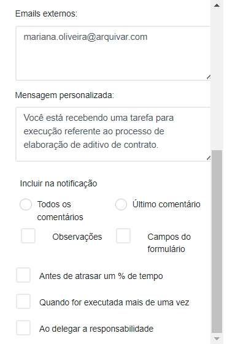<figcaption></figcaption></figure>

#### Aba Anexos

* **Anexo do fluxo, obrigar:** Marque a opção “O upload de pelo menos um arquivo” caso deseje obrigar o usuário a anexar pelo menos um documento ao fluxo. &#x20;
* **Registro de Documento, obrigar:** Selecione as opções desejadas sobre as obrigatoriedades de cadastrar um novo documento ou associar um documento já cadastrado anteriormente ao fluxo. &#x20;


<mark style="color:blue;">**Diferença entre Anexos do Fluxo e Registro de Documento:**</mark>&#x20;

_<mark style="color:blue;">Anexos do fluxo:</mark>_ <mark style="color:blue;"></mark><mark style="color:blue;">Qualquer usuário interno ou externo que tiver acesso ao fluxo pode visualizar os anexos. Indicado utilizar quando forem documentos que devem ser validados e ainda estão em tramitação.</mark>&#x20;

_<mark style="color:blue;">Registro de Documento:</mark>_ <mark style="color:blue;"></mark><mark style="color:blue;">Existe uma restrição de quais usuários poderão acessar o documento, porque estará associado à árvore documental. Somente os usuários com acesse aquele nível de árvore poderão acessar o documento. Indicado utilizar essa opção para o documento final do fluxo, já validado e que vai ser registrado como o oficial.</mark> &#x20;


* **Considerar documentos criados na ativação do fluxo:** Essa opção só estará disponível caso a ativação do fluxo, definida no campo Tipo de Ativação da aba Configurações, seja automática. &#x20;
* **Compartilhamento**: Marque os campos se for necessário compartilhar o documento com usuários externos que deverão conseguir visualizar os anexos.&#x20;

<figure>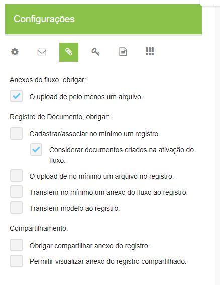<figcaption></figcaption></figure>

#### Aba Assinaturas

* **Assinar:** Selecione as opções sobre o que deverá ser assinado pelo responsável da tarefa. &#x20;
* **Tarefas de Acesso Externo do Fluxo:** Marque as opções se um usuário externo precisar assinar um anexo ou um registro de documento do fluxo.&#x20;

<figure>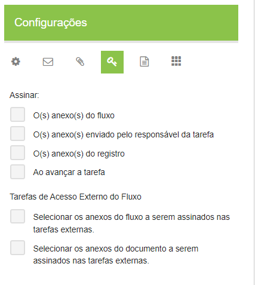<figcaption></figcaption></figure>

#### Aba Modelo Documento&#x20;

* **Modelo:** Neste campo é exibido o modelo PDF cadastrado anteriormente no campo “Modelo de Arquivo PDF com campos”, na aba Dados Gerais.&#x20;
* **Visualização:** Se marcada essa opção o usuário terá acesso ao modelo PDF cadastrado.&#x20;
* Campos do modelo: Neste espaço são exibidos todos os campos que o sistema extraiu do modelo PDF cadastrado no fluxo. Aqui o usuário deverá marcar como o executor da tarefa poderá interagir com cada campo, sendo `C =` Cadastrar, `O =` Cadastrar Obrigatoriamente e `E =` Editar.

<figure>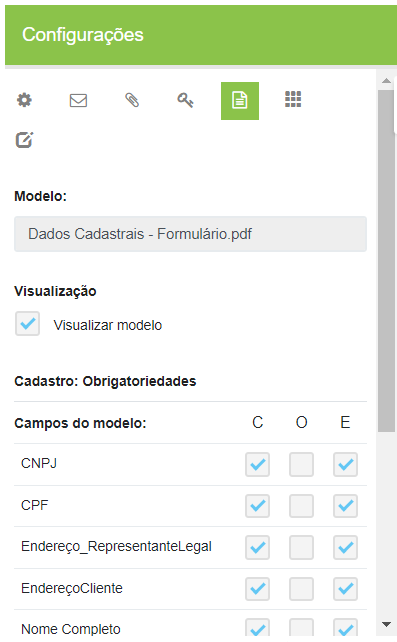<figcaption></figcaption></figure>

* **Assinar modelo:** Marque essa opção caso seja solicitado ao executor que assine o modelo PDF durante o fluxo.

<figure>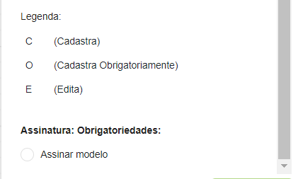<figcaption></figcaption></figure>

#### Aba Campos

* **Formulário:** Neste campo é exibido o formulário cadastrado anteriormente no campo “Formulário”, na [aba Dados Gerais](aba-dados-gerais.md).&#x20;
* **Campos:** Neste espaço são exibidos todos os campos do formulário cadastrado associado ao fluxo. Aqui o usuário deverá marcar como o executor da tarefa poderá interagir com cada campo, sendo `V =` Visualiza, `C =` Cadastra, `O =` Cadastra Obrigatoriamente, `E =` Edita e `T =` Exibir na Tarefa. É possível ocultar campos e permitir que o executor tarefa edite determinado campo se necessário. Os campos marcados com T (Exibir na Tarefa) serão mostrados na tela Minhas Atividades, na descrição da tarefa.&#x20;


<mark style="color:orange;">**Os campos que forem ocultos com a opção V (Visualiza) desmarcada só serão ocultados naquela tarefa e não em todo o fluxo, ou seja, em outras tarefas eles aparecerão no formulário normalmente.**</mark>


<figure>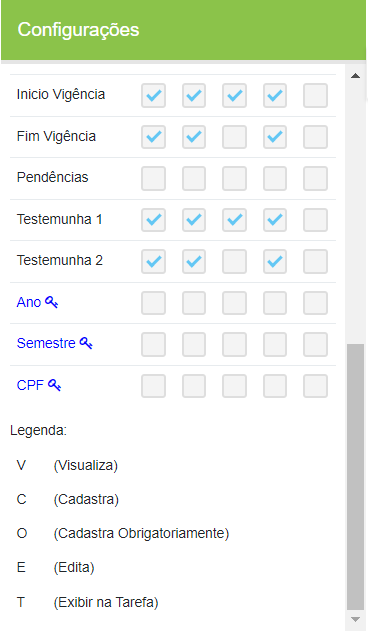<figcaption></figcaption></figure>

#### Aba Layout Tarefa Externa


<mark style="color:orange;">**Essa aba só será exibida caso o responsável da tarefa seja um usuário externo.**</mark>


Defina os nomes que serão exibidos para o usuário externo que receber uma atribuição da tarefa. Esses nomes serão exibidos na tela de detalhes da tarefa, exibida quando o usuário externo clica no link recebido por e-mail para realizar a tarefa.

<figure>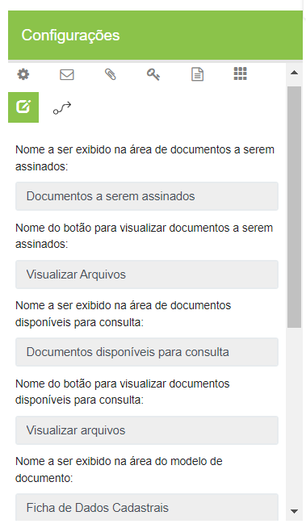<figcaption></figcaption></figure>

* **Ordem e exibição das áreas:** Defina a ordem de exibição dos campos e marque somente aqueles que deverão ser exibidos para o usuário externo.

<figure>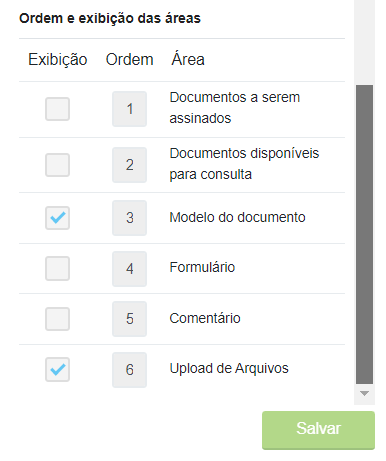<figcaption></figcaption></figure>

#### Aba Automação


<mark style="color:orange;">**Essa aba só será exibida caso o responsável da tarefa seja um usuário externo.**</mark>


* **Usar o(s) email(s) como responsável(is) pels etapa:** Se marcada essa opção ao invés de solicitar que o usuário informe o e-mail externo para recebimento da tarefa, o sistema extrairá esse e-mail de algum dos campos do formulário cadastrado. Neste caso é preciso apontar de qual campo será extraída a informação.

<figure>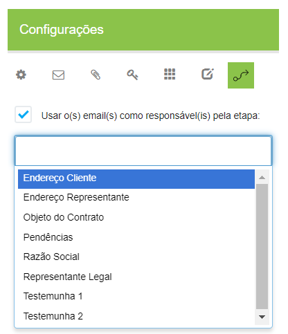<figcaption></figcaption></figure>

***

## Decisão

Indica que naquele momento do fluxo é necessário que o executor da tarefa tome uma decisão sobre a próxima etapa. Neste caso é preciso indicar os caminhos que o usuário poderá seguir. Cada decisão pode ter até seis caminhos distintos.

<figure><figcaption></figcaption></figure>

### Configurações da Decisão

As configurações da Decisão e da Tarefa são idênticas. A única diferença entre as duas é que na tarefa só é possível utilizar um conector de saída para outra tarefa, enquanto na Decisão é possível utilizar até seis conectores para outras tarefas. Para configurar uma Decisão, parametrize as abas:

* [Configurações](aba-fluxograma.md#aba-configuracoes)
* [E-mail](aba-fluxograma.md#aba-e-mail)
* [Anexos](aba-fluxograma.md#aba-anexos)
* [Assinaturas](aba-fluxograma.md#aba-assinaturas),
* [Modelo Documento](aba-fluxograma.md#aba-modelo-documento)
* [Campos](aba-fluxograma.md#aba-campos)
* [Layout Tarefa Externa](aba-fluxograma.md#aba-layout-tarefa-externa)
* [Automação](aba-fluxograma.md#aba-automacao)

***

## Início/Fim

Representa o início e fim de fluxo, ou seja, deve ser inserido no início e no final, obrigatoriamente.

### Configurações de Início/Fim

* **Tipo:** Selecione se o ícone está representando o início ou fim do fluxo.

<figure>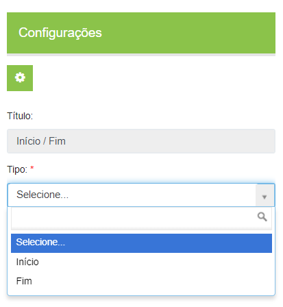<figcaption></figcaption></figure>

***

## E-mail

Representa uma etapa em que será enviado para um usuário uma visão geral de tudo o que foi executado no fluxo até o momento, sem a necessidade de alguma ação por parte deste usuário. Ele será simplesmente notificado do status do fluxo, sem precisar cumprir nenhuma obrigatoriedade. 

<figure>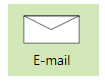<figcaption></figcaption></figure>

### Configurações de E-mail

* **Notificar:** Informe quem deverá ser notificado. O sistema poderá notificar um usuário, um grupo de usuários ou todos os envolvidos no fluxo.

<figure>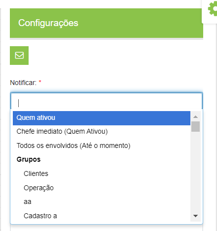<figcaption></figcaption></figure>

* **E-mail externos**: Se forem notificados usuários externos, informe os e-mails e insira uma mensagem personalizada de notificação. &#x20;
* **Mensagem personalizada:** Neste campo pode ser inserida uma mensagem personalizada que será exibida para o usuário executor da tarefa. &#x20;
* **Incluir na notificação:** Selecione o que deverá ser incluído na notificação: se todos os comentários feitos ao longo do fluxo ou se apenas o último. Indique se devem ser incluídos a observação inserida na ativação do fluxo e os campos do formulário associado ao fluxo.&#x20;

<figure>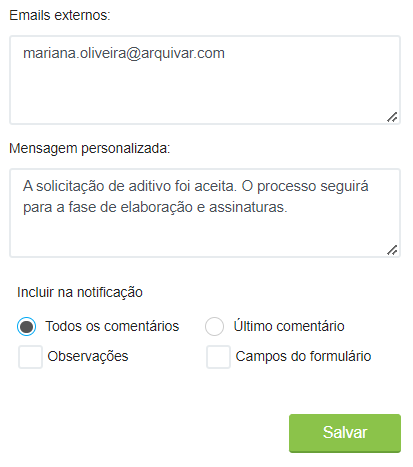<figcaption></figcaption></figure>

***

## Fluxo

Indica quo fluxo atual se encerra naquela etapa e um novo fluxo será ativado naquele momento.  

<figure>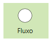<figcaption></figcaption></figure>

### Configurações de Fluxo

* **Ativar o fluxo**: Selecione o fluxo que deverá ser ativado automaticamente.

<figure>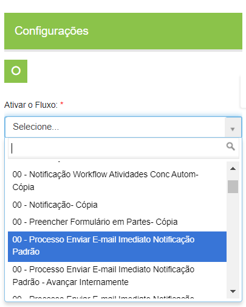<figcaption></figcaption></figure>

***

## Grupo

Indica quando um grupo de tarefas independentes devem ser concluídas para que o fluxo continue.

<figure>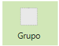<figcaption></figcaption></figure>

 

<figure><figcaption></figcaption></figure>

### Configurações de Grupo

* **Nome do Agrupador**: Informe o nome do grupo de tarefas. &#x20;
* **Tarefas Agrupadas:** Informe as tarefas que fazem parte do grupo. &#x20;
* **Condição do Agrupador:** Informe se todas as tarefas devem ser concluídas para prosseguimento (E) ou se apenas uma delas precisa ser concluída para que o fluxo avance automaticamente (OU). &#x20;

<figure>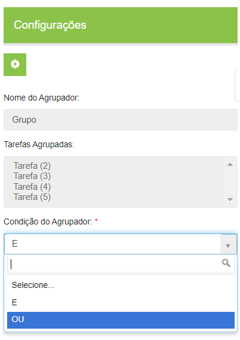<figcaption></figcaption></figure>

***

## Tarefa do tipo Gateway Exclusivo

Em um desenho de fluxo que possuir formulário, a tarefa do tipo Gateway Exclusivo irá exibir todos os campos existentes neste formulário para que o usuário possa configurar qual campo será o responsável pelo avanço. Este é um tipo de tarefa que será utilizado somente para avanço automático via preenchimento de campo de formulário.

<figure>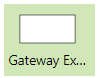<figcaption></figcaption></figure>

O conector de saída de uma tarefa do tipo Gateway Exclusivo, irá exibir o campo de formulário configurado, para que o usuário possa definir qual valor será utilizado para o avanço automático. O campo de formulário configurado será preenchido em alguma tarefa anterior e, quando chegar nesta tarefa, a aplicação irá identificar se o valor preenchido corresponde ao valor definido para o conector de saída conforme configurado no desenho.


<mark style="color:blue;">**EXEMPLO:**</mark> <mark style="color:blue;"></mark><mark style="color:blue;">Uma tarefa do tipo Gateway Exclusivo foi configurada com o campo do formulário “Faturamento” e este é um campo do tipo lista que possui as opções: “Até 20 mil”, “Até 50 mil” e “Acima de 50 mil”. O conector de saída desta tarefa irá exibir o campo do formulário configurado com as opções para definição do avanço automático. Pode-se definir, por exemplo, que se o usuário selecionar a opção “Acima de 50 mil” o fluxo avance automaticamente para a próxima tarefa.</mark>


Uma tarefa do tipo Gateway também poderá ser configurada para avançar automaticamente por atraso, conforme já existe atualmente. Neste caso, a tarefa será avançada automaticamente de acordo com a primeira condição encontrada, por atraso ou por campo de formulário.

### Configurações de Tarefa do tipo Gateway Exclusivo

#### Aba Configurações

* **Status:** Informe o status que será exibido para o usuário quando o fluxo chegar à etapa de execução desta tarefa.&#x20;
* **Prazo:** Defina o prazo para o avanço automático.&#x20;
* **Campo do Formulário:** Selecione qual campo do formulário será usado como referência para o avanço automático da tarefa.   &#x20;

<figure>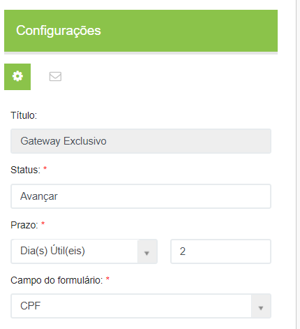<figcaption></figcaption></figure>

#### Aba Notificação

* **Notificar quando:** Informe quando será enviada a notificação sobre a tarefa.

<figure><figcaption></figcaption></figure>

* **% de tempo:** Esse campo será exibido se no campo “Notificar quando” tiver sido escolhida a opção “Ao atrasar um % de tempo” ou “Antes de atrasar um % de tempo”. Neste caso deve ser informada aqui a porcentagem de tempo de atraso, considerando o prazo cadastrado na aba Configurações. &#x20;
* **Notificar:** Informe quem deverá ser notificado. O sistema poderá notificar um usuário ou um grupo de usuários. &#x20;

<figure><figcaption></figcaption></figure>

* **E-mail externos:** Se forem notificados usuários externos, informe os e-mails e insira uma mensagem personalizada de notificação.&#x20;
* **Mensagem personalizada:** Neste campo pode ser inserida uma mensagem personalizada que será exibida para o usuário executor da tarefa.&#x20;
* **Incluir na notificação:** Selecione o que deverá ser incluído na notificação: se todos os comentários feitos ao longo do fluxo ou se apenas o último. Indique se devem ser incluídos a observação inserida na ativação do fluxo e os campos do formulário associado ao fluxo.   &#x20;
* **Quando for executada mais de uma vez**: Essa opção deve ser marcada se, caso a tarefa seja executada mais de uma vez, a notificação precise também ser enviada mais de uma vez. Neste caso deve ser preenchido também o campo Quantidade de vezes executada.&#x20;
* **Ao delegar a responsabilidade:** Marque essa opção para que seja enviada uma notificação sempre que o responsável pela tarefa a delegue a outra pessoa. Essa opção só estará disponível caso o campo “Inibe opção de delegar” esteja desabilitado na aba Configurações. Se a tarefa for de execução externa, essa opção não será exibida.&#x20;

<figure><figcaption></figcaption></figure>

***

## Decisão do tipo Gateway Exclusivo

Em um desenho de fluxo que possuir formulário, a decisão do tipo Gateway Exclusivo irá exibir todos os campos existentes neste formulário para que o usuário possa configurar qual campo será o responsável pelo avanço. Este é um tipo de tarefa que será utilizado somente para avanço automático via preenchimento de campo de formulário.

<figure>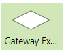<figcaption></figcaption></figure>

O conector de avanço de uma decisão do tipo Gateway Exclusivo, irá exibir o campo de formulário configurado para que o usuário possa definir qual valor será utilizado para o avanço automático. O campo de formulário configurado deve ser preenchido em alguma tarefa anterior e, quando chegar nesta tarefa, a aplicação irá identificar se o valor preenchido corresponde ao valor definido para avanço.

### Configurações da Decisão do tipo Gateway Exclusivo

#### Aba Configurações

* **Status:** Informe o status que será exibido para o usuário quando o fluxo chegar à etapa de execução desta tarefa.&#x20;
* **Prazo:** Defina o prazo para o avanço automático.&#x20;
* **Campo do Formulário:** Selecione qual campo do formulário será usado como referência para o avanço automático da tarefa.  &#x20;

<figure><figcaption></figcaption></figure>

#### Aba Notificação

* **Notificar quando:** Informe quando será enviada a notificação sobre a tarefa.

<figure><figcaption></figcaption></figure>

* **% de tempo:** Esse campo será exibido se no campo “Notificar quando” tiver sido escolhida a opção “Ao atrasar um % de tempo” ou “Antes de atrasar um % de tempo”. Neste caso deve ser informada aqui a porcentagem de tempo de atraso, considerando o prazo cadastrado na aba Configurações. &#x20;
* **Notificar:** Informe quem deverá ser notificado. O sistema poderá notificar um usuário ou um grupo de usuários.

<figure><figcaption></figcaption></figure>

* **E-mail externos:** Se forem notificados usuários externos, informe os e-mails e insira uma mensagem personalizada de notificação.&#x20;
* **Mensagem personalizada:** Neste campo pode ser inserida uma mensagem personalizada que será exibida para o usuário executor da tarefa.&#x20;
* **Incluir na notificação:** Selecione o que deverá ser incluído na notificação: se todos os comentários feitos ao longo do fluxo ou se apenas o último. Indique se devem ser incluídos a observação inserida na ativação do fluxo e os campos do formulário associado ao fluxo.   &#x20;
* **Quando for executada mais de uma vez:** Essa opção deve ser marcada se, caso a tarefa seja executada mais de uma vez, a notificação precise também ser enviada mais de uma vez. Neste caso deve ser preenchido também o campo Quantidade de vezes executada.&#x20;
* **Ao delegar a responsabilidade:** Marque essa opção para que seja enviada uma notificação sempre que o responsável pela tarefa a delegue a outra pessoa. Essa opção só estará disponível caso o campo “Inibe opção de delegar” esteja desabilitado na aba Configurações. Se a tarefa for de execução externa, essa opção não será exibida.&#x20;

<figure><figcaption></figcaption></figure>
