# 🔹 Aba Fluxograma

## Conector



Conecta as etapas do fluxo. Deve ser inserido ligando uma tarefa à outra no desenho. Para cada conector será exibido para o usuário um botão de prosseguimento no fluxo.

<figure><figcaption></figcaption></figure>

### Configurações do Conector

* **Ação de Avanço:** Informe o nome do botão que vai aparecer na tela da tarefa quando o usuário for dar prosseguimento ao fluxo.  Caso seja um conector de uma tarefa que será executada por um usuário externo, informe as obrigatoriedades que ele deverá executar para dar prosseguimento ao fluxo. &#x20;
* **Origem:** Mostra a tarefa ou decisão que é a origem do conector.&#x20;
* **Destino:** Mostra a tarefa ou decisão de destino do conector.&#x20;
* **Avançar Automaticamente:** Selecione essa opção se o prosseguimento da etapa for automático depois de um determinado percentual de atraso de execução da tarefa. Neste caso, é preciso preencher também o campo Percentual de Atraso. &#x20;

<figure>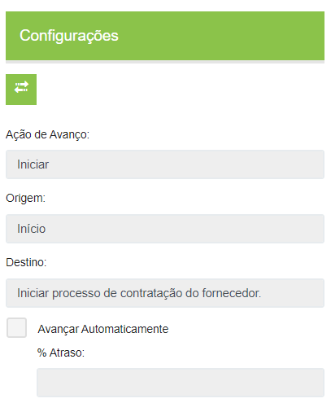<figcaption></figcaption></figure>

### Configurações do Conector de Tarefa tipo Gateway Exclusivo

* **Avançar Automaticamente:** Ao marcar esta opção, o campo numérico “% Atraso” ficará habilitado para o usuário informar o % de atraso para que a decisão avance para este caminho de forma automática conforme o tempo de atraso. &#x20;
* **Condição para este avanço:** Este campo virá marcado e desabilitado &#x20;
* **Quando o campo:** Neste campo já virá preenchido de forma automática o campo do formulário informado nas configurações da tarefa do tipo Gateway Exclusivo associada ao conector.&#x20;
* **For:** Este campo será do tipo dropdown e terão os seguintes valores: “=”, “>=”, “<=” e “<>”. &#x20;
* **Ao valor:** Este campo sempre irá obedecer ao formato do campo que está sendo exibido no “Campo do formulário”. Ou seja, se o “Campo do formulário” for um campo de lista do tipo lista, este campo deverá ser exibido como dropdown exibindo as opções existentes para ele. Se o “Campo do formulário” for numérico, este campo deverá ser exibido no formato numérico. Se o “Campo do formulário” for monetário, este campo deverá ser exibido no formato monetário.&#x20;

<figure>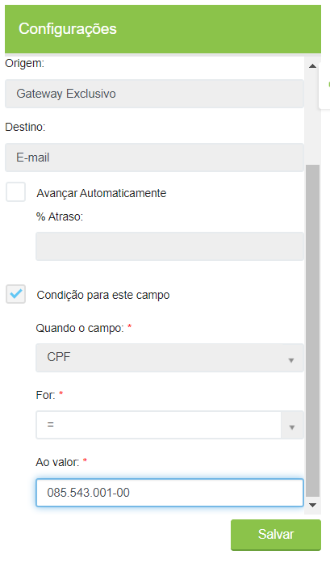<figcaption></figcaption></figure>

### Configurações do Conector de Decisão tipo Gateway Exclusivo

* **Avançar Automaticamente**: Ao marcar esta opção, o campo numérico “% Atraso” ficará habilitado para o usuário informar o % de atraso para que a decisão avance para este caminho de forma automática conforme o tempo de atraso. &#x20;
* **Condição para este campo:** Selecione esta opção caso deseje que o fluxo avance automaticamente a partir da condição de preenchimento de um campo específico do formulário. &#x20;
* **Quando o campo:** Neste campo já virá preenchido de forma automática o campo do formulário informado nas configurações da tarefa do tipo Gateway Exclusivo associada ao conector.&#x20;
* **For**: Este campo será do tipo dropdown e terão os seguintes valores: “=”, “>=”, “<=” e “<>”. &#x20;
* **Ao valor:** Este campo sempre irá obedecer ao formato do campo que está sendo exibido no “Campo do formulário”. Ou seja, se o “Campo do formulário” for um campo de lista do tipo lista, este campo deverá ser exibido como dropdown exibindo as opções existentes para ele. Se o “Campo do formulário” for numérico, este campo deverá ser exibido no formato numérico. Se o “Campo do formulário” for monetário, este campo deverá ser exibido no formato monetário.&#x20;


<mark style="color:blue;">**Regras de configuração do avanço automático para conectores de saída de uma decisão do tipo Gateway:**</mark> <mark style="color:blue;"></mark>&#x20;

<mark style="color:blue;">-> No conector vinculado a uma decisão do tipo gateway, a aplicação irá exigir que sejam configurados a opção “Avançar Automaticamente” ou a “Condição para este avanço”.</mark> &#x20;

<mark style="color:blue;">-> No conector vinculado a uma decisão do tipo gateway, a aplicação irá exigir que os conectores de saída da decisão em questão tenham combinações dos campos “For” e “Ao Valor” diferentes.</mark> &#x20;

<mark style="color:blue;">-> No conector vinculado a uma decisão do tipo gateway, a aplicação irá exigir que se tenha no máximo um conector de saída com a opção “Avançar Automaticamente” para a decisão em questão. O uso da opção “Avançar Automaticamente” não é obrigatório, mas quando esta opção for usada, ela poderá estar em somente um conector de saída da decisão.</mark> &#x20;

<mark style="color:blue;">-> As tarefas seguintes da decisão do tipo gateway não poderão ter o Tipo Responsável como: “Selecionado”, “Selecionado Externo Único” (sem automação para extração do e-mail de campo de formulário) e “Selecionado Externo Vários” (sem automação para extração do e-mail de campo de formulário).</mark>&#x20;


<figure>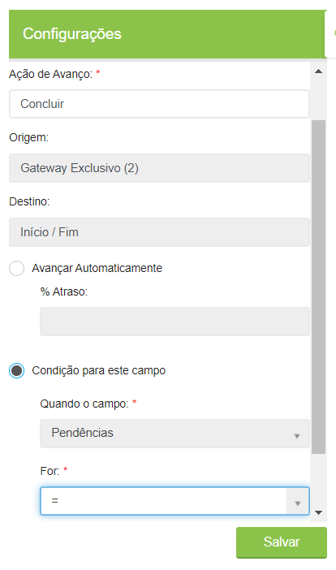<figcaption></figcaption></figure>

***

## Tarefa



Representa as tarefas do fluxo. Ao inserir uma tarefa, insira o seu nome ou uma breve descrição do que deve ser feito naquela tarefa. 

<figure>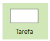<figcaption></figcaption></figure>

### Configurações da Tarefa

Todas as tarefas criadas no desenho do fluxo devem ser configuradas individualmente.

#### Aba Configurações&#x20;

* **Título:** Nome da tarefa. Para editar o título da tarefa, clique sobre o ícone da tarefa no fluxograma. &#x20;
* **Status:** Informe o status para a tarefa. Esse status informará ao usuário em que fase o fluxo se encontra durante a execução daquela tarefa. &#x20;

<figure>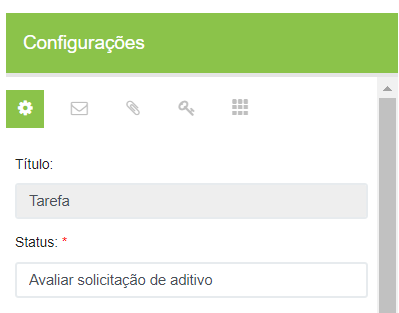<figcaption></figcaption></figure>

* **Tipo de Responsável**: Selecione que tipo de usuário será o responsável por executar aquela tarefa.  &#x20;
  * Chefe imediato (Quem Ativou): Essa opção só será exibida se o fluxo for de ativação manual. Neste caso a tarefa será direcionada para o chefe da pessoa que ativou o fluxo. O sistema obterá a informação de quem é o chefe da pessoa que ativou o fluxo por meio do Cadastro de Usuário.&#x20;
  * Usuário externo: É um usuário fixo que sempre será o executor da tarefa, mas que não precisará estar logado no sistema para executá-la. Será solicitado que seja informado o e-mail da pessoa (campo “E-mail para receber o token”).&#x20;
  * Grupo: será solicitado selecionar o grupo cadastrado anteriormente no menu Workflow > Grupo de Usuários e definir se a tarefa será uma atividade conjunta ou individual. Se a atividade for conjunta, no campo “Consenso” informe a porcentagem que será considerada para prosseguimento do fluxo, de acordo com o número de integrantes do grupo (exemplo: se há duas pessoas e for colocado 50%, quando uma delas assinar o fluxo poderá seguir. Se for colocado 100%, as duas precisarão assinar). Se a tarefa for individual, o sistema escolherá quem vai executar a tarefa. Nesse caso defina se essa escolha vai se basear em uma fila (o sistema obedecerá a ordem alfabética, distribuindo tarefas igualmente para todos os membros do grupo), ou se vai se basear em ociosidade (o sistema direcionará a tarefa para o usuário com menor número de tarefas pendentes).&#x20;


<mark style="color:blue;">Quando o tipo de usuário for grupo, serão exibidos</mark> <mark style="color:blue;"></mark><mark style="color:blue;">**tanto os grupos do usuário quanto da unidade**</mark><mark style="color:blue;">.</mark>


* Quem ativou: Neste caso a tarefa será direcionada para o usuário que ativou o fluxo.&#x20;
* Selecionado: deverá ser indicado o responsável durante a execução do fluxo. &#x20;
* Selecionado externo único: Deverá ser informado o e-mail do responsável durante a execução do fluxo.&#x20;
* Selecionado externo vários: Deverá ser informado o e-mail do responsável durante a execução do fluxo. O usuário poderá definir qual o percentual de execução para o avanço (campo “% Consenso”), ou seja, a tarefa poderá prosseguir mesmo quando a porcentagem de usuários definida aqui a execute. Deverá ser preenchido o campo “Decisão de Consenso”, que apontará para o sistema para onde o fluxo deverá seguir após atingir o percentual de consenso configurado. &#x20;
* Usuários: será solicitado selecionar o usuário que será o responsável.  &#x20;
* Quem executou uma tarefa externa: Nesse caso a tarefa é direcionada para algum usuário externo que tenha executado alguma outra tarefa durante o fluxo. É preciso definir no campo “Tarefas” a tarefa que está associada e o e-mail utilizado para notificar o usuário será extraído dessa outra tarefa. Só podem ser incluídas tarefas de referência cujo tipo de responsável seja “Selecionado Externo Único”.&#x20;
* Quem executou uma tarefa interna: O sistema direcionará a tarefa para mesmo usuário que executou alguma outra tarefa durante o fluxo, que deverá ser indicada no campo “Tarefas”. Para este Tipo de Responsável só podem ser incluídas tarefas de referência cujo tipo de responsável anterior seja “Selecionado”, “Grupos por fila” ou “Grupos por ociosidade”.&#x20;

<figure>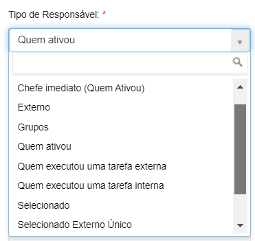<figcaption></figcaption></figure>

* **Prazo:** Informe o prazo que o responsável terá para executar a tarefa. Se o prazo considerar dias, horas e minutos úteis, o sistema vai considerar o [horário de trabalho](../horarios-de-trabalho.md) e [calendário](../calendarios.md) cadastrados no menu Workflow. Caso não hajam esses cadastros o sistema sempre vai considerar o prazo corrido.&#x20;
* **Inibe a opção de delegar:** Se marcada essa opção o responsável não poderá delegar a tarefa para que outra pessoa execute. &#x20;
* **Obrigar comentário na etapa:** Obriga o responsável a fazer um comentário sobre o status ou execução da tarefa antes de dar prosseguimento. &#x20;
* **Descrição da Etapa:** Descrição que será apresentada para o usuário no momento em que ele receber a tarefa. Neste campo pode ser feita a descrição do que deve ser executado de forma mais detalhada. &#x20;

<figure>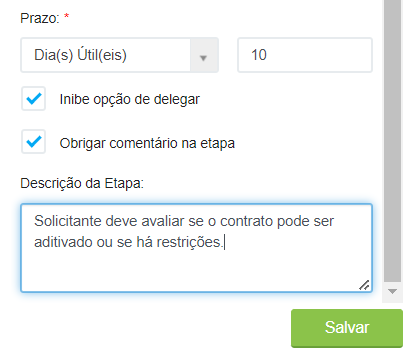<figcaption></figcaption></figure>

#### Aba E-mail



* **Notificar quando:** Informe quando será enviada a notificação sobre a tarefa.

<figure>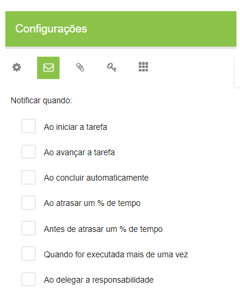<figcaption></figcaption></figure>

* **% de tempo:** Esse campo será exibido se no campo “Notificar quando” tiver sido escolhida a opção “Ao atrasar um % de tempo” ou “Antes de atrasar um % de tempo”. Neste caso deve ser informada aqui a porcentagem de tempo de atraso, considerando o prazo cadastrado na aba Configurações. &#x20;
* **Notificar:** Informe quem deverá ser notificado. O sistema poderá notificar um usuário ou um grupo de usuários.

<figure>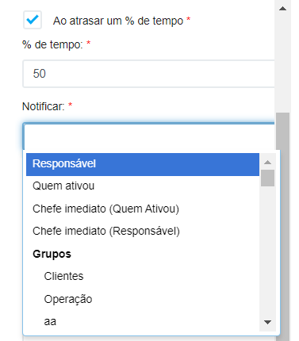<figcaption></figcaption></figure>

* **E-mail externos:** Se forem notificados usuários externos, informe os e-mails e insira uma mensagem personalizada de notificação.&#x20;
* **Mensagem personalizada:** Neste campo pode ser inserida uma mensagem personalizada que será exibida para o usuário executor da tarefa.&#x20;
* **Incluir na notificação:** Selecione o que deverá ser incluído na notificação: se todos os comentários feitos ao longo do fluxo ou se apenas o último. Indique se devem ser incluídos a observação inserida na ativação do fluxo e os campos do formulário associado ao fluxo.   &#x20;
* **Quando for executada mais de uma vez:** Essa opção deve ser marcada se, caso a tarefa seja executada mais de uma vez, a notificação precise também ser enviada mais de uma vez. Neste caso deve ser preenchido também o campo Quantidade de vezes executada.&#x20;
* **Ao delegar a responsabilidade:** Marque essa opção para que seja enviada uma notificação sempre que o responsável pela tarefa a delegue a outra pessoa. Essa opção só estará disponível caso o campo “Inibe opção de delegar” esteja desabilitado na [aba Configurações.](aba-fluxograma.md#aba-configuracoes) Se a tarefa for de execução externa, essa opção não será exibida.&#x20;

<figure>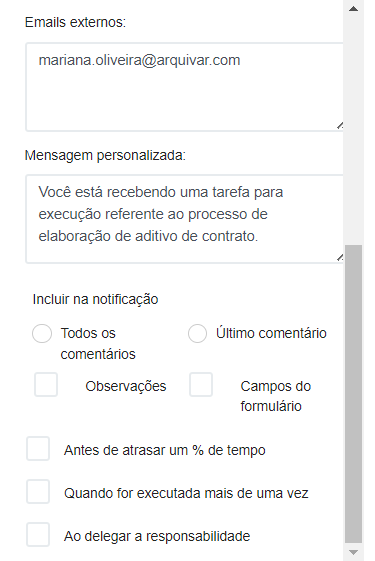<figcaption></figcaption></figure>

#### Aba Anexos



* **Anexo do fluxo, obrigar:** Marque a opção “O upload de pelo menos um arquivo” caso deseje obrigar o usuário a anexar pelo menos um documento ao fluxo. &#x20;
* **Registro de Documento, obrigar:** Selecione as opções desejadas sobre as obrigatoriedades de cadastrar um novo documento ou associar um documento já cadastrado anteriormente ao fluxo. &#x20;


<mark style="color:blue;">**Diferença entre Anexos do Fluxo e Registro de Documento:**</mark>&#x20;

_<mark style="color:blue;">Anexos do fluxo:</mark>_ <mark style="color:blue;"></mark><mark style="color:blue;">Qualquer usuário interno ou externo que tiver acesso ao fluxo pode visualizar os anexos. Indicado utilizar quando forem documentos que devem ser validados e ainda estão em tramitação.</mark>&#x20;

_<mark style="color:blue;">Registro de Documento:</mark>_ <mark style="color:blue;"></mark><mark style="color:blue;">Existe uma restrição de quais usuários poderão acessar o documento, porque estará associado à árvore documental. Somente os usuários com acesse aquele nível de árvore poderão acessar o documento. Indicado utilizar essa opção para o documento final do fluxo, já validado e que vai ser registrado como o oficial.</mark> &#x20;


* **Considerar documentos criados na ativação do fluxo:** Essa opção só estará disponível caso a ativação do fluxo, definida no campo Tipo de Ativação da aba Configurações, seja automática. &#x20;
* **Compartilhamento**: Marque os campos se for necessário compartilhar o documento com usuários externos que deverão conseguir visualizar os anexos.&#x20;

<figure>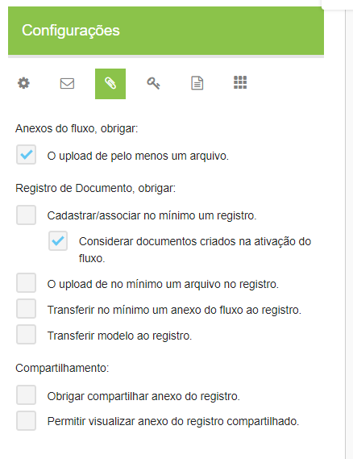<figcaption></figcaption></figure>

#### Aba Assinaturas



* **Assinar:** Selecione as opções sobre o que deverá ser assinado pelo responsável da tarefa. &#x20;
* **Tarefas de Acesso Externo do Fluxo:** Marque as opções se um usuário externo precisar assinar um anexo ou um registro de documento do fluxo.&#x20;

<figure>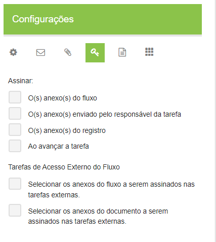<figcaption></figcaption></figure>

#### Aba Modelo Documento&#x20;



* **Modelo:** Neste campo é exibido o modelo PDF cadastrado anteriormente no campo “Modelo de Arquivo PDF com campos”, na aba Dados Gerais.&#x20;
* **Visualização:** Se marcada essa opção o usuário terá acesso ao modelo PDF cadastrado.&#x20;
* **Campos do modelo:** Neste espaço são exibidos todos os campos que o sistema extraiu do modelo PDF cadastrado no fluxo. Aqui o usuário deverá marcar como o executor da tarefa poderá interagir com cada campo, sendo `C =` Cadastrar, `O =` Cadastrar Obrigatoriamente e `E =` Editar. O usuário poderá marcar um capo por vez ou marcar todos utilizando a opção o "campos do modelo".

<figure><figcaption>
Clique na imagem para ampliar.
</figcaption></figure>

* **Assinar modelo:** Marque essa opção caso seja solicitado ao executor que assine o modelo PDF durante o fluxo.

<figure>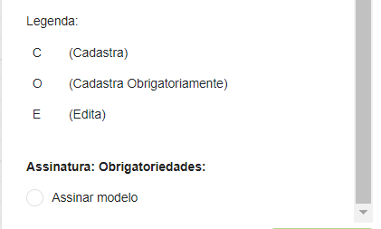<figcaption></figcaption></figure>

#### Aba Formulário



* **Formulário:** Neste campo é exibido o nome do formulário cadastrado anteriormente no campo “Formulário”, na [aba Dados Gerais](aba-dados-gerais.md).&#x20;
* **Campos:** Neste espaço são exibidos todos os campos do formulário cadastrado associado ao fluxo. Aqui o usuário deverá marcar como o executor da tarefa poderá interagir com cada campo, sendo `V =` Visualiza, `C =` Cadastra, `O =` Cadastra Obrigatoriamente, `E =` Edita e `T =` Exibir na Tarefa.  O usuário poderá marcar um capo por vez ou marcar todos utilizando a opção o "campos". É possível ocultar campos e permitir que o executor tarefa edite determinado campo se necessário. Os campos marcados com T (Exibir na Tarefa) serão mostrados na tela Minhas Atividades, na descrição da tarefa.&#x20;


<mark style="color:orange;">**Os campos que forem ocultos com a opção V (Visualiza) desmarcada só serão ocultados naquela tarefa e não em todo o fluxo, ou seja, em outras tarefas eles aparecerão no formulário normalmente.**</mark>


<figure><figcaption>
Clique na imagem para ampliar.
</figcaption></figure>

<figure>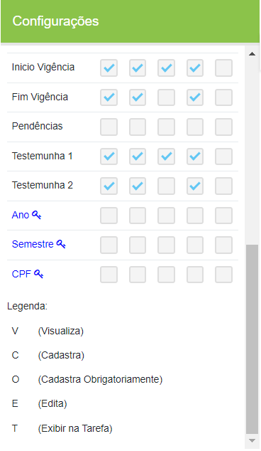<figcaption>
Clique na imagem para ampliar.
</figcaption></figure>

#### Aba Layout Tarefa Externa




<mark style="color:orange;">**Essa aba só será exibida caso o responsável da tarefa seja um usuário externo.**</mark>


Defina os nomes que serão exibidos para o usuário externo que receber uma atribuição da tarefa. Esses nomes serão exibidos na tela de detalhes da tarefa, exibida quando o usuário externo clica no link recebido por e-mail para realizar a tarefa.

<figure>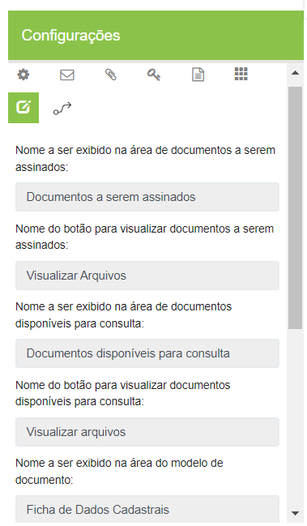<figcaption></figcaption></figure>

* **Ordem e exibição das áreas:** Defina a ordem de exibição dos campos e marque somente aqueles que deverão ser exibidos para o usuário externo.

<figure>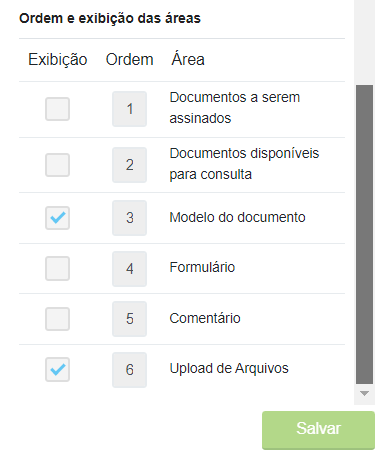<figcaption></figcaption></figure>

### Aba Layout Tarefa Interna 

#### **Fluxos sem contrato de Integração ArqSign**

Na configuração de uma tarefa, no desenho do fluxo, a tela de **Layout de Tarefa interna**, permite definir quais áreas devem ser exibidas ao responsável durante a execução da tarefa, ou seja, quais funcionalidades ele poderá utilizar, como cadastro de documentos, upload de arquivos no fluxo, preenchimento de formulário, entre outras. É nesta tela que deve ser definida a restrição ou liberação de determinadas funcionalidades durante a execução do fluxo.

<figure><figcaption>
Clique na imagem para ampliar.
</figcaption></figure>

**Exibição**: Indica se a área será apresentada ou não durante a execução da tarefa. Este campo pode ser marcado opcionalmente pelo usuário ou definido automaticamente pela aplicação, de acordo com a obrigatoriedade correspondente.

**Ordem:** Define a posição da área na tela durante a execução da tarefa.

**Área:** Indica as obrigatoriedades ou ações opcionais que devem ser realizadas durante a execução da tarefa.

Ao marcar uma área para exibição, o campo "Nome para a área" é apresentado automaticamente com um nome padrão da aplicação. Esse nome será usado como título da área durante a execução da tarefa. É importante escolher um nome que seja familiar ao usuário dentro do processo; caso não seja necessário, basta manter o nome padrão definido pela aplicação.

<figure><figcaption>
Clique na imagem para ampliar.
</figcaption></figure>


**Importante:** Esta tela sempre será apresentada com as áreas **Comentários**, **Documentos**, **Modelo de Documento** (quando houver) e **Arquivos** desabilitadas para seleção.

Quando não houver obrigatoriedades configuradas para uma tarefa, as áreas poderão ser marcadas para exibição durante a execução da atividade, mas serão tratadas como ações opcionais para o responsável.

**Exemplo:** Se não houver configuração de 'Obrigar comentário na etapa', mas o usuário marcar a exibição da área 'Comentários' na tela de layout, o responsável verá a área sem a obrigatoriedade de comentar — será uma ação opcional.

Sempre que uma obrigatoriedade for configurada, a área correspondente será marcada e desabilitada automaticamente pela aplicação.

**Exemplo:** Se a tarefa estiver configurada para 'Obrigar comentário na etapa', ao acessar a aba de Layout da Tarefa Interna, a área estará marcada e desabilitada, indicando que é uma ação obrigatória para o responsável pela execução da tarefa.

Apenas o campo 'Ordem' permanece sempre habilitado quando uma área é selecionada para exibição. Isso permite que o usuário defina a posição das áreas conforme necessário.


<figure><figcaption>
Clique na imagem para ampliar.
</figcaption></figure>

**Modelo de Documento:** Se houver um modelo de documento castrado para o fluxo, é possível definir se o usuário deve ver esse modelo e ainda qual deve ser o nome apresentado ao usuário, neste caso, a aplicação carrega como padrão o nome dado ao arquivo modelo e não o nome do campo. Ajuste para o nome familiar utilizado pelos participantes do processo.

<figure><figcaption>
Clique na imagem para ampliar.
</figcaption></figure>

**Arquivos:** Esta área indica que serão exibidos os anexos do fluxo. Além disso, possui as opções **'Exibir Modelo'** e **'Exibir anexo do Registro'**.

**Exibir Modelo:** Quando marcada, a área Arquivos exibirá tanto os anexos do fluxo quanto o modelo de documento relacionado ao processo.

**Exibir anexo do Registro:** Quando marcada, a área Arquivos exibirá os anexos do fluxo e também os anexos dos documentos relacionados ao processo.

<figure><figcaption>
Clique na imagem para ampliar.
</figcaption></figure>


É possível selecionar mais de uma opção, ou todas elas. Importante avaliar a necessidade de exibição no momento da execução do processo pelo usuário.


**Download em Massa:** ao marcar essa opção a **aba de download em massa** será exibida na área de **anexos** e na área de **documentos.**

<figure><figcaption>
Clique na imagem para ampliar.
</figcaption></figure>

<figure><figcaption>
Clique na imagem para ampliar.
</figcaption></figure>


Ao realizar a configuração do Download em Massa, não é possível definir sua ordem de exibição, isso ocorre pelo fato do download em massa acontecer dentro de outra área. Ele vai acontecer dentro de "Arquivos" e "Documentos".&#x20;



Concluídas essas definições o usuário não mais verá todos os ícones do processo, serão exibidos apenas aqueles devidamente configuração para exibição.

<figure><figcaption>
Clique na imagem para ampliar.
</figcaption></figure>

#### **Fluxos com contrato de Integração ArqSign**

Neste cenário, existe uma particularidade na aba de assinatura.

Quando o fluxo possui assinatura via a ArqSign, não é possível realizar assinatura interna de arquivos, assinatura é realizada somente pela plataforma ArqSign, portanto a aba assinatura não será configurada para este fim. Na aba assinatura, será necessário informar qual deve ser a "Seleção" de arquivos considerada para assinatura via ArqSign.

<figure><figcaption>
Clique na imagem para ampliar.
</figcaption></figure>

Quando marcada a opção "Anexo(s) do fluxo, automaticamente a área "Arquivos" no Layout da tarefa interna" é marcada também, pois é o único lugar onde é possível selecionar anexos do fluxo.

<figure><figcaption>
Clique na imagem para ampliar.
</figcaption></figure>

Quando marcada a opção "Anexos(s) do(s) registro(s)", automaticamente a área "Arquivos" no Layout da tarefa interna" é marcada, com seleção ativa também de "Exibir Anexo do Registro". Isso ocorre pois só é possível selecionar anexos do registro pela ArqSign na área "Arquivos".

<figure><figcaption>
Clique na imagem para ampliar.
</figcaption></figure>

Nas tarefas do tipo ArqSign é definido o que deve ser assinado, os anexos do registro ou os anexos do fluxo sendo essa uma tarefa de acompanhamento, onde é possível reenviar o token para assinatura, ou cancelar o processo de assinatura.

Após configurar o processo ArqSign definido para esta tarefa, é preciso definir o acompanhamento. Então se marcada a opção "Permitir cancelar o processo ArqSign", o usuário pode ou não fazer um comentário, não existe essa obrigatoriedade definida, então neste caso nas configurações de "Layout de tarefa de acesso interno", a área não é marcada automaticamente.

<figure><figcaption>
Clique na imagem para ampliar.
</figcaption></figure>

Se marcada a opção "Permitir cancelar o processo ArqSign" com a obrigatoriedade "Obrigar comentário antes desta ação", a configuração de "Layout de tarefa de acesso interno" muda, sendo realizada a marcação automática da área "Comentário".

<figure><figcaption>
Clique na imagem para ampliar.
</figcaption></figure>

O mesmo comportamento se aplica às demais obrigatoriedades disponíveis na configuração a etapa, quando marcada a obrigatoriedade, a área é automaticamente marcada e desabilitada na aba de "Layout de tarefa de acesso interno".

Quando o fluxo possui um processo de assinatura ArqSign associado, obrigatoriamente será apresentada na tela de "Layout de tarefa de acesso interno" a opção já marcada e desabilitada "Processo ArqSign", porque ela é uma área de acompanhamento.

<figure><figcaption>
Clique na imagem para ampliar.
</figcaption></figure>

#### Aba Automação




<mark style="color:orange;">**Essa aba só será exibida caso o responsável da tarefa seja um usuário externo.**</mark>


* **Usar o(s) email(s) como responsável(is) pels etapa:** Se marcada essa opção ao invés de solicitar que o usuário informe o e-mail externo para recebimento da tarefa, o sistema extrairá esse e-mail de algum dos campos do formulário cadastrado. Neste caso é preciso apontar de qual campo será extraída a informação.

<figure>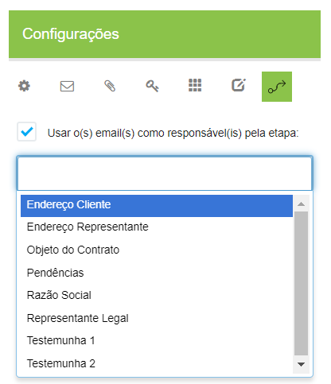<figcaption></figcaption></figure>

***

## Decisão



Indica que naquele momento do fluxo é necessário que o executor da tarefa tome uma decisão sobre a próxima etapa. Neste caso é preciso indicar os caminhos que o usuário poderá seguir. Cada decisão pode ter até seis caminhos distintos.

<figure>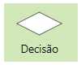<figcaption></figcaption></figure>

### Configurações da Decisão

As configurações da Decisão e da Tarefa são idênticas. A única diferença entre as duas é que na tarefa só é possível utilizar um conector de saída para outra tarefa, enquanto na Decisão é possível utilizar até seis conectores para outras tarefas. Para configurar uma Decisão, parametrize as abas:

* [Configurações](aba-fluxograma.md#aba-configuracoes)
* [E-mail](aba-fluxograma.md#aba-e-mail)
* [Anexos](aba-fluxograma.md#aba-anexos)
* [Assinaturas](aba-fluxograma.md#aba-assinaturas),
* [Modelo Documento](aba-fluxograma.md#aba-modelo-documento)
* [Campos](aba-fluxograma.md#aba-campos)
* [Layout Tarefa Externa](aba-fluxograma.md#aba-layout-tarefa-externa)
* [Automação](aba-fluxograma.md#aba-automacao)

***

## Início/Fim

Representa o início e fim de fluxo, ou seja, deve ser inserido no início e no final, obrigatoriamente.

### Configurações de Início/Fim

* **Tipo:** Selecione se o ícone está representando o início ou fim do fluxo.

<figure>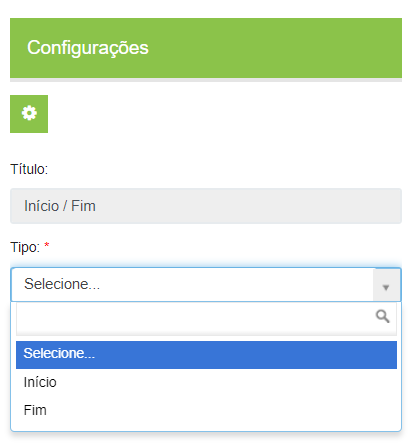<figcaption></figcaption></figure>

***

## E-mail



Representa uma etapa em que será enviado para um usuário uma visão geral de tudo o que foi executado no fluxo até o momento, sem a necessidade de alguma ação por parte deste usuário. Ele será simplesmente notificado do status do fluxo, sem precisar cumprir nenhuma obrigatoriedade. 

<figure>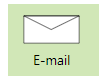<figcaption></figcaption></figure>

### Configurações de E-mail

* **Notificar:** Informe quem deverá ser notificado. O sistema poderá notificar um usuário, um grupo de usuários ou todos os envolvidos no fluxo.

<figure>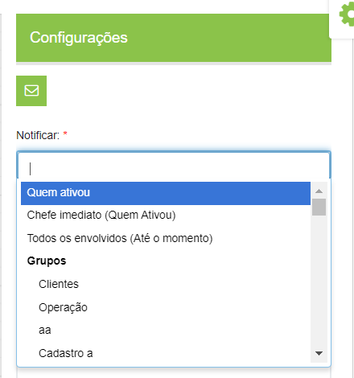<figcaption></figcaption></figure>

* **E-mail externos**: Se forem notificados usuários externos, informe os e-mails e insira uma mensagem personalizada de notificação. &#x20;
* **Mensagem personalizada:** Neste campo pode ser inserida uma mensagem personalizada que será exibida para o usuário executor da tarefa. &#x20;
* **Incluir na notificação:** Selecione o que deverá ser incluído na notificação: se todos os comentários feitos ao longo do fluxo ou se apenas o último. Indique se devem ser incluídos a observação inserida na ativação do fluxo e os campos do formulário associado ao fluxo.&#x20;

<figure>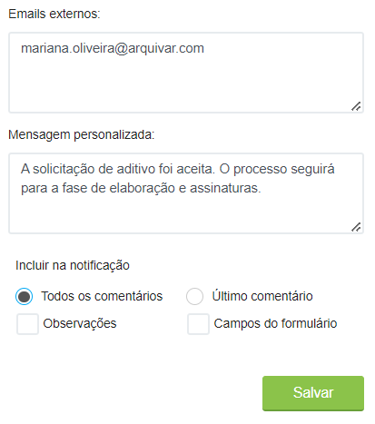<figcaption></figcaption></figure>

***

## Fluxo

Indica quo fluxo atual se encerra naquela etapa e um novo fluxo será ativado naquele momento.  

<figure>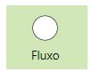<figcaption></figcaption></figure>

### Configurações de Fluxo

* **Ativar o fluxo**: Selecione o fluxo que deverá ser ativado automaticamente.

<figure>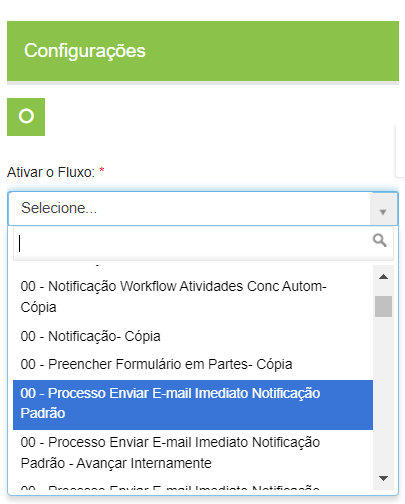<figcaption>
Clique na imagem para ampliar.
</figcaption></figure>

Neste momento o usuário poderá copiar os dados do fluxo atual para o novo fluxo, ou seja, o usuário poderá configurar previamente, quais informações do fluxo atual poderão ser copiadas o fluxo de destino.

<figure><figcaption>
Clique na imagem para ampliar.
</figcaption></figure>

Quando o componente estiver selecionado, no campo Ativar Novo Fluxo, serão exibidos todos os fluxos com status “Em Elaboração” e “Ativo”, incluindo o próprio fluxo que está sendo cadastrado.&#x20;

Para o fluxo em execução, quando houver o avanço para este componente, o novo fluxo será ativado copiando todos os dados configurados pelo usuário, conforme a imagem acima.&#x20;

As opções de configuração para cópia dos dados são:&#x20;

* **Cópia das observações:** Quando esta opção estiver marcada a aplicação deverá gerar o novo fluxo com a cópia da informação incluída no campo observação do fluxo de origem.&#x20;
* **Cópia dos dados do formulário:** As informações serão copiadas somente se o fluxo a ser ativado possuir formulário e somente serão copiados os dados entre os formulários do fluxo de origem para o fluxo destino, quando os campos dos formulários forem os mesmos.&#x20;
* **Dados do Modelo:** As informações serão copiadas somente se o fluxo a ser ativado possuir modelo. Somente serão copiados os dados entre os modelos do fluxo de origem para o fluxo destino, quando os campos dos formulários estiverem relacionados aos campos do modelo e estes forem os mesmos.&#x20;
* **Cópia último comentário:** Quando esta opção estiver marcada a aplicação deverá gerar o novo fluxo com a cópia do último comentário realizado no fluxo de origem.&#x20;
* **Cópia de todos os comentários:** Quando esta opção estiver marcada a aplicação deverá gerar o novo fluxo com a cópia de todos os comentários realizados no fluxo de origem.&#x20;
* **Associação dos registros dos documentos:** Quando esta opção estiver marcada, a aplicação deverá associar ao novo fluxo todos os registros do fluxo de origem.&#x20;
* **Enviar as marcações de assinatura:** Quando esta opção estiver marcada, a aplicação deverá além de associar todos os registros do fluxo de origem, deverá marcar os anexos dos registros marcados para assinar no fluxo de origem.&#x20;
* **Cópia do download em massa:** Quando esta opção estiver marcada, a aplicação deverá copiar todos os downloads em massa do fluxo de origem para o fluxo destino.&#x20;
* **Cópia de todos os arquivos anexos do fluxo:** Quando esta opção estiver marcada, a aplicação deverá copiar todos os anexos do fluxo de origem para o fluxo destino.&#x20;
* **Cópia somente dos arquivos marcados para assinar:** Quando esta opção estiver marcada, a aplicação deverá copiar para o fluxo destino somente os anexos do fluxo marcados para assinar.&#x20;
* **Cópia dos arquivos anexos com as marcações de assinatura:** Quando esta opção estiver marcada, a aplicação deverá além de copiar os anexos do fluxo de origem, também marcar os anexos selecionados para assinar no fluxo de origem.&#x20;


<mark style="color:red;">Ao ativar um fluxo, o sistema realiza automaticamente uma validação dos usuários e grupos envolvidos.</mark>&#x20;

<mark style="color:red;">Caso sejam identificados usuários inativos — seja diretamente vinculados ao fluxo ou pertencentes a algum grupo participante — a ativação será bloqueada, e o sistema exibirá a seguinte mensagem de erro:</mark>

.png>)

<mark style="color:red;">Essa restrição é uma medida preventiva que visa assegurar a correta execução de todas as etapas do processo, evitando falhas na atribuição de tarefas ou no envio de notificações.</mark>

<mark style="color:red;">Para garantir o bom funcionamento dos fluxos, recomenda-se revisar previamente todos os usuários e grupos envolvidos, certificando-se de que estejam ativos no sistema. A manutenção regular dos cadastros e a atualização dos grupos de usuários também são práticas importantes para prevenir esse tipo de bloqueio.</mark>


***

## Grupo

Indica quando um grupo de tarefas independentes devem ser concluídas para que o fluxo continue.

<figure>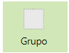<figcaption></figcaption></figure> <figure>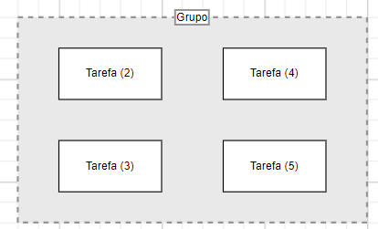<figcaption></figcaption></figure>

### Configurações de Grupo

* **Nome do Agrupador**: Informe o nome do grupo de tarefas. &#x20;
* **Tarefas Agrupadas:** Informe as tarefas que fazem parte do grupo. &#x20;
* **Condição do Agrupador:** Informe se todas as tarefas devem ser concluídas para prosseguimento (E) ou se apenas uma delas precisa ser concluída para que o fluxo avance automaticamente (OU). &#x20;

<figure>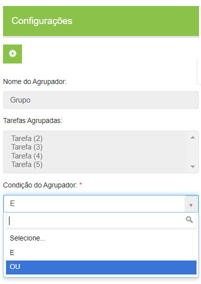<figcaption></figcaption></figure>

***

## Tarefa do tipo Gateway Exclusivo



Em um desenho de fluxo que possuir formulário, a tarefa do tipo Gateway Exclusivo irá exibir todos os campos existentes neste formulário para que o usuário possa configurar qual campo será o responsável pelo avanço. Este é um tipo de tarefa que será utilizado somente para avanço automático via preenchimento de campo de formulário.

<figure>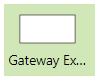<figcaption></figcaption></figure>

O conector de saída de uma tarefa do tipo Gateway Exclusivo, irá exibir o campo de formulário configurado, para que o usuário possa definir qual valor será utilizado para o avanço automático. O campo de formulário configurado será preenchido em alguma tarefa anterior e, quando chegar nesta tarefa, a aplicação irá identificar se o valor preenchido corresponde ao valor definido para o conector de saída conforme configurado no desenho.


<mark style="color:blue;">**EXEMPLO:**</mark> <mark style="color:blue;"></mark><mark style="color:blue;">Uma tarefa do tipo Gateway Exclusivo foi configurada com o campo do formulário “Faturamento” e este é um campo do tipo lista que possui as opções: “Até 20 mil”, “Até 50 mil” e “Acima de 50 mil”. O conector de saída desta tarefa irá exibir o campo do formulário configurado com as opções para definição do avanço automático. Pode-se definir, por exemplo, que se o usuário selecionar a opção “Acima de 50 mil” o fluxo avance automaticamente para a próxima tarefa.</mark>


Uma tarefa do tipo Gateway também poderá ser configurada para avançar automaticamente por atraso, conforme já existe atualmente. Neste caso, a tarefa será avançada automaticamente de acordo com a primeira condição encontrada, por atraso ou por campo de formulário.

### Configurações de Tarefa do tipo Gateway Exclusivo

#### Aba Configurações

* **Status:** Informe o status que será exibido para o usuário quando o fluxo chegar à etapa de execução desta tarefa.&#x20;
* **Prazo:** Defina o prazo para o avanço automático.&#x20;
* **Campo do Formulário:** Selecione qual campo do formulário será usado como referência para o avanço automático da tarefa.   &#x20;

<figure>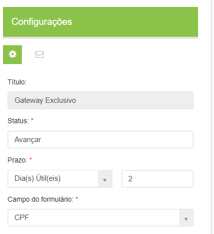<figcaption></figcaption></figure>

#### Aba Notificação

* **Notificar quando:** Informe quando será enviada a notificação sobre a tarefa.

<figure><figcaption></figcaption></figure>

* **% de tempo:** Esse campo será exibido se no campo “Notificar quando” tiver sido escolhida a opção “Ao atrasar um % de tempo” ou “Antes de atrasar um % de tempo”. Neste caso deve ser informada aqui a porcentagem de tempo de atraso, considerando o prazo cadastrado na aba Configurações. &#x20;
* **Notificar:** Informe quem deverá ser notificado. O sistema poderá notificar um usuário ou um grupo de usuários. &#x20;

<figure><figcaption></figcaption></figure>

* **E-mail externos:** Se forem notificados usuários externos, informe os e-mails e insira uma mensagem personalizada de notificação.&#x20;
* **Mensagem personalizada:** Neste campo pode ser inserida uma mensagem personalizada que será exibida para o usuário executor da tarefa.&#x20;
* **Incluir na notificação:** Selecione o que deverá ser incluído na notificação: se todos os comentários feitos ao longo do fluxo ou se apenas o último. Indique se devem ser incluídos a observação inserida na ativação do fluxo e os campos do formulário associado ao fluxo.   &#x20;
* **Quando for executada mais de uma vez**: Essa opção deve ser marcada se, caso a tarefa seja executada mais de uma vez, a notificação precise também ser enviada mais de uma vez. Neste caso deve ser preenchido também o campo Quantidade de vezes executada.&#x20;
* **Ao delegar a responsabilidade:** Marque essa opção para que seja enviada uma notificação sempre que o responsável pela tarefa a delegue a outra pessoa. Essa opção só estará disponível caso o campo “Inibe opção de delegar” esteja desabilitado na aba Configurações. Se a tarefa for de execução externa, essa opção não será exibida.&#x20;

<figure><figcaption></figcaption></figure>

***

## Decisão do tipo Gateway Exclusivo

Em um desenho de fluxo que possuir formulário, a decisão do tipo Gateway Exclusivo irá exibir todos os campos existentes neste formulário para que o usuário possa configurar qual campo será o responsável pelo avanço. Este é um tipo de tarefa que será utilizado somente para avanço automático via preenchimento de campo de formulário.

<figure>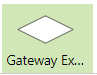<figcaption></figcaption></figure>

O conector de avanço de uma decisão do tipo Gateway Exclusivo, irá exibir o campo de formulário configurado para que o usuário possa definir qual valor será utilizado para o avanço automático. O campo de formulário configurado deve ser preenchido em alguma tarefa anterior e, quando chegar nesta tarefa, a aplicação irá identificar se o valor preenchido corresponde ao valor definido para avanço.

### Configurações da Decisão do tipo Gateway Exclusivo

#### Aba Configurações

* **Status:** Informe o status que será exibido para o usuário quando o fluxo chegar à etapa de execução desta tarefa.&#x20;
* **Prazo:** Defina o prazo para o avanço automático.&#x20;
* **Campo do Formulário:** Selecione qual campo do formulário será usado como referência para o avanço automático da tarefa.  &#x20;

<figure><figcaption></figcaption></figure>

#### Aba Notificação

* **Notificar quando:** Informe quando será enviada a notificação sobre a tarefa.

<figure><figcaption></figcaption></figure>

* **% de tempo:** Esse campo será exibido se no campo “Notificar quando” tiver sido escolhida a opção “Ao atrasar um % de tempo” ou “Antes de atrasar um % de tempo”. Neste caso deve ser informada aqui a porcentagem de tempo de atraso, considerando o prazo cadastrado na aba Configurações. &#x20;
* **Notificar:** Informe quem deverá ser notificado. O sistema poderá notificar um usuário ou um grupo de usuários.

<figure><figcaption></figcaption></figure>

* **E-mail externos:** Se forem notificados usuários externos, informe os e-mails e insira uma mensagem personalizada de notificação.&#x20;
* **Mensagem personalizada:** Neste campo pode ser inserida uma mensagem personalizada que será exibida para o usuário executor da tarefa.&#x20;
* **Incluir na notificação:** Selecione o que deverá ser incluído na notificação: se todos os comentários feitos ao longo do fluxo ou se apenas o último. Indique se devem ser incluídos a observação inserida na ativação do fluxo e os campos do formulário associado ao fluxo.   &#x20;
* **Quando for executada mais de uma vez:** Essa opção deve ser marcada se, caso a tarefa seja executada mais de uma vez, a notificação precise também ser enviada mais de uma vez. Neste caso deve ser preenchido também o campo Quantidade de vezes executada.&#x20;
* **Ao delegar a responsabilidade:** Marque essa opção para que seja enviada uma notificação sempre que o responsável pela tarefa a delegue a outra pessoa. Essa opção só estará disponível caso o campo “Inibe opção de delegar” esteja desabilitado na aba Configurações. Se a tarefa for de execução externa, essa opção não será exibida.&#x20;

<figure><figcaption></figcaption></figure>

## ArqSign

Para integrar o **ArqFlow** com o **ArqSign**, é necessário que o desenho do fluxo inclua uma etapa configurada com o componente específico de decisão **ArqSign**, conforme a necessidade do cliente.

Esse componente estará disponível apenas se o desenho do fluxo possuir um **serviço do tipo ArqSign Plataforma** previamente configurado na aba **Dados Gerais**.

Ao selecionar o componente ArqSign no fluxograma, o sistema exibirá automaticamente as abas **Configurações** (selecionada por padrão), **Notificações**, **Assinatura** e **Formulário**, onde serão realizadas as definições necessárias para a execução da etapa de assinatura digital no fluxo.

### Configuração

* **Título** _(somente leitura):_ Exibe o nome atribuído ao componente ArqSign no fluxograma.
* **Configuração** _(obrigatório):_ Campo para selecionar a **configuração ArqSign** que será utilizada nesta etapa. _O sistema listará todas as configurações previamente cadastradas na aba **ArqSign** do desenho do fluxo._
* **Status** _(obrigatório):_ Define o **status do fluxo** quando estiver nesta etapa do processo.

<figure><figcaption></figcaption></figure>

*   **Tipo de Responsável** _(obrigatório):_ Campo para definir **quem acompanhará a execução da etapa ArqSign**.\
    Opções disponíveis:

    * Chefe imediato (Quem ativou) – _visível apenas em fluxos com ativação manual_
    * Grupo – _habilita o campo adicional de seleção de grupo_
    * Quem ativou – _visível apenas em fluxos com ativação manual_
    * Quem executou uma tarefa interna
    * Selecionado
    * Usuário – _habilita o campo adicional de seleção de usuário_

    <figure><figcaption></figcaption></figure>


**Importante:** Ao selecionar a opção **Grupo**, a etapa será tratada automaticamente como uma **atividade conjunta**, sem exibição das opções “Atividade Conjunta” ou “Atividade Individual”. O percentual de consenso não será considerado.\
Neste caso, o fluxo gerará uma execução separada para cada membro do grupo.


#### Ações Avançadas

Os campos abaixo definem permissões especiais que podem ser concedidas ao responsável por acompanhar a etapa:

1. **Permitir cancelar o processo ArqSign** _(opcional)_
   * Autoriza o cancelamento manual do processo de assinaturas via ArqSign.
   * Ao marcar, o campo **Obrigar comentário antes desta ação** será habilitado.
2. **Permitir atualizar o token ArqSign expirado** _(opcional)_
   * Autoriza a atualização manual de tokens expirados no processo de assinaturas.
   * Ao marcar, o campo **Obrigar comentário antes desta ação** será habilitado.
3.  **Permitir editar signatários que não assinaram** _(opcional)_

    * Autoriza a edição manual de signatários ainda pendentes de assinatura.
    * Ao marcar, o campo **Obrigar comentário antes desta ação** será habilitado.


Quando qualquer uma dessas ações avançadas estiver marcada, e a opção **Obrigar comentário antes desta ação** também for ativada, o sistema exigirá que o usuário insira uma justificativa antes de realizar a operação correspondente.


#### Descrição da Etapa

* **Descrição da Etapa** _(opcional)_\
  Campo para registrar uma descrição textual sobre a etapa ArqSign, podendo servir como **orientação adicional** aos usuários definidos como responsáveis por acompanhá-la.

<figure><figcaption></figcaption></figure>

### Notificações

A aba **Notificações** permite configurar os gatilhos e destinatários das mensagens enviadas automaticamente durante o andamento da etapa ArqSign no fluxo de trabalho. Essas notificações são disparadas em momentos estratégicos e podem conter mensagens personalizadas, além de dados relevantes sobre o processo de assinatura.

Estão disponíveis os seguintes gatilhos para envio de notificações:

* **Ao iniciar a tarefa:** Envio realizado assim que o ArqGED dispara o processo de assinatura no ArqSign e inicia a execução da etapa.
* **Ao avançar a tarefa:** Notificação enviada no momento em que o fluxo é movimentado para a etapa seguinte após a conclusão da etapa ArqSign.
* **Ao atrasar um percentual do tempo de assinatura de cada signatário:** Envio automático ao ultrapassar o percentual de atraso definido, considerando o prazo individual de cada signatário.
* **Antes de atrasar um percentual do tempo de assinatura de cada signatário:** Envio antecipado quando o prazo de assinatura está próximo de ultrapassar o percentual configurado.
* **Quando for executada mais de uma vez:** Notificação enviada ao atingir a quantidade de execuções definida para a etapa.
* **Quando o link do ArqSign expirar:** Exibido apenas para componentes do tipo ArqSign. A notificação é enviada assim que o link de assinatura expira.

#### Campos disponíveis em cada notificação

Para todos os gatilhos configurados, o sistema permite a definição dos seguintes elementos:

* **Notificar:**\
  Define quem receberá a notificação. Opções:
  * Responsável por acompanhar o processo
  * Signatário
  * Quem ativou
  * Chefe imediato (Quem ativou)
  * Chefe imediato (Responsável)
  * Grupo
  * Usuários


As opções **Chefe imediato (Quem ativou)** e **Quem ativou** estão disponíveis apenas em fluxos com ativação manual.


* **E-mails externos:**\
  Campo para inserção manual de e-mails adicionais a serem notificados.
* **Mensagem personalizada:**\
  Campo de texto para redigir o conteúdo da mensagem que será enviada aos destinatários definidos.

#### Incluir na notificação

<figure><figcaption></figcaption></figure>

Além da mensagem personalizada, é possível incluir informações adicionais na notificação, selecionando:

* **Comentários:**
  * Todos
  * Último
* **Observações**
* **Campos do Formulário**
*   **Situação do Processo de Assinatura ArqSign**

    Ao incluir a situação do processo de assinatura, a aplicação enviará os dados dos processos vinculados, conforme o tipo de etapa:

    * Para etapas do tipo **ArqSign**:
      * Processo em andamento
      * Todos (Atual + Concluídos + Cancelados)
    * Para etapas **diferentes de ArqSign**:
      * Processos concluídos
      * Todos (Concluídos + Cancelados)

Esta opção estará disponível para todas as **configurações de notificações de um fluxo com integração com a Plataforma ArqSign**. Quando esta opção estiver marcada, a aplicação enviará os seguintes dados:

> **\[Nome do Processo 1] - Status: \[Status do Processo]**
>
> Ordem de Assinatura: Nome do Signatário 1 - Assinou como ou Assinará como: Papel do Signatário
>
> Ordem de Assinatura: Nome do Signatário 2 - Assinou como ou Assinará como: Papel do Signatário
>
> Ordem de Assinatura: Nome do Signatário 3 - Assinou como ou Assinará como: Papel do Signatário
>
> Ordem de Assinatura: Nome do Signatário n - Assinou como ou Assinará como: Papel do Signatário
>
> **\[IdProcessoArqSIGN] \[Nome do Processo n]  - Status:  \[Status do Processo]**
>
> Ordem de Assinatura: Nome do Signatário 1 - Assinou como ou Assinará como: Papel do Signatário
>
> Ordem de Assinatura: Nome do Signatário 2 - Assinou como ou Assinará como: Papel do Signatário
>
> Ordem de Assinatura: Nome do Signatário 3 - Assinou como ou Assinará como: Papel do Signatário
>
> Ordem de Assinatura: Nome do Signatário n - Assinou como ou Assinará como: Papel do Signatário

* Quando houver **papel definido**, será exibido:
  * **Assinou como:** (para quem já assinou)
  * **Assinará como:** (para quem ainda não assinou)
* Quando **não houver papel definido**, será exibido:
  * **Assinado** ou **Não Assinado**
* Se houver **recusa de assinatura**, o sistema exibirá:
  * Ordem de Assinatura: Nome do Signatário 1 – Recusou Assinar - Motivo Recusa.

### Assinatura

A aba **Assinatura** permite ao usuário indicar quais documentos do fluxo serão enviados para assinatura por meio da plataforma ArqSign na etapa configurada.

É **obrigatório marcar ao menos uma das opções** disponíveis para que o componente funcione corretamente.

<figure><figcaption></figcaption></figure>

O sistema exibe os seguintes campos:

* **Modelo do fluxo**\
  Exibido somente quando o fluxo possui um modelo configurado.\
  Ao marcar essa opção, o modelo será incluído no processo de assinatura via ArqSign nesta etapa.
* **Anexo(s) do fluxo marcados para assinar**\
  Indica que os anexos adicionados ao fluxo, e previamente marcados para assinatura, serão assinados na plataforma ArqSign.
* **Anexo(s) do registro marcados para assinar**\
  Indica que os anexos do registro/documento principal, também marcados para assinatura, serão enviados ao ArqSign na etapa em questão.

### Formulário

A aba **Formulário** estará sempre visível para etapas configuradas com o serviço **ArqSign**, pois o uso de formulário é obrigatório nesse tipo de fluxo.

Nesta aba, o usuário poderá **definir quais campos do formulário serão exibidos** na tarefa de acompanhamento da etapa de assinatura digital.

#### Funcionamento da configuração

* Na etapa ArqSign, será possível visualizar apenas o formulário que foi preenchido em etapas anteriores do fluxo. Portanto, certifique-se de que os campos desejados estejam preenchidos antes do envio para assinatura.
* A lista exibida corresponde aos **campos disponíveis no formulário associado ao fluxo**.
* Para cada campo, é possível selecionar:
  * **V (Visualizar):** o campo será exibido para leitura na tarefa.
  * **T (Exibir tarefa):** o campo será destacado no painel da tarefa.


Em etapas do tipo **ArqSign**, a coluna **T** permite a seleção de no máximo **4 campos**.


<figure><figcaption>
Clique na imagem para ampliar.
</figcaption></figure>

### Conector

Para que o componente do tipo **ArqSign** funcione corretamente no fluxograma, é necessário configurar **conectores de saída** que definem os possíveis caminhos do fluxo a partir dessa etapa, com base no status do processo de assinatura.

O componente ArqSign deve conter **no mínimo 1 e no máximo 5 conectores de saída**.\
Cada conector deve conter **pelo menos uma das opções de avanço** listadas abaixo — e nenhuma opção pode ser repetida no mesmo conector nem entre conectores diferentes.

#### Opções de avanço disponíveis

* **Concluído**\
  Avança o fluxo quando o processo de assinatura for concluído com sucesso — ou seja, todos os signatários assinaram. A informação é recebida via WebHook e o fluxo segue automaticamente.
* **Quando alguém recusar assinar**\
  Avança o fluxo quando um dos signatários recusa a assinatura, causando o cancelamento do processo. A recusa é recebida via WebHook e tratada pela aplicação.
* **Cancelado**\
  Esta opção contempla três situações:
  1. Cancelamento realizado diretamente na plataforma ArqSign pelo remetente.
  2. Cancelamento realizado no ArqGED por um responsável com permissão na etapa ArqSign.
  3. Cancelamento do próprio fluxo por um usuário com permissão, enquanto a etapa ArqSign está em andamento.
* **Link de assinatura expirado** _(opcional)_\
  Disponível apenas se **não estiver marcada** a opção **"Permitir atualizar token ArqSign expirado"** nas configurações da etapa.\
  Avança o fluxo automaticamente quando o link de assinatura expira sem que todos os signatários tenham concluído a assinatura.


Se o documento precisar ser **gerado novamente**, esta opção deve ser utilizada.\
Caso contrário, basta manter o fluxo na etapa e permitir que os responsáveis reenviem o token manualmente.


* **Não possuir todos os dados para envio**\
  Avança o fluxo se, ao tentar enviar os documentos para assinatura, o ArqGED identificar que faltam dados obrigatórios para realizar a operação.

#### Regras importantes

* O **componente ArqSign deve obrigatoriamente conter pelo menos 4 das 5 opções listadas** acima.
* A opção **"Link de assinatura expirado"** é **obrigatória** **caso a etapa não permita a atualização manual do token expirado**.
* A presença dessa opção no fluxograma indica que, ao expirar, o documento deverá ser **recriado e reenviado** para assinatura.

#### Campos exibidos

* **Origem:**\
  Campo somente leitura, exibe o nome do componente de origem no fluxograma.
* **Destino:**\
  Campo somente leitura, exibe o nome do componente de destino.
* **Avançar etapa, se processo for:**\
  Aqui o usuário define, para cada conector, qual condição levará ao avanço do fluxo, conforme as opções descritas acima.

### Validação do fluxo

#### Validação do Fluxo

Ao ativar um fluxo, a aplicação realiza a validação dos **serviços vinculados ao desenho do fluxo**, verificando se estão **ativos e vigentes** — tanto o **Serviço de Workflow** quanto o **Serviço de ArqSign**.


Um fluxo **somente poderá ser ativado** se **todos os serviços vinculados estiverem ativos** no contrato do cliente e na unidade correspondente.


#### Integração automática com webhooks

Caso o fluxo contenha ao menos uma etapa do tipo **ArqSign** e seja validado com sucesso, a aplicação criará automaticamente **dois webhooks** por integração:

* **Webhook de acompanhamento:** permite o monitoramento do andamento do processo de assinatura.
* **Webhook de conclusão:** recebe a confirmação de que todos os signatários finalizaram a assinatura.

#### Validações específicas – Etapas ArqSign

Durante a validação, a aplicação também verifica regras específicas relacionadas à configuração de assinaturas. São elas:

1. **Obrigatoriedade de marcação de documentos para assinatura:**\
   Toda etapa do tipo ArqSign deve ter **pelo menos uma das opções abaixo marcadas**:
   * **Modelo do fluxo** (visível apenas se houver modelo configurado)
   * **Anexo(s) do fluxo marcados para assinar**
   * **Anexo(s) do registro marcados para assinar**
2. **Exclusividade do envio do modelo:**\
   Apenas **uma etapa do tipo ArqSign** em todo o fluxograma pode ter a opção **“Enviar ao ArqSign para assinar: Modelo do fluxo”** marcada.
3. **Consistência com etapas anteriores:**\
   Se a etapa do tipo ArqSign estiver configurada para enviar anexos (fluxo e/ou registro), é necessário que, em etapas anteriores:
   * Os **anexos do fluxo** estejam marcados para assinatura.
   * Os **anexos do registro** estejam igualmente marcados para assinatura.
