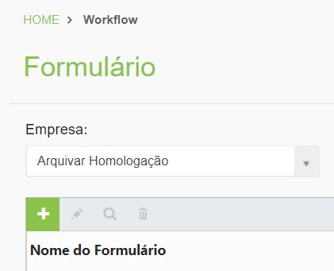
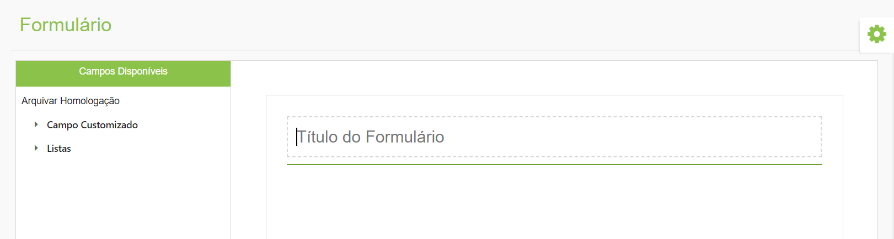
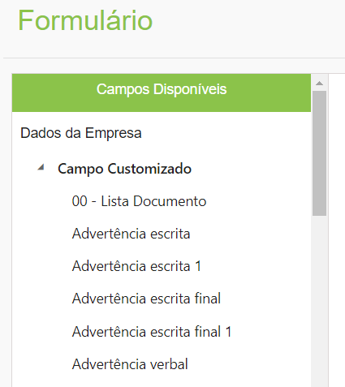
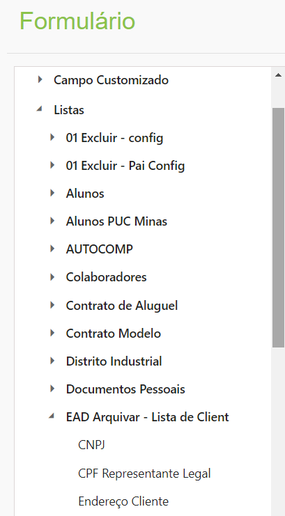
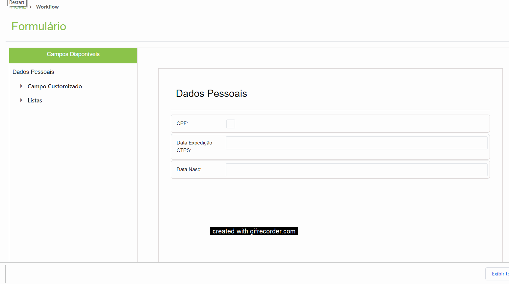
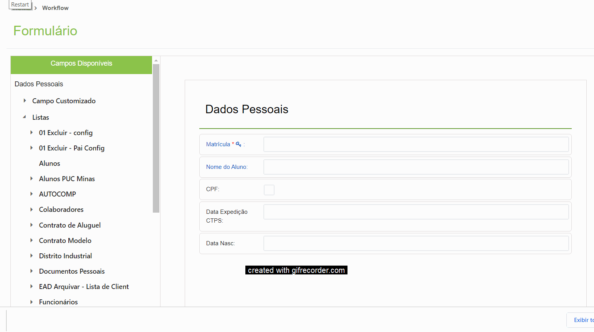
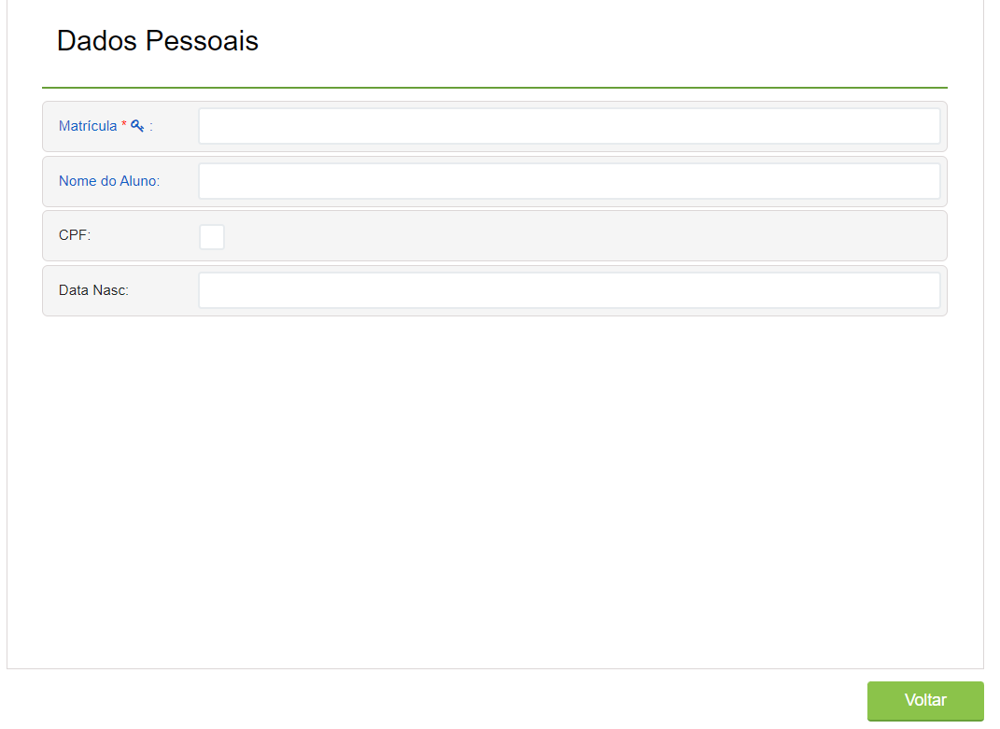

# 🟩 Formulário

No menu Formulário são criados os formulários que deverão ser preenchidos durante a execução do processo.&#x20;

***

## Formulário – Tela principal

**1. Campo Empresa:** Neste campo é exibida a empresa ou empresas às quais o usuário logado pertence ou tem acesso.&#x20;

**2. Ícone Adicionar:** Utilizado para o cadastro de um novo formulário.&#x20;

**3. Ícone Editar:** Utilizado para realizar a edição do formulário selecionado. Durante a edição de um formulário não é possível excluir campos se o formulário estiver sendo utilizado em algum fluxo. Neste caso, só será possível acrescentar campos. &#x20;

**4. Ícone Visualizar:** Utilizado para visualizar detalhes do formulário selecionado. &#x20;

**5. Ícone Excluir:**  Utilizado para excluir o formulário selecionado. Não é permitido excluir formulários que estejam sendo utilizados em algum fluxo. Caso deseje inutilizar um formulário que esteja em uso, o usuário pode ocultá-lo na configuração do Desenho do Fluxo ou criar uma nova versão de um fluxo com um formulário. &#x20;

**Coluna Nome do Formulário:** Nesta coluna são exibidos todos os formulários cadastrados.

<figure><figcaption>
Clique na imagem para ampliar.
</figcaption></figure>

***

## Cadastro de Formulário

1. Clique no ícone “Adicionar”.

<figure><figcaption></figcaption></figure>

2. Informe um título para o formulário.

<figure><figcaption>
Clique na imagem para ampliar.
</figcaption></figure>

3. Clique em “Campos Customizados”. Serão exibidos todos os campos que podem ser acrescentados ao formulário.

<figure><figcaption></figcaption></figure>

4. Selecione o campo desejado e arraste-o para o campo à direita. Repita o processo com todos os campos que desejar incluir. 

<figure><figcaption>
Clique na imagem para ampliar.
</figcaption></figure>


<mark style="color:blue;">**Campos Customizados**</mark> <mark style="color:blue;"></mark><mark style="color:blue;">são campos de preenchimento "livre", ou seja, o executor da tarefa deverá adicionar as informações manualmente nos campos. Diferente do campo lista, não é possível trabalhar com auto-complete em campos customizados. Eles são apresentados em preto e não podem ser definidos como "campos chave". Os campos customizados exibidos aqui devem ter sido anteriormente criados no menu Árvore Documental > Campos Customizados.</mark>


5. Clicando em “Listas” é possível arrastar uma lista de campos anteriormente criados para o formulário.  

<figure><figcaption></figcaption></figure>


<mark style="color:blue;">**Campos Lista**</mark> <mark style="color:blue;"></mark><mark style="color:blue;">são campos que possuem definição de auto-complete. Quando realizado o preenchimento do campo chave no formulário pelo usuário durante a execução do fluxo, os demais dados serão preenchidos de forma automática mediante busca dos dados existentes em banco de dados. Os campos de lista são destacados em azul. Esses campos somente poderão ser criados pela Arquivar. As listas de campos exibidas aqui devem ter sido anteriormente criadas e configuradas no menu Listas.</mark>&#x20;


6\. Ao arrastar um campo do tipo Lista, o sistema incluirá além do campo selecionado outros que houverem sido cadastrados como obrigatórios para o seu preenchimento.&#x20;

<figure><figcaption>
Clique na imagem para ampliar.
</figcaption></figure>

7. Se desejar mudar a ordem dos campos, arraste-os para a posição desejada.

<figure><figcaption>
Clique na imagem para ampliar.
</figcaption></figure>

8. Se desejar excluir um campo, arraste o campo desejado para fora do formulário.

<figure><figcaption>
Clique na imagem para ampliar.
</figcaption></figure>


<mark style="color:orange;">**Não é possível excluir campos se o formulário estiver sendo utilizado em algum fluxo. Neste caso, só será possível acrescentar campos.**</mark>&#x20;


9. Para concluir a elaboração do formulário, clique em “Voltar”.

<figure><figcaption></figcaption></figure>
